# 🤖 AGENTS.md - Coding Guidelines for NEAT-AI

This file is the single source of truth for coding conventions, project
terminology, and development workflows in the NEAT-AI (NeuroEvolution of
Augmenting Topologies — Artificial Intelligence) repository. All contributors
(human and AI) should follow these guidelines.

> [!NOTE]
> This document is intended for both human contributors and AI coding agents.
> When in doubt, follow the conventions described here rather than assuming
> defaults from other projects.

## 📌 Summary and where to go next

This file collects the **conventions that apply across every subsystem** —
terminology, the two critical invariants (neuron UUID stability and semantic
version stability), the WASM (WebAssembly) compute contract, and the testing /
logging policies. It assumes you have already met the project via
[`README.md`](./README.md); it does **not** re-explain what NEAT-AI does.

For deep dives on a single topic, follow the dedicated docs (full index in
[`docs/README.md`](./docs/README.md)):

- **Activation / squash functions** —
  [`docs/ACTIVATION_FUNCTIONS.md`](./docs/ACTIVATION_FUNCTIONS.md) and
  [`src/methods/activations/README.md`](./src/methods/activations/README.md).
- **Neuron UUID rules** — quality-gate test
  [`test/creature/NeuronUuidStability.ts`](./test/creature/NeuronUuidStability.ts);
  identity vs runtime integer `id` lives in
  [`src/architecture/NeuronId.ts`](./src/architecture/NeuronId.ts) (Issue
  #1958).
- **Semantic version rules** — quality-gate test
  [`test/creature/SemanticVersionStability.ts`](./test/creature/SemanticVersionStability.ts).
- **Discovery / FFI (Foreign Function Interface)** —
  [`docs/DISCOVERY_GUIDE.md`](./docs/DISCOVERY_GUIDE.md),
  [`docs/DISCOVERY_ARCHITECTURE.md`](./docs/DISCOVERY_ARCHITECTURE.md), and
  [`docs/DISCOVERY_DIR.md`](./docs/DISCOVERY_DIR.md).
- **NEAT-AI-core dependency** —
  [`docs/CORE_DEPENDENCY_POLICY.md`](./docs/CORE_DEPENDENCY_POLICY.md) and
  [`docs/PARITY_GATE.md`](./docs/PARITY_GATE.md).
- **Contributor onboarding / quality gate** —
  [`CONTRIBUTING.md`](./CONTRIBUTING.md).
- **Security disclosure** — [`SECURITY.md`](./SECURITY.md).
- **Release notes** — [`CHANGELOG.md`](./CHANGELOG.md).

## 📖 Terminology

We keep the tone playful, but every nickname maps to a mainstream
machine-learning idea:

- **NEAT** — the original **NeuroEvolution of Augmenting Topologies** algorithm
  published by
  [Stanley & Miikkulainen (2002)](http://nn.cs.utexas.edu/downloads/papers/stanley.ec02.pdf).
  Use this term **only** when discussing the algorithm as defined in that paper
  (speciation by historical markings, structure-mutation crossover, and so on).
  Synonyms acceptable for emphasis: "standard NEAT", "pure NEAT", "the 2002 NEAT
  algorithm".
- **NEAT-AI** — **this project**. Started from pure NEAT but extends it well
  beyond the 2002 algorithm with memetic evolution, error-guided **Discovery**,
  MCMC mutation acceptance, synthetic synapses, predictive coding, Muon-style
  orthogonalised gradients, and other modern algorithms (some published only
  weeks before this entry was written). Use this term for **all** references to
  features, behaviour, or APIs in this repository.
- **Creatures** are individual neural networks/genomes inside a NEAT population,
  as described in the original NEAT paper by
  [Stanley & Miikkulainen (2002)](http://nn.cs.utexas.edu/downloads/papers/stanley.ec02.pdf).
- **Memetic evolution** refers to the well-studied combination of evolutionary
  search plus local gradient descent, also called a
  [memetic algorithm](https://en.wikipedia.org/wiki/Memetic_algorithm).
- **CRISPR injections** describe targeted gene edits inspired by the real-world
  [CRISPR gene editing technique](https://www.nature.com/scitable/topicpage/crispr-cas9-a-precise-tool-for-33169884/);
  in practice we add hand-crafted synapses/neurons.
- **Grafting** is crossover between incompatibly shaped genomes, similar to the
  [island-model speciation strategies](https://en.wikipedia.org/wiki/Island_model)
  used in evolutionary algorithms.
- **Squash** is our term for activation functions applied to neurons.
- **Discovery** is the error-guided structural evolution process that uses the
  Rust FFI extension to propose structural improvements.
- **Intelligent Design** is a technique for systematically testing different
  squash functions for each hidden neuron.
- **Synthetic synapses** are temporary zero-weight connections added between
  adjacent topological layers before backpropagation. They give gradient descent
  a richer search space — similar to
  [layer densification](https://en.wikipedia.org/wiki/Dense_layer) in
  conventional deep learning — and are pruned back to only the useful ones after
  training.
- **Layer assignment** is the topological ordering of neurons into discrete
  layers based on longest-path distance from input neurons, used by synthetic
  synapse generation to determine which neuron pairs are in adjacent layers.
- **MCMC acceptance** — Markov Chain Monte Carlo acceptance — refers to the
  [Metropolis-Hastings](https://en.wikipedia.org/wiki/Metropolis%E2%80%93Hastings_algorithm)
  criterion applied to mutation acceptance. Instead of accepting all mutations
  unconditionally, worsening mutations are accepted with a temperature-dependent
  probability, enabling escape from local optima early and convergence later.
- **Horizontal gene transfer** describes the subgraph transplantation breeding
  strategy that copies connected subgraphs between genetically incompatible
  creatures, inspired by
  [horizontal gene transfer](https://en.wikipedia.org/wiki/Horizontal_gene_transfer)
  in microbiology.
- **Episode rollout** — one full play-through of a simulator for a creature,
  from `reset` to a terminal state (or a `maxSteps` cap). Each tick is observe →
  `Creature.activate` → decode action → `sim.step`. Used for
  reinforcement-learning tasks; see
  [`docs/REINFORCEMENT_LEARNING.md`](./docs/REINFORCEMENT_LEARNING.md).
- **Streaming observation** — the input to `Creature.activate` in an episode
  rollout, where the next observation depends on the agent's previous action.
  The simulator owns world state; the creature owns weights. This is the API
  pattern documented in
  [`docs/REINFORCEMENT_LEARNING.md`](./docs/REINFORCEMENT_LEARNING.md).

If you spot another fun label, expect it to be backed by a reference to the
standard term the first time it appears.

### 🆚 NEAT vs NEAT-AI — which term to use

Because the project has extended far past the 2002 algorithm, mixing the two
terms in docs and code comments has been a source of confusion. Use this rule of
thumb:

- ✅ Say **NEAT-AI** when discussing what **this repo** does — features,
  behaviour, configuration, APIs, defaults, and roadmap.
- ✅ Say **NEAT** (or "standard NEAT", "pure NEAT", "the 2002 NEAT algorithm")
  **only** when contrasting with the original Stanley & Miikkulainen algorithm —
  for example, "standard NEAT speciates by historical markings; NEAT-AI also
  accepts mutations via an MCMC criterion".
- ❌ Avoid using bare **NEAT** as shorthand for the implementation in
  user-facing docs. If you mean "this codebase", write **NEAT-AI**.
- 🧩 Inside historical-context paragraphs (e.g. the project's origin story or
  the `src/NEAT/` folder name), bare "NEAT" is acceptable because the meaning is
  clear from context, but prefer **NEAT-AI** when describing current behaviour.

When a single sentence mentions both, name them explicitly to make the
distinction unambiguous (e.g. "NEAT-AI inherits speciation from standard NEAT
but replaces unconditional mutation acceptance with MCMC").

## 🏗️ Project Architecture

### ⚙️ Technology Stack

- **TypeScript** on **Deno 2.x** for the core library
- **WASM** (WebAssembly, required) for activation/scoring — initialised
  automatically, no manual init needed
- **Rust** FFI (Foreign Function Interface) extension
  ([NEAT-AI-Discovery](https://github.com/stSoftwareAU/NEAT-AI-Discovery)) for
  GPU (Graphics Processing Unit) accelerated structural analysis
- **wgpu** for cross-platform GPU compute shaders (Metal on macOS, Vulkan on
  Linux, DX12 (DirectX 12) on Windows) with CPU (Central Processing Unit)
  fallback

### 📂 Directory Structure

```
src/                    # Source code
  architecture/         # Core neural network architecture (Creature, Neuron, Synapse)
  blackbox/             # Black-box evaluation utilities
  breed/                # Crossover and breeding algorithms
  compact/              # Network compaction and optimisation
  config/               # Configuration and options (NeatOptions, NeatConfig)
  costs/                # Cost/fitness functions
  creature/             # Creature behaviour modules (activation, mutation, serialisation, training)
  deprecated/           # Deprecated activation functions (HYPOT, HYPOTv2, MEAN)
  discovery/            # Discovery integration (Rust FFI bridge)
  errors/               # Error types
  intelligentDesign/    # Intelligent Design squash optimisation
  methods/              # Activation functions (squash implementations)
  multithreading/       # Worker thread utilities
  mutate/               # Mutation operators
  NEAT/                 # Core NEAT algorithm (selection, speciation)
  optimize/             # Optimisation passes
  propagate/            # Backpropagation (TS orchestration; topological loop and elastic distribution are WASM-only)
  reconstruct/          # Network reconstruction utilities
  upgrade/              # Version migration
  utils/                # Shared utilities
  wasm/                 # WASM activation bridge
test/                   # Tests (mirrors src/ structure)
bench/                  # Benchmarks
docs/                   # Extended documentation
wasm_activation/pkg/    # Vendored WASM runtime artifacts from NEAT-AI-core
scripts/                # Utility scripts
```

### 🗝️ Key Files

- `mod.ts` - Public API entry point
- `deno.json` - Deno configuration, dependencies, lint rules
- `quality.sh` - Pre-commit quality gate (lint, format, type-check, test)

### 🧬 Neuron UUID stability (CRITICAL INVARIANT)

> [!CAUTION]
> **A neuron's UUID is assigned once at creation and MUST NEVER change for the
> lifetime of that neuron.** This is not a nice-to-have — it is the foundation
> of how distributed evolution works. Violating this invariant silently corrupts
> breeding across the entire fleet. See `test/creature/NeuronUuidStability.ts`
> for the quality gate test.

**Why this matters:** In production, ~20 machines independently evolve
populations for hours, periodically pushing their fittest creatures to a shared
GitHub repository. Other machines pull those creatures and breed them with their
own population. Breeding aligns neurons between parents **by matching UUIDs** —
not by array position, not by integer index. If a mutation, compaction, or any
other operation silently changes a neuron's UUID, cross-machine breeding
produces garbage offspring. The creatures look valid but their topology is
meaninglessly scrambled.

**The rules:**

1. **A neuron's `uuid` is immutable once assigned.** No mutation operator,
   compaction pass, breeding step, discovery application, or serialisation
   round-trip may change an existing neuron's UUID. Inserting a new neuron
   between existing ones does not change the UUIDs of those existing neurons.

2. **New neurons get a new UUID at creation** (via `crypto.randomUUID()`). That
   UUID then follows rule 1 for the rest of the neuron's life.

3. **Numeric integer IDs (`id`, `fromId`, `toId`) are internal-only
   implementation details.** They MUST NOT appear in any JSON that crosses a
   process, machine, disk, cache, or FFI boundary. They are ephemeral values
   derived at runtime — never persisted, never used for identity. Issue #2090
   proved that hash-colliding integer IDs silently corrupt forward-only
   creatures.

4. **`creature.exportJSON()` is UUID-only.** No `id`, `fromId`, or `toId`
   fields. This is the canonical external format. `exportSnapshotJSON()` is
   equivalent. Any code path that adds numeric IDs to an export that leaves the
   process is a bug.

5. **`loadFrom` resolves synapses by UUID first** (Issue #2090). Integer IDs are
   a fallback only for internal round-trips where UUIDs may not be present.

6. **Genetic compatibility** uses `getHiddenNeuronWireKeys()` (UUID-based wire
   labels), not integer ids.

7. **Quality gate test**
   ([`test/creature/NeuronUuidStability.ts`](./test/creature/NeuronUuidStability.ts)):
   builds a creature, records all neuron UUIDs, runs multiple generations of
   mutation and breeding, then asserts that every surviving original neuron
   still has its original UUID. This test MUST pass before any commit.

#### 🔁 Neuron UUID lifecycle

```mermaid
stateDiagram-v2
    [*] --> Created: crypto.randomUUID() at creation
    Created --> Persisted: exportJSON() (UUID-only wire format)
    Persisted --> Loaded: loadFrom() resolves by UUID first
    Loaded --> InMemory: integer id assigned at runtime (ephemeral)
    InMemory --> Mutated: mutate / compact / discovery
    Mutated --> InMemory: UUID preserved (rule 1)
    InMemory --> Bred: breed aligns parents by matching UUIDs
    Bred --> InMemory: child neurons keep parent UUIDs;\nnew neurons get new UUIDs
    InMemory --> Persisted: round-trip preserves UUID
    Persisted --> [*]: archived / shared across machines
```



The integer `id` is recreated on every load and is **never** part of an external
wire format. UUIDs are the only stable identity that survives a process
boundary, disk write, or cross-machine handoff.

### Neuron identity: wire UUID vs runtime integer `id` (Issue #1958)

- **Stable identity** (anything that crosses generations, disks, or species
  boundaries): use **UUID strings only** — `neuron.uuid` for hidden/constant,
  canonical `input-N` / `output-N` in synapse endpoints.

- **Runtime integer `id`** (`src/architecture/NeuronId.ts`): allowed **only
  in-memory** for hot paths (WASM, `Map<number, …>`, internal breeding
  traversal) where **profiling** shows a material win. Internal code that needs
  integer IDs in serialised form should use `exportJSON()` from
  `CreatureSerialization.ts`. Do **not** introduce new integer-keyed surfaces
  for lineage, export, or user-visible JSON without a benchmark in `bench/` and
  a short note in the PR.

- **Discovery/cache/FFI wire contract:** any JSON that crosses a library, app,
  worker/cache boundary, or Rust FFI boundary must use **UUIDs only** for neuron
  and synapse identity. This includes discovery candidates, success/failure
  cache `rustRequest` payloads, diagnostics written to disk, and replay inputs.
  Do **not** persist or emit `neuronId`, `fromNeuronId`, `toNeuronId`,
  `insertBeforeNeuronId`, `fromId`, or `toId` in these wire payloads. Resolve
  UUIDs to runtime integers only at the last internal application step.

- **No legacy fallback on wire formats:** when reading discovery cache or other
  persisted wire payloads, reject or skip numeric-id-only entries instead of
  silently accepting them. Backward compatibility must not reintroduce runtime
  ids into external contracts.

- **Reference benchmarks** (evidence for keeping internal integer maps):
  `bench/ParallelBreeding.ts`, `bench/GeneticCompatibilitySetIntersection.ts`,
  and WASM activation/serialisation paths tied to Issue #1958.

- **Serialisation hot path:** `exportJSON` must not run full `creatureValidate`
  on every call in production — only when `creature.DEBUG` is true.
  `Creature.fromJSON` / `loadFrom` default to `validate: false` for the same
  reason. Invariants belong in mutation/breed/discovery and in targeted tests;
  adding unconditional validation to export/import is a performance regression
  (see `test/creature/CreatureSerializationPolicy.ts`).

- **Grafting / `createCompatibleFather`**: Hidden and constant neurons are
  aligned to the mother’s id scheme **by matching stable wire `uuid` first**,
  then — when the real-UUID overlap is below `syntheticAlignmentThreshold`
  (default `0.2`, Issue #2614) — by **location-based synthetic UUIDs** computed
  on demand from `computeSyntheticLocationUuids` (Issue #2613), and finally by a
  connectivity fingerprint (integer neighbour ids) for any remaining neurons.
  Synthetic UUIDs follow a loose-match rule (either anchor — input-side OR
  output-side — wins on first match) so structurally similar but genetically
  incompatible parents pick up real crossover anchor points. They are **never
  persisted**: aligned father neurons inherit the mother's real UUID, and the
  resulting `CreatureExport` only ever carries real UUIDs (no
  `${anchor}-${steps}-${sign}-${rank}` strings). **Cross-machine**: the same
  saved genome should carry the same uuids; alignment does not depend on neuron
  array position. When genetic compatibility is below threshold,
  `editParentByIndex` may still reassign ids by **scan order** — that path is a
  deliberate fallback for badly mismatched topologies.

### 🔢 Semantic version is immutable after upgrade (CRITICAL INVARIANT)

> [!CAUTION]
> **Once a creature is upgraded to 4.x, its `semanticVersion` MUST be preserved
> through every operation for the rest of its life.** Upgrade is a one-time
> load-from-disk check — it should never fire again. If any pipeline step
> (mutation, breeding, compaction, discovery, export/import) drops or resets the
> semantic version, that is a bug.

**Why this matters:** The entire population has been 4.x for a long time. There
is no path to downgrade. There is no need to re-upgrade. Scattered
forward-only-bump helpers (`bumpToFourIfForwardOnlyConfirmed` /
`upgradeSemanticVersionIfForwardOnlyConfirmed`) that previously existed
throughout the pipeline were dead code for 4.x creatures and have been removed.

**The rules:**

1. **Upgrade happens once, at load from disk** (`Creature.fromJSON` /
   `upgrade()`). After that, `semanticVersion` is carried through unchanged.

2. **No version bumping in breed, mutate, compact, or discovery.** These
   operations must not modify `semanticVersion`. The `Creature` constructor
   defaults to `CURRENT_CREATURE_SEMANTIC_VERSION` (`"4.0.0"`), so newly created
   creatures (including offspring) are automatically 4.x.

3. **`exportJSON()` includes `semanticVersion`** and `fromJSON()` restores it. A
   round-trip must preserve the exact version string.

4. **Pre-4.x creatures reaching the pipeline are a critical error.** If
   `prepareCreatureForBreeding` encounters a pre-4.x creature, it logs a `🚨`
   alarm and runs the legacy upgrade as a safety net — but this should never
   happen in practice.

5. **Quality gate test**
   ([`test/creature/SemanticVersionStability.ts`](./test/creature/SemanticVersionStability.ts)):
   verifies that `semanticVersion` survives mutation, breeding, compaction, and
   export/import round-trips. This test MUST pass before any commit.

#### 🔁 Semantic version invariant flow

```mermaid
flowchart LR
    Disk[(JSON on disk<br/>any version)] -->|fromJSON / loadFrom| Up{semanticVersion<br/>== 4.x?}
    Up -- "yes" --> Carry[Carry version unchanged]
    Up -- "no (legacy)" --> Repair[upgrade() / upgradeTwo()<br/>one-time repair]
    Repair --> Carry
    Carry --> Mut[mutate]
    Carry --> Brd[breed]
    Carry --> Cmp[compact]
    Carry --> Dsc[discovery]
    Mut --> Out[exportJSON()<br/>preserves semanticVersion]
    Brd --> Out
    Cmp --> Out
    Dsc --> Out
    Out --> Disk
```

If a pipeline stage other than `upgrade()` ever changes `semanticVersion`, that
is a bug — fail fast and fix the producer rather than masking it downstream.

## 📝 Coding Conventions

### 🌏 Language

Use **Australian English** spelling throughout code, comments, and
documentation:

- colour, behaviour, organisation, favour, metre, centre
- optimise, normalise, analyse, summarise
- licence (noun), license (verb)

> [!TIP]
> If you are unsure whether a spelling is Australian English, prefer the `-ise`
> suffix over `-ize`, and `-our` over `-or` (e.g., `optimise`, `colour`).

### 🎨 Style

- Follow the Deno lint rules configured in `deno.json` (recommended + jsr tags)
- Use `deno fmt` for formatting
- Prefer `camelCase` for variables and functions
- Prefer explicit types where they aid readability
- Follow KISS, DRY, and the Boy Scout Rule
- Prefer smaller, focused files over large monolithic ones (Single
  Responsibility Principle)

### 📝 Logging Policy

NEAT-AI uses its own pluggable `Logger` abstraction in `src/utils/Logger.ts`
(introduced in #1398, which removed ~350 scattered `console.*` calls). The
project deliberately does **not** depend on `@std/log`.

**Rules:**

1. **All internal logging MUST go through `getLogger()`** from
   `src/utils/Logger.ts`. Do not add new `console.*` calls in production code
   under `src/`.
2. **`@std/log` (`jsr:@std/log`) MUST NOT be added to `deno.json`'s `imports`**
   and MUST NOT appear as a transitive dependency. Rationale: `@std/log` is
   marked **unstable** on JSR (see [jsr.io/@std/log](https://jsr.io/@std/log))
   and the existing `Logger` interface is consumer-pluggable, so there is no
   benefit to taking on an unstable dependency.
3. **Consumers wanting structured / external logging integration** (pino,
   winston, cloud logging) inject a custom `Logger` via `NeatOptions.logger` or
   call `setLogger()` directly:

   ```typescript
   import { Neat } from "@stsoftware/neat-ai";
   import { setLogger } from "@stsoftware/neat-ai/utils/Logger";

   // Option A — inject via NeatOptions
   const neat = new Neat(input, output, fitness, {
     logger: {
       debug: (...a) => myPino.debug({ args: a }),
       info: (...a) => myPino.info({ args: a }),
       warn: (...a) => myPino.warn({ args: a }),
       error: (...a) => myPino.error({ args: a }),
     },
   });

   // Option B — set globally
   setLogger(myCustomLogger);
   ```

4. **Missing logging features** (e.g. structured key/value pairs, async sinks)
   should be raised as a separate issue against `src/utils/Logger.ts`. Do not
   reach for `@std/log` to fill the gap.

#### Audit

The current tree contains zero `@std/log` references. Confirm with:

```bash
grep -r '@std/log\|jsr:@std/log' src test mod.ts deno.json
deno info --json mod.ts | grep -o '"specifier": "[^"]*"' | grep '@std/log' \
  || echo 'no @std/log dependency'
```

### 🕒 Date/time handling — Temporal vs Date

NEAT-AI uses the native [`Temporal`](https://tc39.es/proposal-temporal/docs/)
API for **wall-clock and calendar-style timestamps**, and keeps `Date.now()` /
`performance.now()` for **elapsed-time measurements**. `Temporal` is stable in
**Deno 2.7+** — no `--unstable-temporal` flag and no polyfill are required.

**Use `Temporal` for wall-clock / calendar timestamps.** Anything that records
_when something happened_ on the real-world clock:

- Timestamps written to logs.
- Timestamps emitted in event payloads (e.g. training events).
- Timestamps persisted to JSON on disk.
- Dates/times printed in a user-facing report.

```typescript
// ✅ Wall-clock timestamp — ISO 8601 string for a log, event, or JSON field
const occurredAt = Temporal.Now.instant().toString();
// e.g. "2026-05-30T03:21:09.123456789Z"
```

**Keep `Date.now()` / `performance.now()` for elapsed-time measurements.**
Anything that measures _how long something took_ or drives a relative deadline:

- Per-phase timings (start/stop durations).
- Throttling cool-downs.
- Sliding-window TTLs (time-to-live).
- Deadline computations driven by `Date.now()` deltas.

`Temporal` is **not** the right tool for monotonic elapsed timing — do not
migrate these to `Temporal`.

```typescript
// ✅ Elapsed-time measurement — keep Date.now() / performance.now()
const start = performance.now();
runPhase();
const elapsedMs = performance.now() - start;
```

**Canonical "do NOT migrate" examples** (these measure elapsed time, not
wall-clock instants):

- `src/NEAT/MemoryMonitor.ts` — sampling cadence and elapsed-window logic.
- `src/NEAT/ThroughputMetrics.ts` — throughput is `count / elapsed`.
- Per-phase timing in `src/NEAT/NeatEvolution.ts` — phase start/stop deltas.

**Forbidden dependencies.** Do **not** add either of the following, and do not
introduce any new `package.json`-only dependency to satisfy date/time needs
(consistent with the project's Deno-regression guardrail):

- `@js-temporal/polyfill` — native `Temporal` is already stable in Deno 2.7+, so
  the polyfill is redundant.
- `@std/datetime` (`jsr:@std/datetime`) — `Temporal` covers wall-clock
  formatting and arithmetic without an extra dependency.

> [!NOTE]
> Quick test of which tool to reach for: if the value answers _"at what point on
> the calendar?"_ use `Temporal`; if it answers _"how long?"_ use `Date.now()` /
> `performance.now()`.

### 🧪 Testing

#### Unit Tests vs Benchmarks

- **Unit tests** (`test/`) verify **what** the code does — correct outputs,
  correct errors, correct state changes. They must never measure timing or
  performance.
- **Benchmarks** (`bench/`) measure **how fast** the code runs. Use
  `Deno.bench()` or `performance.now()` here, never in unit tests.
- Tests run in parallel; timing in unit tests is inherently unreliable. Do not
  use `performance.now()`, `performance.mark()`, `Date.now()`, or any timing API
  in test files.
- Do not reduce iteration counts to make "performance tests" faster — move them
  to `bench/` instead.

> [!WARNING]
> Using timing APIs (`performance.now()`, `Date.now()`) inside `test/` files
> will cause flaky, unreliable results because tests run in parallel. Move any
> performance-sensitive checks to `bench/`.

#### ✅ "What" Tests (Good) vs ❌ "How" Tests (Bad)

Every test should be a **"what" test**: it exercises real code with test data
and asserts on the **outcome** (return values, side effects, error conditions).

A **"how" test** checks implementation details rather than outcomes. Examples of
"how" tests to avoid:

- Asserting that a specific internal method was called
- Checking that a particular algorithm or data structure is used
- Grepping source files for patterns, keywords, or headings
- Inspecting function bodies, line counts, or documentation content
- Verifying that one function calls another

"How" tests break when implementation changes even though behaviour is
identical. For example, switching from quicksort to mergesort should not break
any unit test — the result is the same. If you need to verify performance
characteristics (e.g., that a cache makes things faster), write a benchmark.

> [!NOTE]
> A good rule of thumb: if your test would still pass after a complete internal
> rewrite that produces the same outputs, it is a "what" test. If it would
> break, it is a "how" test — reconsider it.

#### 📋 Conventions

- Tests use `Deno.test()` with `@std/assert` imports
- Test files live under `test/` and are included via `deno.json`
- Name test files after the functionality they verify, not after performance
  characteristics (avoid "Benchmark" or "Performance" in test file names)

### ⚠️ Error Handling

- Use typed errors from `src/errors/`
- Fail fast on configuration errors
- Use `ValidationError` for structural validation

## 🔧 Quality Gate

Before committing, run:

```bash
./quality.sh
```

> [!TIP]
> Run `./quality.sh` before every commit. It covers linting, formatting,
> type-checking, WASM sync, and all tests in one step — no need to run them
> individually.

This script runs the following steps by default:

1. Updates dependencies
   (`deno outdated --update --latest --minimum-dependency-age=<minutes>`,
   honouring `VIBE_BUMP_QUARANTINE_HOURS` — default 24h — to dodge fast-flagged
   supply-chain attacks; see Issue #2742)
2. Formats code (`deno fmt`)
3. Lints and auto-fixes (`deno lint --fix`)
4. Checks bash script syntax
5. Type-checks (`deno check`)
6. Builds the Rust discovery library (if `../NEAT-AI-Discovery` exists)
7. Syncs `wasm_activation/pkg` from pinned NEAT-AI-core (`./build.sh`)
8. Runs all tests in parallel with leak detection

### 🚩 Optional Flags

```bash
./quality.sh --help            # Show usage and step descriptions
./quality.sh --skip-tests      # Skip test execution
./quality.sh --skip-discovery  # Skip discovery library build and verification
./quality.sh --skip-wasm       # Skip WASM package sync step
./quality.sh --lint-only       # Only run formatting + linting (includes bash check)
./quality.sh --check-only      # Only run type-checking (deno check)
./quality.sh --dry-run         # Show which steps would run without executing them
```

Flags can be combined, e.g. `./quality.sh --skip-tests --skip-discovery`.

### 🚀 Deployment Checklist

1. Run `./quality.sh` in both NEAT-AI and NEAT-AI-Discovery repositories
2. Increment version in `deno.json` (NEAT-AI) or NEAT-AI-Discovery metadata
3. Verify all tests pass before committing

## ⚡ Activation / WASM

Activation uses WASM (required). The library initialises the WASM backend
automatically; callers do not need to call any init function or set environment
variables. This works transparently in both the main thread and Deno Worker
contexts. If WASM cannot be loaded, activation/scoring fails fast with an
actionable error.

> [!NOTE]
> No manual WASM initialisation is required. The library handles this
> automatically in all supported contexts.

### WASM-only operations (no TS fallback)

Several read-heavy and hot-path computations live exclusively in NEAT-AI-core
(WASM) — there is **no TypeScript fallback**. If the WASM bundle cannot be
loaded, these operations fail fast with an actionable error pointing at
`./build.sh`.

- **Topological helpers** (`src/wasm/WasmTopologyOps.ts`): `validateTopology`,
  `scanAvailableConnections`, `computeReverseTopologicalOrder`,
  `validateStructuralIntegrity`, `detectCycles`. Backed by
  `neat-core/src/topology_ops.rs`. The previous `*TS` fallbacks were removed in
  Issue #2415 once core stabilised.
- **Topological backprop loop and elastic distribution**
  (`src/propagate/WasmTopologicalBackprop.ts`,
  `src/propagate/ElasticDistribution.ts`): the per-iteration backprop traversal
  and elastic weight redistribution run inside core. The previous TypeScript
  loop and elastic-distribution fallbacks were removed in Issue #2416.
- **Topology export** (DOT / JSON): when available from core (Issue #2417), the
  thin TS wrapper delegates formatting to core; there is no TS re-implementation
  of the DOT or JSON formatter.

If you add a new read-heavy or hot-path operation that lives in core, **do not
re-implement a TypeScript fallback** — fail fast via `requireWasm(...)` instead.

### WASM smoke audit gate in `bump-deps.sh` (Issue #2465)

Because the WASM-only operations above have no TS fallback, a freshly bumped
WASM bundle that traps at runtime (e.g. `RuntimeError: unreachable` inside
`propagate_topological`) cannot be detected by `deno check` — the static
type-check still passes. Issue #2460 demonstrated 120 silent test failures
landing on `main` from exactly this class of regression.

`bump-deps.sh` therefore runs a two-phase audit gate after the bumps:

1. **WASM smoke gate** — a curated subset of `deno test` specs covering the
   `propagate_topological`, `wasmTopologicalBackprop`, and
   `compute_score_components` paths. The list is intentionally small so the
   total wall-clock stays under ~120 seconds; the gate is hard-capped via
   `$TIMEOUT_CMD` (`gtimeout` on macOS, `timeout` on Linux).
2. **`deno check`** — the existing static type-check.

Either gate failing fails the script with exit 1, and the Vibe Coder worker
reverts per the VibeCoding#1613 contract. Use `--skip-smoke` only when running
the full `./quality.sh` immediately afterwards (which exercises the same paths
and more).

## 🦀 Rust Discovery Module

The Rust FFI extension shipped via
[NEAT-AI-Discovery](https://github.com/stSoftwareAU/NEAT-AI-Discovery) provides
GPU-accelerated structural hints used by `discoveryDir()`.

### 🛠️ Setup

1. Clone and build:

   ```bash
   git clone https://github.com/stSoftwareAU/NEAT-AI-Discovery.git
   ../NEAT-AI-Discovery/scripts/runlib.sh
   ```

2. Or set an explicit path:

   ```bash
   export NEAT_AI_DISCOVERY_LIB_PATH="/absolute/path/to/libneat_ai_discovery.dylib"
   ```

3. Validate:

   ```bash
   deno run --allow-env --allow-ffi --allow-read scripts/check_discovery.ts
   ```

4. Guard discovery calls with `isRustDiscoveryEnabled()` so controllers fail
   fast when the module is unavailable.

> [!NOTE]
> Discovery is always optional. When the library cannot be resolved, tests are
> skipped gracefully and discovery is disabled — no environment variable is
> required.

## 🦀 NEAT-AI-core Dependency Policy

NEAT-AI consumes shared Rust computation from the external
[NEAT-AI-core](https://github.com/stSoftwareAU/NEAT-AI-core) repository. The
full policy is in
[docs/CORE_DEPENDENCY_POLICY.md](docs/CORE_DEPENDENCY_POLICY.md); the key rules
are:

1. **Pinning:** `deno.json` contains `neatCore.repo` and immutable
   `neatCore.rev` (full 40-char SHA). Never use branch pinning.
2. **Single source of truth:** only `deno.json` controls the core revision.
3. **Sync flow:** run `./build.sh` to refresh `wasm_activation/pkg` from pin.
4. **Commit policy:** commit `deno.json` and `wasm_activation/pkg` together.
5. **Semver:** NEAT-AI-core tags follow `v<MAJOR>.<MINOR>.<PATCH>`. Patch bumps
   need CI green; minor bumps need one review; major bumps need owner approval.
6. **Parity gate:** before **removing** any in-tree duplicate native Rust (or
   after bumping the pinned `rev`), run `./scripts/parity-gate.sh` and include
   the output in the PR. See [docs/PARITY_GATE.md](docs/PARITY_GATE.md).
7. **Scorer alignment:** downstream consumers such as
   [NEAT-AI-scorer](https://github.com/stSoftwareAU/NEAT-AI-scorer) must pin the
   **same core rev** as this workspace. When bumping the rev here, verify and
   update the scorer in the same coordinated change.
8. **No TS fallbacks for core-owned operations:** once an operation moves into
   NEAT-AI-core (e.g. topology validation/scanning, reverse topological order,
   structural integrity, cycle detection, the topological backprop loop, and
   elastic weight distribution), the TypeScript side does **not** keep a
   parallel implementation. Wrappers in `src/wasm/` and `src/propagate/` call
   into WASM and fail fast if the bundle is unavailable. Do not reintroduce
   `*TS` fallbacks for these operations — the parity gate is the only alignment
   check, and a divergent TS implementation would silently mask drift.

## 🔄 Feed-forward vs Recurrent Connections

NEAT-AI supports two topology styles:

- **Feed-forward (forward-only)**: No self-loops or backward connections. Each
  activation depends only on the current input and upstream neuron activations.
- **Recurrent (feedback-enabled)**: Self-loops and backward connections allowed,
  useful for time-series behaviours.

In our production workloads, the default is feed-forward/forward-only.

## 📚 Documentation Layout

The full topic index lives in [`docs/README.md`](./docs/README.md). Sibling
governance / contributor documents:

- **[README.md](./README.md)** — human-readable project overview, features, and
  quick start.
- **[CONTRIBUTING.md](./CONTRIBUTING.md)** — first-time contributor guide with
  development setup and workflow.
- **AGENTS.md** (this file) — coding guidelines and development reference.
- **[SECURITY.md](./SECURITY.md)** — vulnerability disclosure policy.
- **[CHANGELOG.md](./CHANGELOG.md)** — release notes (Keep a Changelog +
  Semantic Versioning).
- **[COMPARISON.md](./COMPARISON.md)** — comparison with other AI approaches.
- **docs/API_REFERENCE.md** - Short index for the public API; per-surface detail
  docs live under **docs/api/** (Creature, Evolution, Configuration, Costs &
  Activations, Training, Discovery, Compute, Errors, Interop)
- **docs/CRISPR_GUIDE.md** - CRISPR conventions, append+demote pattern, and
  validation rules
- **docs/DISCOVERY_GUIDE.md** - Complete discovery workflow guide
- **docs/DISCOVERY_ARCHITECTURE.md** - Discovery pipeline internal architecture
- **docs/DISCOVERY_DIR.md** - Technical API reference for `discoveryDir()`
- **docs/GPU_ACCELERATION.md** - GPU acceleration details
- **docs/CONFIGURATION_GUIDE.md** - Complete configuration options reference
- **docs/PERFORMANCE_TUNING.md** - Performance tuning guide for large-scale
  training
- **docs/PERFORMANCE_RESEARCH.md** - Performance research with WASM migration
  learnings
- **docs/ACTIVATION_FUNCTIONS.md** - Activation function selection guide
- **docs/BACKPROP_ELASTICITY.md** - Elastic backpropagation explanation
- **docs/INTELLIGENT_DESIGN.md** - Intelligent Design squash optimisation guide
- **docs/PREDICTIVE_CODING.md** - Predictive Coding architecture design
- **docs/TS_RUST_MIGRATION.md** - TypeScript to Rust migration milestone roadmap
- **docs/CORE_DEPENDENCY_POLICY.md** - NEAT-AI-core release, pinning, and semver
  policy (ADR)
- **docs/PARITY_GATE.md** - Parity gate checklist (Issue #2345) that must pass
  before removing in-tree duplicate native Rust
- **docs/PARITY_AUDITS.md** - Consolidated archive of the three parity audits
  (Issues #2367, #2368, #2369). Replaces the former
  `NEAT_AI_CORE_PARITY_AUDIT.md`, `RUST_SCORER_PARITY_AUDIT.md` and
  `WASM_ACTIVATION_PARITY_AUDIT.md` stubs
- **docs/dna-sharing-bake-off-results.md** - Inter-island DNA-sharing primitive
  bake-off results (Issue #2496); `PruningTemplateStrategy` is the recommended
  primitive
- **docs/TROUBLESHOOTING.md** - Common issues and solutions
- **docs/archive/pr-summaries/** - Archived PR summary files (historical)
- **src/methods/activations/README.md** - Activation function strategy reference
