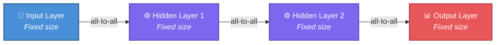
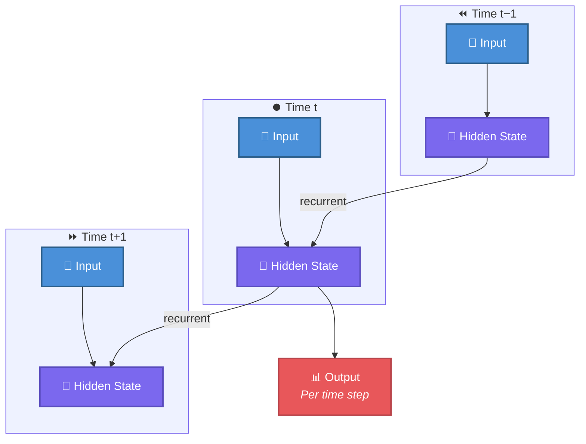
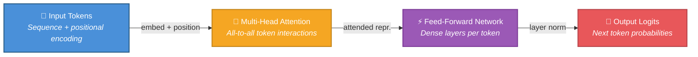
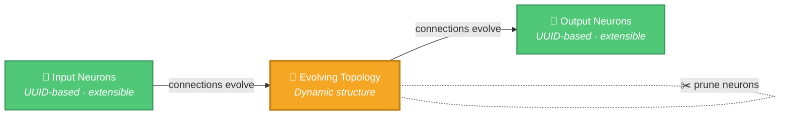

# 📊 NEAT vs Traditional Neural Networks and Modern LLMs: A Comprehensive Comparison

## 🔍 Overview

This document compares our NEAT-AI implementation with traditional neural
network architectures (feedforward, CNN, RNN) and modern Large Language Models
(Transformers). It clearly explains what we've implemented, the pros and cons of
our approaches, our unique innovations, and identifies shortcomings that
represent future work opportunities.

> [!NOTE]
> You don't need to be an expert in neural networks or the NEAT algorithm to get
> value from this comparison. We start with a high-level introduction to NEAT
> and only assume basic familiarity with ML concepts. It aims to stay accurate
> and links to authoritative sources whenever new ideas are introduced.

For project terminology (Creatures, Memetic evolution, CRISPR injections,
Grafting, etc.), see [AGENTS.md](./AGENTS.md#terminology).

## 📋 Table of Contents

1. [What We've Implemented](#what-weve-implemented)
2. [Architectural Comparison](#architectural-comparison)
3. [Training Paradigms](#training-paradigms)
4. [Our Unique Approaches](#our-unique-approaches)
5. [Ecosystem Comparison: What We've Built vs Standard Libraries](#ecosystem-comparison-what-weve-built-vs-standard-libraries)
6. [Pros and Cons Analysis](#pros-and-cons-analysis)
7. [Shortcomings and Future Work](#shortcomings-and-future-work)
8. [References and Further Reading](#references-and-further-reading)

## 🧬 What We've Implemented

### 🔬 Core NEAT Algorithm

- ✅ **Evolutionary Topology Search**: Networks evolve their structure through
  genetic operations (mutation, crossover)
- ✅ **Speciation**: Networks grouped by similarity to protect innovation and
  prevent premature convergence
- ✅ **Historical Marking**: Tracks gene history for compatible crossover
  between different topologies
- ✅ **Genetic Operators**:
  - Mutation: Add/remove neurons and connections, modify weights/biases
  - Crossover: Breeding between compatible parents
  - Selection: Multiple strategies (fitness proportionate, tournament, power)

### 🎓 Training Methods

- ✅ **Backpropagation**: Full gradient-based weight optimisation implemented
  with:
  - Mini-batch gradient descent (configurable batch sizes)
  - Adaptive learning rate strategies (fixed, decay, adaptive)
  - Weight and bias adjustment with configurable limits
  - Sparse training with intelligent neuron selection
- ✅ **Memetic Evolution**: Records successful weight patterns and reuses them
  in later generations, following the
  [memetic algorithm](https://en.wikipedia.org/wiki/Memetic_algorithm) approach;
  we've observed this hybrid step improve convergence on our internal
  benchmarks.
- ✅ **Error-Guided Structural Evolution**: GPU-accelerated discovery of
  beneficial structural changes
- ✅ **Sparse Training**: Configurable neuron selection strategies (random,
  output-distance, error-weighted) for efficiency
- ✅ **Batch Processing**: Mini-batch gradient descent with configurable batch
  sizes
- ✅ **Early Stopping**: Enhanced early stopping with patience and improvement
  thresholds
- ✅ **Predictive Coding**: Optional training paradigm based on
  [Rao & Ballard (1999)](https://www.nature.com/articles/nn0199_79) that uses
  iterative inference settling and local Hebbian learning rules. Configurable
  via `PredictiveCodingConfig` with inference steps, learning rate, and energy
  convergence thresholds. See
  [PREDICTIVE_CODING.md](./docs/PREDICTIVE_CODING.md) for architecture details.
- ✅ **Dropout Regularisation**: True
  [inverted dropout](https://arxiv.org/abs/1207.0580) during training—randomly
  disables a configurable fraction of hidden neurons per forward pass and scales
  remaining activations by 1/(1−p) so inference runs unchanged. Input and output
  neurons are never dropped.
- ✅ **L1/L2 Weight & Bias Regularisation**: During backpropagation, applies L2
  weight decay (`w *= (1 − lr·λ₂)`) and L1 soft-thresholding to drive small
  weights to exactly zero, promoting sparsity. Mirrors the same decay for
  biases.
- ✅ **K-Fold Cross-Validation**: Splits training data into k folds, trains on
  k−1 folds and validates on the held-out fold. Fitness is the average
  validation error across all folds, reducing overfitting and producing more
  robust fitness estimates. Configurable fold count (1–20) with automatic
  fallback to single-split when data is insufficient.
- ✅ **Gradient Accumulation Normalisation**: Optional sqrt-scaling for gradient
  accumulation in high fan-out neurons, preventing neurons with many downstream
  connections from receiving disproportionately large error signals.
- ✅ **Synthetic Synapse Training**: Temporarily densifies inter-layer
  connectivity during backpropagation by adding zero-weight synapses between
  adjacent topological layers. After training, near-zero synapses are pruned and
  only useful connections are retained — addressing NEAT's inherent weakness of
  sparse connectivity compared to conventional
  [dense layers](https://en.wikipedia.org/wiki/Dense_layer). Opt-in via
  `syntheticSynapses: true` in the training configuration.
- ✅ **MCMC Mutation Acceptance**: Uses the
  [Metropolis-Hastings](https://en.wikipedia.org/wiki/Metropolis%E2%80%93Hastings_algorithm)
  criterion for mutation acceptance. Instead of unconditionally accepting all
  mutations, worse-fitness moves are accepted with a probability that decreases
  as temperature cools — enabling the population to escape local optima early
  and converge later. Includes adaptive temperature tuning toward the
  theoretically optimal acceptance rate (~23.4%, Roberts et al. 1997). The
  cooling schedule is also coupled to a live diversity signal: when species
  count collapses or within-species crowding rises, the temperature is reheated
  to restore exploration (`diversityAwareMCMC` block). Opt-in via
  `mcmc: { enabled: true }`.
- ✅ **Muon-Style Orthogonalised Gradient Updates**: Optional Newton-Schulz
  polynomial iteration applied to per-neuron gradient matrices during
  backpropagation, decorrelating update directions for improved training
  stability. Inspired by the DeepSeek V4 approach. Opt-in via
  `gradientOrthogonalisation: "muon"` in `BackPropagationArguments` (default
  `"none"`).

### ✨ Unique Features

- ✅ **UUID-Based Indexing**: Extensible observations without restarting
  evolution—new input features can be added dynamically by extending NEAT's
  historical-marking idea from
  [Stanley & Miikkulainen (2002)](http://nn.cs.utexas.edu/downloads/papers/stanley.ec02.pdf).
- ✅ **Distributed Evolution**: Multi-node training with centralised combination
  of best-of-breed creatures, similar to the
  [island model](https://en.wikipedia.org/wiki/Island_model).
- ✅ **Lifelong Learning**: Continuous adaptation via ongoing evolution and
  backpropagation. In long-running deployments (for example, generating fresh
  training data each day from many years of financial, market, or company
  reporting data), the same population can keep training and adapting as new
  samples and new features arrive. This supports continual learning in the
  spirit of
  [continual learning](https://en.wikipedia.org/wiki/Continual_learning) while
  still relying on your training data mix to keep past behaviour represented.
- ✅ **CRISPR Gene Injection**: Targeted gene insertion during evolution to
  introduce specific traits, inspired by
  [CRISPR-Cas9 gene editing](https://www.nature.com/scitable/topicpage/crispr-cas9-a-precise-tool-for-33169884/).
- ✅ **Grafting**: Cross-species breeding algorithm for genetically incompatible
  parents that preserves diversity like cross-island migration in the
  [island model](https://en.wikipedia.org/wiki/Island_model).
- ✅ **Neuron Pruning**: Automatic removal of neurons whose activations don't
  vary during training, echoing established
  [network pruning](https://en.wikipedia.org/wiki/Pruning_(neural_networks))
  practice.
- ✅ **GPU-Accelerated Discovery**: Cross-platform GPU support via
  [wgpu](https://wgpu.rs/) abstraction—Metal on macOS, Vulkan on Linux, DX12 on
  Windows—with automatic CPU fallback when no compatible GPU is detected.
- ✅ **Discovery Caching**: Success and failure caching for discovery candidates
  with age-based and size-based eviction, cache-informed multi-neuron removal
  candidates, and supplemental candidate building from historical data.
- ✅ **Disk Space Monitoring**: Pre-flight and runtime disk space checks during
  discovery to gracefully warn or abort when disk space is insufficient.
- ✅ **Ensemble Diversity**: `EnsembleDiversityConfig` scores creatures within
  species by weight variance, squash entropy, and topology diversity to reduce
  reliance on brilliant-but-brittle solutions.
- ✅ **Adaptive Quantum Steps**: `QuantumStepConfig` provides adaptive step
  sizing during memetic fine-tuning—larger steps when far from the optimum and
  smaller steps during convergence.
- ✅ **Unique Activation Functions**: IF, MAX, MIN, and other non-standard
  squashes that enable different network behaviours, akin to the broader family
  of [activation functions](https://en.wikipedia.org/wiki/Activation_function).
- ✅ **Improved Aggregate Gradient Flow**: MAXIMUM and MINIMUM aggregate
  functions distribute partial error signals to runner-up connections within a
  proximity threshold (15%), preventing dead gradient paths while preserving
  dominance of the winning connection.
- ✅ **Transfer Learning**: Checkpoint export/import system with UUID-based
  neuron and synapse mapping between creatures with different input/output
  configurations. Supports weight freezing for fine-tuning imported hidden
  layers and population seeding with pre-trained creatures.
- ✅ **ONNX Format Export**: Exports trained creatures to the
  [ONNX](https://onnx.ai/) binary format for interoperability with standard ML
  tooling. Converts creature topology to ONNX computational graphs with
  compatibility checking for unsupported features (aggregate functions,
  recurrent connections).
- ✅ **Hyperparameter Self-Adaptation**: Per-creature evolvable hyperparameters
  (learning rate, mutation rates, regularisation strength) subject to Gaussian
  mutation and weighted-average crossover, reducing the need for manual
  hyperparameter tuning.
- ✅ **Adaptive Population Sizing**: Automatically adjusts population size based
  on species diversity metrics—growing the population when diversity is low
  (premature convergence) and shrinking it during high-diversity stagnation.
- ✅ **Parallel Batch Creature Evaluation**: Topology-aware grouping clusters
  same-structure creatures in the evaluation queue to maximise WASM compilation
  cache hits across workers, with configurable concurrency limits.
- ✅ **MCMC Mutation Acceptance**: Implements the
  [Metropolis-Hastings](https://en.wikipedia.org/wiki/Metropolis%E2%80%93Hastings_algorithm)
  criterion for mutation acceptance with adaptive temperature tuning toward the
  theoretically optimal acceptance rate (~23.4%). Enables escape from local
  optima early in evolution while promoting convergence later.
- ✅ **Advanced Breeding Strategies**: Multiple breeding strategies for
  genetically incompatible creatures, including input-weight cosine similarity
  for neuron alignment, subgraph transplantation for
  [horizontal gene transfer](https://en.wikipedia.org/wiki/Horizontal_gene_transfer),
  and diversity-driven breeding for cross-population pairing.
- ✅ **Synthetic Synapse Training**: Temporarily densifies inter-layer
  connectivity during backpropagation by adding zero-weight synapses between
  adjacent topological layers, then prunes near-zero connections after training
  — addressing NEAT's inherent sparse connectivity weakness.
- ✅ **WASM Panic Recovery**: Graceful handling of WASM unreachable panics
  during evolution. Creatures that trigger WASM traps are excluded from the
  population without crashing the worker or evolution loop, enabling robust
  long-running training.
- ✅ **Forward-Only Topology Enforcement**: Unconditional topology validation
  after creature initialisation, with DEBUG-gated assertions after bulk neuron
  remapping operations, ensuring backward synapses cannot silently corrupt
  forward-only creatures.
- ✅ **Numerical Stability**: Unbounded activation functions (TAN, SQUARE, CUBE)
  are clamped to finite ranges in both TypeScript and Rust WASM implementations,
  preventing numerical overflow from producing extreme scores.
- ✅ **Fitness Sharing and Per-Species Breeding Quotas**: Standard NEAT fitness
  sharing divides raw fitness by species size so dominant species don't starve
  smaller niches. Per-species breeding quotas guarantee each surviving species a
  minimum number of breeding slots (`FitnessSharingConfig`, enabled by default).
- ✅ **Stagnant Species Detection and Retirement**: Species that fail to improve
  their best raw fitness across a sliding window are first halted (50% breeding
  reduction) and then made extinct, reclaiming breeding slots for progressing
  species. Configurable via `SpeciesStagnationConfig` (`haltWindow`,
  `extinctionWindow`).
- ✅ **Soft Compatibility-Gated Cross-Species Breeding**: Replaces hard
  lowest-compatibility father selection with a soft probabilistic gate that
  accepts candidates with probability `compatibility ^ power`, preserving rare
  exploratory hybrids while favouring similar architectures
  (`CompatibilityGatingConfig`, enabled by default).
- ✅ **Fitness-Driven Squash Mutation**: Squash function selection during
  mutation is biased toward activations that historically improved fitness in
  similar neuron roles (layer depth + fan-in bucket). Uses EMA-smoothed fitness
  deltas with Boltzmann-weighted selection (`SquashEffectivenessConfig`, enabled
  by default).
- ✅ **DNA-Sharing Primitives**: A bake-off harness compares strategies for
  transferring useful structure between unrelated creatures. The current
  recommended primitive is `PruningTemplateStrategy`, which uses an oracle
  creature ("Europa") to identify and remove redundant production neurons via
  activation-fingerprint correlation. Additional primitives include
  `KnowledgeDistillation` (small student pathway trained to imitate donor
  behaviour), `CompactModuleGraft` (graft 6–32 neuron dense modules preserving
  donor UUIDs), and `KnobTuningStrategy` (baseline preset stamping). See
  [docs/dna-sharing-bake-off-results.md](./docs/dna-sharing-bake-off-results.md).
- ✅ **Optional Rust CLI Scorer with WASM Fallback**: Generation scoring can be
  delegated to an external `rust_scorer` binary for higher throughput
  (directory/batch mode runs once per generation), with automatic fallback to
  the in-process WASM scorer when the binary is unavailable or errors out
  (`RustScorerConfig`, opt-in).
- ✅ **NEAT-AI-core Pinning and Parity Gate**: Read-heavy and hot-path
  computations (topology validation/scanning, reverse topological order, cycle
  detection, the topological backprop loop, and elastic weight distribution) are
  owned by the external
  [NEAT-AI-core](https://github.com/stSoftwareAU/NEAT-AI-core) repository,
  pinned by full 40-character SHA in `deno.json`. A parity gate (Issue #2345)
  prevents drift between the in-tree wrappers and the pinned core. There are no
  TypeScript fallbacks for core-owned operations — failure to load the WASM
  bundle is fail-fast with an actionable error.

## 🏗️ Architectural Comparison

### 🧠 Traditional Feedforward Neural Networks

> **Key characteristics:** Structure defined before training · All-to-all
> connections between layers · No feedback loops · Static topology

**Image Reference**:
[Feedforward Neural Network](https://en.wikipedia.org/wiki/Feedforward_neural_network)

### 🖼️ Convolutional Neural Networks (CNNs)

```mermaid
graph LR
    I["🖼️ Input Image<br/><i>Fixed grid</i>"]
    C["🔍 Convolution Layers<br/><i>Spatial filters</i>"]
    P["📐 Pooling Layers<br/><i>Downsample</i>"]
    FC["🧠 Fully Connected<br/><i>Classification</i>"]
    OUT["🏷️ Predictions<br/><i>Class scores</i>"]

    I -->|"shared weights"| C
    C -->|"feature maps"| P
    P -->|"flattened"| FC
    FC -->|"softmax"| OUT

    style I fill:#4A90D9,stroke:#2C5F8A,color:#fff,stroke-width:2px
    style C fill:#F5A623,stroke:#C48418,color:#fff,stroke-width:2px
    style P fill:#7B68EE,stroke:#5A4DBE,color:#fff,stroke-width:2px
    style FC fill:#48A999,stroke:#2E7A6E,color:#fff,stroke-width:2px
    style OUT fill:#E8575A,stroke:#B8444A,color:#fff,stroke-width:2px
```

> **Key characteristics:** Designed for spatial data (images) · Shared weights
> via convolution · Approximate translation invariance · Fixed architecture per
> layer type

**Image Reference**:
[Convolutional Neural Network](https://en.wikipedia.org/wiki/Convolutional_neural_network)

### 🔄 Recurrent Neural Networks (RNNs/LSTMs)

> **Key characteristics:** Processes sequences · Maintains a hidden state
> (memory) · Fixed recurrent structure · Can suffer from vanishing or exploding
> gradients

**Image Reference**:
[Recurrent Neural Network](https://en.wikipedia.org/wiki/Recurrent_neural_network)

### 🤖 Transformer/LLM Architecture

> **Key features:** Self-attention mechanism (all tokens attend to all tokens) ·
> Positional encoding for order · Multi-head attention · Fixed architecture,
> often at massive scale (billions of parameters) · Pre-trained on large
> corpora, then fine-tuned

**Image Reference**:
[Transformer (machine learning model)](https://en.wikipedia.org/wiki/Transformer_(machine_learning_model))

### 🧬 NEAT Architecture (Our Implementation)

> **Key differences:** ✓ Topology evolves during training · ✓ Connections can be
> added/removed dynamically · ✓ Neurons can be added/pruned automatically · ✓
> Structure adapts to problem complexity · ✓ No predetermined architecture · ✓
> Can handle non-differentiable objectives

**Visualisation**: See our
[interactive visualisation](https://stsoftwareau.github.io/NEAT-AI/index.html)

## 🎓 Training Paradigms

### 🧠 Traditional Neural Networks

**Training Approach**:

- **Backpropagation**: Gradient-based weight updates using chain rule
- **Fixed Architecture**: Structure determined before training begins
- **Batch Training**: Process multiple samples simultaneously for efficiency
- **Static Learning**: Architecture doesn't change during training
- **Transfer Learning**: Pre-trained models can be fine-tuned for new tasks
- **Supervised Learning**: Requires labelled datasets

**Strengths**:

- Fast convergence with gradient descent
- Proven scalability to billions of parameters
- Rich ecosystem of tools and frameworks
- Highly optimised for GPU parallel processing

**Weaknesses**:

- Requires manual architecture design
- Needs differentiable loss functions
- Catastrophic forgetting in continuous learning
- Limited interpretability (black box)
- Rigid input/output dimensions

### 🧬 NEAT (Our Implementation)

**Training Approach**:

- **Hybrid Approach**: Combines evolutionary search with backpropagation
- **Dynamic Architecture**: Structure evolves during training
- **Genetic Operations**: Mutation, crossover, speciation
- **Backpropagation**: Gradient-based weight optimisation (fully implemented)
- **Memetic Learning**: Records and reuses successful weight patterns; on our
  internal workloads this hybrid step has often converged faster than pure
  backpropagation in practice
- **Error-Guided Discovery**: GPU-accelerated structural hints based on error
  analysis
- **Population-Based**: Evolves multiple networks simultaneously
- **Regularisation**: Dropout, L1/L2 weight & bias decay, sparse training,
  neuron pruning, and cost-of-growth penalty
- **Cross-Validation**: K-fold validation for robust fitness estimation
- **Transfer Learning**: Checkpoint export/import with weight freezing for
  fine-tuning on related tasks
- **MCMC Mutation Acceptance**: Metropolis-Hastings criterion with adaptive
  temperature tuning for accepting/rejecting mutations
- **Synthetic Synapses**: Temporary dense inter-layer connectivity during
  backpropagation, pruned after training
- **Advanced Breeding**: Input-weight crossover, subgraph transplantation
  (horizontal gene transfer), diversity-driven breeding, and cosine similarity
  neuron alignment for genetically incompatible creatures

**Strengths**:

- Automatic architecture search
- Adaptive complexity (grows/shrinks as needed)
- Works with non-differentiable objectives
- Extensible inputs/outputs via UUID indexing
- Lifelong learning support for long-running deployments (continuous training as
  new data arrives), with the degree of catastrophic forgetting depending on how
  you construct and refresh your training data
- Can trace evolutionary history
- Transfer learning via checkpoint export/import with UUID-based neuron mapping
- ONNX export for interoperability with standard ML tooling

**Weaknesses**:

- More computationally expensive (population-based)
- Slower convergence than pure gradient descent
- Limited scalability compared to massive transformers
- Less efficient for pure parallel processing

### 🎮 Reinforcement Learning

NEAT-AI is a **direct policy search** method for episode-based reinforcement
learning (RL): each creature is a candidate policy, and the rollout score
(cumulative reward, optionally with shaping penalties) is its fitness. Compared
to value-based RL ([DQN](https://www.nature.com/articles/nature14236)) and
policy-gradient methods ([PPO](https://arxiv.org/abs/1707.06347), REINFORCE),
NEAT does not learn a value function and does not differentiate through the
policy — it evolves the network's topology and weights directly against a scalar
episode score. This means the reward can be sparse, discontinuous, or provided
only by a black-box simulator; the action decoder need not be differentiable;
and the policy architecture grows with the task instead of being chosen up
front. The cost is sample efficiency per environment step — when a dense,
differentiable reward is available, DQN or PPO usually converge in fewer
simulator steps. Where NEAT wins is in parallelism (rollouts are embarrassingly
parallel across the population) and robustness to non-differentiable objectives.
The streaming primitive is `Creature.activate`, called once per simulator tick;
the canonical episode-rollout loop and worked-example link are documented in
[`docs/REINFORCEMENT_LEARNING.md`](./docs/REINFORCEMENT_LEARNING.md).

## ✨ Our Unique Approaches

### 1. 🧬 Memetic Evolution (Hybrid Evolution + Backpropagation)

**What It Is**: A hybrid approach that records successful weight patterns from
the fittest creatures and reuses them in future generations.

**How It Works**:

1. When a creature is mutated, we preserve its original state
2. After mutation, we compare the new creature to its parent
3. If the topology is unchanged, we record the weight/bias differences as
   "memetic" information
4. Future creatures with similar topologies can inherit these successful
   patterns

**Why It Helps**: In our own workloads, memetic evolution has often converged
faster than pure backpropagation because:

- It preserves successful weight patterns across generations
- It combines the exploration of evolution with the exploitation of gradient
  descent
- It allows fine-tuning of fittest creatures between generations
- It bridges the gap between evolutionary and gradient-based learning

**Reference**: See Feature #9 in [README.md](./README.md) and
[Memetic Algorithms](https://en.wikipedia.org/wiki/Memetic_algorithm)

### 2. ⚡ Error-Guided Structural Evolution

**What It Is**: GPU-accelerated discovery that analyses neuron activations and
errors to suggest beneficial structural changes.

**How It Works**:

1. During training, we record neuron activations and errors
2. The Rust discovery engine (GPU-accelerated) analyses this data
3. It identifies:
   - Helpful synapses that should be added
   - Harmful synapses that should be removed
   - New neurons that could reduce error
   - Better activation functions for existing neurons
4. These suggestions are used to create candidate creatures for evolution

**Why It's Unique**: Unlike traditional NEAT which uses random structural
mutations, we use error-driven hints to guide evolution. This is designed to
reduce the search space by prioritising candidates suggested by measured error
patterns rather than exploring structures uniformly at random. To our knowledge,
this combination of NEAT-style evolution with a separate, GPU-accelerated Rust
discovery engine and a cost-of-growth gate is uncommon in open-source NEAT
implementations, which usually mutate structure only inside the main training
loop.

**Real-World Impact**: In our own deployments, this discovery step has been
particularly effective at making steady, incremental gains—typically finding
small improvements (around 0.5–3% per discovery run) that add up over many
iterations. It allows long-lived creatures to keep improving structurally
without manual architecture tweaking.

**Reference**: See Feature #10 in [README.md](./README.md) and
[GPU_ACCELERATION.md](./GPU_ACCELERATION.md)

### 3. 🔑 UUID-Based Extensible Observations

**What It Is**: Neurons are identified by UUIDs rather than numeric indices,
allowing dynamic addition of input/output features.

**How It Works**:

- Each neuron has a unique UUID
- Synapses reference neurons by UUID, not index
- New input neurons can be added without breaking existing connections
- Evolution can continue seamlessly when new features are introduced

**Why It's Unique**: Traditional neural networks require fixed input/output
dimensions. Our approach allows incremental feature engineering without
restarting training.

**Real-World Impact**: This feature solved critical issues when evolving
creatures on multiple machines and combining them into a common population.
UUID-based indexing dramatically improved genetic compatibility between
creatures evolved on different machines (islands), enabling successful
cross-island breeding that would have failed with numeric indexing.

**Reference**: See Feature #1 in [README.md](./README.md)

### 4. 🌐 Distributed Evolution with Centralised Combination

**What It Is**: Evolution can run on multiple independent nodes, with
best-of-breed creatures combined on a central controller.

> [!TIP]
> UUID-based indexing makes distributed combination possible: creatures evolved
> on different machines share a common neuron-identity scheme, so cross-island
> breeding works without index remapping.

**How It Works**:

- Each node runs independent evolution
- Best creatures from each node are periodically sent to controller
- Controller combines populations and redistributes
- Enables scaling beyond single-machine constraints

**Why It's Unique**: Most NEAT implementations are single-machine. Our
distributed approach enables larger populations and faster evolution.

**Reference**: See Feature #2 in [README.md](./README.md)

### 5. 💉 CRISPR Gene Injection

**What It Is**: Targeted gene insertion during evolution to introduce specific
traits.

**How It Works**:

- Pre-defined gene patterns (connections, neurons, activation functions) can be
  injected
- Injected during breeding or mutation phases
- Allows domain knowledge to guide evolution

**Why It's Unique**: Provides a way to incorporate expert knowledge into the
evolutionary process.

**Reference**: See Feature #7 in [README.md](./README.md)

### 6. 🌿 Grafting for Incompatible Parents

**What It Is**: When parents aren't genetically compatible, we use a grafting
algorithm instead of standard crossover.

**How It Works**:

- Genetic compatibility is measured by topology similarity
- If parents are too different, standard crossover fails
- Grafting algorithm transfers compatible sub-networks from one parent to
  another
- Enables cross-species breeding

**Why It's Unique**: Allows evolution to combine solutions from different
"islands" of the search space.

**Reference**: See Feature #8 in [README.md](./README.md)

### 7. 🧠 Predictive Coding Training

**What It Is**: An optional training paradigm based on predictive coding theory
([Rao & Ballard, 1999](https://www.nature.com/articles/nn0199_79)) that
minimises prediction error through iterative inference settling and local
Hebbian learning rules.

**How It Works**:

1. Input and target values are clamped to the network
2. An iterative settling loop runs inference, adjusting latent values to
   minimise prediction error energy (E = ½ Σ ε²)
3. Once settled, local Hebbian weight updates are computed: ΔW = η · f'(a) · ε ·
   x
4. Updates are applied with symmetric (shared) weights rather than separate
   prediction weights

**Why It's Unique**: Predictive coding uses only local information for learning
(pre- and post-synaptic activity), which aligns naturally with NEAT's
neuron-centric topology. It provides an alternative to standard backpropagation
that may generalise differently on certain problem types.

**Configuration**: Controlled via `PredictiveCodingConfig` with parameters for
inference steps, inference rate, learning rate, and energy convergence
threshold. Disabled by default.

**Reference**: See [PREDICTIVE_CODING.md](./docs/PREDICTIVE_CODING.md) for the
full architecture design.

### 8. 🔍 Discovery Caching and Disk Space Management

**What It Is**: A suite of enhancements to the discovery pipeline that cache
evaluation results, inform future candidate building from historical data, and
monitor disk space to prevent failures.

**How It Works**:

- **Success Cache**: Persists discovery candidates that improved a creature's
  score, allowing re-application of known wins to the current fittest creature
- **Failure Cache**: Caches candidates that failed to improve, preventing
  redundant re-evaluation with smart bucketing by weight order-of-magnitude
- **Cache Eviction**: Age-based (TTL) and size-based eviction prevents unbounded
  cache growth
- **Cache-Informed Candidates**: Historical successes inform multi-neuron
  removal combinations and supplement Phase 2 candidate building
- **Disk Space Monitoring**: Pre-flight checks with configurable critical and
  warning thresholds prevent opaque I/O failures during long-running discovery

**Why It's Unique**: Most neuroevolution implementations treat each structural
search independently. Our caching layer allows the discovery pipeline to learn
from its own history, building on previous successes and avoiding repeated
failures.

### 9. 🎲 MCMC Mutation Acceptance

**What It Is**: A
[Metropolis-Hastings](https://en.wikipedia.org/wiki/Metropolis%E2%80%93Hastings_algorithm)
acceptance criterion applied to creature mutations, replacing unconditional
acceptance of all mutations.

**How It Works**:

1. After a mutation, the new creature's fitness is compared to its parent
2. Improving mutations are always accepted
3. Worsening mutations are accepted with probability
   `exp(−Δfitness / temperature)`, where temperature follows an exponential
   cooling schedule
4. Adaptive temperature tuning adjusts the temperature toward the theoretically
   optimal acceptance rate (~23.4%, Roberts et al. 1997) based on a
   rolling-window of recent acceptance decisions

**Why It's Unique**: Standard NEAT implementations accept all mutations
unconditionally or use simple fitness-based filtering. MCMC acceptance enables
the population to explore broadly early in evolution (high temperature) and
converge on good solutions later (low temperature), borrowing from the
well-studied Markov chain Monte Carlo framework.

**Diversity-Aware Cooling**: Beyond simple cooling, the temperature is also
coupled to a live diversity signal. When species count drops below `minSpecies`
or mean within-species compatibility exceeds `crowdingThreshold`, the
temperature is multiplied by `reheatFactor` to restore exploration. This
prevents premature convergence in long-running deployments where pure
exponential cooling would settle a homogeneous population.

**Configuration**: Opt-in via `mcmc: { enabled: true }` with configurable
initial temperature, cooling rate, and adaptive tuning parameters
(`adjustmentRate`, `toleranceRate`). Diversity-aware cooling is configured via
the nested `diversityAwareMCMC` block.

**Reference**: See Feature #20 in [README.md](./README.md)

### 10. 🧬 Advanced Breeding Strategies

**What It Is**: Multiple breeding strategies for genetically incompatible
creatures that go beyond standard NEAT crossover.

**How It Works**:

- **Input-Weight Crossover**: Preserves the mother's topology and blends
  input/output connection weights from both parents, enabling meaningful
  crossover even when topologies are structurally incompatible
- **Cosine Similarity Alignment**: Aligns neurons between incompatible parents
  using input-weight cosine similarity rather than sequential mapping, matching
  neurons by functional role rather than array position
- **Subgraph Transplantation**: Extracts self-contained clusters of 2–5
  connected neurons from one parent and transplants them (with new UUIDs) into
  another, inspired by
  [horizontal gene transfer](https://en.wikipedia.org/wiki/Horizontal_gene_transfer)
  in microbiology
- **Diversity-Driven Breeding**: Periodically breeds the fittest creatures with
  genetically distant newcomers (e.g., from separate islands) to inject
  diversity into stagnating populations
- **Soft Compatibility Gating**: Replaces a hard lowest-compatibility father
  selection step with a probabilistic gate that accepts candidates with
  probability `compatibility ^ power`, preserving rare exploratory hybrids while
  favouring similar architectures
- **Fitness Sharing and Per-Species Breeding Quotas**: Standard NEAT fitness
  sharing combined with minimum per-species breeding slots prevents dominant
  species from starving smaller niches
- **Stagnant Species Retirement**: Species that fail to improve their best raw
  fitness over a sliding window are halted and ultimately made extinct,
  reclaiming breeding budget for progressing species

**Why It's Unique**: Most NEAT implementations fall back to simple fitness-based
selection when parents are incompatible. Our approach preserves meaningful
genetic information across species boundaries, enabling the evolutionary
benefits of cross-island migration without sacrificing structural integrity.

**Reference**: See Feature #21 in [README.md](./README.md)

### 11. 🧮 Muon-Style Orthogonalised Gradient Updates

**What It Is**: An optional gradient orthogonalisation step that runs a
Newton-Schulz polynomial iteration on per-neuron incoming-weight gradient
matrices before applying them, decorrelating update directions to improve
training stability. Inspired by the Muon optimiser used in DeepSeek V4.

**How It Works**:

1. During backpropagation, accumulated weight gradients per neuron are reshaped
   into a small matrix.
2. A few Newton-Schulz iterations approximate the orthogonal polar factor of
   that gradient matrix.
3. The orthogonalised update is then scaled and applied in place of the raw
   gradient.

**Why It's Unique**: Standard backpropagation in NEAT applies raw gradient
descent (with learning-rate decay and L1/L2 decay). Muon-style updates remove
correlations between row directions of the per-neuron gradient, which can
produce smoother, less drift-prone training, particularly for small batch sizes
typical in evolutionary fitness evaluation.

**Configuration**: Opt-in via `gradientOrthogonalisation: "muon"` in
`BackPropagationArguments` (default `"none"`).

**Reference**: See `src/propagate/MuonOrthogonalisation.ts` and the DeepSeek
applicability notes in [docs/](./docs/).

### 12. 🔗 Synthetic Synapse Training

**What It Is**: Temporary dense inter-layer connectivity during backpropagation
that addresses NEAT's inherent sparse connectivity weakness.

**How It Works**:

1. Before backpropagation, zero-weight synapses are added between all neuron
   pairs in adjacent topological layers (determined by layer assignment)
2. Backpropagation runs with this temporarily densified connectivity, giving
   gradient descent a richer search space
3. After training, near-zero synapses are pruned and only connections that
   developed meaningful weights are retained

**Why It's Unique**: NEAT networks are naturally sparse — they start minimal and
grow only through mutation. This sparsity can limit backpropagation's
effectiveness because gradient descent can only optimise existing connections.
Synthetic synapses provide a temporary
[layer densification](https://en.wikipedia.org/wiki/Dense_layer) step that lets
gradient descent discover useful connections that evolution hasn't found yet,
without permanently inflating the network.

**Configuration**: Opt-in via `syntheticSynapses: true` in the training
configuration.

**Reference**: See Feature #22 in [README.md](./README.md)

## 🔬 Ecosystem Comparison: What We've Built vs Standard Libraries

### 📚 Standard ML Libraries (TensorFlow, PyTorch, etc.)

**What They Provide**:

- Pre-built neural network layers (Dense, Conv2D, LSTM, etc.)
- Automatic differentiation (computes gradients automatically)
- Optimisers (Adam, SGD, etc.) with proven hyperparameters
- Data loaders and preprocessing utilities
- Model serialisation formats (SavedModel, ONNX, etc.)
- Visualisation tools (TensorBoard, etc.)
- Pre-trained models (ImageNet, BERT, GPT, etc.)
- Large community and extensive documentation

**What We've Built Instead**:

- **Evolutionary Architecture Search**: No need to design layers - structure
  evolves
- **Dynamic Topology**: Networks grow/shrink during training
- **UUID-Based Extensibility**: Add features without restarting
- **Memetic Evolution**: Hybrid evolution + backpropagation
- **Error-Guided Discovery**: GPU-accelerated structural hints
- **Distributed Evolution**: Multi-machine evolution with centralised
  combination
- **Unique Activations**: IF, MAX, MIN and other non-standard functions
- **Genetic Operations**: Speciation, crossover, mutation with historical
  marking
- **MCMC Acceptance**: Metropolis-Hastings mutation acceptance with adaptive
  temperature
- **Synthetic Synapses**: Temporary dense connectivity for gradient descent
- **Advanced Breeding**: Multiple strategies for incompatible parent crossover
- **WASM Resilience**: Graceful panic recovery in long-running evolution

**Key Differences**:

- **Standard Libraries**: You design the architecture, they handle training
- **Our Library**: Architecture evolves automatically, we handle both structure
  and training
- **Standard Libraries**: Fixed architectures, transfer learning from
  pre-trained models
- **Our Library**: Dynamic architectures with transfer learning via checkpoint
  export/import, and ONNX export for interoperability

**When to Use Each**:

- **Use Standard Libraries**: When you have a proven architecture (CNN for
  images, Transformer for language), need pre-trained models, or want
  industry-standard tooling
- **Use Our Library**: When you need automatic architecture search, have
  non-differentiable objectives, want to add features incrementally, or need
  lifelong learning

**References**:

- [TensorFlow](https://www.tensorflow.org/) - Google's ML framework
- [PyTorch](https://pytorch.org/) - Facebook's ML framework
- [Keras](https://keras.io/) - High-level neural networks API
- [scikit-learn](https://scikit-learn.org/) - Traditional ML library

## ⚖️ Pros and Cons Analysis

### 🧬 NEAT (Our Implementation) - Pros

1. **Automatic Architecture Search**: No need to manually design network
   topology
2. **Adaptive Complexity**: Networks grow/shrink based on problem difficulty
3. **Non-Differentiable Objectives**: Works with objectives that don't have
   gradients
4. **Extensible Inputs**: UUID-based indexing allows adding features without
   restart
5. **Lifelong Learning**: Can continuously adapt over time when you keep older
   and newer data in the training mix, though catastrophic forgetting is still
   possible if the data distribution shifts and older patterns are no longer
   represented
6. **Interpretable Evolution**: Can trace how structure evolved over generations
7. **Hybrid Training**: Combines evolution (exploration) with backprop
   (exploitation)
8. **Unique Activations**: Supports non-standard functions (IF, MAX, MIN) for
   different behaviours
9. **Transfer Learning**: Checkpoint export/import with UUID-based neuron
   mapping and weight freezing for fine-tuning, plus DNA-sharing primitives
   (pruning template, knowledge distillation, compact module graft) for
   inter-island transfer
10. **ONNX Export**: Standard format export for interoperability with existing
    ML pipelines
11. **Comprehensive Regularisation**: Dropout, L1/L2 weight & bias decay, sparse
    training, neuron pruning, and cost-of-growth penalty
12. **Self-Tuning Hyperparameters**: Per-creature evolvable learning rate,
    mutation rates, and regularisation strength
13. **MCMC Exploration/Exploitation**: Metropolis-Hastings acceptance enables
    broad exploration early and convergence later, with adaptive temperature
    tuning
14. **Resilient Long-Running Training**: Graceful WASM panic recovery and
    forward-only topology enforcement enable robust multi-day training runs
    without manual intervention
15. **Advanced Inter-Species Breeding**: Multiple strategies (input-weight
    crossover, subgraph transplantation, diversity-driven breeding) preserve
    genetic diversity while enabling meaningful crossover between structurally
    different creatures
16. **Synthetic Synapse Training**: Temporary layer densification gives gradient
    descent a richer search space without permanently inflating the network
17. **Diversity Preservation**: Fitness sharing with per-species breeding
    quotas, stagnant-species retirement, soft compatibility-gated cross-species
    breeding, and diversity-aware MCMC reheating prevent premature convergence
    in long-running deployments
18. **Fitness-Driven Squash Selection**: Per-role tracker biases mutation toward
    activations that historically improved fitness in similar neuron roles,
    reducing wasted exploration on activations that rarely help
19. **Optional Muon Orthogonalisation**: Newton-Schulz orthogonalisation of
    per-neuron gradient matrices for smoother training updates
20. **External Rust Scorer**: Optional `rust_scorer` CLI for higher
    generation-scoring throughput, with automatic WASM fallback

### 🧬 NEAT (Our Implementation) - Cons

1. **Computational Cost**: Population-based training requires more resources
2. **Slower Convergence**: Evolutionary search is slower than pure gradient
   descent
3. **Limited Scalability**: Struggles with very large networks. In production,
   we're maxing out around 500 hidden neurons and 16,000 synapses. The
   `discoveryDir` feature helps push past this by finding structural
   improvements incrementally.
4. **Sequential Processing**: Less efficient for pure parallel computation than
   fixed architectures, though topology-aware parallel batch evaluation helps
5. **Limited Unsupervised Learning**: While evolution itself doesn't require
   labelled data for the algorithm, NEAT is typically used for supervised
   learning tasks where you need labelled data to compute fitness. True
   unsupervised learning (clustering, autoencoders, generative models) is not
   yet implemented. See [Unsupervised Learning](#unsupervised-learning) section
   for clarification.
6. **Hyperparameter Sensitivity**: Many parameters to tune, though our
   implementation now addresses this with per-creature hyperparameter
   self-adaptation (evolvable learning rate, mutation rates, and regularisation
   strength), adaptive population sizing, adaptive mutation thresholds
   (`AdaptiveMutationThresholds`), plateau detection (`PlateauDetector`),
   stability adaptation (`StabilityAdaptationConfig`), and randomised
   hyperparameters each evolution run (see note below)
7. **No Native CUDA**: GPU acceleration uses wgpu (Metal, Vulkan, DX12) with CPU
   fallback rather than native CUDA for NVIDIA GPUs

> [!TIP]
> Our implementation handles hyperparameter sensitivity well by randomising
> values each evolution run. In one of our production deployments, 20+ machines
> constantly loop with random hyperparameters, and the fittest creatures are
> checked into a shared population pool at the end of each run. This approach
> has worked effectively for that workload without manual tuning, but it is not
> a universal guarantee.

### 🧠 Traditional Neural Networks - Pros

1. **Fast Training**: Gradient descent converges quickly with proper learning
   rates
2. **Proven Scalability**: Can handle billions of parameters (e.g., GPT-3,
   GPT-4)
3. **Transfer Learning**: Pre-trained models can be fine-tuned for new tasks
4. **Efficient Inference**: Highly optimised for production deployment
5. **Rich Ecosystem**: Extensive tooling (TensorFlow, PyTorch, etc.) - see
   [Ecosystem Comparison](#ecosystem-comparison) below
6. **Parallel Processing**: Highly optimised for GPU parallel computation
7. **Mature Techniques**: Well-understood regularisation, optimisation methods
8. **Industry Standard**: Widely used and supported

### 🧠 Traditional Neural Networks - Cons

1. **Fixed Architecture**: Requires manual design and tuning
2. **Gradient Dependency**: Requires differentiable loss functions
3. **Catastrophic Forgetting**: Struggles with continuous learning
4. **Black Box**: Limited interpretability
5. **Data Requirements**: Needs large labelled datasets
6. **Rigid Inputs**: Adding features requires retraining from scratch
7. **Architecture Search**: Manual or separate NAS (Neural Architecture Search)
   needed
8. **Overfitting**: Requires careful regularisation for generalisation

## 🚧 Shortcomings and Future Work

This section identifies gaps in our implementation compared to state-of-the-art
approaches. These represent opportunities for future development and can serve
as a task list.

> [!NOTE]
> The items below are listed in rough priority order. High-priority gaps have
> the greatest impact on practical usability; low-priority items are
> enhancements that would broaden the library's reach.

### 🔴 High Priority

#### 1. 🔁 Transfer Learning Support

**Current State**: ✅ Implemented (Issue #1861). Checkpoint export/import system
with UUID-based neuron and synapse mapping enables reuse of trained creatures
across related tasks with different input/output configurations.

**What We Have**:

- ✅ **Checkpoint Export/Import**: Save and load pre-trained creatures via the
  `Checkpoint` class with full topology and weight serialisation
- ✅ **UUID-Based Neuron Mapping**: Creatures with different topologies can
  share compatible sub-networks through UUID-based matching
- ✅ **Weight Freezing**: Imported hidden layers can be frozen during
  fine-tuning (`freezeHidden` option) so only new connections are trained
- ✅ **Population Seeding**: `createSeededPopulation()` initialises a new
  population from pre-trained creatures, enabling transfer across tasks
- ✅ **DNA-Sharing Primitives** (Issue #2491–#2496): A bake-off harness compares
  inter-island transfer strategies. Implemented primitives include
  `PruningTemplateStrategy` (recommended winner — uses an oracle creature to
  identify and remove redundant production neurons), `KnowledgeDistillation`
  (small student pathway trained to imitate donor behaviour on a probe dataset),
  `CompactModuleGraft` (grafts dense connected 6–32 neuron modules from donor
  into recipient preserving donor neuron UUIDs), and `KnobTuningStrategy`
  (baseline preset configuration). See
  [docs/dna-sharing-bake-off-results.md](./docs/dna-sharing-bake-off-results.md).

**What's Still Missing**:

- Multi-task learning capabilities

**References**:

- [Transfer Learning Explained](https://en.wikipedia.org/wiki/Transfer_learning) -
  Wikipedia overview
- [Transfer Learning Survey](https://arxiv.org/abs/1808.01974) - Pan & Yang
  (2009) - Comprehensive survey
- [How Transferable Are Features in Deep Neural Networks?](https://arxiv.org/abs/1411.1792) -
  Yosinski et al. (2014) - Explains feature transferability
- [Knowledge Distillation](https://arxiv.org/abs/1503.02531) - Hinton et al.
  (2015) - Distilling knowledge from large to small models

#### 2. 🔓 Unsupervised Learning

**Current State**: While evolution itself doesn't require labelled data for the
algorithm to work, NEAT is typically used for supervised learning tasks where
you need labelled data to compute fitness scores. True unsupervised learning
(learning patterns from unlabelled data) is not yet implemented.

> [!NOTE]
> Evolution is "unsupervised" in the sense that the algorithm doesn't need
> gradients or labelled examples to guide weight updates. However, you still
> typically need labelled data to compute fitness scores (e.g., "how well did
> this creature predict the target?"). True unsupervised learning in ML means
> learning patterns, representations, or structures from unlabelled data without
> any target labels.

**What's Missing**:

- Autoencoder architectures for representation learning
- Generative models (VAE, GAN-like structures)
- Clustering and dimensionality reduction
- Self-supervised learning objectives
- Unsupervised fitness functions (e.g., reconstruction error, clustering
  quality)

**Impact**: Broader applicability, ability to learn from unlabelled data

**References**:

- [Autoencoders](https://en.wikipedia.org/wiki/Autoencoder) - Wikipedia
- [Variational Autoencoders](https://arxiv.org/abs/1312.6114) - Kingma & Welling
  (2013)
- [Generative Adversarial Networks](https://arxiv.org/abs/1406.2661) -
  Goodfellow et al. (2014)
- [Unsupervised Learning Explained](https://en.wikipedia.org/wiki/Unsupervised_learning) -
  Wikipedia

#### 3. 👁️ Attention Mechanisms

**Current State**: No built-in attention mechanisms for sequence tasks.

**What's Missing**:

- Self-attention layers that can evolve
- Multi-head attention structures
- Position encoding for sequences
- Attention-based memory mechanisms

**Impact**: Better performance on sequential data, natural language tasks

**References**:

- [Attention Is All You Need](https://arxiv.org/abs/1706.03762) - Vaswani et al.
  (2017)
- [The Illustrated Transformer](https://jalammar.github.io/illustrated-transformer/) -
  Jay Alammar
- [Attention Mechanisms in Neural Networks](https://distill.pub/2016/augmented-rnns/) -
  Olah & Carter (2016)

#### 4. ⚡ Batch Processing Optimisation

**Current State**: Parallel batch creature evaluation with topology-aware
grouping is implemented (Issue #1862), along with batch discovery validation and
mini-batch gradient descent.

**What We Have**:

- ✅ **Parallel Batch Creature Evaluation**: `ParallelEvaluationConfig` provides
  topology-aware grouping that clusters same-structure creatures in the
  evaluation queue to maximise WASM compilation cache hits across workers, with
  configurable concurrency limits via `maxConcurrentEvaluations`.
- **Batch Discovery Validation**: `BatchDiscoveryValidator` validates multiple
  discovery candidates in a single call with type-based grouping (structural vs
  weight-only), result caching, early-exit on structural failure, and detailed
  validation statistics. This significantly reduces redundant validation during
  the discovery pipeline.
- **Mini-Batch Gradient Descent**: Configurable batch sizes for backpropagation
  weight updates.

**What's Still Missing**:

- Vectorised operations for multiple creatures simultaneously
- GPU-accelerated forward passes
- Batch inference optimisation

**Impact**: Faster training on large datasets, better GPU utilisation

**References**:

- [Batch Normalization](https://arxiv.org/abs/1502.03167) - Ioffe & Szegedy
  (2015)
- [Efficient Batch Processing](https://pytorch.org/tutorials/recipes/recipes/tuning_guide.html) -
  PyTorch Optimization Guide

### 🟡 Medium Priority

#### 5. 🎯 Multi-Task Learning

**Current State**: Single objective optimisation. Each creature optimises for
one task.

**What's Missing**:

- Multi-objective fitness functions
- Pareto-optimal solution tracking
- Task-specific output heads
- Shared representation learning

**Impact**: More efficient learning, networks that solve multiple problems

**References**:

- [Multi-Task Learning Survey](https://arxiv.org/abs/1706.05098) - Ruder (2017)
- [Multi-Objective Optimization](https://en.wikipedia.org/wiki/Multi-objective_optimization) -
  Wikipedia

#### 6. 🛡️ Advanced Regularisation Techniques

**Current State**: Comprehensive regularisation suite including dropout, L1/L2
weight & bias decay, sparse training, pruning, cost-of-growth penalty, and
cross-validation.

**What We Have**:

- ✅ **Dropout**: True inverted dropout (Issue #1860)—randomly disables hidden
  neurons during training, scales remaining activations by 1/(1−p), uses all
  neurons during inference
- ✅ **L1/L2 Weight & Bias Regularisation**: L2 weight decay biases towards
  smaller values; L1 soft-thresholding drives small weights/biases to exactly
  zero for sparsity (Issue #1859). Applied during backpropagation via
  `WeightRegularisationConfig` and `BiasRegularisationConfig`.
- ✅ **Cross-Validation**: K-fold cross-validation (Issue #1865) with
  configurable fold count, validation-based early stopping, and automatic
  fallback to single-split when data is insufficient
- **Sparse Training**: Configurable `sparseRatio` that selects a subset of
  neurons to update during training
- **Neuron Pruning**: Automatic removal of non-contributing neurons
- **Cost-of-Growth**: Penalty for network size
- **Hard Limits**: Per-mutation change limits and maximum absolute weight/bias
  values

**What's Still Missing**:

- Batch normalisation evolution

**Impact**: Better generalisation, reduced overfitting

**References**:

- [Dropout](https://arxiv.org/abs/1207.0580) - Srivastava et al. (2014) -
  Original dropout paper
- [Batch Normalization](https://arxiv.org/abs/1502.03167) - Ioffe & Szegedy
  (2015)
- [Regularization in Deep Learning](https://www.deeplearningbook.org/contents/regularization.html) -
  Deep Learning Book

#### 7. 🔧 Hyperparameter Evolution

**Current State**: Per-creature hyperparameter self-adaptation with adaptive
population sizing is implemented (Issue #1863), complementing the existing
adaptive mutation mechanisms.

**What We Have**:

- ✅ **Per-Creature Hyperparameter Self-Adaptation**: Learning rate, mutation
  rates, and regularisation strength are encoded as evolvable per-creature
  parameters (Issue #1863). Gaussian mutation and weighted-average crossover
  allow each creature to carry its own optimised hyperparameters, reducing the
  need for manual tuning.
- ✅ **Adaptive Population Sizing**: `AdaptivePopulationConfig` automatically
  adjusts population size based on species diversity metrics (Issue #1863)—
  growing when diversity is low (premature convergence) and shrinking during
  high-diversity stagnation.
- **Adaptive Mutation Thresholds**: `AdaptiveMutationThresholds` adjusts the
  ratio of topology vs weight/bias mutations based on creature size (neuron
  count). Large creatures (≥300 neurons) receive 90% weight/bias mutations and
  only 10% topology expansion, with linear interpolation for medium creatures
  (100–299 neurons).
- **Plateau Detection**: `PlateauDetector` monitors fitness improvement rates
  across generations and adapts mutation rates—doubling the mutation multiplier
  when on a plateau and reducing it during rapid improvement to escape local
  optima.
- **Stability Adaptation**: `StabilityAdaptationConfig` adapts mutation rates
  and breeding selection based on creature validation stability. Brittle
  creatures (high failure rate) receive reduced mutations, while stable
  creatures receive a boost. Stability can also influence parent selection.

**What's Still Missing**:

- Meta-learning for hyperparameters (learning to learn across tasks)

**Impact**: Reduced manual tuning, better default configurations

**References**:

- [Hyperparameter Optimization](https://arxiv.org/abs/1206.2944) - Bergstra &
  Bengio (2012)
- [AutoML](https://www.automl.org/) - AutoML Research

#### 8. 🖥️ Cross-Platform GPU Support

**Current State**: Cross-platform GPU acceleration via wgpu abstraction layer.

> [!NOTE]
> GPU acceleration uses the wgpu cross-platform abstraction, which automatically
> selects the best available backend: Metal on macOS, Vulkan on Linux, and DX12
> on Windows. When no compatible GPU is detected, discovery gracefully falls
> back to CPU computation.

**What's Implemented**:

- ✅ Automatic backend selection via wgpu (Metal, Vulkan, DX12, OpenGL)
- ✅ CPU fallback when no compatible GPU is available
- ✅ GPU backend detection and reporting (`getGpuBackendInfo()`)
- ✅ Cross-platform `requireGpu: false` — GPU accelerates but is not required

**What's Missing**:

- CUDA support for NVIDIA GPUs (wgpu uses Vulkan on Linux instead)
- OpenCL support for older hardware
- Benchmarking across all supported platforms

**Impact**: Broader hardware support, discovery works on any platform

**References**:

- [wgpu Documentation](https://wgpu.rs/) - Cross-platform GPU abstraction
- [Vulkan Specification](https://www.vulkan.org/)
- [CUDA Programming Guide](https://docs.nvidia.com/cuda/cuda-c-programming-guide/)

### 🟢 Low Priority

#### 9. 🔍 Advanced Interpretability Tools

**Current State**: Basic visualisation of network structure.

**What's Missing**:

- Activation visualisation
- Feature importance analysis
- Evolutionary path visualisation
- Decision boundary visualisation
- Saliency maps

**Impact**: Better understanding of evolved solutions, debugging capabilities

**References**:

- [Interpretable Machine Learning](https://christophm.github.io/interpretable-ml-book/) -
  Molnar (2020)
- [Visualizing Neural Networks](https://distill.pub/2017/feature-visualization/) -
  Olah et al. (2017)

#### 10. 📦 Standard Format Export

**Current State**: ✅ ONNX export implemented (Issue #1866). Custom JSON format
remains for internal serialisation.

**What We Have**:

- ✅ **ONNX Export**: Converts creature topology to ONNX computational graphs
  with each neuron mapped to weighted sum → bias addition → activation function.
  Includes compatibility checking via `checkOnnxCompatibility()` for unsupported
  features (aggregate functions like IF/MINIMUM/MAXIMUM and recurrent
  connections).

**What's Still Missing**:

- TensorFlow Lite export for mobile
- CoreML export for Apple devices
- PyTorch model conversion

**Impact**: Integration with existing ML pipelines, deployment flexibility

**References**:

- [ONNX Format](https://onnx.ai/) - Open Neural Network Exchange
- [TensorFlow Lite](https://www.tensorflow.org/lite) - TensorFlow Documentation
- [CoreML](https://developer.apple.com/machine-learning/core-ml/) - Apple
  Documentation

#### 11. 🕹️ Reinforcement Learning Support

**Current State**: Primarily supervised learning focus.

**What's Missing**:

- Q-learning integration
- Policy gradient methods
- Actor-critic architectures
- Reward shaping mechanisms

**Impact**: Ability to solve RL problems, game playing, robotics

**References**:

- [Reinforcement Learning: An Introduction](http://incompleteideas.net/book/) -
  Sutton & Barto (2018)
- [Deep Q-Networks](https://arxiv.org/abs/1312.5602) - Mnih et al. (2013)
- [Policy Gradient Methods](https://arxiv.org/abs/1704.06440) - Schulman et al.
  (2017)

#### 12. 📈 Time Series and Sequence Modelling

**Current State**: Primarily feedforward, but basic recurrent/time-series
support exists via the `feedbackLoop` configuration.

**What We Have**:

- **Feedback Loop**: The `feedbackLoop` option in `NeatArguments` enables
  recurrent connections (self-loops and backward connections), where the
  previous activation result feeds back into the next interaction. When enabled,
  recurrent mutation operations (`ADD_BACK_CONN`, `ADD_SELF_CONN`, etc.) become
  available, allowing networks to evolve memory-like structures suitable for
  time-series forecasting. See the
  [NARX feedback neural networks](https://www.mathworks.com/help/deeplearning/ug/design-time-series-narx-feedback-neural-networks.html)
  reference for the underlying concept.

**What's Still Missing**:

- LSTM/GRU-like gated structures
- Temporal convolution evolution
- Sequence-to-sequence architectures
- Advanced temporal attention mechanisms

**Impact**: Better handling of time series, natural language, sequential data

**References**:

- [LSTM Networks](https://arxiv.org/abs/1503.04069) - Hochreiter & Schmidhuber
  (1997)
- [Sequence to Sequence Learning](https://arxiv.org/abs/1409.3215) - Sutskever
  et al. (2014)

## 📚 References and Further Reading

### 🧬 NEAT Algorithm

- [Original NEAT Paper](http://nn.cs.utexas.edu/downloads/papers/stanley.ec02.pdf) -
  Stanley & Miikkulainen (2002) - **Foundational paper**
- [NEAT Wikipedia](https://en.wikipedia.org/wiki/Neuroevolution_of_augmenting_topologies) -
  Comprehensive overview
- [Evolving Neural Networks](https://www.cs.utexas.edu/users/ai-lab/?neat) - UT
  Austin NEAT Lab
- [NEAT Algorithm Explained](https://www.youtube.com/watch?v=3fzjfNV4vYo) -
  Visual explanation

### 🧠 Traditional Neural Networks

- [Deep Learning Book](https://www.deeplearningbook.org/) - Goodfellow, Bengio,
  Courville - **Comprehensive textbook**
- [Neural Networks and Deep Learning](http://neuralnetworksanddeeplearning.com/) -
  Michael Nielsen - **Beginner-friendly**
- [Backpropagation Algorithm](https://en.wikipedia.org/wiki/Backpropagation) -
  Wikipedia overview
- [Gradient Descent Optimization](https://ruder.io/optimizing-gradient-descent/) -
  Sebastian Ruder's blog

### 🤖 Modern LLMs and Transformers

- [Attention Is All You Need](https://arxiv.org/abs/1706.03762) - Vaswani et al.
  (2017) - **Transformer paper**
- [The Illustrated Transformer](https://jalammar.github.io/illustrated-transformer/) -
  Jay Alammar - **Visual explanation**
- [BERT Paper](https://arxiv.org/abs/1810.04805) - Devlin et al. (2018)
- [GPT Paper](https://cdn.openai.com/research-covers/language-unsupervised/language_understanding_paper.pdf) -
  Radford et al. (2018)

### 🧬 Memetic Algorithms

- [Memetic Algorithms](https://en.wikipedia.org/wiki/Memetic_algorithm) -
  Wikipedia overview
- [Memetic Algorithms for Optimization](https://link.springer.com/chapter/10.1007/978-3-540-72960-0_1) -
  Krasnogor & Smith (2005)
- [Hybrid Evolutionary Algorithms](https://www.springer.com/gp/book/9783540732194) -
  Raidl (2008)

### 🎲 Markov Chain Monte Carlo

- [Metropolis-Hastings Algorithm](https://en.wikipedia.org/wiki/Metropolis%E2%80%93Hastings_algorithm) -
  Wikipedia overview
- [Optimal Scaling of MCMC](https://projecteuclid.org/journals/annals-of-applied-probability/volume-7/issue-1/Weak-convergence-and-optimal-scaling-of-random-walk-Metropolis-algorithms/10.1214/aoap/1034625254.full) -
  Roberts, Gelman & Gilks (1997) — optimal acceptance rate theory
- [MCMC in Machine Learning](https://en.wikipedia.org/wiki/Markov_chain_Monte_Carlo) -
  Wikipedia overview

### 🧬 Horizontal Gene Transfer and Breeding

- [Horizontal Gene Transfer](https://en.wikipedia.org/wiki/Horizontal_gene_transfer) -
  Wikipedia overview
- [Island Model Evolution](https://en.wikipedia.org/wiki/Island_model) -
  Wikipedia overview
- [Cosine Similarity](https://en.wikipedia.org/wiki/Cosine_similarity) - Used
  for neuron alignment in inter-species breeding

### ⚡ GPU Acceleration

- [Metal Performance Shaders](https://developer.apple.com/metal/Metal-Performance-Shaders-Framework/) -
  Apple Documentation
- [wgpu Documentation](https://wgpu.rs/) - Cross-platform GPU abstraction
- [CUDA Programming Guide](https://docs.nvidia.com/cuda/cuda-c-programming-guide/) -
  NVIDIA Documentation
- [GPU Computing](https://en.wikipedia.org/wiki/General-purpose_computing_on_graphics_processing_units) -
  Wikipedia

### 🔬 Neuroevolution

- [Neuroevolution: A Different Kind of Deep Learning](https://www.oreilly.com/radar/neuroevolution-a-different-kind-of-deep-learning/) -
  O'Reilly article
- [Evolving Deep Neural Networks](https://arxiv.org/abs/1703.00548) - Real et
  al. (2017)
- [Large-Scale Evolution](https://arxiv.org/abs/1703.00548) - Real et al. (2017)

### 📖 Machine Learning Fundamentals

- [Machine Learning Course](https://www.coursera.org/learn/machine-learning) -
  Andrew Ng (Coursera)
- [Fast.ai](https://www.fast.ai/) - Practical deep learning course
- [3Blue1Brown Neural Networks](https://www.youtube.com/playlist?list=PLZHQObOWTQDNU6R1_67000Dx_ZCJB-3pi) -
  Visual explanations

## 🏁 Conclusion

NEAT offers unique advantages in automatic architecture search and adaptive
learning, but historically suffered from computational inefficiency and
scalability limitations. Our implementation addresses many of these through
cross-platform GPU acceleration, memetic evolution, error-guided discovery with
intelligent caching, predictive coding, per-creature hyperparameter
self-adaptation, comprehensive regularisation (dropout, L1/L2 weight & bias
decay), transfer learning via checkpoint export/import and DNA-sharing
primitives (pruning template, knowledge distillation, compact module graft),
ONNX format export, k-fold cross-validation, parallel batch creature evaluation,
MCMC mutation acceptance with adaptive temperature tuning and diversity-aware
reheating, optional Muon-style orthogonalised gradient updates, synthetic
synapse training for temporary layer densification, advanced inter-species
breeding strategies (input-weight crossover, subgraph transplantation,
diversity-driven breeding, soft compatibility gating), fitness sharing with
per-species breeding quotas and stagnant-species retirement, fitness-driven
squash mutation, an optional external Rust CLI scorer with WASM fallback, a
pinned NEAT-AI-core dependency with parity-gated WASM-only hot paths, graceful
WASM panic recovery for resilient long-running training, and forward-only
topology enforcement for structural integrity. Remaining gaps in unsupervised
learning and attention mechanisms represent opportunities for future
development.

The choice between NEAT and traditional neural networks depends on:

- **Use NEAT when**:
  - You need automatic architecture search
  - You have non-differentiable objectives
  - You require lifelong learning
  - You want to add features incrementally
  - You need interpretable evolution
  - You want to transfer learned structures via checkpoint export/import

- **Use Traditional NNs when**:
  - You need fast training on large datasets
  - You have proven architectures (CNNs for images, Transformers for language)
  - You need maximum scalability (billions of parameters)
  - You want industry-standard tooling

Our implementation bridges these worlds, making NEAT more practical while
preserving its unique advantages. The hybrid approach of evolution +
backpropagation, combined with memetic learning, error-guided discovery,
transfer learning, ONNX interoperability, MCMC acceptance, synthetic synapse
training, and advanced inter-species breeding, creates a powerful alternative to
purely gradient-based methods.
