# 📊 NEAT-AI vs Standard NEAT, Traditional Neural Networks, and Modern LLMs

This is the **comparison hub** for **[NEAT-AI](./AGENTS.md#-terminology)** — the
implementation in this repository. It is intentionally short: it frames the
comparison, gives an at-a-glance capability matrix, and links out to focused
sub-documents under [`docs/comparison/`](./docs/comparison/) so you can go as
deep as you like without wading through one giant page.

> [!IMPORTANT]
> **NEAT-AI ≠ NEAT.** NEAT-AI started from
> **[NEAT (NeuroEvolution of Augmenting Topologies)](./AGENTS.md#-terminology)**
> as published by
> [Stanley & Miikkulainen (2002)](http://nn.cs.utexas.edu/downloads/papers/stanley.ec02.pdf),
> but extends it well beyond the 2002 paper with gradient training, memetic
> evolution, error-guided Discovery, MCMC mutation acceptance, synthetic
> synapses, and more. Throughout these docs, **NEAT** means the standard 2002
> algorithm and **NEAT-AI** means this project. The
> [NEAT vs NEAT-AI rule in AGENTS.md](./AGENTS.md#-neat-vs-neat-ai--which-term-to-use)
> is the one canonical statement of the convention.

New to NEAT-AI? Read on — this hub assumes no prior expertise.

> [!NOTE]
> You don't need to be an expert in neural networks or the original NEAT
> algorithm to get value from this comparison. Each sub-document starts at a
> high level and links to authoritative sources whenever new ideas appear. For
> project terminology (Creatures, Memetic evolution, CRISPR, Grafting), see the
> [glossary](./docs/GLOSSARY.md) and [AGENTS.md](./AGENTS.md#-terminology).

## 🗺️ Sub-document map

```mermaid
flowchart TD
    Hub["📊 COMPARISON.md<br/>(this hub)"]
    Hub --> Impl["🧬 IMPLEMENTED<br/>standard NEAT vs<br/>NEAT-AI extensions"]
    Hub --> Arch["🏗️ ARCHITECTURES<br/>feedforward · CNN ·<br/>RNN · Transformer · NEAT-AI"]
    Hub --> Train["🎓 TRAINING_PARADIGMS<br/>gradient vs evolution · RL"]
    Hub --> Uniq["✨ UNIQUE_APPROACHES<br/>12 NEAT-AI innovations"]
    Hub --> Eco["🔬 ECOSYSTEM<br/>vs TensorFlow / PyTorch"]
    Hub --> Pros["⚖️ PROS_AND_CONS<br/>trade-offs"]
    Hub --> Future["🚧 FUTURE_WORK<br/>gaps vs state of the art"]
    Hub --> Ref["📚 REFERENCES<br/>supporting literature"]

    style Hub fill:#F5A623,stroke:#C48418,color:#fff,stroke-width:3px
    style Impl fill:#50C878,stroke:#3A9A5C,color:#fff,stroke-width:2px
    style Arch fill:#4A90D9,stroke:#2C5F8A,color:#fff,stroke-width:2px
    style Train fill:#4A90D9,stroke:#2C5F8A,color:#fff,stroke-width:2px
    style Uniq fill:#50C878,stroke:#3A9A5C,color:#fff,stroke-width:2px
    style Eco fill:#7B68EE,stroke:#5A4DBE,color:#fff,stroke-width:2px
    style Pros fill:#7B68EE,stroke:#5A4DBE,color:#fff,stroke-width:2px
    style Future fill:#E8575A,stroke:#B8444A,color:#fff,stroke-width:2px
    style Ref fill:#48A999,stroke:#2E7A6E,color:#fff,stroke-width:2px
```

## 📚 Sub-documents

| Page                                                                 | What it covers                                                                            |
| -------------------------------------------------------------------- | ----------------------------------------------------------------------------------------- |
| [🧬 What NEAT-AI implements](./docs/comparison/IMPLEMENTED.md)       | The line between **standard NEAT machinery** and the **NEAT-AI extensions** on top.       |
| [🏗️ Architectural comparison](./docs/comparison/ARCHITECTURES.md)    | NEAT-AI's evolving topology vs feedforward, CNN, RNN/LSTM, and Transformer networks.      |
| [🎓 Training paradigms](./docs/comparison/TRAINING_PARADIGMS.md)     | Gradient-only training vs NEAT-AI's hybrid evolution + backprop, and where it sits in RL. |
| [✨ Unique approaches](./docs/comparison/UNIQUE_APPROACHES.md)       | Deep dives on the 12 headline NEAT-AI innovations.                                        |
| [🔬 Ecosystem comparison](./docs/comparison/ECOSYSTEM.md)            | NEAT-AI vs TensorFlow / PyTorch / scikit-learn, with a capability matrix.                 |
| [⚖️ Pros and cons](./docs/comparison/PROS_AND_CONS.md)               | Candid trade-offs for NEAT-AI vs traditional neural networks.                             |
| [🚧 Shortcomings and future work](./docs/comparison/FUTURE_WORK.md)  | Gaps versus the modern state of the art (with what's already shipped).                    |
| [📚 References and further reading](./docs/comparison/REFERENCES.md) | Consolidated supporting literature for every external claim.                              |

## ⚖️ At-a-glance: NEAT-AI vs standard NEAT vs traditional NNs

This matrix is the 30-second summary. **Every claim is verified against the code
and cited in the linked sub-documents.**

| Capability                         | Standard NEAT (2002)   | NEAT-AI (this repo)               | Traditional NNs         |
| ---------------------------------- | ---------------------- | --------------------------------- | ----------------------- |
| Evolves topology                   | ✅ Core                | ✅ Inherited                      | ❌ Fixed architecture   |
| Speciation + historical marking    | ✅ Core                | ✅ Inherited                      | ❌                      |
| Gradient training (backprop)       | ❌ None                | ✅ Extension                      | ✅ Core                 |
| Memetic evolution                  | ❌                     | ✅ Extension                      | ❌                      |
| Error-guided structural Discovery  | ❌ Random mutation     | ✅ Extension (GPU)                | ❌                      |
| MCMC mutation acceptance           | ❌ Accepts all         | ✅ Extension                      | ❌                      |
| Synthetic synapses (densification) | ❌                     | ✅ Extension                      | n/a (already dense)     |
| Extensible inputs (UUID-keyed)     | ❌ Integer innovations | ✅ Extension                      | ❌ Retrain from scratch |
| Distributed / island evolution     | ❌ Single-machine      | ✅ Extension                      | 🟡 Data/model parallel  |
| Cross-incompatible-parent breeding | ❌ Refuses             | ✅ Extension (grafting, subgraph) | n/a                     |
| Transfer learning                  | ❌                     | ✅ Checkpoints + ONNX             | ✅ Pre-trained models   |
| Non-differentiable objectives      | ✅                     | ✅                                | ❌ Needs gradients      |
| Scales to billions of parameters   | ❌                     | 🟡 ~500 hidden neurons in prod    | ✅                      |

Legend: ✅ supported · 🟡 partial · ❌ not supported. See
[Pros and cons](./docs/comparison/PROS_AND_CONS.md) and
[Ecosystem comparison](./docs/comparison/ECOSYSTEM.md) for the detail behind
each row.

## 🧭 When to use NEAT-AI

- **Use NEAT-AI when** you need automatic architecture search, have
  non-differentiable objectives, want to add input features incrementally
  without restarting, need lifelong learning on a long-running deployment, or
  want interpretable evolutionary history.
- **Use traditional neural networks when** you need fast training on large
  datasets, have a proven architecture (CNNs for images, Transformers for
  language), need maximum scalability (billions of parameters), or want
  industry-standard tooling.

NEAT-AI bridges these worlds: the hybrid of evolution + backpropagation,
combined with memetic learning, error-guided Discovery, transfer learning, ONNX
interoperability, MCMC acceptance, synthetic-synapse training, and advanced
inter-species breeding, makes the NEAT idea more practical while preserving its
unique advantages.

## 🔗 Related reading

- [docs/README.md](./docs/README.md) — the full documentation index.
- [AGENTS.md](./AGENTS.md#-terminology) — terminology and the canonical
  NEAT-vs-NEAT-AI rule.
- [docs/GLOSSARY.md](./docs/GLOSSARY.md) — every acronym and themed term.
- [docs/DOC_STYLE.md](./docs/DOC_STYLE.md) — the documentation house style this
  hub follows.
