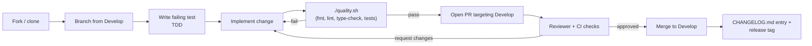

# 🤝 Contributing to NEAT-AI

Thank you for your interest in contributing to
[NEAT-AI](./AGENTS.md#-terminology) (NeuroEvolution of Augmenting Topologies —
Artificial Intelligence)! This guide covers everything you need to get started —
from setting up your development environment to submitting a pull request.

> [!IMPORTANT]
> **NEAT** refers to the original 2002 algorithm; **NEAT-AI** refers to this
> project, which extends it. See the
> [NEAT vs NEAT-AI rule](./AGENTS.md#-neat-vs-neat-ai--which-term-to-use) for
> the convention used throughout this repository.

## 📌 Summary and where to go next

This document is the **first-time contributor onboarding** guide: install the
toolchain, run the quality gate, branch off, write a failing test, and open a PR
(Pull Request). It does **not** duplicate detail that already lives in:

- [`AGENTS.md`](./AGENTS.md) — coding conventions, terminology, and the two
  critical invariants (neuron UUID stability, semantic version stability).
- [`docs/README.md`](./docs/README.md) — the topic-by-topic documentation index.
- [`docs/DISCOVERY_GUIDE.md`](./docs/DISCOVERY_GUIDE.md) — Discovery setup,
  including Rust FFI (Foreign Function Interface) extension build.
- [`docs/CORE_DEPENDENCY_POLICY.md`](./docs/CORE_DEPENDENCY_POLICY.md) — pinning
  policy for the external NEAT-AI-core WASM (WebAssembly) bundle.
- [`SECURITY.md`](./SECURITY.md) — vulnerability disclosure.
- [`CHANGELOG.md`](./CHANGELOG.md) — release notes.

## 🌊 The contribution pipeline at a glance



## 🚀 Quick Start

### 📋 Prerequisites

- **Deno 2.x** — Install from [deno.land](https://deno.land/) or via:

  ```bash
  curl -fsSL https://deno.land/install.sh | sh
  ```

  Verify your installation:

  ```bash
  deno --version   # Must be 2.x or later
  ```

- **Rust toolchain** (optional) — Only needed if you want to build the
  [NEAT-AI-Discovery](https://github.com/stSoftwareAU/NEAT-AI-Discovery) FFI
  extension locally. Install via [rustup](https://rustup.rs/).

### 🔧 Setup

1. **Clone the repository**

   ```bash
   git clone https://github.com/stSoftwareAU/NEAT-AI.git
   cd NEAT-AI
   ```

2. **Verify your setup** by running the full quality gate:

   ```bash
   ./quality.sh
   ```

   This script formats, lints, type-checks, and runs all 2000+ tests. If it
   passes, you are ready to contribute.

3. **Run individual tests** during development:

   ```bash
   deno test test/path/to/test.ts
   ```

### ⚙️ WASM Activation Module

The WASM activation backend is **required** and ships pre-built in
`wasm_activation/pkg/`. The library initialises it automatically — no manual
init or environment variables needed.

> [!NOTE]
> `wasm_activation/pkg` is sourced from NEAT-AI-core and should be refreshed via
> `./build.sh` after bumping the pin in `deno.json`.

To refresh the pinned artifacts:

```bash
./build.sh
```

### 🦀 Rust Discovery Library (Optional)

The Rust FFI extension provides GPU-accelerated structural analysis. It is
optional — tests and the core library work without it.

> [!TIP]
> If you are not working on discovery-related features, you can safely skip this
> section. All core tests pass without the Rust FFI extension.

1. Clone and build alongside NEAT-AI:

   ```bash
   git clone https://github.com/stSoftwareAU/NEAT-AI-Discovery.git ../NEAT-AI-Discovery
   ../NEAT-AI-Discovery/scripts/runlib.sh
   ```

2. Or point to an existing build:

   ```bash
   export NEAT_AI_DISCOVERY_LIB_PATH="/absolute/path/to/libneat_ai_discovery.dylib"
   ```

3. Validate:

   ```bash
   deno run --allow-env --allow-ffi --allow-read scripts/check_discovery.ts
   ```

## 🦀 NEAT-AI-core Dependency

Shared native Rust computation lives in the external
[NEAT-AI-core](https://github.com/stSoftwareAU/NEAT-AI-core) repository and is
consumed as a vendored WASM bundle **pinned by an immutable 40-char SHA** in
`deno.json` (`neatCore.rev`), attested by `neatCore.assetSha256`, and synced
into `wasm_activation/pkg` via `./build.sh`. The `neatCore.ref` field is only a
human-readable label recording which branch the pinned SHA came from — it is
**not** branch-tracking. `deno.json` is the single source of truth; `neatCore`
is pinned by SHA, never by branch.

For the full pinning policy (semver rules, approval tiers, CI auth) see
[docs/CORE_DEPENDENCY_POLICY.md](./docs/CORE_DEPENDENCY_POLICY.md); for the
day-to-day bump workflow see
[docs/EXTERNAL_NEAT_AI_CORE.md](./docs/EXTERNAL_NEAT_AI_CORE.md).

### Bumping the pinned core revision

`deno.json` pins the core by immutable SHA. A valid `neatCore` block carries
`repo`, `ref`, a 40-char `rev`, and a 64-char `assetSha256`:

```json
"neatCore": {
  "repo": "stSoftwareAU/NEAT-AI-core",
  "ref": "Develop",
  "rev": "fb793eba1fbfb2bf444ada43cc97b059292d1abc",
  "assetSha256": "81f7b7a886b8bedbea85c0dda216058e02181f64035034904038e76a36102fe3"
}
```

An example that omits `rev`/`assetSha256` would fail `./quality.sh`, which runs
`./build.sh --verify-only` and errors when `neatCore.rev` is unset.

To bump the pin (see
[docs/EXTERNAL_NEAT_AI_CORE.md](./docs/EXTERNAL_NEAT_AI_CORE.md) for the
authoritative workflow):

1. Run `./build.sh` — it resolves the target NEAT-AI-core commit, downloads the
   matching `wasm-bundle-<SHA>` artefact, refreshes `wasm_activation/pkg`, and
   updates `deno.json` `neatCore.rev` + `assetSha256`. Pass a specific commit
   with `./build.sh --rev <40-char-sha>`.
2. (Historical note for older branches) some workflows mention
   `cargo update -p neat-core`; in this repository layout, use `./build.sh`
   instead because Rust/Cargo is no longer built in-tree.
3. Run the full `./quality.sh` gate.
4. Run the parity gate to verify no behavioural drift:

   ```bash
   ./scripts/parity-gate.sh
   ```

5. Commit the updated `deno.json` and `wasm_activation/pkg` **together** in your
   PR — the pin and the artefact must move as one commit (approval controls
   rollout timing).

See [docs/PARITY_GATE.md](./docs/PARITY_GATE.md) for the full parity checklist
that must pass before removing in-tree Rust or after any core bump.

### Local Development Overrides

`build.sh` also supports local/experimental overrides without editing
`deno.json`:

```bash
NEAT_CORE_REPO=stSoftwareAU/NEAT-AI-core \
NEAT_CORE_REV=<40-char-sha> \
./build.sh
```

If you maintain older Rust-enabled branches, local path overrides are typically
done via `.cargo/config.toml` (path override). Do not commit that file.

Do not commit temporary override scripts/config. Keep committed pinning in
`deno.json` as the source of truth.

### Cross-Repository Links

- **[NEAT-AI-core](https://github.com/stSoftwareAU/NEAT-AI-core)** — shared Rust
  computation and WASM artifact source.
- **[NEAT-AI-scorer](https://github.com/stSoftwareAU/NEAT-AI-scorer)** — scoring
  tooling; should pin the same `neat-core` revision as this repo.
- **[NEAT-AI-Discovery](https://github.com/stSoftwareAU/NEAT-AI-Discovery)** —
  GPU-accelerated structural analysis (optional FFI extension).

## 🔄 Development Workflow

### 1. 🌿 Create a Branch

Branch from `Develop` (the main branch):

```bash
git checkout Develop
git pull origin Develop
git checkout -b your-branch-name
```

### 2. 🧪 Write Failing Tests First (TDD)

Follow test-driven development:

1. Write a test that defines the expected behaviour.
2. Run it and confirm it fails.
3. Implement the change to make the test pass.
4. Refactor if needed, keeping all tests green.

> [!TIP]
> Writing the test first clarifies the expected behaviour before implementation
> begins, leading to cleaner, more focused code.

### 3. 💻 Implement the Change

- Follow the conventions in [AGENTS.md](./AGENTS.md).
- Use **Australian English** spelling (colour, behaviour, organisation, favour,
  optimise, normalise, analyse, centre, metre).
- Run `deno fmt` and `deno lint --fix` regularly.

### 4. ✅ Run the Quality Gate

```bash
./quality.sh
```

The quality gate runs (see `quality.sh` for the canonical step list):

1. Dependency updates
   (`deno outdated --update --latest --minimum-dependency-age=<minutes>`,
   honouring `VIBE_BUMP_QUARANTINE_HOURS` — default 24h — to dodge fast-flagged
   supply-chain attacks; see Issue #2742)
2. Code formatting (`deno fmt`)
3. Linting with auto-fix (`deno lint --fix`)
4. Bash script syntax checks
5. Type checking (`deno check`)
6. Discovery library build (if `../NEAT-AI-Discovery` exists)
7. WASM package sync from pinned NEAT-AI-core (`./build.sh --verify-only`)
8. All tests in parallel with leak detection

> [!WARNING]
> Do not submit a pull request until `./quality.sh` passes cleanly. The CI
> pipeline runs the same checks and will block merging if any step fails.

Keep running `./quality.sh` until it passes cleanly.

For faster iteration, you can skip specific steps. The full flag set is shown by
`./quality.sh --help`; the most common ones are listed below (kept in sync with
the script's `show_help` block):

| Flag                          | Effect                                               |
| ----------------------------- | ---------------------------------------------------- |
| `--help`, `-h`                | Show usage and exit.                                 |
| `--skip-tests`                | Skip test execution.                                 |
| `--skip-discovery`            | Skip discovery library build and verification.       |
| `--skip-wasm`                 | Skip WASM package sync from NEAT-AI-core.            |
| `--with-rust-scorer`          | Enable external Rust scorer during test execution.   |
| `--test-both-scorers`         | Run tests twice: WASM-only then Rust scorer.         |
| `--rust-scorer-bin=PATH`      | Path to `rust_scorer` binary.                        |
| `--rust-scorer-timeout-ms=MS` | Per-call scorer timeout.                             |
| `--lint-only`                 | Only run formatting + linting (includes bash check). |
| `--check-only`                | Only run type-checking (`deno check`).               |
| `--dry-run`                   | Show which steps would run without executing them.   |

### 5. 📬 Submit a Pull Request

- Target the `Develop` branch.
- Use the PR title format: `Topic: Description (#issue)`
- Include a clear summary and test plan in the PR body.

## 🧪 Testing

### 📐 Conventions

- Tests use `Deno.test()` with `@std/assert` imports.
- Test files live under `test/` and mirror the `src/` directory structure.
- All 2000+ tests run **in parallel** — never rely on timing or execution order.

### 🎯 What to Test

Write **"what" tests** that exercise real code and assert on outcomes:

```typescript
import { assertEquals } from "@std/assert";

Deno.test("squash produces expected output", () => {
  const result = mySquash(0.5);
  assertEquals(result, 0.6224593312018546);
});
```

Avoid **"how" tests** that check implementation details:

- Do not assert that a specific internal method was called.
- Do not grep source files for patterns or keywords.
- Do not check function bodies, line counts, or documentation content.

### ⏱️ Unit Tests vs Benchmarks

- **Unit tests** (`test/`) verify correctness. Never use timing APIs
  (`performance.now()`, `Date.now()`, etc.) in tests.
- **Benchmarks** (`bench/`) measure performance. Use `Deno.bench()` or
  `performance.now()` here.

> [!NOTE]
> Timing-based assertions in unit tests create flaky tests that fail
> unpredictably under different system loads. Keep timing logic strictly within
> `bench/`.

### 🏃 Running benchmarks

Benchmarks live in `bench/` and are **not** part of the unit-test / coverage
suite, so they never count against the ≤120s-per-test budget. Run them
explicitly:

```bash
# Full Deno.bench suite (long-running — manual / nightly use).
deno task bench

# Fast smoke subset — the same command the Benchmarks CI job runs.
deno task bench:smoke

# A single benchmark file.
deno bench --allow-read --allow-write --allow-env --allow-ffi bench/Activate.ts
```

`deno task bench` uses the `bench.include` / `bench.exclude` config in
`deno.json`. `deno bench` only auto-discovers `*.bench.ts` files, so `include`
widens discovery to the whole `bench/` tree; `exclude` lists the standalone
profiling harnesses that are launched with `deno run` (they do heavy work at
module top level) so `deno task bench` does not execute them. New profiling
scripts of that kind should either be named without a `Deno.bench` suite or
guard their entry point with `import.meta.main`.

The `.github/workflows/bench.yaml` workflow runs `deno task bench:smoke` on pull
requests that touch `bench/` or `deno.json`, so the benchmarks are actually
executed in CI. It is intentionally a small, fast pass; fanning the full suite
across a CI matrix and OOM hardening are tracked as separate sub-issues.

## ➕ Adding Configuration

When adding a new configuration option, follow the established pattern:

### Step 1: 📄 Create the Config File

Create `src/config/FooConfig.ts`:

```typescript
/**
 * Configuration for foo behaviour.
 *
 * Issue #XXXX: Brief description.
 */
export interface FooConfig {
  /**
   * Description of the field.
   * Default: 42
   */
  bar?: number;

  /**
   * Description of the field.
   * Default: true
   */
  baz?: boolean;
}

/**
 * Required version of FooConfig with all fields populated.
 * Used internally after defaults are applied.
 */
export type RequiredFooConfig = Required<FooConfig>;

/**
 * Default values for foo configuration.
 */
export const DEFAULT_FOO_CONFIG: RequiredFooConfig = {
  bar: 42,
  baz: true,
};
```

### Step 2: 🔗 Add to NeatArguments

In `src/config/NeatArguments.ts`, add a `RequiredFooConfig` field:

```typescript
fooConfig: RequiredFooConfig;
```

### Step 3: 🔗 Add to NeatOptions

In `src/config/NeatOptions.ts`:

1. Add the partial override to both `NeatOptions` and `NeatOptionsInput` types.
2. For CLI-compatible options, wrap numeric fields with `CoerceNumeric<>`.
3. Add the config name to both `Omit` lists.

### Step 4: 🔍 Parse in NeatConfig

In `src/config/NeatConfig.ts`, parse numeric values using the IIFE pattern:

```typescript
const fooConfig: RequiredFooConfig = (() => {
  const result: RequiredFooConfig = {
    ...DEFAULT_FOO_CONFIG,
    ...options.fooConfig,
  };

  if (options.fooConfig?.bar !== undefined) {
    result.bar = parseNumber(options.fooConfig.bar, "fooConfig.bar");
  }

  return result;
})();
```

### Step 5: ✅ Validate

Add cross-field validation after the config object is created, before
`validate()` is called.

### Step 6: 🧪 Add Tests

Create `test/config/FooConfig.ts` with tests for default values, custom
overrides, and validation errors.

## ⚡ Adding Activation Functions

Activation functions (called "squash" functions in NEAT-AI) follow a strategy
pattern. See `src/methods/activations/README.md` for the full reference.

### Step 1: 💡 Create the Implementation

Create a new file in `src/methods/activations/` implementing the
`ActivationInterface`:

- **`getName()`** — Returns the unique squash name.
- **`squash(x)`** — The forward activation function.
- **`unSquash(x)`** — The inverse (if invertible).
- **`range()`** — Returns `{ low, high }` output bounds.

### Step 2: 🧪 Add Tests

Create tests under `test/` that verify:

- `squash()` produces correct output for known inputs.
- `unSquash(squash(x)) ≈ x` round-trips correctly (if invertible).
- Edge cases (zero, negative, large values).
- The function integrates correctly with the activation system.

### Step 3: 📝 Register the Activation

Register the new activation in the activation system so it is available for
mutation selection. Set an appropriate priority weight (1–10) based on the
function's practical usefulness.

### Step 4: 📚 Update Documentation

Add an entry to `src/methods/activations/README.md` following the existing
format — include priority, invertibility, and backpropagation strategy.

## 🎨 Code Style

### 🇦🇺 Australian English

All code, comments, and documentation use Australian English spelling:

| Use            | Not          |
| -------------- | ------------ |
| colour         | color        |
| behaviour      | behavior     |
| organisation   | organization |
| favour         | favor        |
| optimise       | optimize     |
| normalise      | normalize    |
| analyse        | analyze      |
| centre         | center       |
| licence (noun) | license      |
| license (verb) | license      |

> [!NOTE]
> Spell-checkers default to American English. Configure your editor to use
> Australian or British English to avoid false positives on correctly spelt
> words.

### 🔍 Key Lint Rules

The project enforces these lint rules (configured in `deno.json`):

- **`default-param-last`** — Default parameters (`foo = val`) cannot precede
  optional parameters (`bar?: type`). Make defaults optional and apply them in
  the function body instead:

  ```typescript
  // Wrong
  function fn(foo = 10, bar?: string) { ... }

  // Right
  function fn(bar?: string, foo?: number) {
    const effectiveFoo = foo ?? 10;
  }
  ```

- **`camelCase`** — Use `camelCase` for variables and functions.
- **`eqeqeq`** — Use `===` and `!==` instead of `==` and `!=`.
- **`no-throw-literal`** — Throw `Error` objects, not strings or other values.
- **`ban-untagged-todo`** — TODOs must include an issue reference:
  `// TODO(#1234): description`.

For the complete set of conventions, see [AGENTS.md](./AGENTS.md).

### 📝 Logging

All internal logging MUST go through `getLogger()` from `src/utils/Logger.ts`.
Do **not** add `@std/log` (`jsr:@std/log`) to `deno.json` or rely on it
transitively — it is unstable on JSR and the in-tree `Logger` interface is
already consumer-pluggable. See the
[Logging Policy section in AGENTS.md](./AGENTS.md#-logging-policy) for the
rationale, the audit command, and an example of injecting a custom `Logger` via
`NeatOptions.logger` / `setLogger()`.

### 🕒 Date/time handling

Use the native `Temporal` API (stable in Deno 2.7+) for **wall-clock /
calendar-style timestamps** — anything logged, emitted in an event payload,
persisted to JSON, or shown in a user-facing report. Keep `Date.now()` /
`performance.now()` for **elapsed-time measurements** (phase timings,
cool-downs, sliding-window TTLs). Do **not** add `@js-temporal/polyfill` or
`@std/datetime`. See the
[Date/time handling section in AGENTS.md](./AGENTS.md#-datetime-handling--temporal-vs-date)
for the full policy and canonical examples.

## 📁 Project Structure

```
src/                    # Source code
  architecture/         # Core neural network architecture
  breed/                # Crossover and breeding algorithms
  compact/              # Network compaction and optimisation
  config/               # Configuration and options
  costs/                # Cost/fitness functions
  creature/             # Creature behaviour modules
  discovery/            # Discovery integration (Rust FFI bridge)
  errors/               # Error types
  intelligentDesign/    # Intelligent Design squash optimisation
  methods/              # Activation functions (squash implementations)
  mutate/               # Mutation operators
  NEAT/                 # Core NEAT-AI evolutionary loop (selection, speciation)
  propagate/            # Backpropagation
  wasm/                 # WASM activation bridge
test/                   # Tests (mirrors src/ structure)
bench/                  # Benchmarks
docs/                   # Extended documentation
wasm_activation/        # WASM activation module (Rust source + pkg)
scripts/                # Utility scripts
```

## 💬 Getting Help

- Open an [issue](https://github.com/stSoftwareAU/NEAT-AI/issues) for bugs or
  feature requests.
- Check [docs/TROUBLESHOOTING.md](./docs/TROUBLESHOOTING.md) for common issues.
- See [AGENTS.md](./AGENTS.md) for detailed coding conventions and architecture.
- Browse [docs/README.md](./docs/README.md) for the topic-by-topic index.

## 🔗 Sibling docs

- **[README.md](./README.md)** — project overview and quick start.
- **[AGENTS.md](./AGENTS.md)** — coding conventions, terminology, invariants.
- **[SECURITY.md](./SECURITY.md)** — vulnerability disclosure policy.
- **[CHANGELOG.md](./CHANGELOG.md)** — release notes.
- **[docs/README.md](./docs/README.md)** — topic-by-topic documentation index.
