# 🧬 NEAT-AI Neural Network for DenoJS

<p align="center">
  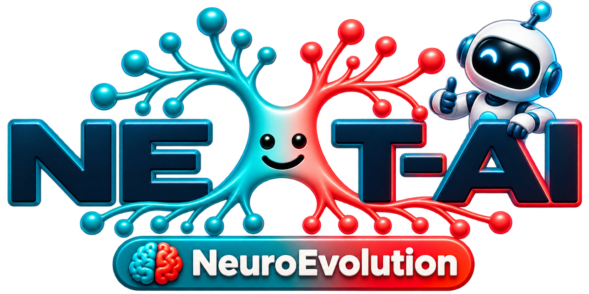
</p>

<p align="left">
<strong>NEAT-AI</strong> started from <strong>NEAT</strong> — the
NeuroEvolution of Augmenting Topologies algorithm published by
<a href="http://nn.cs.utexas.edu/downloads/papers/stanley.ec02.pdf">Stanley &amp; Miikkulainen (2002)</a>
— and has grown into a hybrid evolutionary plus gradient-based system, written
in DenoJS using TypeScript. NEAT-AI keeps the speciation and structure-mutation
ideas from standard NEAT but layers on much more recent research: memetic
evolution, error-guided <strong>Discovery</strong>, Markov Chain Monte Carlo
(MCMC) mutation acceptance, synthetic synapses,
<a href="docs/PREDICTIVE_CODING.md">predictive coding</a>,
<a href="docs/comparison/UNIQUE_APPROACHES.md">Muon-style orthogonalised
gradients</a>, and other algorithms (some published only weeks
before this paragraph was written). Every house term and acronym here is defined
in the <a href="docs/GLOSSARY.md">glossary</a>.
</p>

> [!IMPORTANT]
> **NEAT** refers to the original 2002 algorithm. **NEAT-AI** refers to this
> project — they are no longer the same thing. See the
> [NEAT vs NEAT-AI terminology rule in AGENTS.md](./AGENTS.md#-neat-vs-neat-ai--which-term-to-use)
> for the convention used throughout this repository.

For project terminology, coding conventions, and development guidelines, see
[AGENTS.md](./AGENTS.md).

## 📖 Docs map

New here? **[docs/README.md](./docs/README.md)** is the single, canonical
documentation index — a topic-by-topic table of contents with a "where to start"
reading path and a one-line summary for every long-form guide (Compute / WASM,
Discovery / FFI, Performance, Reference, Specialised topics, Governance). This
README deliberately does **not** re-catalogue those guides; it links off to the
one index so the two never drift apart.

Top entry points:

- **[docs/README.md](./docs/README.md)** — full documentation index; start here
  for any topic guide.
- **[CONTRIBUTING.md](./CONTRIBUTING.md)** — development setup, workflow, and
  how to bump the pinned NEAT-AI-core revision.
- **[AGENTS.md](./AGENTS.md)** — terminology and coding conventions for human
  and AI contributors.
- **[Glossary](./docs/GLOSSARY.md)** — the canonical reference for every acronym
  and house term used here (Creature, Discovery, Grafting, CRISPR, Intelligent
  Design, MCMC, FFI, WASM, …). When a themed word below is unfamiliar, this is
  the place to look it up.
- **[COMPARISON.md](./COMPARISON.md)** — how NEAT-AI compares to other AI
  approaches (and to standard NEAT).

## 🏗️ High-level architecture

A creature is a NEAT-AI genome that mutates and breeds in TypeScript, then runs
its forward pass inside a vendored WebAssembly (WASM) module. When the optional
Rust extension is present, error-guided structural proposals come back over a
Foreign Function Interface (FFI) call.

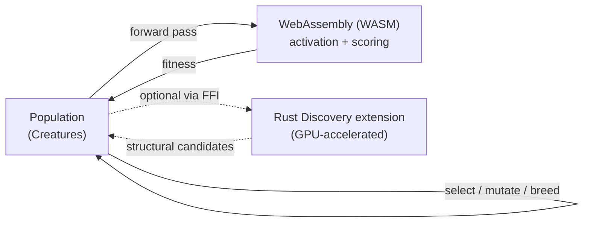

The Rust path is optional: if the
[NEAT-AI-Discovery](https://github.com/stSoftwareAU/NEAT-AI-Discovery) extension
is not built, discovery is skipped and evolution still runs end-to-end in WASM.
See [docs/DISCOVERY_ARCHITECTURE.md](./docs/DISCOVERY_ARCHITECTURE.md) for the
full pipeline.

## ✨ Feature Highlights

The list below describes **NEAT-AI** behaviour. Many entries — memetic
evolution, error-guided Discovery, MCMC mutation acceptance, synthetic synapses,
ONNX export — are extensions beyond the standard NEAT algorithm. See
[COMPARISON.md](./COMPARISON.md) for the side-by-side picture.

1. **Extendable Observations**: Input and output features are identified by
   stable UUIDs in the exported representation, rather than only by positional
   indices. This prevents the need to restart the evolution process as new
   observations are added, and makes it practical to evolve creatures on
   multiple machines and then recombine them, much like NEAT's historical
   marking for genes
   [Stanley & Miikkulainen (2002)](http://nn.cs.utexas.edu/downloads/papers/stanley.ec02.pdf).

2. **Distributed Training**: Training and evolution can be run on multiple
   independent nodes. The best-of-breed creatures can later be combined on a
   centralised controller node, mirroring the
   [island model](https://en.wikipedia.org/wiki/Island_model) used in
   evolutionary algorithms.

3. **Life Long Learning**: Designed for continuous learning in changing
   environments. The same population can keep training and adapting as new data
   arrives over weeks or months, supporting
   [continual learning](https://en.wikipedia.org/wiki/Continual_learning) while
   still relying on your training data to keep past knowledge represented.

4. **Efficient Model Utilisation**: Once trained, the current best model can be
   utilised efficiently by calling the `activate` function. This runs a single
   forward pass that maps inputs to outputs.

   > [!NOTE]
   > **Activation uses WebAssembly (WASM, required).** The library initialises
   > the WASM backend automatically; callers do not need to call any init
   > function or set environment variables.
   >
   > **Spawning your own Deno Workers that import NEAT-AI from the JavaScript
   > Registry (JSR)?** The worker may need explicit help to reach `jsr.io` for
   > the WASM bytes — see
   > [Troubleshooting › JSR-hosted NEAT-AI in your own workers](./docs/troubleshooting/WASM.md#-jsr-hosted-neat-ai-in-your-own-workers-issue-2545)
   > for the pre-fetch pattern (`fetchWasmForWorkers` +
   > `initialiseWasmActivationFromPayload`).

5. **Unique Squash Functions**: Supports unique squash functions such as IF, MAX
   and MIN, offering a wider range of potential solutions. More about
   [Activation Functions](https://en.wikipedia.org/wiki/Activation_function).

6. **Neuron Pruning**: Neurons whose activations don't vary during training are
   removed, and the biases in associated neurons are adjusted. More about
   [Pruning (Neural Networks)](https://en.wikipedia.org/wiki/Pruning_(neural_networks)).

7. **CRISPR**: Allows injection of hand-crafted genes into a population of
   creatures during evolution. The name borrows the biology acronym CRISPR
   (Clustered Regularly Interspaced Short Palindromic Repeats) from the
   [CRISPR gene-editing technique](https://en.wikipedia.org/wiki/CRISPR); in
   NEAT-AI, the "edits" are added neurons and synapses.

8. **Grafting**: If parents aren't "genetically compatible", the grafting
   algorithm enables cross-island interbreeding, preserving diversity in the
   same spirit as
   [island-model evolution](https://en.wikipedia.org/wiki/Island_model).

9. **Memetic Evolution**: Records and utilises the biases and weights of the
   fittest creatures to fine-tune future generations. Learn more about
   [Memetic Algorithms](https://en.wikipedia.org/wiki/Memetic_algorithm).

10. **Error-Guided Structural Evolution**: Dynamically identifies and creates
    new synapses by analysing neuron activations and errors. A dedicated Rust
    extension performs graphics processing unit (GPU)-accelerated analysis and
    proposes structural candidates over a Foreign Function Interface (FFI).
    Discovery runs typically find improvements of 0.5–3% per run that accumulate
    over many iterations.

    > [!WARNING]
    > Relies entirely on the
    > [NEAT-AI-Discovery](https://github.com/stSoftwareAU/NEAT-AI-Discovery)
    > Rust extension library. If the library is not available, the discovery
    > phase is skipped; there is no TypeScript fallback.

11. **[Visualisation](https://stsoftwareau.github.io/NEAT-AI/index.html)**

12. **Adaptive Mutation Rate**: Automatically adjusts mutation strategy based on
    creature size - large creatures focus on weight/bias modification rather
    than topology expansion.

13. **Adaptive Mutation Rate Based on Fitness Progress**: Mutation rate is
    automatically adjusted based on whether evolution is improving, stagnating,
    or stable, helping balance exploration and exploitation.

14. **Continuous Incremental Discovery**: For distributed, multi-machine
    discovery workflows that accumulate small improvements over time, see the
    [Discovery Guide](./docs/DISCOVERY_GUIDE.md).

15. **Training Data Fuzzing**: Noise injection during training prevents
    creatures from memorising exact training examples. Gaussian or uniform
    perturbations are added to inputs (and optionally outputs for
    [label smoothing](https://en.wikipedia.org/wiki/Label_smoothing)) each
    iteration, encouraging robust generalisation.

16. **K-Fold Cross-Validation**: Built-in
    [k-fold cross-validation](https://en.wikipedia.org/wiki/Cross-validation_(statistics))
    evaluates creatures on held-out data folds during evolution, reducing
    overfitting to a single train/test split.

17. **Transfer Learning**: Export trained creatures as checkpoints with
    metadata, import them into new tasks with UUID mapping for different
    input/output configurations, and seed populations with pre-trained creatures
    for [transfer learning](https://en.wikipedia.org/wiki/Transfer_learning)
    across related problems.

18. **ONNX Export**: Export trained creatures to the [ONNX](https://onnx.ai/)
    (Open Neural Network Exchange) format for deployment in standard ML
    inference pipelines, bridging the gap between neuroevolution and production
    deployment.

19. **Markov Chain Monte Carlo (MCMC) Mutation Acceptance**: Uses the
    [Metropolis-Hastings](https://en.wikipedia.org/wiki/Metropolis%E2%80%93Hastings_algorithm)
    criterion for mutation acceptance. Instead of unconditionally accepting all
    mutations, worse-fitness moves are accepted with a probability that
    decreases as temperature cools — enabling the population to escape local
    optima early and converge later. Includes adaptive temperature tuning toward
    the theoretically optimal acceptance rate (~23.4%, Roberts et al. 1997).
    Opt-in via `mcmc: { enabled: true }` in the configuration.

20. **Advanced Breeding Strategies**: Multiple breeding strategies for
    genetically incompatible creatures, including input-weight cosine similarity
    for neuron alignment, subgraph transplantation for horizontal gene transfer,
    and diversity-driven breeding for cross-population pairing. These strategies
    preserve genetic diversity while enabling meaningful crossover between
    structurally different creatures, inspired by
    [horizontal gene transfer](https://en.wikipedia.org/wiki/Horizontal_gene_transfer)
    in biology.

21. **Synthetic Synapse Training**: Temporarily densifies inter-layer
    connectivity during backpropagation by adding zero-weight synapses between
    adjacent topological layers. After training, near-zero synapses are pruned
    and only the useful connections are retained — addressing NEAT's inherent
    weakness of sparse connectivity compared to conventional
    [dense layers](https://en.wikipedia.org/wiki/Dense_layer). Opt-in via
    `syntheticSynapses: true` in the training configuration.

22. **Random Immigrants (Fresh Genomes on a Plateau)**: When the population
    stalls, boosting the mutation rate only perturbs the _existing_ genomes — it
    adds no new genetic material. Driven by the existing plateau signal,
    random-immigrant injection replaces the weakest _non-elite_ creatures with
    freshly seeded genomes once the population has been on a plateau for
    `triggerWindow` generations, then waits `cooldown` generations before
    injecting again. Elites are always preserved. **OFF by default** — opt-in
    via `randomImmigrants: { enabled: true }`. Tune `injectionFraction` (the
    fraction of non-elites replaced), `triggerWindow`, and `cooldown`.

    ```mermaid
    flowchart LR
        A[Generation] --> B{On plateau for<br/>triggerWindow gens?}
        B -- no --> E[Breed + mutate as usual]
        B -- yes --> C{Cooldown<br/>elapsed?}
        C -- no --> E
        C -- yes --> D[Replace weakest non-elites<br/>with fresh genomes<br/>elites preserved]
        D --> E
    ```

## 🚀 Quick Start

Install nothing — NEAT-AI is published to the
[JavaScript Registry (JSR)](https://jsr.io/@stsoftware/neat-ai) and the
WebAssembly (WASM) backend initialises itself on first use. Create a
**Creature** (a NEAT-AI genome — one neural network), run a forward pass, then
round-trip it through JSON:

```typescript
import { Creature } from "@stsoftware/neat-ai";

// A Creature with 2 inputs, 1 output, and one hidden layer of 3 neurons.
const creature = new Creature(2, 1, { layers: [{ count: 3 }] });

// activate() runs a single forward pass through the WASM backend.
const output = creature.activate(new Float32Array([0.5, 0.3]));
console.log(output); // Float32Array(1) [ … ]

// Serialise and restore — UUID-stable, safe to share between machines.
const json = creature.exportJSON();
const restored = Creature.fromJSON(json);
```

Run it with `deno run -A example.ts` (the `-A` permission lets Deno fetch the
WASM bytes from JSR on first run).

Once you have training data, `evolveDataSet()` evolves a population toward it.
The optional error-guided **Discovery** step then proposes structural
improvements — one iteration looks like:

```typescript
// Requires the optional NEAT-AI-Discovery Rust extension (see note below).
const result = await creature.discoveryDir(dataDir, {
  discoveryRecordTimeOutMinutes: 1,
  discoveryAnalysisTimeoutMinutes: 10,
});

if (result.improvement) {
  console.log(`Found ${result.improvement.changeType} improvement!`);
  // Use the improved creature for the next iteration.
}
```

`discoveryDir()` needs the optional
[NEAT-AI-Discovery](https://github.com/stSoftwareAU/NEAT-AI-Discovery) Rust
extension. Without it the discovery phase is skipped — `activate()`, training,
and evolution still run end-to-end in WASM.

> [!TIP]
> For distributed, multi-machine workflows that accumulate small improvements
> over time, see the [Discovery Guide](./docs/DISCOVERY_GUIDE.md) for a complete
> walkthrough.

## 💻 Usage

This project is designed to be used in a DenoJS environment. Please refer to the
[Deno runtime manual](https://docs.deno.com/runtime/manual/) for setup and usage
instructions.

## 🌐 Related Repositories

NEAT-AI is the primary Deno/TypeScript library at the centre of a small family
of repositories. Each repo has a focused role; together they form the full
training, discovery, scoring, visualisation, and example surface.

| Repository                                                                             | Role                                                                                                                                                                             |
| -------------------------------------------------------------------------------------- | -------------------------------------------------------------------------------------------------------------------------------------------------------------------------------- |
| **[NEAT-AI](https://github.com/stSoftwareAU/NEAT-AI)** (this repo)                     | Deno/TypeScript NEAT library — the main library that orchestrates evolution, training, discovery, breeding, and serialisation.                                                   |
| **[NEAT-AI-core](https://github.com/stSoftwareAU/NEAT-AI-core)**                       | Shared Rust computation crate (`neat-core`) consumed by NEAT-AI as vendored WASM in `wasm_activation/pkg`, pinned by SHA in `deno.json`.                                         |
| **[NEAT-AI-Discovery](https://github.com/stSoftwareAU/NEAT-AI-Discovery)**             | Rust FFI extension providing GPU-accelerated structural analysis; called from NEAT-AI via Deno FFI by `discoveryDir()`.                                                          |
| **[NEAT-AI-Snapshot](https://github.com/stSoftwareAU/NEAT-AI-Snapshot)**               | Snapshot artefacts produced by NEAT-AI training/discovery runs and shared between machines for distributed evolution.                                                            |
| **[NEAT-AI-scorer](https://github.com/stSoftwareAU/NEAT-AI-scorer)**                   | Rust scoring application; depends on NEAT-AI-core via a path dependency and must pin the same core revision as NEAT-AI.                                                          |
| **[NEAT-AI-Backpropagation](https://github.com/stSoftwareAU/NEAT-AI-Backpropagation)** | Native Rust backpropagation (`neat_ai_backpropagation`) used by NEAT-AI's `trainDir` for gradient training of evolved topologies; depends on NEAT-AI-core via a path dependency. |
| **[NEAT-AI-Lamarck](https://github.com/stSoftwareAU/NEAT-AI-Lamarck)**                 | Experimental Rust optimiser (`neat_ai_lamarck`) that refines already-fit NEAT-AI creatures; its results are judged by NEAT-AI-scorer.                                            |
| **[NEAT-AI-Explore](https://github.com/stSoftwareAU/NEAT-AI-Explore)**                 | TypeScript visualisation tool that consumes NEAT-AI-Snapshot data to inspect creature topology and behaviour.                                                                    |
| **[NEAT-AI-Examples](https://github.com/stSoftwareAU/NEAT-AI-Examples)**               | TypeScript example projects showing how to use NEAT-AI for real tasks.                                                                                                           |
| **[NEAT-AI-Forests](https://github.com/stSoftwareAU/NEAT-AI-Forests)**                 | Experimental Rust optimiser that grafts decision-tree residual corrections onto already-fit NEAT-AI creatures; candidates are judged by NEAT-AI-scorer.                          |
| **[NEAT-AI-Ockham](https://github.com/stSoftwareAU/NEAT-AI-Ockham)**                   | Experimental Rust optimiser that prunes structure that no longer earns its keep from already-fit NEAT-AI creatures; candidates are judged by NEAT-AI-scorer.                     |

### Dependency graph

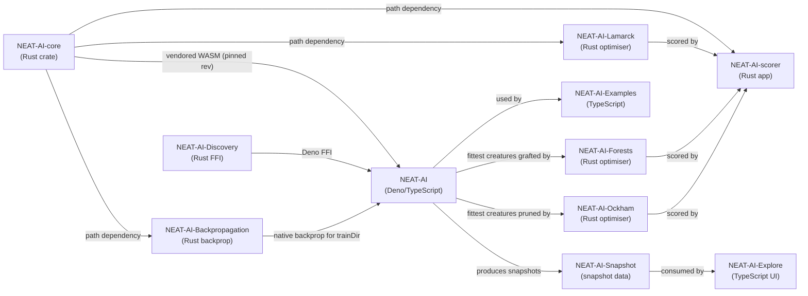

> [!NOTE]
> NEAT-AI and NEAT-AI-scorer must pin the **same** NEAT-AI-core revision. See
> [docs/CORE_DEPENDENCY_POLICY.md](./docs/CORE_DEPENDENCY_POLICY.md) for the
> rev-pinning and semver policy.

### Family previews

Every sibling shares the same lockup — smiley-neuron soma, teal/coral dendrites,
capability pills — with its own subtitle and motif. The artwork is transparent,
so it reads in light and dark modes alike. Sources and regeneration:
[docs/brand/README.md](./docs/brand/README.md).

<table>
  <tr>
    <td>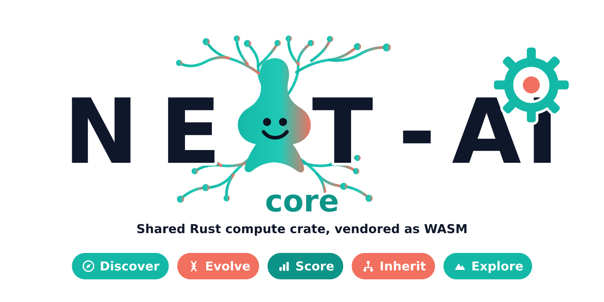</td>
    <td>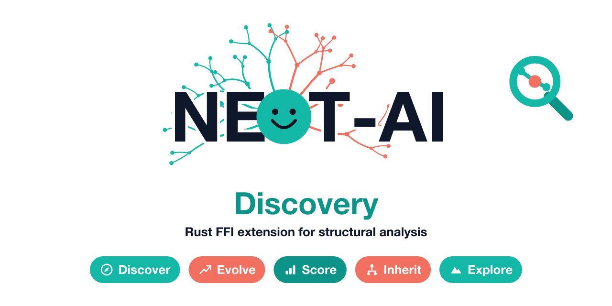</td>
  </tr>
  <tr>
    <td>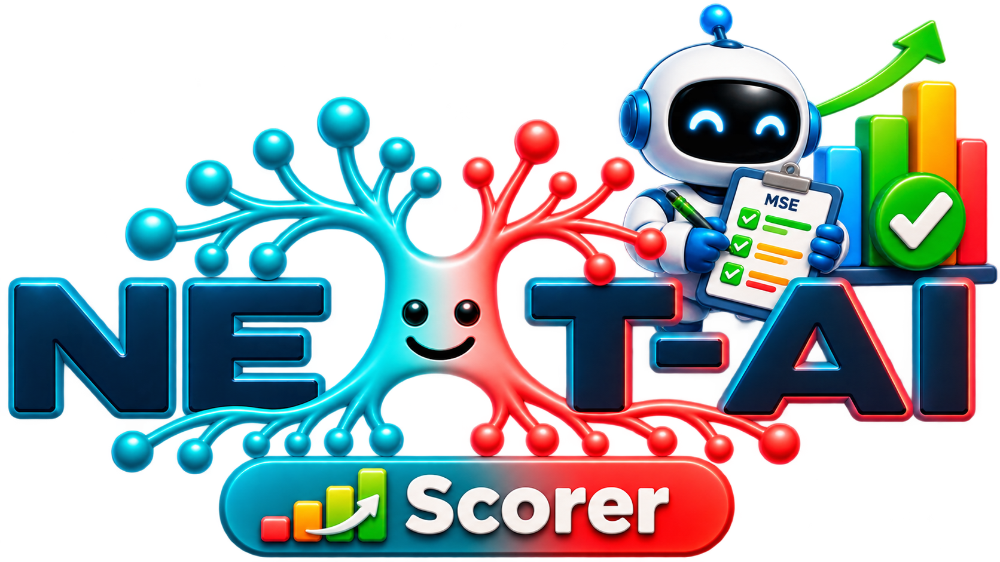</td>
    <td>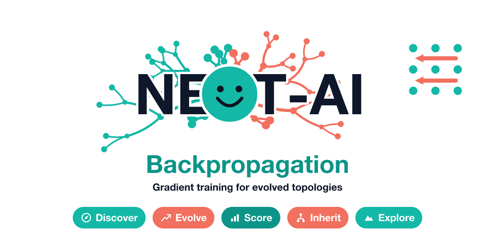</td>
  </tr>
  <tr>
    <td>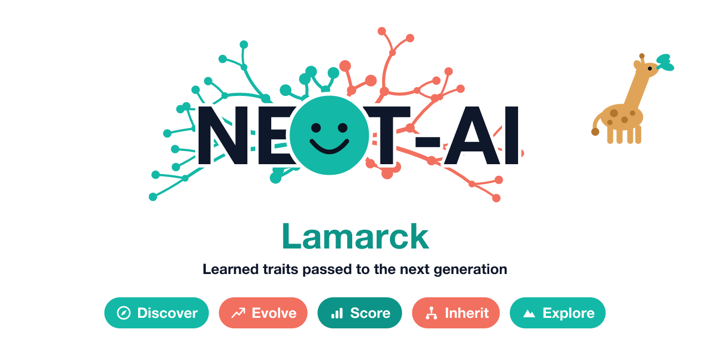</td>
    <td>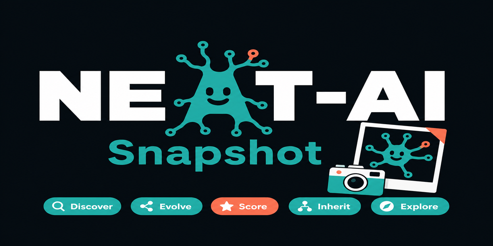</td>
  </tr>
  <tr>
    <td>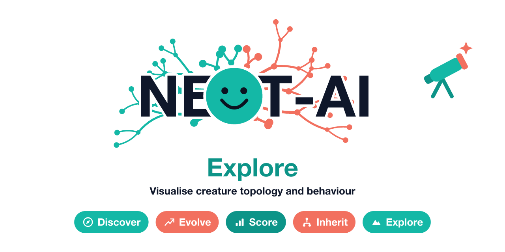</td>
    <td>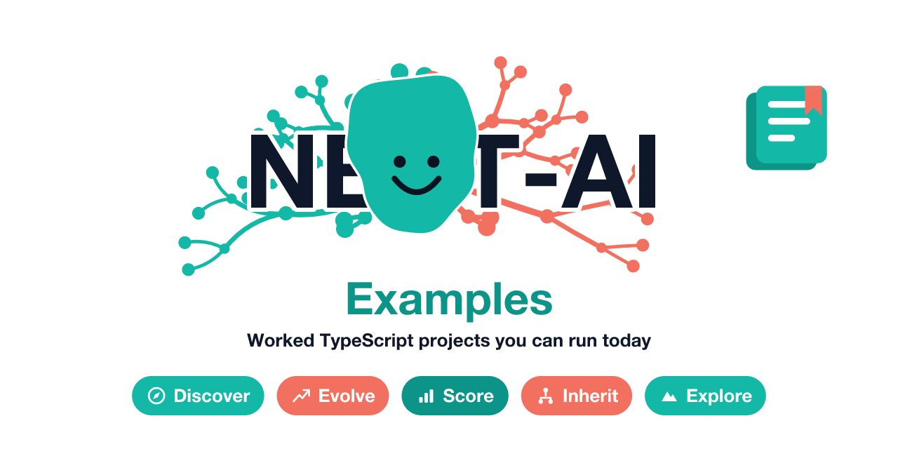</td>
  </tr>
  <tr>
    <td>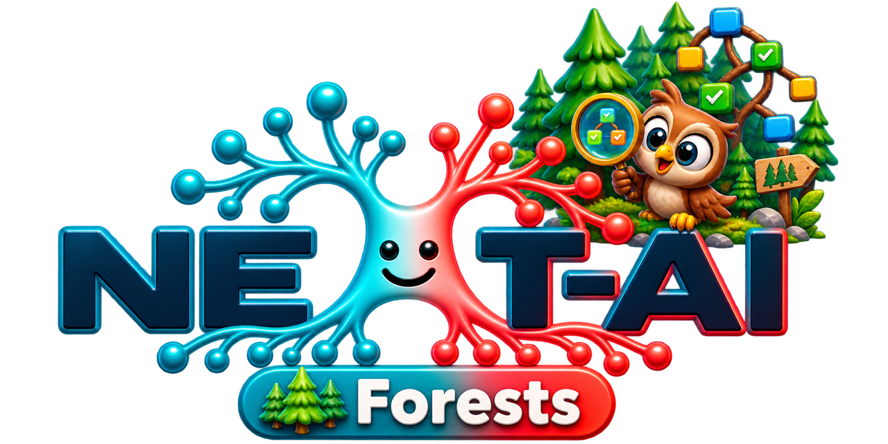</td>
    <td>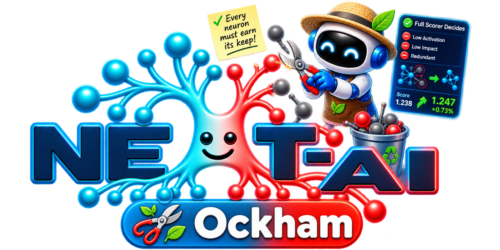</td>
  </tr>
</table>

## 🤝 Contributions

Contributions are welcome! See [CONTRIBUTING.md](./CONTRIBUTING.md) for
development setup, workflow, and guidelines. Please submit a pull request or
open an issue to discuss potential changes/additions.

## ⚖️ Licence

This project is licensed under the terms of the Apache Licence 2.0. For the full
licence text, please see [LICENSE](./LICENSE)

[](https://deno.land/std)

[](https://codecov.io/github/stSoftwareAU/NEAT-AI)
