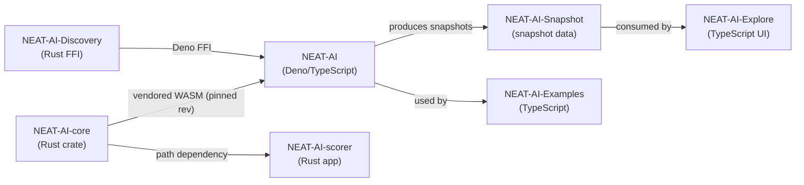

# 🧬 NEAT Neural Network for DenoJS

<p align="left">
  
This project is a practical implementation of a neural network based on the NEAT (NeuroEvolution of Augmenting Topologies) algorithm, written in DenoJS using TypeScript, with additional features such as error-guided discovery, memetic evolution, and distributed workflows.
</p>

For project terminology, coding conventions, and development guidelines, see
[AGENTS.md](./AGENTS.md).

## ✨ Feature Highlights

1. **Extendable Observations**: Input and output features are identified by
   stable UUIDs in the exported representation, rather than only by positional
   indices. This prevents the need to restart the evolution process as new
   observations are added, and makes it practical to evolve creatures on
   multiple machines and then recombine them, much like NEAT's historical
   marking for genes
   [Stanley & Miikkulainen (2002)](http://nn.cs.utexas.edu/downloads/papers/stanley.ec02.pdf).

2. **Distributed Training**: Training and evolution can be run on multiple
   independent nodes. The best-of-breed creatures can later be combined on a
   centralised controller node, mirroring the
   [island model](https://en.wikipedia.org/wiki/Island_model) used in
   evolutionary algorithms.

3. **Life Long Learning**: Designed for continuous learning in changing
   environments. The same population can keep training and adapting as new data
   arrives over weeks or months, supporting
   [continual learning](https://en.wikipedia.org/wiki/Continual_learning) while
   still relying on your training data to keep past knowledge represented.

4. **Efficient Model Utilisation**: Once trained, the current best model can be
   utilised efficiently by calling the `activate` function. This runs a single
   forward pass that maps inputs to outputs.

   > [!NOTE]
   > **Activation uses WASM (required).** The library initialises the WASM
   > backend automatically; callers do not need to call any init function or set
   > environment variables.

5. **Unique Squash Functions**: Supports unique squash functions such as IF, MAX
   and MIN, offering a wider range of potential solutions. More about
   [Activation Functions](https://en.wikipedia.org/wiki/Activation_function).

6. **Neuron Pruning**: Neurons whose activations don't vary during training are
   removed, and the biases in associated neurons are adjusted. More about
   [Pruning (Neural Networks)](https://en.wikipedia.org/wiki/Pruning_(neural_networks)).

7. **CRISPR**: Allows injection of genes into a population of creatures during
   evolution. More about [CRISPR](https://en.wikipedia.org/wiki/CRISPR).

8. **Grafting**: If parents aren't "genetically compatible", the grafting
   algorithm enables cross-island interbreeding, preserving diversity in the
   same spirit as
   [island-model evolution](https://en.wikipedia.org/wiki/Island_model).

9. **Memetic Evolution**: Records and utilises the biases and weights of the
   fittest creatures to fine-tune future generations. Learn more about
   [Memetic Algorithms](https://en.wikipedia.org/wiki/Memetic_algorithm).

10. **Error-Guided Structural Evolution**: Dynamically identifies and creates
    new synapses by analysing neuron activations and errors. A dedicated Rust
    extension performs GPU-accelerated analysis and proposes structural
    candidates. Discovery runs typically find improvements of 0.5-3% per run
    that accumulate over many iterations.

    > [!WARNING]
    > Relies entirely on the
    > [NEAT-AI-Discovery](https://github.com/stSoftwareAU/NEAT-AI-Discovery)
    > Rust extension library. If the library is not available, the discovery
    > phase is skipped; there is no TypeScript fallback.

11. **[Visualisation](https://stsoftwareau.github.io/NEAT-AI/index.html)**

12. **Adaptive Mutation Rate**: Automatically adjusts mutation strategy based on
    creature size - large creatures focus on weight/bias modification rather
    than topology expansion.

13. **Adaptive Mutation Rate Based on Fitness Progress**: Mutation rate is
    automatically adjusted based on whether evolution is improving, stagnating,
    or stable, helping balance exploration and exploitation.

14. **Continuous Incremental Discovery**: For distributed, multi-machine
    discovery workflows that accumulate small improvements over time, see the
    [Discovery Guide](./docs/DISCOVERY_GUIDE.md).

15. **Training Data Fuzzing**: Noise injection during training prevents
    creatures from memorising exact training examples. Gaussian or uniform
    perturbations are added to inputs (and optionally outputs for
    [label smoothing](https://en.wikipedia.org/wiki/Label_smoothing)) each
    iteration, encouraging robust generalisation.

16. **K-Fold Cross-Validation**: Built-in
    [k-fold cross-validation](https://en.wikipedia.org/wiki/Cross-validation_(statistics))
    evaluates creatures on held-out data folds during evolution, reducing
    overfitting to a single train/test split.

17. **Hyperparameter Self-Adaptation**: Each creature carries its own learning
    rate, mutation rates, and regularisation strength. These evolve alongside
    topology and weights — creatures with better-suited hyperparameters achieve
    higher fitness and propagate their settings, inspired by
    [self-adaptive evolution strategies](https://en.wikipedia.org/wiki/Evolution_strategy).

18. **Transfer Learning**: Export trained creatures as checkpoints with
    metadata, import them into new tasks with UUID mapping for different
    input/output configurations, and seed populations with pre-trained creatures
    for [transfer learning](https://en.wikipedia.org/wiki/Transfer_learning)
    across related problems.

19. **ONNX Export**: Export trained creatures to the [ONNX](https://onnx.ai/)
    (Open Neural Network Exchange) format for deployment in standard ML
    inference pipelines, bridging the gap between neuroevolution and production
    deployment.

20. **MCMC Mutation Acceptance**: Uses the
    [Metropolis-Hastings](https://en.wikipedia.org/wiki/Metropolis%E2%80%93Hastings_algorithm)
    criterion for mutation acceptance. Instead of unconditionally accepting all
    mutations, worse-fitness moves are accepted with a probability that
    decreases as temperature cools — enabling the population to escape local
    optima early and converge later. Includes adaptive temperature tuning toward
    the theoretically optimal acceptance rate (~23.4%, Roberts et al. 1997).
    Opt-in via `mcmc: { enabled: true }` in the configuration.

21. **Advanced Breeding Strategies**: Multiple breeding strategies for
    genetically incompatible creatures, including input-weight cosine similarity
    for neuron alignment, subgraph transplantation for horizontal gene transfer,
    and diversity-driven breeding for cross-population pairing. These strategies
    preserve genetic diversity while enabling meaningful crossover between
    structurally different creatures, inspired by
    [horizontal gene transfer](https://en.wikipedia.org/wiki/Horizontal_gene_transfer)
    in biology.

22. **Synthetic Synapse Training**: Temporarily densifies inter-layer
    connectivity during backpropagation by adding zero-weight synapses between
    adjacent topological layers. After training, near-zero synapses are pruned
    and only the useful connections are retained — addressing NEAT's inherent
    weakness of sparse connectivity compared to conventional
    [dense layers](https://en.wikipedia.org/wiki/Dense_layer). Opt-in via
    `syntheticSynapses: true` in the training configuration.

## 🚀 Quick Start

```typescript
// Single discovery iteration
const result = await creature.discoveryDir(dataDir, {
  discoveryRecordTimeOutMinutes: 1,
  discoveryAnalysisTimeoutMinutes: 10,
});

if (result.improvement) {
  console.log(`Found ${result.improvement.changeType} improvement!`);
  // Use improved creature for next iteration
}
```

> [!TIP]
> For distributed, multi-machine workflows that accumulate small improvements
> over time, see the [Discovery Guide](./docs/DISCOVERY_GUIDE.md) for a complete
> walkthrough.

## 💻 Usage

This project is designed to be used in a DenoJS environment. Please refer to the
[DenoJS documentation](https://deno.land/manual) for setup and usage
instructions.

## 📚 Documentation

For detailed documentation, see the [docs/](./docs/) directory:

### 🚀 Getting Started

- **[CONTRIBUTING.md](./CONTRIBUTING.md)**: First-time contributor guide with
  development setup and workflow
- **[Configuration Guide](./docs/CONFIGURATION_GUIDE.md)**: Complete reference
  of all configuration options and presets

### 🧠 Core Concepts

- **[COMPARISON.md](./COMPARISON.md)**: How NEAT compares to traditional neural
  networks, CNNs, RNNs, and modern LLMs
- **[Discovery Guide](./docs/DISCOVERY_GUIDE.md)**: Complete guide to
  distributed, multi-machine discovery workflows, including failure/success
  caches, replay, candidate category limits, focus overrides, and the
  cost-of-growth gate
- **[Intelligent Design](./docs/INTELLIGENT_DESIGN.md)**: Systematic squash
  function optimisation for hidden neurons

### 🔧 API & Reference

- **[API Reference](./docs/API_REFERENCE.md)**: Comprehensive public API
  documentation
- **[DiscoveryDir API](./docs/DISCOVERY_DIR.md)**: Technical API reference for
  `Creature.discoveryDir()` and data preparation
- **[Activation Functions Guide](./docs/ACTIVATION_FUNCTIONS.md)**: Complete
  guide to all 30+ activation functions with selection guidance

### 🔬 Advanced Topics

- **[Predictive Coding](./docs/PREDICTIVE_CODING.md)**: Neuroscience-inspired
  predictive coding training mode
- **[Predictive Coding Benchmarks](./docs/PREDICTIVE_CODING_BENCHMARKS.md)**:
  Benchmark results for predictive coding
- **[Elastic Backpropagation](./docs/BACKPROP_ELASTICITY.md)**: Why we prefer
  minimum-change weight updates and avoid pushing saturated squashes further
  into saturation
- **[GPU Acceleration](./docs/GPU_ACCELERATION.md)**: GPU acceleration for
  discovery on macOS using Metal
- **[WASM Resident Topology](./docs/WASM_RESIDENT_TOPOLOGY.md)**: Feasibility
  analysis for WASM-resident creature topology

### ⚡ Operations

- **[Performance Tuning](./docs/PERFORMANCE_TUNING.md)**: Tuning WASM caches,
  thread pools, memory management, and scaling for large-scale training
- **[Performance Research](./docs/PERFORMANCE_RESEARCH.md)**: WASM migration
  research and benchmark learnings
- **[Troubleshooting](./docs/TROUBLESHOOTING.md)**: Common issues and solutions
  for WASM, discovery, memory, CI, and configuration

### 🦀 Core Dependency

- **[Core Dependency Policy](./docs/CORE_DEPENDENCY_POLICY.md)**: How NEAT-AI
  pins and consumes [NEAT-AI-core](https://github.com/stSoftwareAU/NEAT-AI-core)
  via `deno.json` + `build.sh` (semver, rev pinning, approval tiers)
- **[External NEAT-AI-core](./docs/EXTERNAL_NEAT_AI_CORE.md)**: Day-to-day
  workflow for bumping the pinned revision and refreshing `wasm_activation/pkg`
- **[Parity Gate](./docs/PARITY_GATE.md)**: Pre-removal verification checklist
  for repin + artefact parity validation
- **[CI for External Core](./docs/CI_EXTERNAL_NEAT_AI_CORE.md)**: CI plumbing
  for `build.sh`-driven artifact sync

### 🤝 For Contributors

- **[AGENTS.md](./AGENTS.md)**: Coding conventions, terminology, and development
  guidelines
- **[Discovery Architecture](./docs/DISCOVERY_ARCHITECTURE.md)**: Internal
  discovery pipeline architecture

## 🌐 Related Repositories

NEAT-AI is the primary Deno/TypeScript library at the centre of a small family
of repositories. Each repo has a focused role; together they form the full
training, discovery, scoring, visualisation, and example surface.

| Repository                                                                 | Role                                                                                                                                     |
| -------------------------------------------------------------------------- | ---------------------------------------------------------------------------------------------------------------------------------------- |
| **[NEAT-AI](https://github.com/stSoftwareAU/NEAT-AI)** (this repo)         | Deno/TypeScript NEAT library — the main library that orchestrates evolution, training, discovery, breeding, and serialisation.           |
| **[NEAT-AI-core](https://github.com/stSoftwareAU/NEAT-AI-core)**           | Shared Rust computation crate (`neat-core`) consumed by NEAT-AI as vendored WASM in `wasm_activation/pkg`, pinned by SHA in `deno.json`. |
| **[NEAT-AI-Discovery](https://github.com/stSoftwareAU/NEAT-AI-Discovery)** | Rust FFI extension providing GPU-accelerated structural analysis; called from NEAT-AI via Deno FFI by `discoveryDir()`.                  |
| **[NEAT-AI-Snapshot](https://github.com/stSoftwareAU/NEAT-AI-Snapshot)**   | Snapshot artefacts produced by NEAT-AI training/discovery runs and shared between machines for distributed evolution.                    |
| **[NEAT-AI-scorer](https://github.com/stSoftwareAU/NEAT-AI-scorer)**       | Rust scoring application; depends on NEAT-AI-core via a path dependency and must pin the same core revision as NEAT-AI.                  |
| **[NEAT-AI-Explore](https://github.com/stSoftwareAU/NEAT-AI-Explore)**     | TypeScript visualisation tool that consumes NEAT-AI-Snapshot data to inspect creature topology and behaviour.                            |
| **[NEAT-AI-Examples](https://github.com/stSoftwareAU/NEAT-AI-Examples)**   | TypeScript example projects showing how to use NEAT-AI for real tasks.                                                                   |

### Dependency graph



> [!NOTE]
> NEAT-AI and NEAT-AI-scorer must pin the **same** NEAT-AI-core revision. See
> [docs/CORE_DEPENDENCY_POLICY.md](./docs/CORE_DEPENDENCY_POLICY.md) for the
> rev-pinning and semver policy.

## 🤝 Contributions

Contributions are welcome! See [CONTRIBUTING.md](./CONTRIBUTING.md) for
development setup, workflow, and guidelines. Please submit a pull request or
open an issue to discuss potential changes/additions.

## ⚖️ Licence

This project is licensed under the terms of the Apache Licence 2.0. For the full
licence text, please see [LICENSE](./LICENSE)

[](https://deno.land/std)

[](https://codecov.io/github/stSoftwareAU/NEAT-AI)
