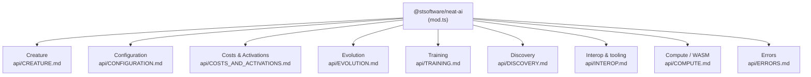

# 📖 NEAT-AI API Reference

Index for the public API exported from `mod.ts`. The reference is split by
surface area into the per-topic detail docs under [`api/`](api/) — start here,
then jump to the page you need.

For project terminology — including the distinction between
[NEAT and NEAT-AI](../AGENTS.md#-neat-vs-neat-ai--which-term-to-use) — see
[`AGENTS.md`](../AGENTS.md#-terminology). Acronyms and themed terms (Creature,
Discovery, CRISPR, Grafting, MCMC …) are defined once in the canonical
[Glossary](GLOSSARY.md).

> [!NOTE]
> Every symbol is imported from the single package entry point. There are no
> deep `src/...` import paths in the public contract:
>
> ```typescript
> import { Costs, Creature, Mutation, Selection } from "@stsoftware/neat-ai";
> ```

## 🗺️ Surface map



## 📚 Detail docs

| Topic                                                   | Covers                                                                                                                                                                                                                                                                                                                    |
| ------------------------------------------------------- | ------------------------------------------------------------------------------------------------------------------------------------------------------------------------------------------------------------------------------------------------------------------------------------------------------------------------- |
| **[Creature](api/CREATURE.md)**                         | `Creature` lifecycle (`activate`, `exportJSON`, `fromJSON`), the `CreatureFactory` helpers, `CRISPR` gene-editing, `CreatureUtil`, serialisation types (`CreatureExport`, `NeuronExport`, `SynapseExport`, `CreatureTrace`), `Upgrade` / `upgradeTwo`, `TypedTopology`.                                                   |
| **[Configuration](api/CONFIGURATION.md)**               | `NeatOptions` / `NeatOptionsInput`, every sub-config (plateau, stability, regularisation, ensemble diversity, MCMC, output range, hyperparameter evolution, adaptive population, parallel evaluation, data fuzzing, selection pressure, specialist), training-event callbacks, `Logger`, and the `RandomNumberGenerator`. |
| **[Costs & Activations](api/COSTS_AND_ACTIVATIONS.md)** | `Costs` registry, `CostInterface`, the built-in cost names, `costNameToTaskDescriptor` and the task-descriptor types, and the 39 activation (squash) functions.                                                                                                                                                           |
| **[Evolution](api/EVOLUTION.md)**                       | `Creature.evolveDir()`, the reinforcement-learning `Creature.evolveRL()` + `EpisodeAdapter`, `Selection`, `Mutation`, configuration presets, plateau detection, speciation (`Species` / `Genus`), and the specialist pipeline.                                                                                            |
| **[Training](api/TRAINING.md)**                         | `BackPropagationOptions`, `TrainOptions`, sparse-training controls, and the synthetic-synapse densification step.                                                                                                                                                                                                         |
| **[Discovery](api/DISCOVERY.md)**                       | Discovery formatting utilities, `DiscoveryEvaluationSummary`, orphan-dir cleanup, and disk-space monitoring.                                                                                                                                                                                                              |
| **[Interop & tooling](api/INTEROP.md)**                 | Transfer learning (checkpoints, population seeding), ONNX export, topology DOT/JSON export, and the Intelligent Design squash optimiser.                                                                                                                                                                                  |
| **[Compute / WASM](api/COMPUTE.md)**                    | Worker WASM preloading, the activation LRU cache controls, and unified cache diagnostics.                                                                                                                                                                                                                                 |
| **[Errors](api/ERRORS.md)**                             | `CrisprError`, `BreedExhaustionError`, and the `ValidationError` shape callers should `catch`.                                                                                                                                                                                                                            |

## 💡 Minimal example

```typescript
import { Creature } from "@stsoftware/neat-ai";

const creature = new Creature(2, 1);
const output = creature.activate(new Float32Array([0.5, 0.3]));

const json = creature.exportJSON();
const clone = Creature.fromJSON(json);
```

See [`api/EVOLUTION.md`](api/EVOLUTION.md) for a full `evolveDir()` run and
[`api/CREATURE.md`](api/CREATURE.md) for the `CreatureFactory` warm-start
helpers.

## 📚 Further reading

- [README.md](../README.md) — project overview and quick start.
- [AGENTS.md](../AGENTS.md) — development guidelines and the NEAT-vs-NEAT-AI
  rule.
- [Glossary](GLOSSARY.md) — acronyms and themed terms.
- [Configuration Guide](CONFIGURATION_GUIDE.md) — narrative configuration guide
  (the field-by-field reference lives in
  [`api/CONFIGURATION.md`](api/CONFIGURATION.md)).
- [Activation Functions](ACTIVATION_FUNCTIONS.md) — squash-selection guide.
- [Reinforcement Learning](REINFORCEMENT_LEARNING.md) — `evolveRL` walkthrough.

---

**Up to:** [`README.md`](../README.md) (entry point) ·
[`docs/README.md`](README.md) (topic index).
