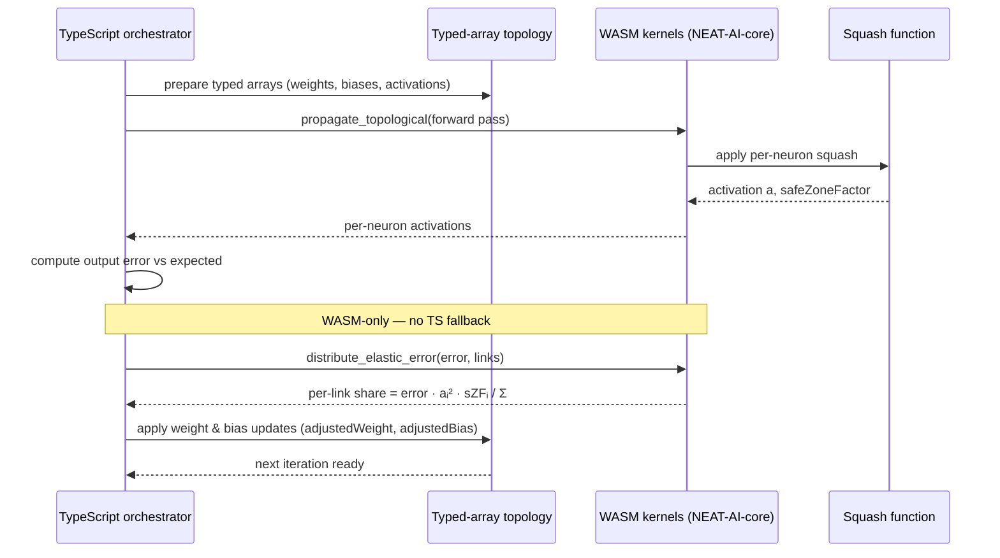

# 🔄 Elastic Back Propagation

> **TL;DR** — [NEAT-AI](../AGENTS.md#-terminology)'s backpropagation does not
> blindly apply the chain rule everywhere. It (a) computes a target pre-squash
> value for each neuron, (b) distributes the required change across inbound
> weights using a minimum-change heuristic weighted by
> `activationᵢ² × safeZoneFactorᵢ`, and (c) refuses to push neurons that are
> already saturated further into saturation. The topological backprop loop and
> the elastic distribution kernel both live in WebAssembly (WASM) — there is no
> TypeScript fallback. Acronyms used here: **WASM** (WebAssembly), **ReLU**
> (Rectified Linear Unit), **TANH** (hyperbolic tangent), **MCMC** (Markov-chain
> Monte Carlo).

## 🔗 Sibling docs in the **Compute / WASM** cluster

- [ACTIVATION_FUNCTIONS.md](./ACTIVATION_FUNCTIONS.md) — squash catalogue and
  saturation behaviour referenced throughout this doc.
- [WASM_RESIDENT_TOPOLOGY.md](./WASM_RESIDENT_TOPOLOGY.md) — what data the WASM
  backprop kernel reads from the typed-array topology.
- [GPU_ACCELERATION.md](./GPU_ACCELERATION.md) — Discovery uses the same
  per-neuron error attribution, accelerated on Graphics Processing Unit (GPU)
  hardware.
- [docs/README.md](./README.md) — full topic index.

## 🔄 Elastic Back Propagation (minimum-change + safe-zone aware)

This project uses a value-solving form of back propagation.

Instead of only using chain-rule gradients everywhere, we often compute a
**target pre-squash value** for a neuron and then adjust **biases and inbound
synapse weights** to move the neuron toward that target.

This works well for many squashes, but it can behave poorly near **saturation**
(or near non-invertible regions) unless we actively avoid "forcing" already
immovable neurons.

> [!NOTE]
> Elastic back propagation is designed to favour low-cost learning paths by
> preferring plastic (unsaturated) synapses over those that are already at their
> activation boundary. This improves training stability and helps the network
> avoid chasing meaningless error outliers.

### 🧭 End-to-End Sequence

The diagram below traces a single training iteration: forward pass, error
computation, elastic distribution of that error across inbound links, and the
resulting weight/bias update. The two highlighted steps are the WASM-only
kernels described in `AGENTS.md` § "WASM-only operations".



### 🧪 Training vs Recording (Explorer / Discovery)

There are two related flows:

- **Training back propagation** (`Neuron.propagate()`): decides how to adjust
  weights/biases.
- **Recording/backprop attribution** (`Creature.record()` / `Neuron.record()`):
  records per-neuron error signals for Explorer visualisation and for discovery.

Both flows now apply the same core idea:

- Prefer "plastic" paths
- Treat saturated paths as a last resort

### ⚠️ The Core Problem: Saturation and Inverse Targets

Some squashes have bounded activation ranges:

- **ArcTan**: activation range is \((-\pi/2, +\pi/2)\)
- **TANH**: activation range is \((-1, +1)\)
- **LOGISTIC**: activation range is \((0, 1)\)
- **HARD_TANH / ReLU6 / STEP**: piecewise and/or clipped regions

If a neuron is already saturated and the training target is "at the boundary",
an inverse (`unSquash`) can imply an _enormous_ change in raw input for only a
tiny change in activation.

That can create large value-space errors which then:

- dominate per-neuron traces in Explorer
- cause discovery focus selection to "chase" meaningless outliers
- slow evolution due to excessive error magnitudes

> [!WARNING]
> Saturation-driven outlier errors can severely distort the discovery process.
> Without safe-zone awareness, a single saturated neuron may absorb a
> disproportionate share of the error signal, causing the optimiser to focus on
> the wrong part of the network.

### 🧮 The Fix: Allocate Error Where It Is Cheapest to Change

When a neuron has many inbound synapses, we treat the neuron's pre-activation
as:

\[ v = b + \sum_i (w_i \cdot a_i) \]

If we want to change \(v\) by \(\Delta v\), the **minimum overall weight
change** heuristic allocates per-link contribution changes proportional to
\(a_i^2\).

In code, each inbound link gets a score:

- `score_i = (activation_i^2) * safeZoneFactor_i`

Then:

- `share_i = error * score_i / Σ(score)`

This is "elasticity": links that can move the neuron with smaller weight changes
absorb more of the required value change.

### 🛡️ Safe-Zone Awareness (Don't Push Saturated Parents Further)

Many squashes implement `safeZoneAdjustment(rawInput, error, weight)` which
returns a factor in \([0,1]\). It is designed to:

- **prefer** updates when the neuron is in its strong-gradient region
- **reduce** or **block** updates that push a saturated neuron further into
  saturation
- optionally allow "recovery" when the error would move the neuron back toward
  the centre

> [!TIP]
> The `rawInput` parameter to `safeZoneAdjustment` is the neuron's **pre-squash
> value**, not a single synapse contribution. Using the full pre-squash value
> lets the squash function accurately determine whether the neuron is in a
> safe-gradient region or approaching saturation.

Important: `rawInput` here means the neuron's **pre-squash value**, not a single
synapse contribution.

### 📊 Your Example (Why We Prefer Changing Other Parts)

Scenario:

```text
output-0 (error ≈ +0.1)
  ^
  |  w0
  |
ArcTan_hidden (near +π/2, saturated)
  ^
  |  w1
  |
ReLU_hidden
  ^
  |  w3..wN
  |
observations

Alternative path (preferred when ArcTan_hidden is saturated):
ReLU_hidden ------------------ w2 -----------------> output-0
```

What we _do not_ want:

```text
Try to "force" ArcTan(output-0) further positive
even though it is already near +π/2.
```

What we _do_ want (elastic backprop):

```text
Prefer adjusting the inbound weights/biases that can change v cheaply,
and de-emphasise parents that are saturated (safeZoneFactor ≈ 0).
```

So, if `ArcTan(output-0)` is saturated, its safe-zone factor reduces the share
of the error that we try to push "through" it. That shifts the learning pressure
toward other inbound synapses or upstream neurons that are _not_ saturated.

### 📈 About LeakyReLU (Negative Region)

LeakyReLU does **not** have a hard saturation like ArcTan/TANH/LOGISTIC. Its
slope is:

- `1` for \(x \ge 0\)
- `α` for \(x < 0\) (eg. 0.01)

So it can still learn in the negative region, but it's "stiffer" there.

With elastic backprop + safe-zones:

- we can **prefer** moving toward the positive region when appropriate
- we can **resist** updates that push raw input more negative when it is already
  far negative

### 🗂️ Where to Look in Code

The TypeScript side is now a thin orchestration layer; the per-iteration
topological loop and the elastic distribution kernel live exclusively in the
NEAT-AI-core WASM bundle (Issue #2416). If the bundle cannot be loaded these
operations fail fast with a `WasmError` — there is **no TypeScript fallback**.

- Elastic distribution adapter (TS shim around the WASM kernel):
  [`src/propagate/ElasticDistribution.ts`](../src/propagate/ElasticDistribution.ts)
- Topological backprop wrapper (calls into WASM):
  [`src/propagate/WasmTopologicalBackprop.ts`](../src/propagate/WasmTopologicalBackprop.ts)
- Back-propagation application:
  [`src/architecture/Neuron.ts`](../src/architecture/Neuron.ts)
  (`Neuron.propagate()`)
- Example saturating squash:
  [`src/methods/activations/types/ArcTan.ts`](../src/methods/activations/types/ArcTan.ts)
- WASM artefacts (vendored from the pinned NEAT-AI-core revision):
  [`wasm_activation/pkg/`](../wasm_activation/pkg/) — see `AGENTS.md` for the
  WASM-only operations list and core dependency policy.

---

**Up to:** [`README.md`](../README.md) (entry point) ·
[`docs/README.md`](README.md) (topic index).
