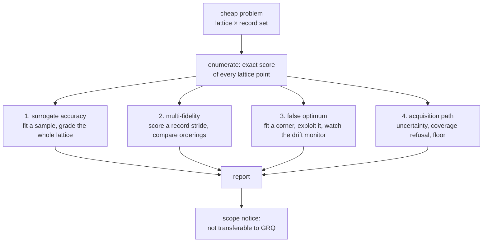

# Cheap-problem benchmark for surrogate techniques (Issue #3935)

> **Scope — read this first.** These are cheap analytic problems. **Nothing
> measured here transfers to GRQ creature scores.** The 90-day equity objective
> is not a scaled-down analytic function: its error surface is heavy-tailed, its
> ground truth arrives a quarter late, and the accepted improvements sit around
> `1e-05` against a score range of `0.36`–`0.41`. Whether a surrogate can rank
> 5,317-neuron forward-only creatures on 90-day returns is answered by Issues
> #3927 and #3930, on real creatures against the real corpus, and cannot be
> answered here.

Jin (2011) §6 grades surrogate techniques on analytic test functions for one
reason: the "expensive" objective can be called for **every** point in the
design space, so approximation error is measured against ground truth rather
than against another approximation. That is impossible at GRQ scale — you cannot
exhaustively evaluate the neighbourhood of a 5,317-neuron creature — and trivial
on a lattice of a few thousand points.

This harness is the fleet's version of that test bed. It exists to characterise
the mechanisms of the #3919 sweep, and to give the safety invariants that
protect GRQ something continuous integration (CI) can actually assert against.

**Why it lives in NEAT-AI and not NEAT-AI-Examples.** Issue #3935 named
NEAT-AI-Examples as the home. Two things put it here instead: the mechanisms
under benchmark — `src/surrogate/`, `src/NEAT/EvolutionControl.ts`,
`src/NEAT/PreSelection.ts` — all live in this repository and are not part of its
published surface, so a benchmark elsewhere could only reach them through a
release; and the invariant tests the issue asks for must run in **this**
repository's CI, which is what gates changes to those mechanisms. The harness
imports nothing that is not already here, and adds nothing to the published
package.

## What it measures



1. **Surrogate accuracy against ground truth.** Every family of
   `scripts/lib/surrogateModels.ts` is fitted to a sample of the lattice and
   graded on **all** of it — Spearman's ρ, Kendall's τ-b, top-10 agreement, and
   two readings an aggregate accuracy metric cannot give: where the **true**
   optimum sits in the model's ordering, and the _false-optimum regret_, the
   true score lost by trusting the model's own argmax.
2. **Multi-fidelity rank agreement.** The cheap fidelity of Issue #3926 — a
   **stride** of the record set — scored over the same lattice and compared with
   the rank metrics of Issue #3927 against a _complete_ ordering, including the
   gap resolution: the largest exact score gap the cheap fidelity fails to order
   correctly.
3. **A deliberate false optimum.** Two knobs could each explain a firing, so the
   report varies them one at a time across five regimes:

   | Regime | Model fitted in    | Candidates drawn  | Coverage refusal          |
   | ------ | ------------------ | ----------------- | ------------------------- |
   | A      | a converged corner | by predicted rank | ignored                   |
   | B      | a converged corner | by predicted rank | **honoured** (production) |
   | C      | a converged corner | uniformly         | ignored                   |
   | D      | the whole lattice  | by predicted rank | ignored                   |
   | E      | the whole lattice  | uniformly         | ignored (**control**)     |

   A against C isolates selection pressure; A against D isolates extrapolation;
   E holds both off. B is A with the coverage refusal honoured, which is what
   production does: `PreSelection` records a prediction only for a candidate the
   model actually predicted, so a refused candidate goes straight to exact
   evaluation and its prediction never reaches the monitor.
4. **The acquisition path.** Mandatory uncertainty, the out-of-distribution
   refusal, and the uncertainty floor of Issue #3933, exercised end to end
   against a lattice whose best point is known.

## Running it

```bash
deno task bench:cheap-problem
```

or with the knobs:

```bash
deno run --allow-read --allow-write --allow-env bench/surrogate_cheap_problem.ts \
  --surfaces=sphere,rastrigin,rosenbrock \
  --dimensions=2 --levels=41 --records=64 \
  --rates=1,0.5,0.25,0.1 --training=80 --locality=0.35 --seed=3935 \
  --json=docs/evidence/cheap-problem-benchmark-3935.json
```

`--allow-write` is needed only for `--json=`; without it the report goes to
standard output.

The whole report runs in well under a second. That is the point: a cheap problem
whose "exhaustive" pass takes minutes is not cheap, so a lattice larger than
`MAX_ENUMERATED_POINTS` (65,536) is **refused** rather than run.

The latest recorded run is
[`docs/evidence/cheap-problem-benchmark-3935.md`](evidence/cheap-problem-benchmark-3935.md).

## What the shipped run found

From
[`docs/evidence/cheap-problem-benchmark-3935.md`](evidence/cheap-problem-benchmark-3935.md),
over 3 surfaces × 4 surrogate families = 12 models per regime:

| Regime                                          | Fired      |
| ----------------------------------------------- | ---------- |
| A — corner-fitted, exploited, refusal ignored   | 10 / 12    |
| B — the same, refusal **honoured** (production) | 0 / 12     |
| C — corner-fitted, sampled uniformly            | 5 / 12     |
| D — fully covered, exploited                    | **7 / 12** |
| E — fully covered, sampled uniformly (control)  | **0 / 12** |

Read in order:

- **The monitor fires, and on a path production can take.** Regime D is a model
  fitted to the whole lattice — nothing is being extrapolated, the coverage
  region refuses nothing — and merely exploiting it produces one-directional
  residuals in 7 of 12 cases. That is the demonstration Issue #3935 asks for:
  the monitor has now been seen to fire where it is supposed to.
- **And it does not fire on the control.** Regime E is the same twelve models
  sampled uniformly instead of exploited: 0 of 12. The difference between D and
  E is selection pressure alone, which is precisely the effect Jin (2011) §5
  describes.
- **Extrapolation alone can also trip it** (C, 5 / 12), which is why the two
  knobs are varied separately — a report that moved both at once could not tell
  the causes apart.
- **Where the model extrapolates, the coverage refusal gets there first.** In
  regime B every firing of regime A disappears, because the refusal routes those
  candidates to exact evaluation and the monitor is left with too few residuals
  to decide. That is defence in depth working, not the monitor failing: by the
  time a candidate is that far outside the archive, Issue #3933 has already
  declined to predict it.
- **It is not universal.** `gradient-boosted-trees` does not fire in regime A on
  `sphere` or `rastrigin` despite carrying the largest model-optimum regrets in
  the table: its predictions are piecewise-constant outside the training range,
  so its residuals are large but mixed in sign, which is exactly the shape a
  bias-ratio test is designed **not** to trip on. Recorded here as a
  characterisation, not tuned away.

## The problem

A problem is a discrete lattice plus a record set:

- the **lattice** is `levels ** dimensions` points spanning `[lower, upper]` in
  every dimension;
- the **exact score** of a point is the negated mean of a classical surface
  (`sphere`, `rastrigin`, `rosenbrock`) taken over every record, each record
  displacing the surface by its own shift. No single record's optimum is the
  optimum of the mean, so a **stride** of the records is a genuinely different
  estimator — which is what makes it the cheap analogue of a sampled fitness
  corpus.

Scores are maximised, matching `Creature.score`: higher is better.

## The invariants CI asserts

`test/surrogate/CheapProblemInvariants.ts` holds the three GRQ-protecting safety
properties named in Issue #3935. They are cheap to test on a small problem and
impossible to test in CI against a 21 GiB corpus:

| Invariant                                            | What is asserted                                                                                                                                                                                                          |
| ---------------------------------------------------- | ------------------------------------------------------------------------------------------------------------------------------------------------------------------------------------------------------------------------- |
| An approximate score never reaches `previousFittest` | A creature scored over the cheap record stride carries a `scoreFidelity` tag below `1`, and `EvolutionControl.assertExact` refuses it — for the incumbent slot and for the whole elite band.                              |
| A screened-out creature is never exported            | Every discard of `PreSelection.select` carries **no** score and **no** fidelity tag, appears in no survivor set, and only survivors are ever exported. A screen that writes a score is refused with `SCREEN_WROTE_SCORE`. |
| A disabled policy produces bit-identical scores      | With `strategy: "none"`, `ratio: 1` and `uncertainty.enabled: false`, the scored population is `Object.is`-identical to the same loop run with no policy object at all, and pass-through preserves candidate order.       |

Tests live under `test/`, not beside the harness in `bench/`: the sharded CI
lanes collect `test/**` only (`scripts/shard_test_files.ts`), and an assertion
CI never executes is not regression coverage.

These are safety properties — statements about what must never happen. They hold
or fail independently of how good any surrogate is, which is exactly why they
belong in CI and the accuracy numbers above do not.

## What this benchmark does **not** tell you

- **Nothing about GRQ creature scores.** Stated at the top of this document, in
  the module docs, and twice in every generated report. A surrogate that ranks
  lattice points well says nothing about ranking real creatures on 90-day
  returns.
- **Nothing about wall-clock at production scale.** The cheap problem costs
  microseconds per evaluation; a GRQ generation costs 7.8 minutes. Timing ratios
  measured here are ratios of the harness, not of a run.
- **Not every false optimum is a detectable one.** The regime-A
  `gradient-boosted-trees` rows above carry a real false optimum that the
  monitor does not flag. That is a property of a signed-bias test, not a defect
  in this harness — and it is reported rather than tuned away. If the scenario
  ever stopped firing _at all_, that would be a finding about the **monitor**
  and would belong on Issue #3933.

## Related

- [`SURROGATE_UNCERTAINTY.md`](SURROGATE_UNCERTAINTY.md) — the guard this
  harness exercises (Issue #3933).
- [`EVOLUTION_CONTROL.md`](EVOLUTION_CONTROL.md) — the fidelity policy behind
  the `previousFittest` invariant (Issue #3931).
- [`PRE_SELECTION.md`](PRE_SELECTION.md) — the screen behind the discard
  invariant (Issue #3932).
