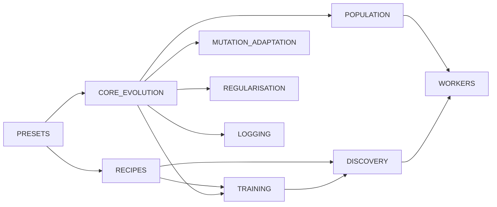

# ⚙️ Configuration Guide

This page is the topic index for NEAT-AI (NeuroEvolution of Augmenting
Topologies — Artificial Intelligence) configuration. The full surface lives in
topic detail docs under [`docs/config/`](./config/), grouped by configuration
domain to mirror the structure of `src/config/`.

Configuration is passed via `NeatOptionsInput` to `createNeatConfig()`, which
validates, parses, and freezes the result into a read-only `NeatConfig`. Numeric
options accept `number | string` so values can be passed directly from CLI
arguments or environment variables without pre-parsing.

> [!TIP]
> If you are new to NEAT-AI, start with
> [Configuration presets](./config/PRESETS.md). The built-in presets cover the
> most common scenarios and are a faster path to a working configuration than
> assembling options from scratch.

## 🗺️ Topic map

## 📚 Topic detail docs

Each detail doc starts with a one-sentence summary and a quick-reference table,
then documents every option with type, default, valid range, and "what happens
when you change it".

- **[Configuration presets](./config/PRESETS.md)** — `QUICK_START_PRESET`,
  `LARGE_NETWORK_PRESET`, `MEMORY_CONSTRAINED_PRESET`,
  `DISCOVERY_FOCUSED_PRESET`, and how to compose them.
- **[Core evolution parameters](./config/CORE_EVOLUTION.md)** — population,
  mutation, elitism, growth penalties, stopping conditions, speciation, CRISPR
  (Clustered Regularly Interspaced Short Palindromic Repeats) injections, and
  feedback-loop mode.
- **[Training parameters](./config/TRAINING.md)** — backpropagation cadence,
  batch size, sample rate, synthetic synapses, data fuzzing, and k-fold
  cross-validation.
- **[Discovery parameters](./config/DISCOVERY.md)** — Rust FFI (Foreign Function
  Interface) discovery: sample rate, recording/analysis timeouts, caching,
  replay, debug options, and minimum candidates per category.
- **[Mutation adaptation](./config/MUTATION_ADAPTATION.md)** — adaptive mutation
  thresholds, plateau detection, stability adaptation, MCMC (Markov Chain Monte
  Carlo) acceptance, and per-creature hyperparameter evolution.
- **[Regularisation, diversity, and step sizing](./config/REGULARISATION.md)** —
  weight/bias regularisation, ensemble diversity, output range constraints, and
  quantum step sizing.
- **[Population sizing](./config/POPULATION.md)** — adaptive population sizing
  and fine-tune population fractions.
- **[Workers and parallel evaluation](./config/WORKERS.md)** — thread count,
  worker thread cap, fast/heavy worker partitioning, topology grouping, and
  parallel evaluation concurrency.
- **[Logging and reproducibility](./config/LOGGING.md)** — log cadence, log
  level, custom loggers, deterministic seeds, and the cross-cutting validation
  rules.
- **[Recipes](./config/RECIPES.md)** — fast prototyping, production training,
  research/reproducibility, time-series, minimal complexity, maximum
  generalisation, and self-tuning evolution.

## ✅ Validation

`createNeatConfig()` validates all parameters and throws on invalid
configurations. The full list of cross-cutting rules (e.g. `feedbackLoop`
requires `disableRandomSamples`, `large > medium` for adaptive mutation
thresholds, fine-tune population fractions ordering) is consolidated in
[Logging and reproducibility — Validation rules](./config/LOGGING.md#-validation-rules).
Per-domain rules also appear in each topic detail doc.

## 👀 See also

- [PERFORMANCE_TUNING.md](./PERFORMANCE_TUNING.md) — operational guide for WASM
  (WebAssembly) caches, thread pools, memory management, and scaling.
- [PERFORMANCE_RESEARCH.md](./PERFORMANCE_RESEARCH.md) — WASM migration research
  and benchmark learnings that motivate the defaults documented here.
- [DISCOVERY_GUIDE.md](./DISCOVERY_GUIDE.md) — end-to-end walkthrough of
  distributed, multi-machine discovery.
- [API_REFERENCE.md](./API_REFERENCE.md) — types and exported helpers referenced
  throughout the configuration surface.

---

**Up to:** [`README.md`](../README.md) (entry point) ·
[`docs/README.md`](README.md) (topic index).
