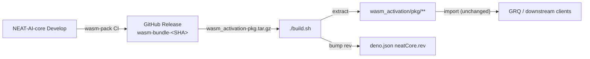

# NEAT-AI-core Release and Pinning Policy

Issue #2342 — Architecture Decision Record (ADR) for how NEAT-AI consumes native
computation from [NEAT-AI-core](https://github.com/stSoftwareAU/NEAT-AI-core)
after removing all in-repo Rust source. Issue #2433 / #2434 extended this to an
artifact-based auto-sync flow that mirrors the GRQ ← NEAT-AI pattern.

## Decision Summary

NEAT-AI tracks NEAT-AI-core in `deno.json`:

```json
"neatCore": {
  "repo": "stSoftwareAU/NEAT-AI-core",
  "ref": "Develop",
  "rev": "<40-char SHA>"
}
```

`build.sh` is the single integration point. By default it resolves NEAT-AI-core
`Develop` HEAD via the GitHub API, downloads the matching
`wasm_activation-pkg.tar.gz` asset from the per-commit Release tagged
`wasm-bundle-<SHA>`, content-verifies the tarball via SHA-256, unpacks it into
`wasm_activation/`, writes a per-file content manifest, and updates `deno.json`
`neatCore.rev` to the new SHA. The maintainer (or worker) running `./build.sh`
commits the updated `deno.json` and `wasm_activation/pkg/**` together.



## Bundle Content Hash (Issue #2705)

Pinning by upstream commit SHA stops a release _tag_ from being renamed or
replaced, but it does not prevent the _asset_ attached to a release from being
swapped (compromised Continuous Integration (CI) runner, leaked release-write
token, Man-in-the-Middle (MITM) attack on the unauthenticated
`releases/download/...` URL). `build.sh` therefore enforces two independent
content-hash guards on every download:

1. **`deno.json` pin** — set `neatCore.assetSha256` to the expected SHA-256 of
   `wasm_activation-pkg.tar.gz`. When set, `build.sh` recomputes the hash
   immediately after download and refuses to extract on mismatch. Because the
   pin lives next to `neatCore.rev`, reviewers can spot bundle-content changes
   in a single line of diff.
2. **Release sidecar** — if NEAT-AI-core publishes
   `wasm_activation-pkg.tar.gz.sha256` alongside the tarball, `build.sh` fetches
   the sidecar and verifies the tarball against it.

After extraction `build.sh` writes `wasm_activation/pkg/content-manifest.sha256`
(standard `shasum -a 256` format). This per-file manifest is committed with the
rest of `pkg/**` and is re-checked on every `./build.sh --verify-only` run — so
any later tampering with the vendored bundle is detected without a network
round-trip.

| Guard                         | When it runs              | What it protects against                                 |
| ----------------------------- | ------------------------- | -------------------------------------------------------- |
| `neatCore.assetSha256`        | Every download            | Swap of the release asset after the pin was committed    |
| Release sidecar `*.sha256`    | Every download (if found) | Asset tampering by anyone without sidecar-signing access |
| `pkg/content-manifest.sha256` | `--verify-only` / CI      | Local or post-install tampering with vendored pkg files  |

If neither sidecar nor `assetSha256` is available, `build.sh` **refuses to
extract** and exits non-zero (issue #2744). A content manifest written from an
unattested download is self-referential — `--verify-only` would compare the
freshly written files against the freshly written manifest and always pass — so
silently extracting an unverified bundle proves nothing about provenance. To
bootstrap a fresh setup (or pin a rev whose upstream release has no sidecar),
re-run with `--allow-unverified`: `build.sh` then extracts and records the
downloaded hash into `deno.json` `neatCore.assetSha256`, so every subsequent run
is attested against that committed pin. Because the standing pin is committed,
the default `./build.sh` (and the `--verify-only` no-op path used by
`quality.sh`) always has an anchor and never needs the override.

Before extraction, `build.sh` also lists the tarball with `tar -tzf` and rejects
any entry whose normalised path is absolute or escapes the destination via `..`
(path-traversal hardening, issue #2744), then extracts with
`tar --no-same-owner --no-same-permissions` so archived ownership and permission
bits are never honoured.

## Why This Model

- Release control happens at PR approval and merge timing.
- No Rust toolchain required in NEAT-AI CI or local contributor setup.
- External API stays unchanged (`wasm_activation/pkg/**` is still published to
  the [JavaScript Registry (JSR)](https://jsr.io/) exactly as before), so GRQ (a
  downstream NEAT-AI-core consumer) and other downstream consumers do not change
  their imports.
- The full `(repo, ref, rev)` triple is still recorded in `deno.json`, so any
  past build is reproducible by passing `--rev <SHA>` to `build.sh`.

## `build.sh` Modes

| Invocation                      | Behaviour                                                                                                                                             |
| ------------------------------- | ----------------------------------------------------------------------------------------------------------------------------------------------------- |
| `./build.sh`                    | Resolve Develop HEAD, download artefact, refresh pkg, update `deno.json` `neatCore.rev`. No-op if up to date.                                         |
| `./build.sh --rev <SHA>`        | Same as above but pin to a specific 40-char SHA instead of resolving HEAD. Used for reproducible builds.                                              |
| `./build.sh --verify-only`      | Verify the vendored pkg matches `deno.json` `neatCore.rev`. No network. No mutation. Used by `quality.sh`.                                            |
| `./build.sh --clean`            | Delete `wasm_activation/pkg` before download.                                                                                                         |
| `./build.sh --allow-unverified` | Proceed even when no SHA-256 anchor attested the tarball; records the downloaded hash into `neatCore.assetSha256` to bootstrap the pin (issue #2744). |
| `./build.sh --help`             | Show usage.                                                                                                                                           |

## Pre-PR auto-bump (`bump-deps.sh`)

The Vibe Coder worker invokes [`./bump-deps.sh`](../bump-deps.sh) before
`./quality.sh` on every PR run. Two dependency classes are handled separately:

- **Internal (`stSoftwareAU/*`, including NEAT-AI-core):** advances `deno.json`
  `neatCore.rev` to NEAT-AI-core `Develop` HEAD by re-running `./build.sh`. No
  quarantine — internal deps bump immediately.
- **External (jsr:@std/_, npm:_, https://deno.land/*):** runs
  `deno outdated --update --latest --minimum-dependency-age=<min>` with a
  quarantine window (default 24h, see `VIBE_BUMP_QUARANTINE_HOURS`). The
  quarantine dodges fast-flagged supply-chain attacks.

After bumping, the script runs a two-phase audit gate (a curated WASM smoke
subset followed by `deno check`). If either phase fails the script exits
non-zero and the bump is reverted. The behaviour is verified by
[`test/scripts/BumpDepsScript.ts`](../test/scripts/BumpDepsScript.ts).

The artifact-based flow depends on the per-commit GitHub Release published by
NEAT-AI-core CI (issue stSoftwareAU/NEAT-AI-core#37). When the upstream artifact
is missing for a given SHA, `build.sh` exits with an actionable error pointing
at the expected release URL.

## Bumping NEAT-AI-core

1. Run `./build.sh` to resolve HEAD, download the matching artifact, and bump
   `deno.json` `neatCore.rev`.
2. Run `./scripts/parity-gate.sh` and include the output in the PR.
3. Run `./quality.sh` (which calls `./build.sh --verify-only` to confirm the
   refreshed pkg is in sync).
4. Commit the updated `deno.json` and `wasm_activation/pkg/**` together.

## CI Policy

- CI runs `./quality.sh`, which calls `./build.sh --verify-only`. CI MUST NOT
  advance `deno.json` `neatCore.rev` automatically — bumps are explicit human
  (or worker) actions, mirroring the GRQ ← NEAT-AI flow.
- The publish workflow (`.github/workflows/publish.yml`) also calls
  `./build.sh --verify-only`. The default `GITHUB_TOKEN` cannot read commits in
  `NEAT-AI-core`, so any attempt to resolve Develop HEAD from the publish job
  will fail (issue #2439). Verify-only sidesteps that by trusting the rev
  already pinned in `deno.json` and the vendored `wasm_activation/pkg`.
- `wasm_activation/pkg` may change whenever a maintainer (or worker) runs
  `./build.sh` and commits the result.
- No Cargo, `rustc`, or `wasm-pack` steps run in this repo.

## Semver and Approvals

NEAT-AI-core tags continue to follow `v<MAJOR>.<MINOR>.<PATCH>`.

- Patch bumps: any contributor after CI passes.
- Minor bumps: one approving review.
- Major bumps: owner approval.

## Downstream Alignment (NEAT-AI-scorer)

Downstream consumers should align to the same NEAT-AI-core branch/ref policy
used by this repo's `deno.json`.

## Related Documents

- [docs/EXTERNAL_NEAT_AI_CORE.md](EXTERNAL_NEAT_AI_CORE.md) — cluster overview
  and day-to-day workflow.
- [docs/CI_EXTERNAL_NEAT_AI_CORE.md](CI_EXTERNAL_NEAT_AI_CORE.md) — CI plumbing
  for build.sh-driven WASM sync.
- [docs/PARITY_GATE.md](PARITY_GATE.md) — release checklist for repins.
- [docs/PARITY_AUDITS.md](PARITY_AUDITS.md) — archived parity audits.
- [docs/VERSION_VISIBILITY.md](VERSION_VISIBILITY.md) — every worker logs the
  running `@stsoftware/neat-ai` version at startup (Issue #2682).
- [docs/README.md](README.md) — full documentation index.

---

**Up to:** [`README.md`](../README.md) (entry point) ·
[`docs/README.md`](README.md) (topic index).
