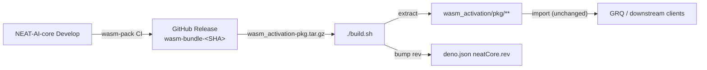

# NEAT-AI-core Release and Pinning Policy

Issue #2342 — ADR for how NEAT-AI consumes native computation from
[NEAT-AI-core](https://github.com/stSoftwareAU/NEAT-AI-core) after removing all
in-repo Rust source. Issue #2433 / #2434 extended this to an artifact-based
auto-sync flow that mirrors the GRQ ← NEAT-AI pattern.

## Decision Summary

NEAT-AI tracks NEAT-AI-core in `deno.json`:

```json
"neatCore": {
  "repo": "stSoftwareAU/NEAT-AI-core",
  "ref": "Develop",
  "rev": "<40-char SHA>"
}
```

`build.sh` is the single integration point. By default it resolves NEAT-AI-core
`Develop` HEAD via the GitHub API, downloads the matching
`wasm_activation-pkg.tar.gz` asset from the per-commit Release tagged
`wasm-bundle-<SHA>`, unpacks it into `wasm_activation/`, and updates `deno.json`
`neatCore.rev` to the new SHA. The maintainer (or worker) running `./build.sh`
commits the updated `deno.json` and `wasm_activation/pkg/**` together.



## Why This Model

- Release control happens at PR approval and merge timing.
- No Rust toolchain required in NEAT-AI CI or local contributor setup.
- External API stays unchanged (`wasm_activation/pkg/**` is still published to
  JSR exactly as before), so GRQ and other downstream consumers do not change
  their imports.
- The full `(repo, ref, rev)` triple is still recorded in `deno.json`, so any
  past build is reproducible by passing `--rev <SHA>` to `build.sh`.

## `build.sh` Modes

| Invocation                 | Behaviour                                                                                                     |
| -------------------------- | ------------------------------------------------------------------------------------------------------------- |
| `./build.sh`               | Resolve Develop HEAD, download artifact, refresh pkg, update `deno.json` `neatCore.rev`. No-op if up to date. |
| `./build.sh --rev <SHA>`   | Same as above but pin to a specific 40-char SHA instead of resolving HEAD. Used for reproducible builds.      |
| `./build.sh --verify-only` | Verify the vendored pkg matches `deno.json` `neatCore.rev`. No network. No mutation. Used by `quality.sh`.    |
| `./build.sh --clean`       | Delete `wasm_activation/pkg` before download.                                                                 |
| `./build.sh --help`        | Show usage.                                                                                                   |

The artifact-based flow depends on the per-commit GitHub Release published by
NEAT-AI-core CI (issue stSoftwareAU/NEAT-AI-core#37). When the upstream artifact
is missing for a given SHA, `build.sh` exits with an actionable error pointing
at the expected release URL.

## Bumping NEAT-AI-core

1. Run `./build.sh` to resolve HEAD, download the matching artifact, and bump
   `deno.json` `neatCore.rev`.
2. Run `./scripts/parity-gate.sh` and include the output in the PR.
3. Run `./quality.sh` (which calls `./build.sh --verify-only` to confirm the
   refreshed pkg is in sync).
4. Commit the updated `deno.json` and `wasm_activation/pkg/**` together.

## CI Policy

- CI runs `./quality.sh`, which calls `./build.sh --verify-only`. CI MUST NOT
  advance `deno.json` `neatCore.rev` automatically — bumps are explicit human
  (or worker) actions, mirroring the GRQ ← NEAT-AI flow.
- The publish workflow (`.github/workflows/publish.yml`) also calls
  `./build.sh --verify-only`. The default `GITHUB_TOKEN` cannot read commits in
  `NEAT-AI-core`, so any attempt to resolve Develop HEAD from the publish job
  will fail (issue #2439). Verify-only sidesteps that by trusting the rev
  already pinned in `deno.json` and the vendored `wasm_activation/pkg`.
- `wasm_activation/pkg` may change whenever a maintainer (or worker) runs
  `./build.sh` and commits the result.
- No Cargo, `rustc`, or `wasm-pack` steps run in this repo.

## Semver and Approvals

NEAT-AI-core tags continue to follow `v<MAJOR>.<MINOR>.<PATCH>`.

- Patch bumps: any contributor after CI passes.
- Minor bumps: one approving review.
- Major bumps: owner approval.

## Downstream Alignment (NEAT-AI-scorer)

Downstream consumers should align to the same NEAT-AI-core branch/ref policy
used by this repo's `deno.json`.

## Related Documents

- [docs/EXTERNAL_NEAT_AI_CORE.md](EXTERNAL_NEAT_AI_CORE.md)
- [docs/CI_EXTERNAL_NEAT_AI_CORE.md](CI_EXTERNAL_NEAT_AI_CORE.md)
- [docs/PARITY_GATE.md](PARITY_GATE.md)
