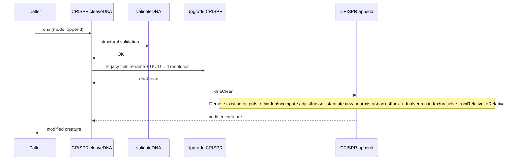

# CRISPR Guide

Targeted genetic modifications for NEAT-AI creatures, inspired by the
[CRISPR gene-editing technique](https://www.nature.com/scitable/topicpage/crispr-cas9-a-precise-tool-for-33169884/).
This guide complements the CRISPR API summary in
[`docs/api/CREATURE.md`](api/CREATURE.md#-crispr) with the conventions and
gotchas that catch out new authors.

## Modes

| Mode     | Purpose                                                                                                          |
| -------- | ---------------------------------------------------------------------------------------------------------------- |
| `insert` | Splice new hidden neurons in front of the existing outputs without changing the output count or output squash.   |
| `append` | Add new neurons (including new outputs) on top of the existing topology. The previous outputs become **hidden**. |

This guide focuses on `append` because that is where the bulk of the
hand-crafted DNA in production lives — and where the implicit conventions around
relative indexing live.

## The append + demote pattern

When append-mode DNA defines new output neurons, every previously-existing
output is **demoted to hidden** and a new output is added in its place. The
demoted neurons keep their UUIDs and their topological position, so any
downstream synapse that referenced them by integer `id` continues to resolve.
The new output, however, is a fresh neuron with its own UUID.

The intended use case is **wrapping** the previous output: the new output reads
from the demoted previous output via a synapse and applies an extra
transformation (e.g. a `TANH` clamp or a `MINIMUM` aggregator). This is how the
GRQ DNA files build per-creature output ensembles on top of an already-trained
creature.

### Index arithmetic

Inside `CRISPR.append()` (`src/reconstruct/CRISPR.ts`):

```ts
adjustIndx = firstNetworkOutputIndex - firstDnaOutputIndex + dna.neurons.length;
```

Every `fromRelative` / `toRelative` value `R` resolves to network index
`R + adjustIndx`. So picking a large, conventional anchor for
`firstDnaOutputIndex` keeps `R` values readable.

NEAT-AI exposes two constants for the recommended anchor:

```ts
import {
  CRISPR_DEFAULT_FIRST_DNA_OUTPUT_INDEX, // 100_000
  FROM_RELATIVE_DEMOTED_OUTPUT, //  99_999  (= ANCHOR - 1)
} from "@stsoftware/neat-ai";
```

With `firstDnaOutputIndex = CRISPR_DEFAULT_FIRST_DNA_OUTPUT_INDEX`:

| `fromRelative` value                    | Resolves to                                                      |
| --------------------------------------- | ---------------------------------------------------------------- |
| `CRISPR_DEFAULT_FIRST_DNA_OUTPUT_INDEX` | The first new output (the new `output-0`).                       |
| `FROM_RELATIVE_DEMOTED_OUTPUT` (99_999) | The **last** previously-existing output, just demoted to hidden. |
| `99_998`                                | The second-last demoted previous output.                         |
| `99_997`                                | The third-last demoted previous output.                          |
| ...                                     | ...                                                              |

The DNA fixtures `test/data/CRISPR/DNA-SANE.json` and `DNA-VOLUME.json` use a
smaller anchor (`1000`) for compactness. They are equivalent — the only thing
that matters is `firstDnaOutputIndex - K`, not the absolute value of either
side.

### Sequence



### Worked example: wrap the previous `output-0` with a `TANH`

```ts
import {
  CRISPR,
  CRISPR_DEFAULT_FIRST_DNA_OUTPUT_INDEX,
  type CrisprInterface,
  FROM_RELATIVE_DEMOTED_OUTPUT,
} from "@stsoftware/neat-ai";

const dna: CrisprInterface = {
  id: "wrap-output-0-with-tanh",
  mode: "append",
  neurons: [
    {
      type: "output",
      squash: "TANH",
      bias: 0,
      index: CRISPR_DEFAULT_FIRST_DNA_OUTPUT_INDEX,
    },
  ],
  synapses: [
    // Demoted previous output → new TANH output.
    {
      fromRelative: FROM_RELATIVE_DEMOTED_OUTPUT,
      toRelative: CRISPR_DEFAULT_FIRST_DNA_OUTPUT_INDEX,
      weight: 1,
    },
  ],
};

const modified = new CRISPR(creature).cleaveDNA(dna);
```

After `cleaveDNA`:

- The original `output-0` is now a hidden neuron with the same UUID and internal
  `id` as before.
- A new `TANH` neuron is the sole output (`output-0`).
- A single synapse with weight `1` carries the demoted neuron's activation into
  the new output.

### Caveats

1. **`firstDnaOutputIndex` is implicit, not declared.** `append()` derives it as
   `min(neuron.index)` over all `type: "output"` neurons in the DNA. Pick a
   large anchor (`100_000` is the recommended value via
   `CRISPR_DEFAULT_FIRST_DNA_OUTPUT_INDEX`) so `fromRelative` / `toRelative`
   values cannot collide with real network indices.
2. **`output-0` literal labels are shadowed.** Once the new outputs land, the
   canonical `output-N` labels point at the **new** outputs. There is no
   canonical label for "the previous `output-0`" — use
   `fromRelative: FROM_RELATIVE_DEMOTED_OUTPUT` (or the demoted neuron's real
   UUID, if you happen to know it).
3. **Multiple new neurons shift the anchor.** If `dna.neurons.length > 1`, the
   new outputs occupy `firstDnaOutputIndex .. firstDnaOutputIndex +
   N - 1`.
   The demoted previous outputs sit immediately _before_ them in the post-append
   topology. `FROM_RELATIVE_DEMOTED_OUTPUT` still resolves to the last demoted
   output regardless of how many DNA neurons you add, because `adjustIndx` rolls
   them into the same relative offset.
4. **Synapses are deduplicated.** `append()` skips a synapse if one already
   exists between the resolved `from` and `to` indices. You will not get a
   duplicate, but you will not get an exception either.

## Validation: `validateDNA`

`cleaveDNA` runs `validateDNA` before `Upgrade.CRISPR`, so the synapse fields it
sees are the raw DNA fields. As of Issue #2509, append-mode synapses are
accepted with **any** of the following endpoint references:

- `from` / `to` — absolute network index
- `fromId` / `toId` — runtime integer neuron `id`
- `fromRelative` / `toRelative` — relative to `firstDnaOutputIndex` after
  `adjustIndx` is applied
- `fromUUID` / `toUUID` — stable UUID string (or canonical `input-N` /
  `output-N` label). `Upgrade.CRISPR` resolves these to `fromId` / `toId` before
  `append()` consumes the DNA.

Insert-mode synapses are stricter: they must use `fromId` / `toId` only (or
`fromUUID` / `toUUID`, since those are resolved to ids by `Upgrade.CRISPR`).
Static `from` / `to` indices and `fromRelative` / `toRelative` are rejected —
those references are meaningless when neurons are being inserted into an
existing topology.

> [!NOTE]
> Prior to Issue #2509, `validateDNA` did not recognise `fromUUID` / `toUUID` as
> endpoint references. Callers worked around this by inserting placeholder
> `fromRelative: 0` / `toRelative: 0` entries before validation. That workaround
> is no longer required.

## Aliasing

`CRISPR.editAliases(dna, aliases)` rewrites neuron and synapse references
without mutating the original DNA. It supports both numeric and UUID alias maps:

```ts
// Numeric: remap fromId/toId/neuron.id
const remapped = CRISPR.editAliases(dna, { 100: 200 });

// UUID: remap fromUUID/toUUID/neuron.uuid (e.g. promote a placeholder
// label to the real UUID of an in-creature neuron)
const resolved = CRISPR.editAliases(dna, {
  "demoted-output-0": "5a47061e-9c90-4126-93ed-abdfd27a1dae",
});
```

## Related

- `src/reconstruct/CRISPR.ts` — implementation
- `src/reconstruct/validateDNA.ts` — DNA structural validation
- `src/reconstruct/Upgrade.ts` — legacy field rename + UUID→id resolution
- `test/CRISPR/AppendDemoteOutput.ts` — append+demote regression tests
- `test/data/CRISPR/DNA-SANE.json`, `DNA-VOLUME.json` — multi-output demote
  examples
