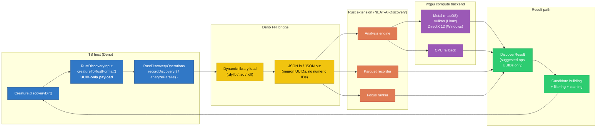
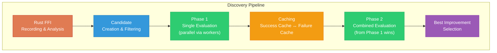
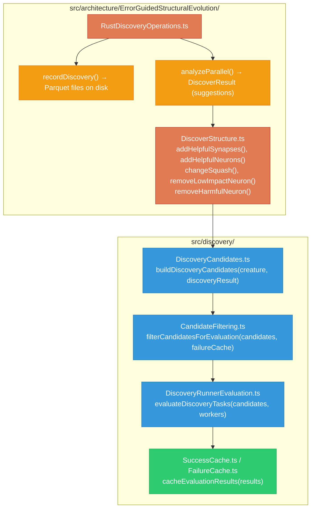
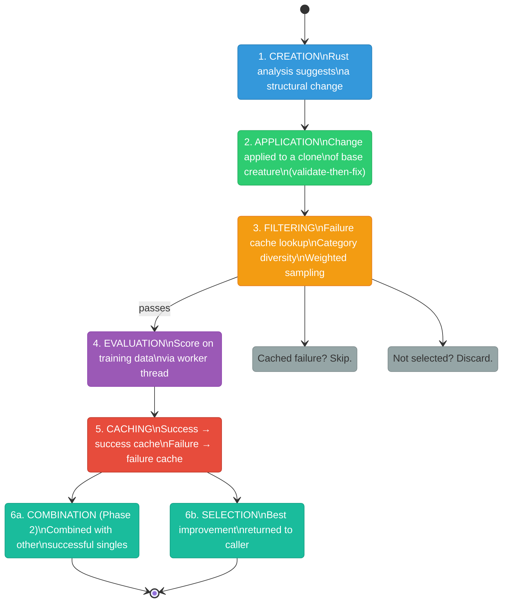
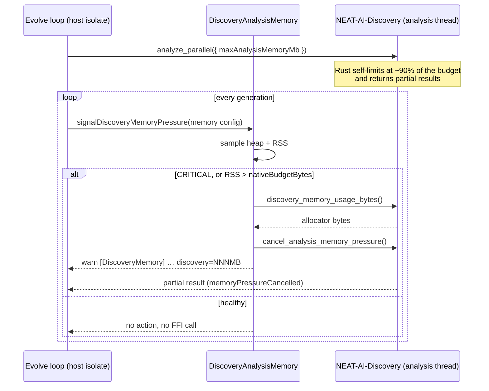
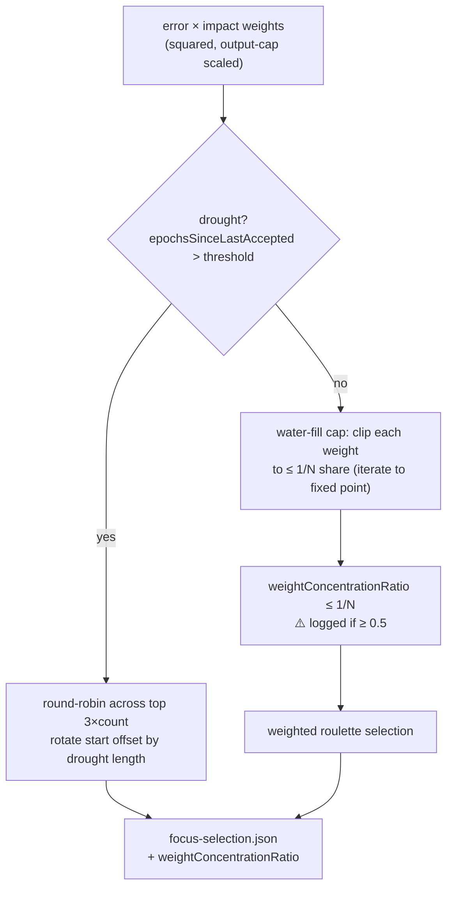
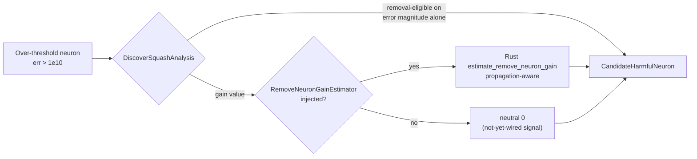

# 🏗️ Discovery Pipeline Internal Architecture

> **Summary** — Deep-dive contributor reference for the discovery pipeline: the
> TypeScript (TS) host orchestrates a two-phase evaluation, calls the Rust
> Discovery extension across the Foreign Function Interface (FFI) for recording
> and parallel analysis (Graphics Processing Unit (GPU) accelerated via `wgpu`,
> with Central Processing Unit (CPU) fallback), and persists JavaScript Object
> Notation (JSON) success / failure cache entries that are keyed by Universally
> Unique Identifier (UUID). Companion docs:
> [DISCOVERY_GUIDE.md](DISCOVERY_GUIDE.md) (user intro),
> [DISCOVERY_DIR.md](DISCOVERY_DIR.md) (on-disk cache layout),
> [TS_RUST_MIGRATION.md](TS_RUST_MIGRATION.md) (where things live),
> [GPU_ACCELERATION.md](GPU_ACCELERATION.md), and the topic index in
> [`docs/README.md`](README.md).

This document describes the internal architecture of the discovery pipeline —
how modules interconnect, the two-phase evaluation strategy, cache architecture,
and candidate lifecycle. For user-facing configuration and distributed setup
guidance, see [DISCOVERY_GUIDE.md](DISCOVERY_GUIDE.md) and
[DISCOVERY_DIR.md](DISCOVERY_DIR.md).

> [!NOTE]
> **Discovery** is a [NEAT-AI](../AGENTS.md#-terminology) themed term for
> error-guided structural evolution
> ([glossary](GLOSSARY.md#-themed--house-terms)). Unlike standard NEAT's blind
> `add-node` / `add-connection` mutations, the pipeline below records per-neuron
> errors and proposes _targeted_ edits — see
> [DISCOVERY_GUIDE.md §Discovery vs standard NEAT](DISCOVERY_GUIDE.md#-discovery-vs-standard-neat)
> for that contrast and the
> [canonical NEAT-vs-NEAT-AI rule](../AGENTS.md#-neat-vs-neat-ai--which-term-to-use).

This document is **contributor-focused**: for user-facing configuration and
distributed setup refer to [DISCOVERY_GUIDE.md](DISCOVERY_GUIDE.md); for the
integration API and on-disk layout refer to
[DISCOVERY_DIR.md](DISCOVERY_DIR.md).

## 🔗 TS host ↔ Rust extension data flow

Every discovery run crosses the FFI boundary at least twice — once to record
training data into Parquet files, and once to run parallel analysis. The diagram
below traces a single call from the TypeScript host through the FFI bridge into
the Rust extension, on into the `wgpu` GPU compute layer, and back to the host
with a `DiscoverResult`.

> [!IMPORTANT]
> **UUID-only wire payloads.** Both directions of the FFI hop carry **neuron
> UUIDs only** — never numeric runtime IDs. This is the same wire contract that
> governs `creature.exportJSON()` and `loadFrom`: see
> [`AGENTS.md`](../AGENTS.md) §"Neuron UUID stability". Numeric IDs are an
> internal acceleration only and are reconstructed at the last application step
> inside the host.

## 🔄 Pipeline Overview

The discovery pipeline is a **two-phase, cache-aware structural evolution
system** that proposes, filters, evaluates, and caches candidate improvements to
neural network topology. Each iteration targets small incremental gains
(typically 0.5–3%) that compound over repeated runs.

## 📊 Two-Phase Evaluation Strategy

### 🔍 Phase 1: Single Candidate Evaluation

Phase 1 evaluates individual structural changes proposed by the Rust analysis
engine. Each candidate represents a single atomic modification to the creature.

**Data flow:**

1. **Rust FFI recording** — Training data is recorded to Parquet via the Rust
   library (`recordDiscovery()`), capturing neuron activations and errors.
2. **Rust FFI analysis** — GPU-accelerated parallel analysis
   (`analyzeParallel()`) produces a `DiscoverResult` containing:
   - Synapse addition suggestions with expected score gains
   - Neuron addition suggestions with expected score gains
   - Squash (activation function) change suggestions
   - Coordinated structural candidates (epistatic multi-operation groups)
   - Low-impact neuron removal candidates
   - Harmful neuron/synapse removal candidates
3. **Candidate building** — `buildDiscoveryCandidates()` constructs concrete
   candidate creatures from each suggestion. Each candidate applies one change
   to the base creature.
4. **Failure cache filtering** — Candidates matching previously failed keys are
   removed before consuming evaluation slots.
5. **Category diversity** — Minimum slots are reserved per change type
   (add-neurons, add-synapses, change-squash, remove-low-impact) to ensure
   breadth of exploration.
6. **Weighted sampling** — Remaining slots are filled via roulette-wheel
   selection weighted by expected improvement.
7. **Parallel evaluation** — Filtered candidates are scored in parallel across
   worker threads. The original creature is also re-scored for baseline
   comparison.
8. **Result caching** — Successful candidates (score > original) go to the
   success cache; failures go to the failure cache.

### 🔗 Phase 2: Combined Candidate Evaluation

Phase 2 builds multi-step combinations from Phase 1 successes, targeting
**epistatic improvements** — cases where individual changes are marginal but
combinations are powerful.

> [!NOTE]
> **Entry threshold:** Phase 2 requires at least **1 successful single** from
> Phase 1. This threshold was lowered from 2 in enhancement #1734 to capture
> more combination opportunities.

**Supplementation:** When Phase 1 produces only 1 success, the pipeline
supplements with up to 5 historical successes from the success cache
(`supplementFromCache()`). Supplemented entries are filtered for relevance to
the current creature and checked against already-applied changes.

**Combination strategies:**

| Strategy        | Description                              |
| --------------- | ---------------------------------------- |
| All successful  | Every Phase 1 success applied together   |
| All removal     | Only removal candidates combined         |
| All non-removal | Only additive/squash candidates combined |
| Pairwise        | Every pair of successful candidates      |
| Triple          | Every triple (when pool is large enough) |

> [!WARNING]
> **Exclusion rule:** Coordinated-structural candidates are never combined with
> other candidates — they are already epistatic groups designed to be applied
> atomically. Combining them with other candidates may produce invalid
> structural configurations.

After building, Phase 2 candidates pass through the same filtering and
evaluation pipeline as Phase 1. Results are cached identically.

### 🏆 Final Selection

All Phase 1 and Phase 2 improvements are pooled, sorted by score (descending),
and the best is returned as the primary improvement. Remaining improvements are
available as `additionalImprovements`.

## 🗺️ Module Dependency Map

### `src/discovery/` — Pipeline Orchestration

```mermaid
graph TD
    classDef orchestrator fill:#e07b53,stroke:#c0392b,color:#fff
    classDef candidates fill:#3498db,stroke:#2980b9,color:#fff
    classDef filtering fill:#2ecc71,stroke:#27ae60,color:#fff
    classDef cache fill:#f39c12,stroke:#e67e22,color:#fff
    classDef diagnostics fill:#9b59b6,stroke:#8e44ad,color:#fff
    classDef replay fill:#1abc9c,stroke:#16a085,color:#fff
    classDef utilities fill:#34495e,stroke:#2c3e50,color:#fff

    DR["DiscoveryRunner.ts\nMain orchestrator"]:::orchestrator
    DRT["DiscoveryRunnerTypes.ts\nPipeline I/O types"]:::orchestrator
    DRE["DiscoveryRunnerEvaluation.ts\nBatch evaluation + cache recording"]:::orchestrator

    DR --> DRT & DRE

    subgraph candidates["Candidate Building"]
        DC["DiscoveryCandidates.ts\nCandidate building coordinator"]:::candidates
        CC["CandidateCreation.ts\nSingle-step builders"]:::candidates
        CAO["CandidateApplicationOps.ts\nLow-level structural ops"]:::candidates
        CMB["CombinedCandidates.ts\nMulti-step combination builders"]:::candidates
        CMBB["CombinedCandidateBuilders.ts\nPer-category combination logic"]:::candidates
        CFS["CombinedFromSuccessful.ts\nPhase 2 combination orchestrator"]:::candidates
        CIR["CacheInformedRemovalCandidates.ts\nMulti-removal from cache"]:::candidates
        SFC["SupplementFromCache.ts\nHistorical success supplementation"]:::candidates
        CA["CandidateApplication.ts\nValidate-then-fix strategy"]:::candidates

        DC --> CC --> CAO
        DC --> CMB --> CMBB
        DC --> CFS & CIR & SFC & CA
    end

    subgraph filtering["Candidate Filtering & Scoring"]
        CF["CandidateFiltering.ts\nSlot allocation, diversity, weighted sampling"]:::filtering
        CS["CandidateScoring.ts\nExpected improvement calculations"]:::filtering
        CD["CandidateDescriptions.ts\nHuman-readable descriptions"]:::filtering
    end

    subgraph caching["Cache Layer"]
        SC["SuccessCache.ts\nSuccessful candidate storage"]:::cache
        FC["FailureCache.ts\nFailed candidate lookup & storage"]:::cache
        FCK["FailureCacheKey.ts\nDeterministic cache key generation"]:::cache
        FCT["FailureCacheTypes.ts\nCache type definitions"]:::cache
        FCD["FailureCacheDiagnostics.ts\nCache analysis & prediction tracing"]:::cache
        DCE["DiscoveryCacheEviction.ts\nCache pruning & retention"]:::cache

        FC --> FCK & FCT & FCD
    end

    subgraph diag["Diagnostics & Validation"]
        DD["DiscoveryDiagnostics.ts\nPer-changeType success/failure rates"]:::diagnostics
        DES["DiscoveryEvaluationSummary.ts\nPer-candidate evaluation records"]:::diagnostics
        DF["DiscoveryFormatting.ts\nFormatting utilities"]:::diagnostics
        DPV["DiscoveryPostValidate.ts\nPost-evaluation validation"]:::diagnostics
    end

    subgraph replayGroup["Replay System"]
        REA["ReplayEntryApplication.ts\nReconstruct candidates from cache"]:::replay
        RH["ReplayHelpers.ts\nCache replay utilities"]:::replay
        DRR["DiscoveryReplayRunner.ts\nReplay orchestration"]:::replay
        DRRT["DiscoveryReplayRunnerTypes.ts\nReplay type definitions"]:::replay

        DRR --> REA & RH & DRRT
    end

    subgraph utils["Utilities"]
        PDQ["PriorityDiscoveryQueue.ts\nTask queue management"]:::utilities
        BS["BrittlenessScorer.ts\nRobustness scoring"]:::utilities
        NEI["NeuronErrorImpactEstimator.ts\nError impact estimation"]:::utilities
        DSM["DiskSpaceMonitor.ts\nPre-flight disk space checks"]:::utilities
        DT["DiscoveryTimeout.ts\nTimeout management"]:::utilities
        DCL["DiscoveryCleanup.ts\nPost-run cleanup"]:::utilities
    end

    DR --> DC
    DR --> CF & CS & CD
    DR --> SC & FC & DCE
    DR --> DD & DES & DF & DPV
    DR --> DRR
    DR --> PDQ & BS & NEI & DSM & DT & DCL
```

### 🦀 `src/architecture/ErrorGuidedStructuralEvolution/` — Rust FFI & Structure Operations

```mermaid
graph TD
    classDef ffi fill:#e07b53,stroke:#c0392b,color:#fff
    classDef structure fill:#3498db,stroke:#2980b9,color:#fff
    classDef application fill:#2ecc71,stroke:#27ae60,color:#fff
    classDef recording fill:#f39c12,stroke:#e67e22,color:#fff
    classDef focus fill:#9b59b6,stroke:#8e44ad,color:#fff
    classDef perf fill:#1abc9c,stroke:#16a085,color:#fff
    classDef logging fill:#34495e,stroke:#2c3e50,color:#fff

    subgraph rustFFI["Rust FFI Layer"]
        RD["RustDiscovery.ts\nBarrel re-export"]:::ffi
        RDT["RustDiscoveryTypes.ts\nComplete FFI type definitions"]:::ffi
        RDI["RustDiscoveryInput.ts\nCreature to Rust format conversion"]:::ffi
        RDL["RustDiscoveryLibrary.ts\nLibrary loading & availability"]:::ffi
        RDO["RustDiscoveryOperations.ts\nFFI call wrappers"]:::ffi

        RD --> RDT & RDI & RDL & RDO
    end

    subgraph structureDisc["Structure Discovery"]
        DS["DiscoverStructure.ts\nFacade / coordinator"]:::structure
        DSA["DiscoverStructureAnalysis.ts\nAnalysis phase layer"]:::structure
        DSR["DiscoverStructureRecording.ts\nRecording phase layer"]:::structure
        DSB["DiscoverStructureBase.ts\nBase class"]:::structure
        DST["DiscoverStructureTypes.ts\nDiscovery type definitions"]:::structure

        DS --> DSA & DSR & DSB & DST
    end

    subgraph appOps["Application Operations"]
        DAP["DiscoveryApplication.ts\nBarrel re-export"]:::application
        DSO["DiscoverySynapseOps.ts\nSynapse add/remove"]:::application
        DNA["DiscoveryNeuronAddition.ts\nNeuron insertion & squash changes"]:::application
        DNR["DiscoveryNeuronRemoval.ts\nNeuron removal with bias compensation"]:::application
        DV["DiscoveryValidation.ts\nValidation & issue recording"]:::application

        DAP --> DSO & DNA & DNR & DV
    end

    ACSC["ApplyCoordinatedStructuralCandidate.ts\nEpistatic group application"]:::structure
    CSC["CoordinatedStructuralCandidate.ts\nCoordinated operation types"]:::structure
    DRS["DiscoverResult.ts\nFFI result wrapper"]:::structure

    subgraph dataRec["Data Recording"]
        DRC["DataRecorder.ts\nRecording orchestration"]:::recording
        DRR["DataRecorderRecording.ts\nRecording phase"]:::recording
        DRA["DataRecorderAnalysis.ts\nPost-recording analysis"]:::recording
        DDR["DiscoverDirectory.ts\nDirectory management"]:::recording
        DDL["DiscoverDataLoading.ts\nData loading"]:::recording

        DRC --> DRR & DRA & DDR & DDL
    end

    subgraph focusSel["Focus Selection"]
        FS["FocusSelection.ts\nFocus neuron ranking & selection"]:::focus
        FSR["FocusSelectionRanking.ts\nRanking algorithm"]:::focus
        FSW["FocusSelectionWeighting.ts\nWeight computation"]:::focus
        NI["NeuronImpact.ts\nNeuron impact analysis"]:::focus

        FS --> FSR & FSW & NI
    end

    subgraph perfCache["Performance & Caching"]
        RAC["RustAnalysisCache.ts\nAnalysis result caching"]:::perf
        RFD["RustFlushDiagnostics.ts\nFlush operation diagnostics"]:::perf
        SDB["SubmitDiscoveryRecordBatch.ts\nBatch recording submission"]:::perf
        DP["DiscoveryPerformance.ts\nPerformance metrics"]:::perf
    end

    subgraph loggingGroup["Logging & Diagnostics"]
        DDF["DiscoverDiagnosticFormatting.ts\nDiagnostic output formatting"]:::logging
        DLG["DiscoverLogging.ts\nLogging utilities"]:::logging
        DLC["DiscoverLoggingCore.ts\nCore logging"]:::logging
        PD["PhaseDiagnostics.ts\nPhase-specific diagnostics"]:::logging
        CON["constants.ts\nPipeline constants"]:::logging

        DLG --> DLC
    end

    DS --> DAP & ACSC & CSC & DRS
    DS --> DRC & FS
    DS --> RAC & RFD & SDB & DP
    DS --> DDF & DLG & PD & CON
```

### 🔀 Cross-Directory Data Flow

## 🔁 Candidate Lifecycle

Each discovery candidate follows a defined lifecycle from creation through to
caching:

### 🗂️ Change Types

| Change Type              | Source          | Description                                       |
| ------------------------ | --------------- | ------------------------------------------------- |
| `add-synapses`           | Rust analysis   | Add one synapse between existing neurons          |
| `add-neurons`            | Rust analysis   | Insert one hidden neuron with connections         |
| `change-squash`          | Rust analysis   | Change a neuron's activation function             |
| `coordinated-structural` | Rust analysis   | Multi-operation epistatic group                   |
| `remove-neuron`          | Error analysis  | Remove the most harmful neuron                    |
| `remove-synapse`         | Error analysis  | Remove a harmful synapse                          |
| `remove-low-impact`      | Impact analysis | Remove a neuron with impact < costOfGrowth        |
| `cache-informed-removal` | Success cache   | Multi-neuron removal from historical wins (#1731) |
| `combo-successful`       | Phase 2         | Combination of Phase 1 successes                  |
| `combo-add-remove`       | Phase 1         | Combined addition + removal                       |
| `combo-add-change`       | Phase 1         | Combined addition + squash change                 |
| `combo-best-of-category` | Phase 2         | Best candidate from each category                 |

### 🛡️ Validate-Then-Fix Strategy

When a structural change is applied to a creature clone, the pipeline uses a
two-step validation approach:

1. **Validate only** — Call `validate()` without `fix()`. If validation passes,
   the modification logic is correct.
2. **Fix as fallback** — If validation fails, call `fix()` to repair structural
   issues. This indicates a bug in the modification logic worth investigating.

> [!TIP]
> Creatures at version 2.x/3.x are upgraded to 4.x when forward-only topology is
> confirmed. Version 4.x+ creatures enforce strict forward-only connection
> ordering, which improves both performance and determinism.

## 💾 Cache Architecture

### ✅ Success Cache

The success cache stores candidates that improved the creature's score. Each
entry preserves enough information to **replay** the candidate on a future
creature. Entries are sub-keyed by change type, one `{hash}.json` document per
candidate.

> [!NOTE]
> The **on-disk directory tree** (success and failure caches, candidate
> snapshots, focus-analysis traces, lock files) is documented once in
> [DISCOVERY_DIR.md §On-disk discovery cache layout](DISCOVERY_DIR.md#-on-disk-discovery-cache-layout)
> — this section covers the cache's _role and contents_ rather than repeating
> the layout.

**Entry metadata** (enhanced in #1733):

| Field                  | Purpose                                              |
| ---------------------- | ---------------------------------------------------- |
| `key`                  | Deterministic cache key                              |
| `changeType`           | Category of structural change                        |
| `description`          | Human-readable summary                               |
| `originalScore`        | Creature score before change                         |
| `candidateScore`       | Score after change                                   |
| `scoreDelta`           | Improvement magnitude                                |
| `originalError`        | Error before change                                  |
| `error`                | Error after change                                   |
| `timestamp`            | ISO 8601 recording time                              |
| `discoveryVersion`     | Rust library version                                 |
| `rustRequest`          | Original Rust suggestion (for replay)                |
| `actualCreatureChange` | What structurally changed (for deterministic replay) |

**De-duplication:** When a key collision occurs, the entry with the higher
`candidateScore` is retained.

**Query methods:**

- `getSuccessfulRemovalNeuronUUIDs()` — Returns UUIDs of neurons that were
  successfully removed in past runs (used by cache-informed removal building).
- `getSuccessfulRemovalDetails()` — Returns structured details including score
  delta and timing for better prioritisation (#1733).

### ❌ Failure Cache

The failure cache prevents re-evaluation of candidates known to produce no
improvement. Lookups happen **before** evaluation slot allocation, so cached
failures never waste worker time.

**Caching rules:**

- Most `combo-*` types are **not** cached — their effectiveness depends heavily
  on the current base creature state, so historical failures are unreliable
  predictors.
- Exception: `combo-successful` **is** cached because it is keyed by the
  resulting creature structure, not the combination recipe.

> [!NOTE]
> **Entry metadata** includes prediction diagnostics — comparing expected vs
> actual improvement to calibrate the Rust analysis engine's predictions. This
> data helps surface systematic over- or under-estimation patterns in the
> analysis layer.

### 🔑 Cache Key Generation

Cache keys are designed to be **structurally stable** across evolutionary weight
drift while remaining discriminative enough to avoid false collisions.

| Change Type     | Key Components                          |
| --------------- | --------------------------------------- |
| Neuron removal  | Neuron UUID only                        |
| Synapse removal | From-neuron UUID → to-neuron UUID       |
| All other types | Structural signature + weight exponents |

**Weight exponent bucketing:** Weights are bucketed by their order of magnitude
(log₁₀). Two candidates with weights `0.0042` and `0.0067` share the same
exponent bucket (`-3`), producing the same cache key. This prevents cache
explosion from incremental weight drift across training iterations while still
distinguishing structurally different candidates.

### 🧠 Cache-Informed Candidate Building

Introduced in #1731, this feature proactively builds **multi-neuron removal
candidates** during Phase 1 by consulting historical success cache data.

**Process:**

1. Query the success cache for neuron UUIDs that were individually removed
   successfully in past runs.
2. Filter to neurons still present in the current base creature.
3. Build 2-neuron and 3-neuron removal combinations using seeded RNG
   (`seed = 1731`) for reproducible sampling.
4. Cap at 10 pair candidates and 6 triple candidates.
5. Submit as `cache-informed-removal` change type for evaluation.

This bridges Phase 1 and the success cache — enabling multi-removal exploration
without waiting for Phase 2 combination building.

### 🗑️ Cache Eviction

`DiscoveryCacheEviction.ts` manages cache size and retention:

- **Pruning** removes old or low-value entries when the cache exceeds size
  thresholds.
- **Obsolete directory cleanup** removes entries for change types or creatures
  no longer relevant.
- **Statistics logging** reports cache state for operational monitoring.

## 🎛️ Candidate Filtering Detail

`CandidateFiltering.ts` implements a multi-stage slot allocation strategy that
balances **evaluation budget** against **exploration breadth**.

**Stage 1 — Failure cache pre-filter:** Remove candidates matching cached
failure keys before any slot allocation. This ensures failed candidates never
consume evaluation capacity.

**Stage 2 — Category diversity:** Reserve minimum slots per change type
(configurable via `discoveryMinCandidatesPerCategory`). Categories include
`add-neurons`, `add-synapses`, `change-squash`, and `remove-low-impact`. This
guarantees each type gets evaluation time regardless of expected improvement
scores.

**Stage 3 — Weighted sampling:** Fill remaining slots via roulette-wheel
selection (`weightedSampleWithoutReplacement()`), weighted by expected
creature-level improvement. Candidates with higher predicted gains are more
likely to be selected.

**Stage 4 — Removal candidate selection:** Removal candidates use a separate
slot pool. The filter prefers **novel** removal candidates over those already
present in the success cache, encouraging exploration of untested removals.

**Slot budget:** Total evaluation slots scale with available workers:
`maxCandidates = max(2 × threadCount, categoryCount)`.

## 📈 Discovery Diagnostics

Introduced in #1735, per-change-type diagnostics track evaluation outcomes
across the pipeline.

**Tracked metrics per change type:**

- Number of candidates evaluated
- Number that improved score
- Average score delta
- Success rate percentage

**Output:** Summary table logged at the end of each discovery run. Optionally
persisted to `{archiveDir}/diagnostics.json` for trend analysis across runs.

## 🦀 Rust FFI Bridge

The Rust FFI layer connects TypeScript to the
[NEAT-AI-Discovery](https://github.com/stSoftwareAU/NEAT-AI-Discovery) library
for GPU-accelerated structural analysis.

### 🖥️ FFI Operations

| Function                  | Purpose                                        |
| ------------------------- | ---------------------------------------------- |
| `recordDiscovery()`       | Record training data to Parquet via Rust       |
| `analyzeParallel()`       | Run GPU/CPU parallel analysis on recorded data |
| `readDiscoveryRecords()`  | Read Parquet data for a specific neuron        |
| `rankFocusNeurons()`      | Rank neurons by structural impact (no Parquet) |
| `mergeDiscoveryParquet()` | Merge multiple Parquet files                   |

Two further exports cover analysis memory (see
[Analysis memory controls](#-analysis-memory-controls)):
`getDiscoveryMemoryUsageBytes()` and `cancelAnalysisMemoryPressure()`.

### 🔄 Data Conversion

`creatureToRustFormat()` converts a Creature instance to the FFI-compatible
`RustRecordInput` format. This includes validation of data sizes and error
counts — corrupt data (error counts exceeding `sampleCount × outputCount × 2`)
is flagged with warnings.

### 📦 Library Management

- `isRustDiscoveryEnabled()` checks library availability. GPU is optional — the
  Rust library falls back to CPU when no compatible GPU is present.
- `isRustLibraryAvailable()` checks library loading only.
- `isRustGpuAvailable()` checks whether a GPU backend (Metal/Vulkan/DX12) is
  available for acceleration.
- `getGpuBackendInfo()` returns details about the selected GPU backend.
- `getDiscoveryVersion()` returns the cached Rust library version string.
- Library loading is dynamic via Deno FFI (`.dylib` / `.so` / `.dll`).

> [!NOTE]
> `isRustDiscoveryEnabled()` requires the native library to be loadable. GPU
> acceleration is automatic via wgpu (Metal on macOS, Vulkan on Linux, DX12 on
> Windows) but not required — CPU fallback is always available.

### 🧠 Analysis memory controls

`analyze_parallel` is a **blocking** FFI call: while Rust is analysing, the
calling isolate cannot run a timer, sample the heap, or evict a cache. The host
therefore cannot police the analysis footprint from TypeScript — it has to hand
Rust a budget up front and be able to interrupt from a _different_ thread. Three
controls cover that (Issue #3432):

| Control                                              | Direction   | Role                                                                            |
| ---------------------------------------------------- | ----------- | ------------------------------------------------------------------------------- |
| `maxAnalysisMemoryMb` on `RustParallelAnalysisInput` | host → Rust | Budget in MB; Rust returns partial results near 90% of it. **Omit ⇒ no budget** |
| `discovery_memory_usage_bytes()`                     | Rust → host | Rust allocator footprint, for logs and diagnostics                              |
| `cancel_analysis_memory_pressure()`                  | host → Rust | Aborts an in-flight analysis under CRITICAL host pressure                       |

Configuration lives on `memory` in `NeatOptions`:

- `memory.maxAnalysisMemoryMb` — the budget sent on every analysis request.
  Defaults to `0`, which keeps the field **off the wire** entirely (Discovery
  reads an absent field as "unbounded"; a literal `0` would starve the analysis
  immediately, so the two are not interchangeable).
- `memory.nativeBudgetBytes` — the host's off-heap RSS budget, reused as the
  cancellation trigger alongside V8 CRITICAL pressure.

The cancellation flag inside NEAT-AI-Discovery is process-wide, which is what
makes the interrupt possible: the evolve loop signals it from the host isolate
while the analysis blocks a different thread of the same process.

When a NEAT-AI-Discovery build predates these exports, the memory symbols are
loaded on a **separate** `dlopen` handle so the core discovery symbols keep
working; the missing surface is reported with a one-time warning and
`cancelled: false` rather than being reported as a successful cancellation.

### 🎯 Focus Neuron Selection

Before analysis, the pipeline selects which neurons to focus on. Selection uses
weighted random sampling based on:

- **Total error** — Accumulated absolute error for the neuron (capped by maximum
  output error).
- **Impact** — How much the neuron affects outputs through outgoing synapse
  weights (0.0–1.0).
- **Weighted score** — `totalError × (impact + ε)` — drives roulette-wheel
  selection.

`rankFocusNeurons()` is **structure-only**: it never opens the discovery
Parquet, so it supplies the structural `impact` but always reports
`totalError: 0`. NEAT-AI therefore hydrates each ranked neuron's total error
from the per-neuron absolute error accumulated locally during recording (Issue
#3531). Without that hydration `totalError × impact` is zero for every
candidate, so all of them fall below `costOfGrowth` and discovery adds nothing.
When the ranking reports zero error and no recorded error exists either, the
focus path warns rather than passing an unusable all-zero ranking on silently.

Low-impact neurons (impact < costOfGrowth) are flagged separately as removal
candidates rather than analysis targets.

#### 🪣 Diversity floor: water-fill cap and drought round-robin (#3074)

The squared `error × impact` weighting above is deliberately aggressive, but on
a **plateaued** network it lets a single neuron capture almost all of the wheel
— on the GRQ-3 fixture (1673 neurons) one neuron held **~98%** of the weight.
The nominally-distinct focus neurons then collapse onto the same target and the
search stops exploring. Two mechanisms bound this concentration:

- **Water-fill cap (always on).** Each neuron's roulette weight is _iteratively_
  clipped down to at most a `1/N` share of the total (`N` = candidate count):
  clip every weight above the running mean (`total / N`) to that mean, recompute
  the total, and repeat until nothing exceeds the mean. At the fixed point the
  heaviest neuron holds no more than `1/N` of the wheel, so it can no longer
  dominate, while sub-mean weights keep their relative ordering so the tail
  survives.

  > [!NOTE]
  > **Negative result — why a naive single-pass clip is insufficient.** An
  > earlier attempt clipped each weight to `1/N` in a single pass. That does
  > **not** bound concentration when the tail mass is smaller than the mean:
  > clipping the dominant weight lowers the total, which lowers the effective
  > mean, so the (unchanged) dominant weight can still exceed a `1/N` share of
  > the _new_ total. The iterative water-fill converges to the true fixed point;
  > the single-pass clip does not. Do not replace the water-fill with a
  > single-pass clip — it reintroduces the roulette-concentration bug.

- **`weightConcentrationRatio` metric.** The heaviest floored weight's share of
  the total (in `[0, 1]`) is recorded on the focus-selection summary and written
  to `focus-selection.json`, and surfaced in the discovery analysis logs with a
  **⚠️** marker when it stays **≥ 0.5** (persistent concentration despite the
  floor). See [`DISCOVERY_DIR.md`](./DISCOVERY_DIR.md) for the JSON field.

- **Drought round-robin (drought-gated).** When `epochsSinceLastAccepted`
  exceeds the drought threshold (`DEFAULT_FOCUS_DROUGHT_THRESHOLD`, default
  **20**) the network is plateaued and even the floored roulette keeps
  re-sampling the heavy neurons. Selection then abandons roulette and rotates
  **deterministically** through the top `3 × count` ranked neurons, advancing
  the start offset by the drought length so successive plateaued epochs explore
  distinct targets. This path writes `selectionMethod: "round-robin-drought"`.

The cap is always on and solves the production concentration problem; the
round-robin is an optional, drought-gated fallback exposed via a `diversity`
argument on `selectNeuronsWeightedByError`.

### 🧮 Remove-neuron gain estimation (propagation-aware, Rust-owned)

The expected score gain for a `remove-neuron` candidate is **estimated by the
propagation-aware Rust estimator `estimate_remove_neuron_gain`**
(NEAT-AI-Discovery), never by a JavaScript-local heuristic. The Deno side in
`src/architecture/ErrorGuidedStructuralEvolution/DiscoverSquashAnalysis.ts`
consumes an injected `RemoveNeuronGainEstimator` verbatim; when no estimate is
injected the emitted gain is a **non-fabricated neutral `0`** (the benchmark
sequencing signal that the Discovery estimate is not yet wired) — never a
synthesised value.

Note that gain and removal-eligibility are **separate**: over-threshold
("harmful") neurons are still promoted for removal on error magnitude alone, so
consuming a neutral `0` gain does not suppress the removal itself. Only the
_gain value_ comes from the estimator.

> [!CAUTION]
> **Negative result — do NOT resurrect a local squash-error gain heuristic.** A
> previous Deno-side sink synthesised the gain from squash error alone:
> `min(0.5, max(0.1, 0.1 + (excessMagnitude / 10) × 0.4))` where
> `excessMagnitude = log₁₀(err) − log₁₀(1e10)`. That formula **ignored network
> topology** — it turned a large squash error into a large _positive_ gain
> regardless of how many layers separated the neuron from the output(s). For the
> recorded `neuron-1802938338` failure it claimed `+0.17882921` while the
> measured effect was `−0.000194` — roughly **920× too large and opposite in
> sign**. A local, topology-blind gain estimate cannot be trusted; remove-neuron
> gain must come from the propagation-aware Rust estimator, which accounts for
> how a neuron's error actually propagates to the outputs.

## 🔗 Related Issues

- **#1731** — Cache-informed multi-neuron removal building during Phase 1
- **#1733** — Extended success cache metadata for better combination
  prioritisation
- **#1734** — Phase 2 threshold lowered from 2→1 successful singles, with
  historical success supplementation
- **#1735** — Per-change-type discovery diagnostics (success rates, score
  deltas)
- **#3074** — Focus-selection diversity floor: water-fill cap,
  `weightConcentrationRatio` metric, and drought round-robin fallback
- **#3432** — Analysis memory FFI wired into the `evolveDir` path:
  `maxAnalysisMemoryMb` sent on every analysis request,
  `discovery_memory_usage_bytes` surfaced in diagnostics, and
  `cancel_analysis_memory_pressure` invoked on host CRITICAL / native-budget
  breach
- **#3284** — Remove-neuron gain moved to the propagation-aware Rust
  `estimate_remove_neuron_gain`; captures why a local, topology-blind
  squash-error gain heuristic (~920× too large and opposite in sign) must never
  be reintroduced

## 📚 See Also

- [`docs/README.md`](README.md) — topic index for all NEAT-AI documentation.
- [DISCOVERY_GUIDE.md](DISCOVERY_GUIDE.md) — User guide: distributed setup,
  configuration, best practices.
- [DISCOVERY_DIR.md](DISCOVERY_DIR.md) — Integration guide: API reference for
  `Creature.discoveryDir()` and the on-disk cache directory layout.
- [TS_RUST_MIGRATION.md](TS_RUST_MIGRATION.md) — which subsystems live in
  TypeScript versus Rust / WASM today.
- [GPU_ACCELERATION.md](GPU_ACCELERATION.md) — `wgpu` GPU backend selection and
  CPU fallback.
- [EXTERNAL_NEAT_AI_CORE.md](EXTERNAL_NEAT_AI_CORE.md) — vendored WASM artefact
  workflow.
- [CONFIGURATION_GUIDE.md](CONFIGURATION_GUIDE.md) — All configuration options
  including discovery parameters.
- [`AGENTS.md`](../AGENTS.md) §"Neuron UUID stability" — wire-format invariant
  enforced across the FFI boundary.

---

**Up to:** [`README.md`](../README.md) (entry point) ·
[`docs/README.md`](README.md) (topic index).
