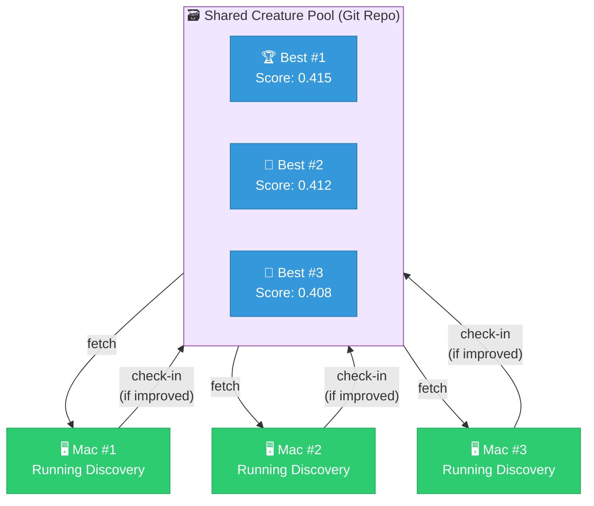

# 🔍 Discovery: Continuous Incremental Improvement

> **Summary** — Discovery is the user-facing entry point to NEAT-AI's
> error-guided structural evolution. It runs as a continuous loop, fetching the
> current best creature, asking the Rust extension via the Foreign Function
> Interface (FFI) to propose small structural changes, and checking improvements
> back into a shared pool. This guide covers configuration, distributed setup,
> and best practices. For internals see
> [DISCOVERY_ARCHITECTURE.md](DISCOVERY_ARCHITECTURE.md); for the
> `discoveryDir()` Application Programming Interface (API) and on-disk layout
> see [DISCOVERY_DIR.md](DISCOVERY_DIR.md); for Graphics Processing Unit (GPU)
> backend selection see [GPU_ACCELERATION.md](GPU_ACCELERATION.md); for the
> external Rust core dependency that vendors WebAssembly (WASM) artefacts see
> [EXTERNAL_NEAT_AI_CORE.md](EXTERNAL_NEAT_AI_CORE.md). The full topic index
> lives in [`docs/README.md`](README.md).

## 📖 Overview

Discovery is designed for **continuous, incremental improvements** to neural
networks through automated structure analysis. Each discovery iteration finds
small improvements (typically 1-3%), which accumulate over time through repeated
iterations.

> [!IMPORTANT]
> Discovery is NOT about finding large 10%+ improvements in a single run. It's
> about finding many small 1-2% improvements that compound over time.

## ⚙️ How Discovery Works

### 📈 The Incremental Improvement Model

1. **Small Steps**: Each discovery run finds 0-3% improvement
2. **Continuous Process**: Runs repeatedly on the current best creature
3. **Compound Growth**: Small improvements accumulate over many iterations
4. **Distributed Swarm**: Multiple machines work in parallel

### 🎯 Typical Results Per Run

```
✅ Excellent: 2-3% improvement (rare but happens)
✅ Good:      1-2% improvement (target range)
✅ Acceptable: 0.5-1% improvement (still useful)
⚠️  Nothing:   0% improvement (try again with next data)
```

**Never expect**: 10%+ improvement in a single run (unrealistic)

## 🏗️ Architecture: Distributed Discovery Swarm

### 🖥️ Multi-Machine Setup



### 🔄 Workflow Loop (Per Machine)

```typescript
while (true) {
  // 1. Fetch current best creature from shared pool
  const best = await fetchBestCreatureFromPool();
  console.log(`Starting with score: ${best.score}`);

  // 2. Run discovery (looking for 1-2% improvement)
  const result = await best.discoveryDir(dataDir, options);

  // 3. If improvement found, check back into pool
  if (result.improvement) {
    const newScore = result.improvement.score;
    const delta = newScore - best.score;
    const pct = (delta / best.score) * 100;

    console.log(`✅ Found ${pct.toFixed(2)}% improvement!`);
    console.log(`   Old score: ${best.score}`);
    console.log(`   New score: ${newScore}`);

    await checkInToPool(result.improvement.creature);
  } else {
    console.log(`No improvement this round - trying again...`);
  }

  // 4. Repeat forever
}
```

## 🛠️ Configuration

### ⚡ Production-Tuned Defaults

These defaults are tuned for continuous incremental discovery:

```typescript
const options: NeatOptions = {
  // Recording phase (1 minute = ~50k records at 700 records/sec)
  discoveryRecordTimeOutMinutes: 1,

  // Analysis phase (10 minutes for thorough analysis)
  discoveryAnalysisTimeoutMinutes: 10,

  // Cost of growth penalty (each synapse/neuron must earn back this cost)
  costOfGrowth: 0.001, // Default: candidates must reduce error > 0.001 per synapse

  // Analyse 6 neurons per iteration (balances speed vs thoroughness)
  discoveryMaxNeurons: 6,

  // Sample 5% of data (faster while maintaining statistical validity)
  discoverySampleRate: 0.05,
};
```

### 💰 Selection Strategy: Cost-Benefit Analysis

Discovery uses a single acceptance rule:

**Cost of Growth Gate**

Each candidate that adds structural complexity must satisfy:
`Error Reduction > Cost of Growth`

- New synapse: costs `1 × costOfGrowth`
- New neuron: costs `~3 × costOfGrowth` (neuron + 2 synapses)
- If error reduction < structural cost → **rejected** (unprofitable)
- **Squash changes (`change-squash`) are excluded** from this check because they
  don't add synapses or neurons - they only modify activation functions of
  existing neurons, so there is no growth cost to penalise
- **Removal candidates (`remove-neuron`, `remove-synapse`, `remove-low-impact`)
  are excluded** because they don't add structural complexity - they remove it.
  They improve score by reducing complexity, not by reducing error. Removing
  elements that return a similar score will improve the creature's score

**Take the Best**

If multiple candidates are profitable:

- ✅ **Select the candidate with the largest net improvement**
- This maximises progress per iteration

Example:

```typescript
// Candidate A: Add 1 synapse, 1.2% improvement, cost = 0.001
// Error reduction: 0.012, Cost: 0.001 → Profit: 0.011 ✅

// Candidate B: Add 1 synapse, 0.8% improvement, cost = 0.001
// Error reduction: 0.008, Cost: 0.001 → Profit: 0.007 ✅

// Candidate C: Add 1 neuron, 0.5% improvement, cost = 0.003
// Error reduction: 0.005, Cost: 0.003 → Profit: 0.002 ✅

// Candidate D: Change squash, 0.1% improvement, cost = 0 (no structural growth)
// Error reduction: 0.001, Cost: 0 → Profit: 0.001 ✅ (not filtered by cost-of-growth)

// Result: Choose the candidate with the largest net improvement
```

## 💻 Example: Distributed Discovery Script

This example shows a simplified version of a production discovery worker:

```typescript
// discovery-worker.ts
import { Creature, NeatOptions } from "@stsoftware/neat-ai";
import { format } from "@std/fmt/duration";

interface CreaturePool {
  fetchBest(): Promise<{ creature: Creature; score: number; path: string }>;
  checkIn(creature: Creature, message: string): Promise<void>;
}

async function runContinuousDiscovery(
  pool: CreaturePool,
  dataDir: string,
  options: NeatOptions,
) {
  console.log("Starting continuous discovery worker...");

  while (true) {
    const start = Date.now();

    // Fetch current best from shared pool
    const best = await pool.fetchBest();
    console.log(
      `\nStarting discovery for creature with score ${best.score.toFixed(6)}`,
    );

    // Run discovery
    const result = await best.creature.discoveryDir(dataDir, options);

    // Check if we found an improvement
    if (result.improvement) {
      const oldScore = result.original.score;
      const newScore = result.improvement.score;
      const delta = newScore - oldScore;
      const pctChange = (delta / oldScore) * 100;

      console.log(`✅ Discovery SUCCESS!`);
      console.log(`   Improvement: ${pctChange.toFixed(3)}%`);
      console.log(`   Old score: ${oldScore.toFixed(6)}`);
      console.log(`   New score: ${newScore.toFixed(6)}`);
      console.log(`   Change: ${result.improvement.changeType}`);

      // Check improved creature back into pool
      await pool.checkIn(
        result.improvement.creature,
        result.improvement.message,
      );

      console.log(`✅ Checked improved creature into pool`);
    } else {
      console.log(`No improvement found this round`);
    }

    const duration = Date.now() - start;
    console.log(
      `Discovery completed in ${format(duration, { ignoreZero: true })}`,
    );

    // Brief pause before next iteration
    await new Promise((resolve) => setTimeout(resolve, 1000));
  }
}

// Example pool implementation (your implementation will vary)
class GitBasedPool implements CreaturePool {
  constructor(private repoPath: string) {}

  async fetchBest() {
    // Sync with git remote
    await this.gitSync();

    // Find highest scoring creature in repo
    let best = null;
    for await (const entry of Deno.readDir(`${this.repoPath}/samples`)) {
      if (!entry.name.endsWith(".json")) continue;

      const path = `${this.repoPath}/samples/${entry.name}`;
      const json = JSON.parse(await Deno.readTextFile(path));
      const score = parseFloat(
        json.tags?.find((t: any) => t.name === "score")?.value || "0",
      );

      if (!best || score > best.score) {
        best = {
          creature: Creature.fromJSON(json),
          score,
          path,
        };
      }
    }

    return best!;
  }

  async checkIn(creature: Creature, message: string) {
    const hostname = Deno.hostname();
    const json = creature.exportJSON();

    // Add metadata tags
    json.tags = json.tags || [];
    json.tags.push({ name: "Discovery", value: message });
    json.tags.push({ name: "host", value: hostname });
    json.tags.push({ name: "timestamp", value: new Date().toISOString() });

    // Write to pool
    const filename = `${hostname}-${Date.now()}.json`;
    await Deno.writeTextFile(
      `${this.repoPath}/samples/${filename}`,
      JSON.stringify(json, null, 1),
    );

    // Commit and push
    await this.gitCommitAndPush(message);
  }

  private async gitSync() {
    // Pull latest from remote
    await new Deno.Command("git", {
      args: ["pull", "--rebase"],
      cwd: this.repoPath,
    }).output();
  }

  private async gitCommitAndPush(message: string) {
    const cwd = this.repoPath;
    await new Deno.Command("git", { args: ["add", "."], cwd }).output();
    await new Deno.Command("git", {
      args: ["commit", "-m", message],
      cwd,
    }).output();
    await new Deno.Command("git", { args: ["push"], cwd }).output();
  }
}

// Usage
if (import.meta.main) {
  const pool = new GitBasedPool("/path/to/creature-pool-repo");
  const dataDir = "/path/to/training/data";

  const options: NeatOptions = {
    discoveryRecordTimeOutMinutes: 1,
    discoveryAnalysisTimeoutMinutes: 10,
    discoveryMaxNeurons: 6,
    discoverySampleRate: 0.05,
  };

  await runContinuousDiscovery(pool, dataDir, options);
}
```

## 🐚 Shell Script Example

A simplified version of a discovery worker shell script:

```bash
#!/bin/bash
# continuous-discovery.sh - Run discovery in a loop

REPO_PATH="$HOME/projects/creature-pool"
DATA_DIR="$HOME/data/training-samples"
TIMEOUT_MINUTES=60  # Total runtime

start_time=$(date +%s)
end_time=$((start_time + TIMEOUT_MINUTES * 60))

echo "Starting continuous discovery for ${TIMEOUT_MINUTES} minutes"

while [[ $(date +%s) -lt ${end_time} ]]; do
  # Sync creature pool from git
  (cd "${REPO_PATH}" && git pull --rebase)

  # Run discovery
  deno run \\
    --allow-read --allow-write --allow-net --allow-ffi --allow-env \\
    discovery-worker.ts \\
    --repoPath="${REPO_PATH}" \\
    --dataDir="${DATA_DIR}" \\
    --discoveryRecordTimeOutMinutes=1 \\
    --discoveryAnalysisTimeoutMinutes=10

  # Brief pause
  sleep 5
done

echo "Discovery loop completed"
```

## 📊 Real-World Results

### 📉 Example: 100 Discovery Iterations

| Iteration | Score  | Delta | Cumulative |
| --------- | ------ | ----- | ---------- |
| 0         | 0.4000 | —     | 0%         |
| 10        | 0.4048 | +1.2% | +1.2%      |
| 20        | 0.4089 | +1.0% | +2.2%      |
| 30        | 0.4142 | +1.3% | +3.6%      |
| …         | …      | …     | …          |
| 80        | 0.4523 | +0.8% | +13.1%     |
| 90        | 0.4589 | +1.5% | +14.7%     |
| 100       | 0.4651 | +1.4% | +16.3%     |

**Summary:** 100 iterations, 16.3% total improvement — average 0.16% per
iteration, best single iteration 1.5%, 73/100 iterations found improvements (73%
success rate).

### ⏱️ Timeline

- **Single iteration**: 12-15 minutes (1 min recording + 10 min analysis +
  overhead)
- **10 iterations**: 2-3 hours
- **100 iterations**: 20-25 hours
- **With 5 machines**: 4-5 hours for 100 iterations

> [!TIP]
> Running discovery on 5 machines simultaneously reduces wall-clock time for 100
> iterations from 20-25 hours down to 4-5 hours. Each machine independently
> searches the candidate space, so the speedup is approximately linear with the
> number of machines added.

## ✅ Best Practices

### 1. 🖥️ Use Multiple Machines

Run discovery on multiple machines simultaneously:

- Each machine independently searches for improvements
- Improvements are shared through the creature pool
- Linear speedup: 5 machines = 5x faster overall progress

### 2. 🔁 Continuous Operation

Discovery works best when run continuously:

- Don't wait for "perfect" data
- Small improvements compound over time
- Each machine should loop indefinitely

### 3. 🗄️ Fresh Training Data

Regenerate training data periodically:

- Prevents overfitting to specific samples
- Discovers generalisable improvements
- Recommendation: New data every 5-10 iterations

### 4. 📈 Monitor Progress

Track cumulative improvements:

```typescript
// Log to file or database
{
  timestamp: new Date().toISOString(),
  iteration: 42,
  oldScore: 0.4123,
  newScore: 0.4179,
  delta: 0.0056,
  pctChange: 1.36,
  changeType: 'add-synapses',
  hostname: 'mac-studio-1',
}
```

### 5. 🌿 Git-Based Creature Pool

Use git for coordination:

- ✅ Automatic conflict resolution
- ✅ Full history of improvements
- ✅ Works across network
- ✅ Easy to inspect progress

## 🔧 Troubleshooting

### "No improvements found"

This is normal! Not every iteration finds an improvement:

- **Expected**: 60-80% of iterations find improvements
- **If < 50%**: Check if threshold is too high
- **If 0%**: Check if discovery is working at all

> [!NOTE]
> A 0% improvement rate across many consecutive iterations often indicates that
> the current creature topology is near a local optimum. Try introducing fresh
> training data or increasing `discoveryMaxNeurons` to broaden the search.

### "Improvements make score worse"

Occasionally a candidate that looked promising during analysis degrades when
re-scored on the full dataset. The re-scoring phase automatically filters out
degrading candidates, so no action is needed — the system self-corrects.

### "Analysis timing out"

Increase the analysis timeout:

```typescript
options.discoveryAnalysisTimeoutMinutes = 15; // or higher
```

### "Too slow"

Reduce thoroughness for speed:

```typescript
options.discoveryMaxNeurons = 3; // Analyse fewer neurons
options.discoverySampleRate = 0.02; // Sample less data (2%)
options.discoveryRecordTimeOutMinutes = 0.5; // Shorter recording (30 sec)
```

> [!WARNING]
> Reducing `discoverySampleRate` below 0.02 (2%) can significantly reduce the
> statistical reliability of improvement estimates. Candidates that appear
> profitable at very low sample rates may not generalise to the full dataset,
> leading to wasted check-ins and potential score regressions.

## 🎯 Advanced: Focus Neurons

Prioritise specific neurons for analysis:

```typescript
options.discoveryFocusNeuronUUIDs = [
  "uuid-of-neuron-1",
  "uuid-of-neuron-2",
];
```

Discovery will analyse these neurons first before doing weighted selection.

## 📚 See Also

- [`docs/README.md`](README.md) — topic index for all NEAT-AI documentation.
- [API Reference — Discovery](API_REFERENCE.md#7-discovery-api) — Programmatic
  API reference.
- [DiscoveryDir Integration Guide](DISCOVERY_DIR.md) — Technical API reference
  for `Creature.discoveryDir()` and the on-disk cache layout.
- [Discovery Architecture](DISCOVERY_ARCHITECTURE.md) — Internal pipeline
  architecture, two-phase evaluation, TS ↔ Rust FFI flow (contributor-focused).
- [Configuration Guide — Discovery](CONFIGURATION_GUIDE.md#discovery-parameters)
  — All discovery configuration options.
- [TS_RUST_MIGRATION.md](TS_RUST_MIGRATION.md) — where TypeScript ends and Rust
  / WASM begins.
- [GPU_ACCELERATION.md](GPU_ACCELERATION.md) — `wgpu` backend selection (Metal /
  Vulkan / DirectX 12) with Central Processing Unit (CPU) fallback.
- [EXTERNAL_NEAT_AI_CORE.md](EXTERNAL_NEAT_AI_CORE.md) — vendored WASM artefact
  workflow.
- `src/config/NeatOptions.ts` — All configuration options (source of truth).
- `src/discovery/` — Pipeline orchestration source.
