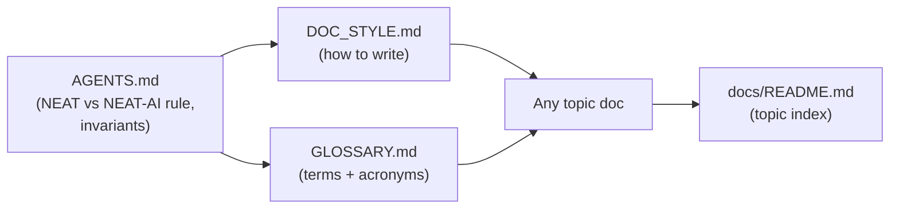

# ✍️ NEAT-AI Documentation Style Guide

This short guide codifies the **house style** for NEAT-AI (NeuroEvolution of
Augmenting Topologies — Artificial Intelligence) documentation. It is the single
rulebook the documentation audit (Issue #2956) applies to every doc, so each
per-doc pass enforces the same conventions instead of reinventing them.

Pair it with the [canonical glossary (`GLOSSARY.md`)](GLOSSARY.md): the glossary
defines the terms; this guide says how to use them.

## 🎯 The rules

Apply every rule below to any doc you write or audit.

1. **Define every acronym on first use, with a link.** The first time a doc uses
   an acronym, expand it and link to a deeper reference — e.g. "WebAssembly
   (WASM)" or "Markov Chain Monte Carlo (MCMC)". The
   [glossary](GLOSSARY.md#-acronyms) is the canonical expansion table; link
   there or to the primary source.
2. **Explain each themed term on use; link to the glossary.** House terms
   (Creature, Discovery, Intelligent Design, Islands, CRISPR, Grafting …) are
   fun, but a newcomer must never be confused. Give a one-line plain-language
   gloss and link to the
   [themed-terms section](GLOSSARY.md#-themed--house-terms).
3. **Call out NEAT-AI-vs-standard-NEAT and industry differences explicitly.**
   Wherever NEAT-AI behaves differently from the original 2002 algorithm or from
   common industry practice, say so in so many words. The
   [NEAT vs NEAT-AI rule in AGENTS.md](../AGENTS.md#-neat-vs-neat-ai--which-term-to-use)
   is the **one canonical statement** of when to write "NEAT-AI" versus
   "standard NEAT" — link to it; never restate or contradict it.
4. **Fact-check claims against both the implementation and external
   references.** A claim must match what the code actually does _and_ line up
   with the external/industry reference it cites. **Delete obsolete content
   outright** — do not archive it inline; stale docs mislead more than missing
   ones.
5. **Keep documents small.** Favour several focused, linked sub-documents over
   one monolith. If a doc grows past a comfortable single-screen-of-scrolling
   topic, split it and link the parts (see how
   [`CONFIGURATION_GUIDE.md`](CONFIGURATION_GUIDE.md) fans out into
   [`config/`](config/)).
6. **Prefer colour and Mermaid diagrams; always add supporting references.** A
   picture tells a thousand words — [Mermaid](https://mermaid.js.org/) renders
   natively on GitHub. Add a diagram wherever it aids understanding, and back
   every non-obvious claim with a reference or link.
7. **Use Australian English.** Spell it `colour`, `behaviour`, `organisation`,
   `favour`, `centre`, `optimise` — in prose, code comments, and diagrams.
8. **Keep internal/AI-facing docs brief and consistent.** Documents like
   [AGENTS.md](../AGENTS.md) refer back to the main docs rather than repeating
   them. One source of truth per fact.

## 🔁 How the foundation docs relate

## ✅ Per-doc audit checklist

When auditing a doc, confirm each of these before considering it done:

- [ ] Every acronym is expanded on first use and linked.
- [ ] Every themed term is glossed and links to [`GLOSSARY.md`](GLOSSARY.md).
- [ ] NEAT-AI-vs-standard-NEAT / industry differences are called out, deferring
      to the [canonical rule](../AGENTS.md#-neat-vs-neat-ai--which-term-to-use).
- [ ] Every claim is fact-checked against the code and an external reference.
- [ ] Obsolete content is deleted, not archived inline.
- [ ] The doc is small and focused; oversized docs are split and linked.
- [ ] At least one Mermaid diagram where it helps, plus supporting links.
- [ ] Australian English throughout.

## 🔗 Related reading

- [Glossary (`GLOSSARY.md`)](GLOSSARY.md) — canonical acronyms and themed terms.
- [AGENTS.md](../AGENTS.md) — contributor conventions and the canonical
  NEAT-vs-NEAT-AI rule.
- [docs/README.md](README.md) — the topic-by-topic documentation index.
