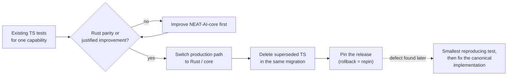

# 🧭 NEAT-AI Engineering Principles

> **Summary** — The canonical engineering policy for the whole NEAT-AI
> repository family. It is written for human contributors and coding agents
> equally: one contract, one wording, no agent-only dialect. Repository-specific
> files ([`AGENTS.md`](../AGENTS.md), [`CONTRIBUTING.md`](../CONTRIBUTING.md))
> hold the local mechanics — commands, directory layout, invariants — and link
> here for the shared rules rather than restating them (Issue #3979).

## 👥 Who this applies to

Everyone who changes code in the NEAT-AI family, whether they are a person or a
coding agent. The inventory of the public repositories — every sibling and how
it depends on the others — is published once in
[`README.md` §Related Repositories](../README.md#-related-repositories); it is
not repeated here, and the private consumers below are deliberately absent from
it. What matters for policy is the three roles a repository can play:

- **Public libraries** — [NEAT-AI](https://github.com/stSoftwareAU/NEAT-AI) and
  its published siblings. Application-agnostic, and bound by principle 11.
- **Shared components** —
  [NEAT-AI-core](https://github.com/stSoftwareAU/NEAT-AI-core) above all, the
  lowest reusable layer where shared logic belongs (principle 10). The
  [TypeScript](https://www.typescriptlang.org/) (TS) → Rust migration rules
  (principles 6–9) govern everything that moves into it.
- **Private downstream consumers** — the stock-market products. They sit
  downstream of every public repository and must keep their domain behaviour to
  themselves (principle 11).

## 📜 The principles

### 1. [Test-driven development (TDD)](../CONTRIBUTING.md#2--write-failing-tests-first-tdd) comes first

Write the failing test before the behaviour. New behaviour and bug fixes both
start with a test that fails for the right reason, then the implementation that
makes it pass. See
[`CONTRIBUTING.md` §Write Failing Tests First](../CONTRIBUTING.md#2--write-failing-tests-first-tdd).

### 2. A post-release defect starts with the smallest reproducing test

When a defect is found after release — including after a capability has moved to
Rust — the first commit adds the **smallest** test that reproduces it. Fix the
canonical implementation only once that test is red. Never fix first and
reconstruct the test afterwards; a test that was never observed failing proves
nothing.

### 3. Tests describe behaviour, not implementation

A test asserts on outcomes: returned values, persisted state, raised errors. If
it would still pass after a complete internal rewrite that produced the same
outcomes, it is a behaviour test — and a migration to Rust is exactly such a
rewrite. A test that asserts _how_ the code works instead (which internal method
was called, source text grepped for a pattern, line counts) blocks the
migrations this document mandates and is not written. Timing belongs in
benchmarks, never in a unit test. The concrete list of what this rules out in
this repository is in [`AGENTS.md` §Testing](../AGENTS.md#-testing).

### 4. One implementation owner per capability

Every capability has exactly one owning implementation in exactly one
repository. Two implementations of one capability drift, and the drift is
discovered by users rather than by tests.

### 5. [Do not repeat yourself (DRY)](https://en.wikipedia.org/wiki/Don%27t_repeat_yourself) across the family

Shared behaviour, fixtures and policy are defined once and consumed everywhere
else. That includes documents: a rule stated here is **linked**, never copied,
by the repositories that follow it.

### 6. Migrate TypeScript → Rust incrementally, and finish each step

A migration is one small capability moved **completely**:

1. Prove the Rust implementation using the **existing** TypeScript tests for
   that capability; add parity fixtures only where the existing suite does not
   reach.
2. Prove parity **or a deliberate, tested and justified improvement** for every
   covered scenario. A deliberate difference is documented; it is never forced
   into byte parity, and it is never left undocumented.
3. Route the production path to Rust/core.
4. Delete the superseded TypeScript implementation, and any helper left with no
   other caller, **in the same migration**.

If core cannot yet handle a required scenario, do not cut that scenario over.
Improve core first, then return to the migration.

Step 4 is gated, not automatic: removing a superseded implementation needs a
clean [`scripts/parity-gate.sh`](PARITY_GATE.md) run pasted into the pull
request and the maintainer sign-off that
[PARITY_GATE.md §Release checklist](PARITY_GATE.md#release-checklist) requires.
[TS_RUST_MIGRATION.md](TS_RUST_MIGRATION.md) records what currently lives where.

### 7. No fallback, no shadow implementation, no long-lived dual path

Once a capability is migrated, the superseded implementation is gone. There is
no runtime fallback, no shadow execution, no dual path, and no "compatibility
copy" kept just in case. A fallback silently masks defects in the canonical
implementation, which is precisely the failure a migration is meant to expose.
Call sites fail loud with an actionable error when the native side is
unavailable, naming the fix. The worked example in this repository is the set of
WebAssembly ([WASM](GLOSSARY.md#-acronyms))-only operations, listed in
[`AGENTS.md` §WASM-only operations](../AGENTS.md#wasm-only-operations-no-ts-fallback).

### 8. Rollback is versioning and pinning, not duplicate code

The operational answer to "the new implementation is wrong in production" is to
re-pin the last known-good release, not to keep a second code path alive. Every
cross-repository dependency is therefore pinned to an immutable revision rather
than to a moving branch, so a rollback is a repin of published artefacts — for
the vendored core that means restoring `neatCore.rev` **and** its `assetSha256`,
re-running `./build.sh`, and committing the regenerated bundle together, exactly
as [CORE_DEPENDENCY_POLICY.md](CORE_DEPENDENCY_POLICY.md) sets out.

### 9. Migrations are small, independently reviewable and revertible

One capability per migration, reviewable on its own, revertible on its own. A
migration that bundles several capabilities cannot be reverted without also
reverting work that was fine.

### 10. Shared logic belongs in the lowest sensible reusable component

Logic that more than one product needs belongs in the lowest reusable component
of the family — normally NEAT-AI-core. Orchestration and policy (which
capability to run, when, with what configuration) stay with the owning product
or experiment. Pushing policy down into a shared library makes it unshareable;
keeping shared logic up in a product makes it duplicated.

### 11. Public libraries stay application-agnostic

The public NEAT-AI libraries are general-purpose. Private stock-market usage
must not leak into the public library contract, and must never be promoted as
part of it: no domain-specific naming, defaults, fixtures or assumptions in the
public Application Programming Interface (API) — the surface catalogued in
[API_REFERENCE.md](API_REFERENCE.md). Domain behaviour lives in the private
consumer.

## 🔁 How a migration flows

## ✅ Before you open a pull request

A recap of the principles above, in the order they usually bite:

- [ ] The change started with a failing test (principles 1–2).
- [ ] The tests assert behaviour, not implementation (principle 3).
- [ ] Exactly one implementation owns the capability afterwards (principles
      4–5).
- [ ] Any migrated capability deleted its superseded implementation in the same
      change, with no fallback or shadow path left behind (principles 6–7).
- [ ] The change is small enough to review and revert on its own (principle 9).
- [ ] Shared logic sits in the lowest sensible component; policy stayed with its
      product (principle 10).
- [ ] Nothing application-specific entered a public library surface (principle
      11).

## 📚 Related reading

- [`AGENTS.md`](../AGENTS.md) — repository conventions, invariants, testing and
  logging policy for this repository.
- [`CONTRIBUTING.md`](../CONTRIBUTING.md) — setup, workflow and the quality
  gate.
- [CORE_DEPENDENCY_POLICY.md](CORE_DEPENDENCY_POLICY.md) — how the shared Rust
  core is pinned and consumed.
- [PARITY_GATE.md](PARITY_GATE.md) — the parity checklist run after every repin,
  before every release, and whenever the vendored bundle is refreshed.
- [TS_RUST_MIGRATION.md](TS_RUST_MIGRATION.md) — the migration ledger: what
  lives in TypeScript, what lives in Rust, and what is next.
- [DOC_STYLE.md](DOC_STYLE.md) and [GLOSSARY.md](GLOSSARY.md) — how to write the
  docs, and the canonical [acronym table](GLOSSARY.md#-acronyms).

---

**Up to:** [`README.md`](../README.md) (entry point) ·
[`docs/README.md`](README.md) (topic index).
