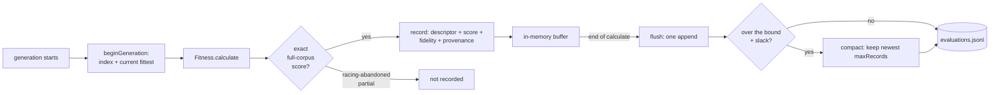

# 🗄️ Evaluation archive: keeping the exact scores (Issue #3929)

Every surrogate in
[Jin (2011)](comparison/REFERENCES.md#-surrogate-assisted-search-and-racing) —
polynomial, kriging, RBF (radial basis function), SVM (support vector machine),
neural net — is a supervised model, and every one of them needs the same thing
to exist first: an archive of `(design point, true fitness)` pairs. Jin treats
managing that data set as part of the method, not a detail.

NEAT-AI kept no such archive. `Fitness.calculate` computed a score, attached it
to the creature, and the pair evaporated when the creature was culled — tens of
thousands of exact evaluations of production-scale creatures, each the product
of minutes of compute against a multi-gigabyte corpus, discarded as they were
produced.

The evaluation archive keeps them. It is **off by default**: it is run
infrastructure, it writes to disk, and it never rides the creature export.

```typescript
await creature.evolveDir(dataSetDir, {
  iterations: 100,
  evaluationArchive: {
    enabled: true,
    directory: ".evaluation-archive", // default
    maxRecords: 100_000, // default retention bound
    runId: "grq-2026-08", // default: a fresh UUID per run
  },
});
```

## 🧭 What is written, and when



One record per **true** evaluation:

| Field               | Meaning                                                      |
| ------------------- | ------------------------------------------------------------ |
| `descriptorVersion` | Layout version of `descriptor`. Readers refuse to mix these. |
| `runId`             | The run that produced the evaluation.                        |
| `generation`        | Generation index within that run.                            |
| `uuid`              | Content-hash UUID of the creature scored.                    |
| `parents`           | UUIDs of the parents it was bred from; empty if not bred.    |
| `operators`         | Mutation operators applied to it, when telemetry knew them.  |
| `approach`          | Pipeline stage that produced it (the `approach` tag).        |
| `score`             | The exact score.                                             |
| `error`             | The raw error the score came from.                           |
| `fidelity`          | Corpus fraction the score covers. `1` is ground truth.       |
| `recordedAt`        | Wall-clock instant it was archived.                          |
| `descriptor`        | The fixed-length feature vector (below).                     |

The file is newline-delimited JSON (`evaluations.jsonl`), appended once per
generation. Runs sharing a directory append to the same archive — cross-run
history is the point, since a surrogate is fitted to what the lineage has
already learnt.

### Exact scores only

A partial score from [racing](RACING.md) (Issue #3928) or a sampled score (Issue
#3926) is **not** ground truth. `fidelity` is required on every record and the
exact-evaluation path passes `1`; anything outside `(0, 1]` is refused rather
than stored, and a racing-abandoned creature never reaches the archive at all. A
non-finite score (the `-Infinity` a WASM panic takes) is also skipped: it
describes the runtime, not the design point.

De-duplication holds too. `Fitness.calculate` scores one representative per UUID
and fans the score out to its duplicates (Issue #1016); only the representative
is archived, so the archive counts evaluations, not creatures.

## 🧬 The descriptor (version 1)

The descriptor is the _design point_: a fixed-length, purely structural summary
computable without touching the corpus. Version 1 has **57** slots.

**Scalars (17):** `neurons`, `inputs`, `outputs`, `hiddenNeurons`,
`constantNeurons`, `synapses`, `depth`, `meanFanIn`, `maxFanIn`, `meanFanOut`,
`maxFanOut`, `weightMeanAbs`, `weightMaxAbs`, `weightRms`, `biasMeanAbs`,
`biasMaxAbs`, `geneticDistanceToReference`.

**Squash histogram (39 + 1):** one slot per canonical activation in
`DESCRIPTOR_V1_SQUASH_NAMES`, plus a trailing `squash:other`. Aliases are
canonicalised, so `RELU` and `ReLU` share a slot. Only hidden and output neurons
are counted — inputs carry no squash.

`geneticDistanceToReference` is `1 - geneticCompatibility(creature, fittest)`
against the run's current fittest, or **`-1`** when the run has no fittest yet.
The sentinel is negative on purpose: "no reference" must never be mistaken for
"maximally distant".

### Descriptor stability is the whole contract

If a slot's meaning drifts, the archive silently becomes a mixture of two
feature spaces and every model fitted to it is wrong in a way that will not show
up as an error. So:

- **Adding, removing, reordering, or re-meaning a slot means bumping
  `EVALUATION_DESCRIPTOR_VERSION`.**
- The squash histogram runs over a **frozen** name list, not over the live
  activation registry. Registering a new activation lands it in `squash:other`
  and does **not** change the layout — the registry stays free to grow.
- Only IEEE-deterministic arithmetic is used, so re-deriving a descriptor from
  the same creature reproduces the same vector bit for bit. A committed creature
  fixture and its committed vector
  (`test/fixtures/archive/descriptor-v1-*.json`) turn any drift into a failing
  test rather than a silent corruption.

**Version mismatches fail loudly.** Reading a record written under a different
version — or appending to an archive that holds one — throws
`EvaluationArchiveError` with reason `DESCRIPTOR_VERSION_MISMATCH`. Nothing is
coerced, and a malformed or wrong-length record is reported rather than skipped:
a partially readable archive is not a smaller archive, it is an archive whose
contents are not what they claim.

## 📦 Retention

The archive keeps the **newest** `maxRecords` records (default `100,000`) and
drops the oldest. Compaction rewrites the file, so it runs only once the archive
is past `maxRecords + slack`, where slack is `max(64, maxRecords / 10)` — that
amortises the rewrite to `O(1)` per record. At the default bound the file is
rewritten once per 10,000 records, which at ~20 evaluations a generation is once
every 500 generations. The file therefore settles between `maxRecords` and
`maxRecords + slack` records: the bound is an "at least", not an exact size.

## ⏱️ Overhead

Measured with `bench/EvaluationArchiveOverhead.ts` against a production-scale
creature (5,300 neurons, 87,096 synapses) and a generation of 20:

| Operation                                  | Cost    |
| ------------------------------------------ | ------- |
| Descriptor, one creature (no reference)    | 1.6 ms  |
| Descriptor, one creature (with reference)  | 1.6 ms  |
| `record()` — one exact evaluation          | 1.6 ms  |
| A whole generation: 20 records + one flush | 44.6 ms |

Against a ~7.8-minute (468,000 ms) generation that is **~0.01%** — four orders
of magnitude below the thing it observes.

## 🔍 How blind is the descriptor?

Two creatures with identical descriptors but materially different exact scores
mean the descriptor cannot see something that decides fitness. No surrogate
fitted to the archive can distinguish them either, so the incidence of that case
is a **ceiling** on how good any such model can be. `reportDescriptorCollisions`
measures it:

```typescript
import {
  formatDescriptorCollisionReport,
  readEvaluationArchive,
  reportDescriptorCollisions,
} from "@stsoftware/neat-ai";

const records = await readEvaluationArchive(
  ".evaluation-archive/evaluations.jsonl",
);
console.log(
  formatDescriptorCollisionReport(reportDescriptorCollisions(records)),
);
```

Only exact records are judged — a partial score differing from an exact one says
something about the corpus fraction, not about the descriptor. Scores within
`DEFAULT_COLLISION_TOLERANCE` (`1e-9`) are treated as agreeing, four orders of
magnitude below the ~`1e-05` gains selection acts on.

## 🚫 Not on the creature export

Nothing the archive records reaches `Creature.exportJSON()`. A creature's `uuid`
is a **content hash**, so anything persisted beside it that is not content is a
liability — and the export contract is fixed by the golden fixtures. Lineage in
particular lives in a module-level `WeakMap` (`src/archive/CreatureLineage.ts`),
never on the creature: nothing is serialised, nothing is hashed, and an
offspring dropped from the population stays collectable.

## 📚 See also

- [`docs/RACING.md`](RACING.md) — the model-free member of the same family, and
  the source of the partial scores this archive refuses.
- [`docs/comparison/REFERENCES.md`](comparison/REFERENCES.md) — Jin (2011), and
  Glover (1986) on remembering what was already tried.
