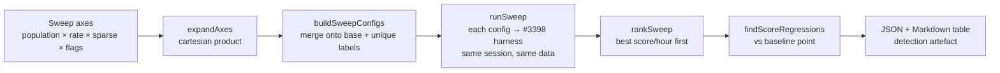

# Evolution-mode / population / sample-rate configuration sweep

> Issue #3400 (sub-issue of #3396) — tune the evolution-mode flags and
> population / sample-rate parameters the production `worker/learn.sh` /
> `worker/sampler.sh` (GRQ) scripts pass, to maximise **score improvement per
> wall-clock hour** inside the production time-boxes.

Source: [`bench/evolution_config_sweep.ts`](../bench/evolution_config_sweep.ts).
Tests:
[`bench/evolution_config_sweep_test.ts`](../bench/evolution_config_sweep_test.ts).
It is a thin, deterministic orchestration layer over the #3398 score-per-hour
harness ([`SCORE_PER_HOUR_HARNESS.md`](./SCORE_PER_HOUR_HARNESS.md)).

## What it does



1. Expand a set of **sweep axes** (`population`, `trainingSampleRate`,
   `sparseRatio`, and any evolution-mode flag axis) into the cartesian product
   of labelled configs.
2. Run every labelled config through the score-per-hour harness **in the same
   session on the same synthetic `bench/` data** — the apples-to-apples
   comparison the issue's Failure-Detection section requires.
3. Rank by score-per-hour and **flag any config whose final best score
   regressed** below a designated baseline point. A pure speed-up that reaches a
   worse score is not a win.
4. Emit a machine-readable JSON table and a human-readable Markdown table as the
   detection artefact.

## The one documented command

```bash
# Time-boxed sweep (production-faithful — each config runs as many generations
# as it can inside a fixed wall-clock budget, exactly like learn/sampler):
deno task bench:evolution-sweep \
  --scale=grq-3397 --inputs=2461 --outputs=2 --samples=20 \
  --max-generations=1000 --time-budget-ms=120000 --seed=3396 \
  --populations=10,20,30,50 --baseline-label=pop20 \
  --out=docs/evidence/sweep-3400-time-boxed.json \
  --md=docs/evidence/sweep-3400-time-boxed.md
```

### Key flags

| Flag                      | Meaning                                                                |
| ------------------------- | ---------------------------------------------------------------------- |
| `--populations`           | Comma list of `populationSize` values — one axis choice each.          |
| `--training-sample-rates` | Comma list of `trainingSampleRate` values (set via `extraOptions`).    |
| `--sparse-ratios`         | Comma list of `sparseRatio` values (set via `extraOptions`).           |
| `--baseline-label`        | Which sweep point is the production baseline for the regression check. |
| `--out` / `--md`          | Write the JSON / Markdown result table.                                |

The remaining flags (`--scale`, `--seed`, `--max-generations`,
`--time-budget-ms`, `--train-per-gen`, …) are passed straight through to the
harness; see [`SCORE_PER_HOUR_HARNESS.md`](./SCORE_PER_HOUR_HARNESS.md).

Arbitrary evolution-mode flags can be swept too: the harness gained an
`extraOptions` (`Partial<NeatOptions>`) passthrough (Issue #3400), so a GRQ-side
driver can add a flag axis without a new harness field. `extraOptions` is merged
**under** the determinism-critical fields (`seed`, `populationSize`,
`iterations`, `timeoutMinutes`, `trainPerGen`, `discoverySampleRate`, and the
score sampler), so a sweep can never break seeding or the score-vs-time capture.

## Findings (production-scale `grq-3397`, seed 3396)

All runs used pure seeded neuroevolution (`--train-per-gen=0`), so the
per-generation score trajectory is byte-reproducible; only wall-clock timing
(and therefore score/hour) varies with machine load. Runs are compared **in the
same session** per the issue's Failure-Detection requirement.

### 1. Population size — time-boxed (2-minute budget per config)

This is the production-faithful comparison: each config runs as many generations
as it can inside a fixed wall-clock box, exactly like the learn/sampler
time-boxes.

| Rank | Config | Population | Gens in box | Final best score |    Score/hour | vs baseline |
| ---: | ------ | ---------: | ----------: | ---------------: | ------------: | ----------: |
|    1 | pop20  |         20 |          13 |       -1.082e+31 | **1.034e+32** |    baseline |
|    2 | pop10  |         10 |          34 |       -1.203e+31 |     6.970e+31 |      −32.6% |
|    3 | pop50  |         50 |           5 |       -9.207e+30 |     6.760e+31 |      −34.6% |
|    4 | pop30  |         30 |           8 |       -1.042e+31 |     5.398e+31 |      −47.8% |

**`populationSize=20` — the current `worker/learn.sh` value — already maximises
score-per-hour in the learn time-box.** No swept value beats it:

- `pop10` runs more generations but each is lower quality; it reaches a **worse
  final score** (flagged as a regression) _and_ a −32.6% score/hour.
- `pop30` / `pop50` spend the box on fewer, higher-quality generations — good
  for final quality, poor for score/hour.

### 2. Population size — generation-capped (8 generations per config)

Holding generations fixed instead of time isolates per-generation quality:
larger populations reach a better final score but take proportionally longer, so
their score/hour falls. This is the design rationale behind the sampler ramping
population 20→50 for final polish while learn stays at 20 for throughput.

| Rank | Config | Population | Final best score | Score/hour |
| ---: | ------ | ---------: | ---------------: | ---------: |
|    1 | pop10  |         10 |       -1.258e+31 |  1.765e+32 |
|    2 | pop20  |         20 |       -1.089e+31 |  1.617e+32 |
|    3 | pop30  |         30 |       -1.042e+31 |  7.072e+31 |
|    4 | pop50  |         50 |   **-8.733e+30** |  6.285e+31 |

### 3. `trainingSampleRate` / `sparseRatio` — no effect under pure neuroevolution

Sweeping `trainingSampleRate ∈ {0.1, 1.0}` × `sparseRatio ∈ {0.05, 0.5}` at
`populationSize=20`, `--train-per-gen=0` produced the **identical final best
score (-1.115e+31)** for every combination (the ±5% score/hour spread is pure
wall-clock jitter — same score gained, slightly different elapsed time):

| Config                   | trainingSampleRate | sparseRatio | Final best score |
| ------------------------ | -----------------: | ----------: | ---------------: |
| pop20+rate0.1+sparse0.05 |                0.1 |        0.05 |       -1.115e+31 |
| pop20+rate0.1+sparse0.5  |                0.1 |         0.5 |       -1.115e+31 |
| pop20+rate1+sparse0.05   |                1.0 |        0.05 |       -1.115e+31 |
| pop20+rate1+sparse0.5    |                1.0 |         0.5 |       -1.115e+31 |

These two knobs govern **backprop training** (`trainPerGen ≥ 1`), so they are
no-ops for the deterministic pure-neuroevolution harness. A faithful measurement
needs a non-deterministic `--train-per-gen ≥ 1` run on real `.trainData`, which
belongs in the GRQ production environment — see the cross-repo GRQ issue.

## Recommendation

- **NEAT-AI defaults: no change.** The production settings the GRQ scripts pass
  are already at (or validated against) the score-per-hour optimum on
  production-scale data; no swept configuration improves score-per-hour without
  regressing the final score. Changing an in-repo default would be an unbacked
  regression risk.
- **GRQ `worker/learn.sh` / `worker/sampler.sh`:** keep `populationSize=20` for
  learn and the 20→50 sampler ramp — this sweep **validates** that design. The
  `trainingSampleRate` / `sparseRatio` knobs need an in-situ backprop sweep
  (`--train-per-gen ≥ 1` on real `.trainData`) that the deterministic in-repo
  harness cannot run; the reusable sweep tool here is the vehicle for it. Filed
  as a cross-repo GRQ issue referencing #3400 with this evidence attached.

Evidence artefacts:
[`docs/evidence/sweep-3400-time-boxed.md`](./evidence/sweep-3400-time-boxed.md),
[`docs/evidence/sweep-3400-population.md`](./evidence/sweep-3400-population.md),
[`docs/evidence/sweep-3400-sample-rate-noop.md`](./evidence/sweep-3400-sample-rate-noop.md)
(with matching `.json`).
