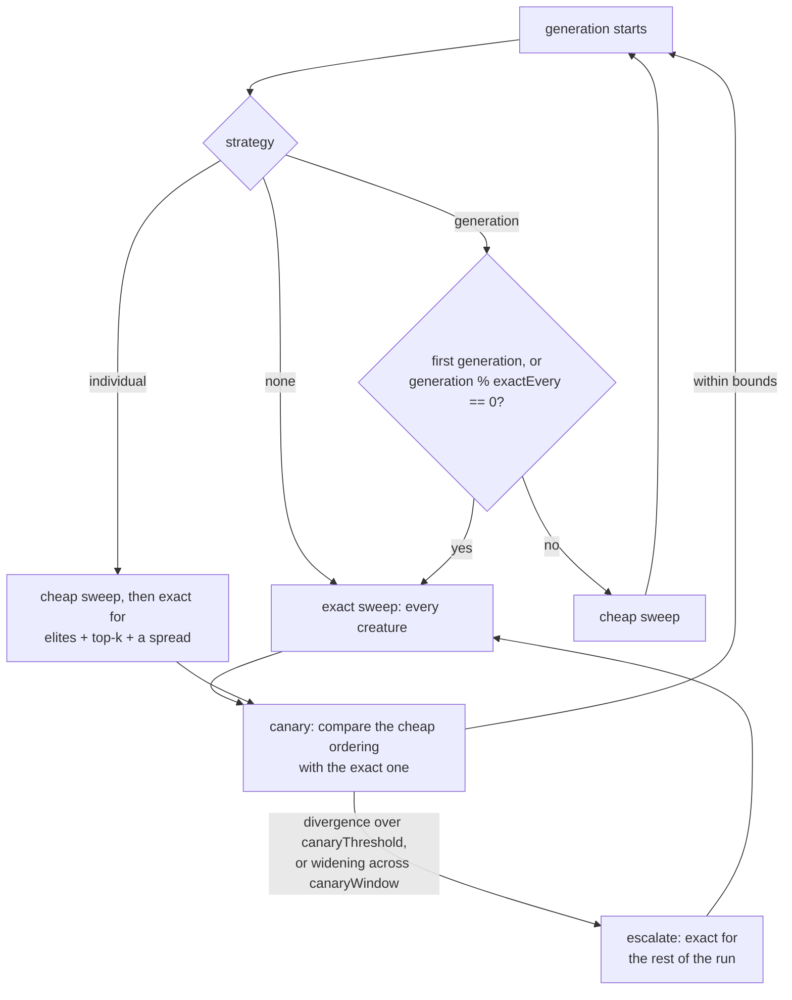

# Evolution control — model management (Issue #3931)

Jin (2011) §4 calls it **evolution control**: the policy deciding which
individuals in a generation earn the true fitness, which get an approximation,
and how that split adapts as the search proceeds. A cheap fitness evaluator is
the easy half of surrogate-assisted evolution; this is the hard half.

Before Issue #3931 NEAT-AI had exactly one fitness policy and it was implicit —
[`src/architecture/Fitness.ts`](../src/architecture/Fitness.ts) evaluates every
creature exactly, every generation — so no object owned the question _is this
creature worth an exact evaluation?_
[`EvolutionControl`](../src/NEAT/EvolutionControl.ts) is that object. It sits
beside the other per-generation policy objects (`AdaptivePopulationSizer`,
`PlateauDetector`, `BreedingQuotas`) rather than inside `Fitness`, which stays a
mechanism.

> [!IMPORTANT]
> **Off by default, and today `"none"` is the only strategy that changes
> anything.** The cheap evaluators this policy would dispatch to have not passed
> their gates: [Issue #3927](evidence/rank-fidelity-3927.md) found **no sampling
> rate safe** on the real lineage, and
> [Issue #3930](evidence/surrogate-feasibility-3930.md) could not decide its
> surrogate kill gate. So **no cheap evaluator is wired into the evolution
> loop**: setting `"generation"` or `"individual"` changes which fidelity each
> generation _asks_ for, and every creature is still evaluated exactly.
>
> That is not a silent no-op. The first generation whose plan is not honoured
> logs a warning naming the strategy and saying it costs what `"none"` costs, so
> a run can never read as cheap when it was not. What landed here is the
> decision layer, its invariants and its canary, so that a cheap evaluator which
> _does_ pass its gate has something to sit behind — and the strategies
> themselves are measured end to end by the A/B harness below, which supplies
> its own evaluator.

## The decision



| Strategy       | Behaviour                                                                                             |
| -------------- | ----------------------------------------------------------------------------------------------------- |
| `"none"`       | Every creature exact, every generation. The default, and the previous behaviour exactly.              |
| `"generation"` | Generation-based control: an exact sweep every λth generation, cheap in between.                      |
| `"individual"` | Individual-based control: a cheap sweep for all, with the top _k_ plus a spread re-evaluated exactly. |

"Cheap" in that table is what the strategy **asks for**. Until an evaluator that
honours it passes its gate, the sweep is exact whatever the plan said — see the
note above.

Jin's third family — **population-based** control, separate sub-populations at
separate fidelities — is not offered: it needs an island model the evolution
loop does not have, and offering a name without the mechanism behind it would be
worse than not offering it.

The **first generation of a run is always exact**, whatever the strategy. A run
that starts on an approximation has no ground truth to measure the
approximation's drift from.

## The invariants, none of which are optional

- **The elites and `previousFittest` are always exact.**
  [`NeatEvolution`](../src/NEAT/NeatEvolution.ts) asserts
  `previousFittest.score <= tmpFittest.score`. Feeding that assertion an
  approximate score either trips it spuriously or — far worse — satisfies it
  with a creature that is not actually an improvement, and the lineage silently
  proceeds from a false premise.
- **Never compare across fidelities.** A cheap score and an exact score are
  different measurements; any ordering that mixes them is meaningless.
  `EvolutionControl.compareScores` throws `MIXED_FIDELITY_COMPARISON` rather
  than tolerating one.
- **Exported creatures carry an exact score.** The guard runs on the clone the
  export is built from, so it cannot be walked around by exporting a copy.
- **Every generation logs its fidelity and its exact-evaluation count**, so a
  run's trace can be read after the fact. An active policy logs at `info`; an
  unmanaged run keeps the line at `debug` rather than repeating "exact" on every
  line of a default run.

### Per-creature fidelity

Fidelity is recorded on the creature as a `scoreFidelity` tag — deliberately not
`fidelity`, which Issue #3929 uses for the archive record's own field and
asserts never appears on a creature —
([`src/architecture/ScoreFidelity.ts`](../src/architecture/ScoreFidelity.ts)),
which travels with `shallowClone` and therefore with the export.

An **untagged** creature has never been approximated — every score NEAT-AI
produces outside the racing path is a full-corpus evaluation — so
`scoreFidelity()` returns `null` rather than a fabricated `1`, and the caller
sees "never approximated" instead of a default. A **corrupt** tag throws; it is
never read as exact. A creature racing abandoned mid-corpus (Issue #3928) is
tagged with the fraction of the corpus it managed, held strictly below `1`, so
the guards refuse it wherever ground truth is required rather than relying on
the rank band alone. A later full-corpus score clears the stale tag.

A run with the policy off and racing off writes no fidelity tag at all, so its
exported creatures are unchanged by this issue.

## The false-optimum canary

Jin's core warning is that a surrogate used without a policy converges
confidently to a **false optimum**: the search optimises the model's error
rather than the objective, and nothing in the fitness trace shows it happening.

On each exact sweep the policy records the **divergence** between the cheap
ordering and the exact one — the fraction of creature pairs the cheap evaluator
placed the other way round. A **one-sided tie** counts as a disagreement: a
predictor that gives two creatures the same score when the exact evaluation
separates them has failed to order them. A pair the exact evaluation also ties
is not a disagreement — there was no ordering to get wrong.

Two things abandon the cheap path for the rest of the run:

1. a single reading above `canaryThreshold` (default `0.25`), and
2. `canaryWindow` consecutive readings (default `3`) each larger than the last —
   the **trend**, which is what Jin actually warns about.

After escalation every generation is exact and the reason is logged. A reading
taken over fewer than two creatures is **undecidable**, not clean: it is
reported as `null` and does not enter the trend history.

## Configuration

```ts
const result = await creature.evolveDataSet(data, {
  evolutionControl: {
    strategy: "generation", // "none" | "generation" | "individual"
    exactEvery: 5, // λ: exact sweep every 5th generation
    exactTopK: 2, // individual: best-predicted creatures re-evaluated exactly
    diverseSampleSize: 2, // individual: spread drawn across the cheap ordering
    canaryThreshold: 0.25, // divergence that abandons the cheap path
    canaryWindow: 3, // consecutive widening readings that do the same
  },
});
```

Every value is **rejected, never clamped** when out of range: a silently
corrected `exactEvery` would change how often the search re-anchors on ground
truth without saying so.

## Measured behaviour

[`docs/evidence/evolution-control-3931.md`](evidence/evolution-control-3931.md)
records a same-seed A/B over ten seeds and 60 generations, judged on the exact
score of the final creature. In short:

- at **equal generations**, `"generation"` is a wash and `"individual"` is a
  **regression** on 8 of 10 seeds;
- at **equal record budget** — the question a wall-clock-bounded run actually
  asks — both cheap arms beat exact-everything on all 10 seeds;
- the canary escalated on 7 of 10 `"generation"` seeds, every one of them on the
  widening-trend rule rather than the threshold.

Reproduce it with
`deno task evolution-control-ab --generations=60 --replicates=10`.

## References

Jin (2011) §4 — evolution control and the false-optimum failure mode — and Jin,
Olhofer & Sendhoff (2002), the controlled-evaluation framework it builds on, are
indexed with their DOIs in
[`docs/comparison/REFERENCES.md`](comparison/REFERENCES.md) under
_Surrogate-assisted search and racing_.

- [RACING.md](RACING.md) — the one mechanism in the build today that produces an
  approximate score.
- [EVALUATION_ARCHIVE.md](EVALUATION_ARCHIVE.md) — the archive of exact
  evaluations a surrogate would be fitted to.
