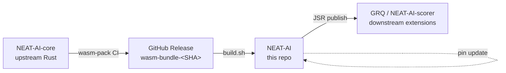

# External NEAT-AI-core Dependency — Cluster Overview

NEAT-AI no longer carries native Rust source. All shared compute lives in the
[NEAT-AI-core](https://github.com/stSoftwareAU/NEAT-AI-core) repository and is
consumed here as a vendored WebAssembly (WASM) bundle pinned by commit SHA in
[`deno.json`](../deno.json) and refreshed by [`./build.sh`](../build.sh). This
page is the **entry point** for the cluster of docs that govern that dependency
— read it first, then follow the links into the detail docs you need.

## 🗺️ Cluster map



This cluster has five docs. Use this overview to pick the one you need.

| Doc                                                          | When to read                                                                                                 |
| ------------------------------------------------------------ | ------------------------------------------------------------------------------------------------------------ |
| **This page**                                                | Day-to-day workflow for bumping the pinned revision.                                                         |
| [`CORE_DEPENDENCY_POLICY.md`](CORE_DEPENDENCY_POLICY.md)     | The pinning policy ADR — why we pin by SHA, semver bands, approval tiers, and the `build.sh` mode reference. |
| [`PARITY_GATE.md`](PARITY_GATE.md)                           | Release checklist — what the parity gate runs and how to interpret its output.                               |
| [`CI_EXTERNAL_NEAT_AI_CORE.md`](CI_EXTERNAL_NEAT_AI_CORE.md) | What the GitHub Actions workflows do for this dependency, and the sync-policy guard.                         |
| [`PARITY_AUDITS.md`](PARITY_AUDITS.md)                       | Archived audits (#2367, #2368, #2369) for in-tree code that has since been removed.                          |

## TL;DR

- `deno.json` pins `neatCore.repo` and a 40-character `neatCore.rev`.
- `./build.sh` is the single integration point — it downloads the matching WASM
  bundle and refreshes [`wasm_activation/pkg`](../wasm_activation/pkg).
- `./scripts/parity-gate.sh` cross-checks the pin against the live TypeScript ↔
  WASM parity tests.
- `./quality.sh` is the release-wide gate; it calls `./build.sh --verify-only`
  so CI never silently advances the pin.

## Architecture

```text
NEAT-AI (this repo)
├── deno.json           ← pins neatCore.repo + neatCore.rev
├── build.sh            ← fetches wasm_activation/pkg from pinned SHA
└── wasm_activation/pkg ← vendored runtime artefacts loaded by TS
```

The full `(repo, ref, rev)` triple in `deno.json` is the single source of truth.
See [`CORE_DEPENDENCY_POLICY.md`](CORE_DEPENDENCY_POLICY.md) for the full ADR
including `build.sh` mode reference.

## Bumping the core revision

1. Run [`./build.sh`](../build.sh) — by default it resolves NEAT-AI-core
   `Develop` HEAD, downloads the matching `wasm-bundle-<SHA>` artefact,
   refreshes [`wasm_activation/pkg`](../wasm_activation/pkg), and updates
   `deno.json` `neatCore.rev`. Use `./build.sh --rev <SHA>` to pin a specific
   commit instead.
2. Run [`./scripts/parity-gate.sh`](../scripts/parity-gate.sh) and paste the
   output into the PR. The gate is a focused alignment check; the release-wide
   gate is `./quality.sh`.
3. Commit the updated `deno.json` and
   [`wasm_activation/pkg`](../wasm_activation/pkg) **together** — the pin and
   the artefact must move as one commit (see _Sync invariant_ below).

For the full release checklist see [`PARITY_GATE.md`](PARITY_GATE.md).

## NEAT-AI-scorer alignment

[NEAT-AI-scorer](https://github.com/stSoftwareAU/NEAT-AI-scorer) and any other
downstream extension should pin the **same** NEAT-AI-core revision as this
workspace. Skew between two consumers of the same core silently drifts shared
types and scoring behaviour.

After bumping `neatCore.rev` here, confirm the scorer is aligned:

```bash
# Extract the rev from NEAT-AI:
deno eval 'const c = JSON.parse(Deno.readTextFileSync("deno.json")); console.log(c.neatCore.rev)'

# Compare against the scorer workspace:
deno eval 'const c = JSON.parse(Deno.readTextFileSync("../NEAT-AI-scorer/deno.json")); console.log(c.neatCore.rev)'
```

If the revisions differ, update the scorer pin and rerun its tests in the same
coordinated bump. The scorer alignment policy is verified by
[`test/scripts/ScorerAlignmentPolicy.ts`](../test/scripts/ScorerAlignmentPolicy.ts).

## Sync invariant

`wasm_activation/pkg/**` should change only in commits that also change
`deno.json` `neatCore.rev`. The CI guard for this lives in
[`.github/workflows/quality.yml`](../.github/workflows/quality.yml) and is
documented in [`CI_EXTERNAL_NEAT_AI_CORE.md`](CI_EXTERNAL_NEAT_AI_CORE.md).

## Related documents

- [`docs/README.md`](README.md) — full documentation index for this repository.
- [`docs/CORE_DEPENDENCY_POLICY.md`](CORE_DEPENDENCY_POLICY.md) — ADR for the
  pinning model.
- [`docs/PARITY_GATE.md`](PARITY_GATE.md) — release checklist.
- [`docs/CI_EXTERNAL_NEAT_AI_CORE.md`](CI_EXTERNAL_NEAT_AI_CORE.md) — CI
  integration.
- [`docs/PARITY_AUDITS.md`](PARITY_AUDITS.md) — archived parity audits.
- [`docs/DISCOVERY_ARCHITECTURE.md`](DISCOVERY_ARCHITECTURE.md) — the Discovery
  / Foreign Function Interface (FFI) cluster, which sits alongside this
  dependency.
