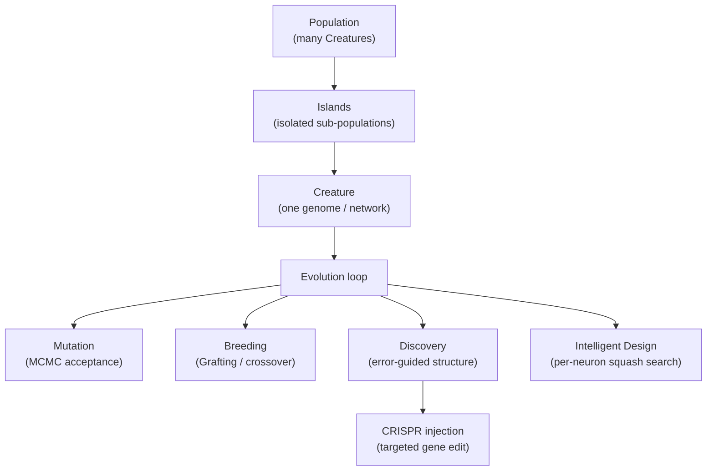

# 📖 NEAT-AI Glossary

This is the **canonical glossary** for NEAT-AI (NeuroEvolution of Augmenting
Topologies — Artificial Intelligence). It is the single source of truth for two
things:

1. **Acronyms** — every shorthand the project uses, expanded with a
   deeper-reading link so nobody has to guess what a TLA (Three-Letter Acronym)
   means.
2. **Themed / house terms** — the playful vocabulary (Creature, Discovery,
   CRISPR, Grafting, Islands …) mapped plainly onto the mainstream
   machine-learning idea behind each one, so the fun never gets in the way of
   understanding.

> [!IMPORTANT]
> **NEAT-AI ≠ NEAT.** **NEAT** means the original 2002 algorithm; **NEAT-AI**
> means this project — they are no longer the same thing. See the
> [NEAT vs NEAT-AI rule in AGENTS.md](../AGENTS.md#-neat-vs-neat-ai--which-term-to-use)
> for the one canonical statement of the convention.

New here? Start with [`../README.md`](../README.md), then skim this glossary,
then dip into a [topic guide](README.md). The companion
[documentation style guide (`DOC_STYLE.md`)](DOC_STYLE.md) explains how these
conventions are applied across the docs.

## 🗺️ How the vocabulary fits together

## 🔤 Acronyms

Each acronym is expanded on first use and linked to a deeper reference. When you
introduce one of these in a doc, expand it the first time and link here or to
the source.

| Acronym     | Expansion                                                                        | Go deeper                                                                                                                                                                |
| ----------- | -------------------------------------------------------------------------------- | ------------------------------------------------------------------------------------------------------------------------------------------------------------------------ |
| **NEAT**    | NeuroEvolution of Augmenting Topologies                                          | [Stanley & Miikkulainen 2002](http://nn.cs.utexas.edu/downloads/papers/stanley.ec02.pdf)                                                                                 |
| **NEAT-AI** | NeuroEvolution of Augmenting Topologies — Artificial Intelligence (this project) | [AGENTS.md terminology](../AGENTS.md#-terminology)                                                                                                                       |
| **MCMC**    | Markov Chain Monte Carlo                                                         | [Metropolis–Hastings](https://en.wikipedia.org/wiki/Metropolis%E2%80%93Hastings_algorithm)                                                                               |
| **WASM**    | WebAssembly                                                                      | [WebAssembly](https://webassembly.org/)                                                                                                                                  |
| **FFI**     | Foreign Function Interface                                                       | [Deno FFI](https://docs.deno.com/runtime/fundamentals/ffi/)                                                                                                              |
| **GPU**     | Graphics Processing Unit                                                         | [Graphics processing unit](https://en.wikipedia.org/wiki/Graphics_processing_unit)                                                                                       |
| **CPU**     | Central Processing Unit                                                          | [Central processing unit](https://en.wikipedia.org/wiki/Central_processing_unit)                                                                                         |
| **RL**      | Reinforcement Learning                                                           | [Reinforcement learning](https://en.wikipedia.org/wiki/Reinforcement_learning); see [REINFORCEMENT_LEARNING.md](REINFORCEMENT_LEARNING.md)                               |
| **CRISPR**  | Clustered Regularly Interspaced Short Palindromic Repeats                        | [CRISPR-Cas9 overview](https://www.nature.com/scitable/topicpage/crispr-cas9-a-precise-tool-for-33169884/)                                                               |
| **ONNX**    | Open Neural Network Exchange                                                     | [onnx.ai](https://onnx.ai/)                                                                                                                                              |
| **CNN**     | Convolutional Neural Network                                                     | [Convolutional neural network](https://en.wikipedia.org/wiki/Convolutional_neural_network)                                                                               |
| **RNN**     | Recurrent Neural Network                                                         | [Recurrent neural network](https://en.wikipedia.org/wiki/Recurrent_neural_network)                                                                                       |
| **LLM**     | Large Language Model                                                             | [Large language model](https://en.wikipedia.org/wiki/Large_language_model)                                                                                               |
| **JSR**     | JavaScript Registry                                                              | [jsr.io](https://jsr.io/)                                                                                                                                                |
| **UUID**    | Universally Unique Identifier                                                    | [UUID](https://en.wikipedia.org/wiki/Universally_unique_identifier); see the neuron UUID invariant in [AGENTS.md](../AGENTS.md)                                          |
| **MSE**     | Mean Squared Error                                                               | [Mean squared error](https://en.wikipedia.org/wiki/Mean_squared_error)                                                                                                   |
| **DX12**    | DirectX 12 (Windows GPU API)                                                     | [DirectX 12](https://en.wikipedia.org/wiki/DirectX#DirectX_12)                                                                                                           |
| **CI**      | Continuous Integration                                                           | [Continuous integration](https://en.wikipedia.org/wiki/Continuous_integration)                                                                                           |
| **OPD**     | On-Policy Distillation                                                           | [Knowledge distillation](https://en.wikipedia.org/wiki/Knowledge_distillation); the elites-into-generalist breed operator in the [Specialist Pipeline](api/EVOLUTION.md) |

## 🧬 Themed / house terms

We keep the tone playful, but every nickname maps to a mainstream idea. These
plain-language definitions are **canonical and live here**; the
[AGENTS.md terminology section](../AGENTS.md#-terminology) links back to this
table rather than restating it, and keeps only the two project-name terms (NEAT,
NEAT-AI) plus a few codebase-specific terms.

- **Creature** — an individual neural network (genome) inside a population. The
  fundamental unit that NEAT-AI evolves, named in the original
  [NEAT paper](http://nn.cs.utexas.edu/downloads/papers/stanley.ec02.pdf).
- **Evolution** — the outer optimisation loop: score every Creature, select the
  fittest, breed and mutate the next generation, repeat. This is classic
  [evolutionary computation](https://en.wikipedia.org/wiki/Evolutionary_computation),
  augmented in NEAT-AI with local gradient descent (memetic evolution).
- **Islands** — isolated sub-populations that evolve in parallel and
  occasionally exchange Creatures. Borrowed from the
  [island model](https://en.wikipedia.org/wiki/Island_model) of evolutionary
  algorithms; it preserves diversity and dodges premature convergence.
- **Discovery** — error-guided structural evolution. Instead of mutating
  topology blindly, NEAT-AI uses the Rust FFI (Foreign Function Interface)
  extension to analyse where a Creature is making errors and propose targeted
  structural improvements. See [DISCOVERY_GUIDE.md](DISCOVERY_GUIDE.md).
- **Intelligent Design** — systematically testing different squash (activation)
  functions for each hidden neuron rather than leaving the choice to chance. See
  [INTELLIGENT_DESIGN.md](INTELLIGENT_DESIGN.md). (The name is a wink at the
  [intelligent-design debate](https://en.wikipedia.org/wiki/Intelligent_design);
  the technique is ordinary hyper-parameter search per neuron.)
- **CRISPR injection** — a targeted "gene edit" that adds hand-crafted synapses
  or neurons to a Creature, inspired by the real-world
  [CRISPR-Cas9](https://www.nature.com/scitable/topicpage/crispr-cas9-a-precise-tool-for-33169884/)
  gene-editing technique. See [CRISPR_GUIDE.md](CRISPR_GUIDE.md).
- **Grafting** — crossover (breeding) between genomes with incompatible shapes,
  related to the
  [island-model speciation](https://en.wikipedia.org/wiki/Island_model)
  strategies used in evolutionary algorithms.
- **Squash** — our term for the activation function applied to a neuron. See
  [ACTIVATION_FUNCTIONS.md](ACTIVATION_FUNCTIONS.md).
- **Memetic evolution** — evolutionary search combined with local gradient
  descent, the well-studied
  [memetic algorithm](https://en.wikipedia.org/wiki/Memetic_algorithm).
- **MCMC acceptance** — applying the
  [Metropolis–Hastings](https://en.wikipedia.org/wiki/Metropolis%E2%80%93Hastings_algorithm)
  criterion to mutation acceptance: worsening mutations are accepted with a
  temperature-dependent probability, helping early escape from local optima.
- **Synthetic synapses** — temporary zero-weight connections added between
  adjacent topological layers before backpropagation to widen the gradient
  search space, then pruned. Similar in spirit to
  [layer densification](https://en.wikipedia.org/wiki/Dense_layer).
- **Horizontal gene transfer** — subgraph transplantation that copies connected
  subgraphs between genetically incompatible Creatures, inspired by biological
  [horizontal gene transfer](https://en.wikipedia.org/wiki/Horizontal_gene_transfer).
- **Predictive coding** — an alternative to plain backpropagation in which each
  layer iteratively minimises local prediction errors passed between layers,
  inspired by the neuroscience theory of
  [predictive coding](https://en.wikipedia.org/wiki/Predictive_coding). See
  [PREDICTIVE_CODING.md](PREDICTIVE_CODING.md).
- **Muon-style orthogonalised gradients** — an optional gradient step that runs
  a Newton–Schulz polynomial iteration to
  [orthogonalise](https://en.wikipedia.org/wiki/Orthogonalization) each
  per-neuron incoming-weight gradient matrix before applying it, decorrelating
  update directions. Inspired by the Muon optimiser; opt-in via
  `gradientOrthogonalisation: "muon"`. See
  [UNIQUE_APPROACHES.md](comparison/UNIQUE_APPROACHES.md).

> [!TIP]
> Spotted a fun label in the codebase that is not defined here? Add it to this
> table — the canonical home — with a link to the mainstream term it stands for.
> Other docs (including [AGENTS.md](../AGENTS.md#-terminology)) link back here
> rather than keeping a parallel copy.

## 🔗 Related reading

- [Documentation style guide (`DOC_STYLE.md`)](DOC_STYLE.md) — the rules that
  govern how these terms are used across the docs.
- [AGENTS.md](../AGENTS.md) — contributor conventions, the NEAT-vs-NEAT-AI rule,
  and the project invariants.
- [docs/README.md](README.md) — the topic-by-topic documentation index.
- [../COMPARISON.md](../COMPARISON.md) — how NEAT-AI differs from standard NEAT,
  classical neural networks, and modern LLMs.
