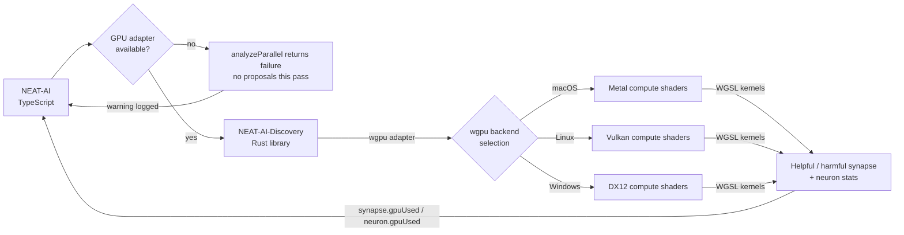

# 🖥️ GPU Acceleration for Discovery

> **TL;DR** — Discovery's synapse/neuron analysis runs **only** on a Graphics
> Processing Unit (GPU), via the cross-platform `wgpu` abstraction. `wgpu`
> selects Metal on macOS, Vulkan on Linux, and DirectX 12 (DX12) on Windows.
> **There is no Central Processing Unit (CPU) fallback for analysis:** on a host
> with no compatible GPU adapter, `analyzeParallel()` returns a failure and
> discovery produces no proposals — evolution itself carries on unaffected. The
> analysis is part of the **Discovery Foreign Function Interface (FFI)** surface
> — see [DISCOVERY_GUIDE.md](./DISCOVERY_GUIDE.md) for the end-to-end workflow.
> Acronyms used here: **GPU** (Graphics Processing Unit), **CPU** (Central
> Processing Unit), **FFI** (Foreign Function Interface), **WGSL** (WebGPU
> Shading Language), **DX12** (Microsoft DirectX 12), **API** (Application
> Programming Interface).

## 🔗 Sibling docs

- **Compute / WASM cluster**:
  [ACTIVATION_FUNCTIONS.md](./ACTIVATION_FUNCTIONS.md) ·
  [BACKPROP_ELASTICITY.md](./BACKPROP_ELASTICITY.md) ·
  [WASM_RESIDENT_TOPOLOGY.md](./WASM_RESIDENT_TOPOLOGY.md).
- **Discovery / FFI cluster**: [DISCOVERY_GUIDE.md](./DISCOVERY_GUIDE.md) ·
  [DISCOVERY_ARCHITECTURE.md](./DISCOVERY_ARCHITECTURE.md) ·
  [DISCOVERY_DIR.md](./DISCOVERY_DIR.md). GPU acceleration is part of the Rust
  Discovery FFI surface — this document explains the compute layer underneath
  those guides.
- [docs/README.md](./README.md) — full topic index.

## 🔍 Overview

The NEAT-AI Discovery Rust library runs its structural analysis on the GPU via
the [`wgpu`](https://wgpu.rs/) crate. The wgpu abstraction layer automatically
selects the best available GPU backend for the current platform:

- **macOS**: Metal
- **Linux**: Vulkan
- **Windows**: DX12

> [!IMPORTANT]
> **A GPU adapter is required for discovery analysis.** The Rust crate
> hard-requires a GPU for synapse/neuron analysis; it has no CPU implementation
> of those kernels. On a host with no compatible adapter, `analyzeParallel()`
> refuses the call with
> `Rust synapse/neuron analysis unavailable (GPU adapter not available)` and
> discovery contributes **no proposals** for that pass. Evolution — mutation,
> breeding, training, scoring — is unaffected and continues normally.

### 🧭 Backend Compatibility Matrix

The table below mirrors the backends advertised by the
[NEAT-AI-Discovery](https://github.com/stSoftwareAU/NEAT-AI-Discovery) README
and the `getGpuBackendInfo()` runtime probe.

| Backend  | Platform                         | Selected by `wgpu` when           | Status                            |
| :------- | :------------------------------- | :-------------------------------- | :-------------------------------- |
| Metal    | macOS (Apple Silicon, Intel)     | Default on macOS                  | ✅ Supported (primary dev target) |
| Vulkan   | Linux (most distros)             | Default on Linux                  | ✅ Supported                      |
| DX12     | Windows 10/11                    | Default on Windows                | ✅ Supported                      |
| Gl       | Cross-platform (OpenGL fallback) | When no native API is usable      | ⚠️ Last-resort fallback           |
| _(none)_ | All                              | No compatible GPU adapter present | ❌ Analysis is skipped, not run   |

> [!NOTE]
> The set of backends is determined entirely by the `wgpu` crate version pinned
> in NEAT-AI-Discovery — there is no platform-specific code in this repository.
> `getGpuBackendInfo()` reports the actual selection at runtime.

<!-- -->

> [!NOTE]
> Backend selection is automatic and requires no platform-specific
> configuration. The `wgpu` abstraction handles it. Use `getGpuBackendInfo()` to
> check which backend was selected — or why none was.

### 🛤️ Discovery → GPU Pipeline



## ⚡ Current GPU Implementation

### ✅ What's Already GPU-Accelerated

1. **Synapse Analysis** - Both helpful and harmful synapse evaluation use GPU
   compute shaders
2. **Neuron Analysis** - The helpful statistics calculation uses GPU, though
   activation function evaluation still runs on CPU

### 🧰 GPU Technology Stack

- **wgpu** - Cross-platform GPU abstraction layer
- **Metal** - Apple's GPU API (selected automatically on macOS)
- **Vulkan** - Cross-platform GPU API (selected automatically on Linux)
- **DX12** - Microsoft's GPU API (selected automatically on Windows)
- **Compute Shaders** - WGSL shaders for parallel processing

### 🌐 Cross-Platform Backend Selection

The wgpu library automatically selects the best available backend. No
platform-specific code and no configuration are needed in the TypeScript layer —
use `getGpuBackendInfo()` to query which backend was selected:

```typescript
import { getGpuBackendInfo } from "@stsoftware/neat-ai";

const info = getGpuBackendInfo();
if (info.available) {
  console.log(`GPU: ${info.backendName} (${info.adapterName})`);
} else {
  console.warn(
    `No GPU adapter (${info.reason}) — discovery analysis is skipped`,
  );
}
```

## 🔎 Verifying GPU Usage

### Method 1: Check Logs

When discovery runs with logging enabled, you'll see messages like:

```
✅ GPU acceleration enabled via Metal (Apple M1 Pro).
Rust synapse analysis using GPU (X helpful, Y harmful candidates)
Rust neuron analysis using GPU (Z candidates)
```

On a host with no adapter you instead get a warning naming the refusal, once per
analysis scope, and that pass yields no candidates:

```
Rust synapse analysis unavailable (Rust synapse/neuron analysis unavailable (GPU adapter not available)) for focus neuron(s): …
Rust neuron analysis unavailable (Rust synapse/neuron analysis unavailable (GPU adapter not available)) for focus neuron(s): …
```

### Method 2: Query Backend Info

`getGpuBackendInfo()` is exported from the package entry point and never throws
— without the Rust library, or without `--allow-ffi`, it reports
`{ available: false, reason }`:

```typescript
import { getGpuBackendInfo, type GpuBackendInfo } from "@stsoftware/neat-ai";

const info: GpuBackendInfo = getGpuBackendInfo();
// info.available: boolean
// info.backendName: "Metal" | "Vulkan" | "Dx12" | "Gl" | undefined
// info.adapterName: e.g. "Apple M1 Pro" | undefined
// info.reason: string (when unavailable) | undefined
```

### Method 3: Check Return Values

`analyzeParallel()` (`RustDiscoveryOperations.ts`) is the analysis entry point.
It reports GPU usage on the **nested** synapse and neuron branches of the
converted result, not at the top level:

```typescript
const converted = convertParallelAnalysisResult(analyzeParallel(input));
console.info(
  `synapse GPU: ${converted.synapse?.gpuUsed}, neuron GPU: ${converted.neuron?.gpuUsed}`,
);
```

Both entry points are internal to
`src/architecture/ErrorGuidedStructuralEvolution/` — library consumers observe
the same outcome through discovery's own logging (Method 1) and the backend
probe (Method 2).

## 📊 Performance Considerations

### ⚡ GPU Utilisation Improvements (2 Jan 2025)

The code now batches multiple GPU operations together to improve utilisation:

- **Batched Evaluation**: Multiple synapse evaluations are collected and
  submitted together in batches of 32
- **Better GPU Saturation**: Instead of submitting one operation at a time and
  waiting, multiple operations are queued before waiting
- **Reduced Idle Time**: GPU spends less time waiting for CPU to prepare the
  next operation

### 🐢 Why It Might Still Be Slow

Even with GPU acceleration, discovery can be CPU-bound due to:

1. **Data I/O** - Reading Parquet files and preparing data for GPU
2. **Neuron Analysis** - Activation function evaluation (GELU, ELU, SELU, etc.)
   still runs on CPU
3. **Memory Transfers** - Copying data between CPU and GPU memory
4. **Small Workloads** - GPU overhead may not be worth it for small datasets

### 🖥️ Current GPU Usage

The implementation uses GPU for:

- ✅ Helpful synapse statistics (batched parallel evaluation)
- ✅ Harmful synapse statistics (parallel evaluation)
- ❌ Neuron activation function evaluation (still CPU-bound)

### 🚀 Future Optimisation Opportunities

- Move activation function evaluation to GPU
- Batch harmful synapse evaluations as well
- Optimise memory transfers with buffer reuse
- Use async GPU execution to overlap CPU/GPU work

## 🔧 Troubleshooting

### ❌ GPU Not Being Used

If the logs report that analysis is unavailable:

1. **Check GPU Drivers**: Ensure Vulkan drivers are installed (Linux) or that
   Metal is supported (macOS)
2. **Check Permissions**: Some systems may require GPU access permissions
3. **Rebuild**: After updating Rust code, rebuild the library:
   ```bash
   cd NEAT-AI-Discovery
   cargo build --release
   ```
4. **Query Backend**: Use `getGpuBackendInfo()` to see the specific reason GPU
   is unavailable

> [!WARNING]
> Discovery analysis does **not** run without a GPU. A GPU-less host is not
> "slower discovery" — it is **no discovery proposals at all**, reported as a
> warning per pass. Provision a GPU, or accept that the discovery phase
> contributes nothing on that host and disable it with `discoverySampleRate: -1`
> to save the recording overhead.

### 🐌 Performance Issues

If GPU is active but still slow:

1. **Check Dataset Size**: GPU benefits increase with larger datasets
2. **Monitor GPU Usage**: Use Activity Monitor (macOS), `nvidia-smi` (Linux), or
   Task Manager (Windows) to verify GPU is being utilised
3. **Check Other Bottlenecks**: Parquet I/O, TypeScript processing, etc.

## ⚙️ Configuration

GPU acceleration has no `NeatOptions` key: backend selection is automatic, and a
GPU adapter is mandatory for analysis either way.

### 🚫 `NEAT_AI_DISCOVERY_GPU` — refusing the GPU on a host

The one switch is an environment variable, read once per process:

| Value                    | Effect                                                    |
| ------------------------ | --------------------------------------------------------- |
| unset / `auto` (default) | Probe the adapter — the historical behaviour.             |
| `on`                     | Same as `auto`; a GPU is never forced into existence.     |
| `off`                    | Skip the probe entirely. No wgpu instance, no GPU device. |

`off` makes `isRustGpuAvailable()` return `false` **before** the library is
loaded, so `analyzeParallel()` refuses every pass and this worker contributes no
discovery proposals. Evolution — mutation, breeding, training and scoring —
continues on the CPU, just slower.

Use it on a host whose driver cannot be trusted with a device. An old Linux
worker in the GRQ fleet probed Vulkan, lost the device mid-run
(`Parent device
is lost`) and killed a 1075-second evolve stage; the value of
probing there was negative (GRQ#4405). The spelling mirrors the native scorer's
`NEAT_SCORER_GPU`, so one host is declared CPU-only the same way for both
engines.

An unrecognised value is reported with a warning and treated as `auto` — a typo
must not quietly leave a host in the state the switch was set to avoid. Set it
in the **host** environment before the process starts, so every child inherits
it, and grant it on any scoped `--allow-env` (a denied read reads as `auto`).

### 🧩 About the internal `requireGpu` field

`requireGpu` is an optional field on `RustParallelAnalysisInput`
(`RustDiscoveryTypes.ts`) — the internal FFI payload. It is **not** user
configuration, and no production code sets it, so the guard in
`analyzeParallel()` is always armed. Two things worth knowing if you meet the
name in the source:

- Leaving it unset (the shipped behaviour) makes `analyzeParallel()` check the
  adapter first and return a graceful failure when there is none. The guard
  exists because the Rust library would otherwise `assert!`-panic the thread
  (Issue #2115).
- Setting it to `false` only bypasses that TypeScript guard. It does **not** buy
  a CPU path: the call reaches Rust, which still has no CPU kernels and returns
  a structured error with `errorKind: "gpu_permanent"` (Issue #2116). That
  snake_case spelling is the wire value — Discovery serialises its
  `DiscoveryErrorKind` enum with `rename_all = "snake_case"`, so the Rust
  variant name `GpuPermanent` never crosses the FFI boundary (Issue #3892). The
  known values are mirrored in `RUST_DISCOVERY_ERROR_KINDS`.

## 🔬 Technical Details

### 💻 GPU Compute Shaders

The GPU uses WGSL compute shaders:

1. **Helpful Synapse Shader** - Evaluates which synapses would help reduce error
2. **Harmful Synapse Shader** - Evaluates which existing synapses are harmful
3. **Activation Shader** - Evaluates neuron activation contributions
4. **ReLU Shader** - Specialised ReLU activation evaluation
5. **Bias Shader** - Evaluates bias adjustments

All use workgroup size of 256 threads for parallel processing.

### 🗂️ Memory Layout

Data is transferred to GPU as:

- `GpuHelpfulSample` - Activation and error pairs
- Results returned as `HelpfulContribution` or `HarmfulContribution`

## 📅 History

- **27 Aug 2026**: `NEAT_AI_DISCOVERY_GPU=off` lets an operator refuse the GPU
  on a host whose driver loses the device mid-run (GRQ#4405). The probe is
  skipped before the library loads, so no wgpu instance is created.
- **9 Aug 2026**: Documented the real behaviour (#3692) — discovery analysis is
  GPU-only, there is no CPU fallback, and `getGpuBackendInfo()` is exported from
  the package entry point so the probe samples above are runnable.
- **18 Mar 2026**: Cross-platform GPU support via wgpu abstraction (#1864).
  Automatic backend selection (Metal/Vulkan/DX12) and backend detection via
  `getGpuBackendInfo()`.
- **2 Jan 2025**: Initial GPU batching improvements for synapse evaluation.
- GPU acceleration is actively maintained as part of the NEAT-AI-Discovery Rust
  module.

---

**Up to:** [`README.md`](../README.md) (entry point) ·
[`docs/README.md`](README.md) (topic index).
