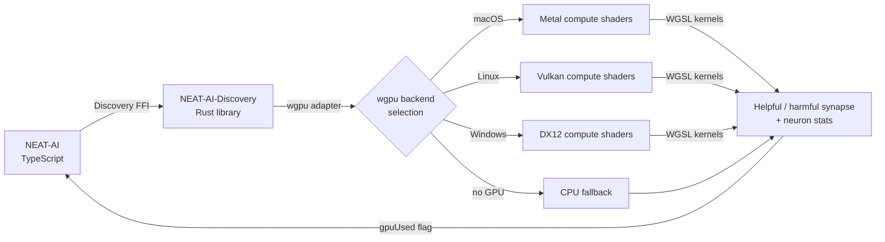

# 🖥️ GPU Acceleration for Discovery

> **TL;DR** — Discovery's heavy synapse/neuron analysis runs on a Graphics
> Processing Unit (GPU) when one is available, via the cross-platform `wgpu`
> abstraction. `wgpu` selects Metal on macOS, Vulkan on Linux, DirectX 12 (DX12)
> on Windows, and falls back to a Central Processing Unit (CPU) path when no
> compatible GPU is found. The acceleration is part of the **Discovery Foreign
> Function Interface (FFI)** surface — see
> [DISCOVERY_GUIDE.md](./DISCOVERY_GUIDE.md) for the end-to-end workflow.
> Acronyms used here: **GPU** (Graphics Processing Unit), **CPU** (Central
> Processing Unit), **FFI** (Foreign Function Interface), **WGSL** (WebGPU
> Shading Language), **DX12** (Microsoft DirectX 12), **API** (Application
> Programming Interface).

### 🔗 Sibling docs

- **Compute / WASM cluster**:
  [ACTIVATION_FUNCTIONS.md](./ACTIVATION_FUNCTIONS.md) ·
  [BACKPROP_ELASTICITY.md](./BACKPROP_ELASTICITY.md) ·
  [WASM_RESIDENT_TOPOLOGY.md](./WASM_RESIDENT_TOPOLOGY.md).
- **Discovery / FFI cluster**: [DISCOVERY_GUIDE.md](./DISCOVERY_GUIDE.md) ·
  [DISCOVERY_ARCHITECTURE.md](./DISCOVERY_ARCHITECTURE.md) ·
  [DISCOVERY_DIR.md](./DISCOVERY_DIR.md). GPU acceleration is part of the Rust
  Discovery FFI surface — this document explains the compute layer underneath
  those guides.
- [docs/README.md](./README.md) — full topic index.

## 🔍 Overview

The NEAT-AI Discovery Rust library supports **cross-platform GPU acceleration**
via the [`wgpu`](https://wgpu.rs/) crate. The wgpu abstraction layer
automatically selects the best available GPU backend for the current platform:

- **macOS**: Metal
- **Linux**: Vulkan
- **Windows**: DX12

When no compatible GPU is detected, discovery gracefully falls back to CPU
computation. GPU accelerates analysis but is not required.

### 🧭 Backend Compatibility Matrix

The table below mirrors the backends advertised by the
[NEAT-AI-Discovery](https://github.com/stSoftwareAU/NEAT-AI-Discovery) README
and the `getGpuBackendInfo()` runtime probe.

| Backend | Platform                         | Selected by `wgpu` when           | Status                            |
| :------ | :------------------------------- | :-------------------------------- | :-------------------------------- |
| Metal   | macOS (Apple Silicon, Intel)     | Default on macOS                  | ✅ Supported (primary dev target) |
| Vulkan  | Linux (most distros)             | Default on Linux                  | ✅ Supported                      |
| DX12    | Windows 10/11                    | Default on Windows                | ✅ Supported                      |
| Gl      | Cross-platform (OpenGL fallback) | When no native API is usable      | ⚠️ Last-resort fallback           |
| CPU     | All                              | No compatible GPU adapter present | ✅ Always available (slower)      |

> [!NOTE]
> The set of backends is determined entirely by the `wgpu` crate version pinned
> in NEAT-AI-Discovery — there is no platform-specific code in this repository.
> `getGpuBackendInfo()` reports the actual selection at runtime.

> [!NOTE]
> GPU acceleration is automatic and requires no platform-specific configuration.
> The `wgpu` abstraction handles backend selection. Use `getGpuBackendInfo()` to
> check which backend was selected.

### 🛤️ Discovery → GPU Pipeline



## ⚡ Current GPU Implementation

### ✅ What's Already GPU-Accelerated

1. **Synapse Analysis** - Both helpful and harmful synapse evaluation use GPU
   compute shaders
2. **Neuron Analysis** - The helpful statistics calculation uses GPU, though
   activation function evaluation still runs on CPU

### 🧰 GPU Technology Stack

- **wgpu** - Cross-platform GPU abstraction layer
- **Metal** - Apple's GPU API (selected automatically on macOS)
- **Vulkan** - Cross-platform GPU API (selected automatically on Linux)
- **DX12** - Microsoft's GPU API (selected automatically on Windows)
- **Compute Shaders** - WGSL shaders for parallel processing

### 🌐 Cross-Platform Backend Selection

The wgpu library automatically selects the best available backend. No
platform-specific code is needed in the TypeScript layer:

```typescript
// GPU is preferred but not required — CPU fallback is automatic
requireGpu: false;
```

Use the `getGpuBackendInfo()` function to query which backend was selected:

```typescript
import { getGpuBackendInfo } from "./RustDiscovery.ts";

const info = getGpuBackendInfo();
if (info.available) {
  console.log(`GPU: ${info.backendName} (${info.adapterName})`);
} else {
  console.log(`CPU fallback: ${info.reason}`);
}
```

## 🔎 Verifying GPU Usage

### Method 1: Check Logs

When discovery runs with logging enabled, you'll see messages like:

```
✅ GPU acceleration enabled via Metal (Apple M1 Pro).
Rust synapse analysis using GPU (X helpful, Y harmful candidates)
Rust neuron analysis using GPU (Z candidates)
```

If you see "CPU fallback" instead, the GPU was not available — discovery still
works, just without GPU acceleration.

### Method 2: Enable Debug Mode

Set the environment variable to see detailed GPU diagnostics:

```bash
export NEAT_AI_DISCOVERY_GPU_DEBUG=1
```

This will print:

- GPU adapter information
- Device initialisation status
- Backend selection details
- Any fallback to CPU

> [!TIP]
> Enable `NEAT_AI_DISCOVERY_GPU_DEBUG=1` during initial setup to confirm that
> the correct GPU backend is being selected. You can disable it once GPU usage
> is verified.

### Method 3: Check Return Values

The Rust analysis functions return a `gpuUsed` boolean field indicating whether
GPU was actually used:

```typescript
const result = analyzeSynapses(input);
if (result.gpuUsed) {
  console.log("GPU acceleration is active!");
} else {
  console.info("Using CPU fallback — discovery still works");
}
```

### Method 4: Query Backend Info

Use `getGpuBackendInfo()` for detailed backend information:

```typescript
const info = getGpuBackendInfo();
// info.available: boolean
// info.backendName: "Metal" | "Vulkan" | "Dx12" | "Gl" | undefined
// info.adapterName: e.g. "Apple M1 Pro" | undefined
// info.reason: string (when unavailable) | undefined
```

## 📊 Performance Considerations

### ⚡ GPU Utilisation Improvements (2 Jan 2025)

The code now batches multiple GPU operations together to improve utilisation:

- **Batched Evaluation**: Multiple synapse evaluations are collected and
  submitted together in batches of 32
- **Better GPU Saturation**: Instead of submitting one operation at a time and
  waiting, multiple operations are queued before waiting
- **Reduced Idle Time**: GPU spends less time waiting for CPU to prepare the
  next operation

### 🐢 Why It Might Still Be Slow

Even with GPU acceleration, discovery can be CPU-bound due to:

1. **Data I/O** - Reading Parquet files and preparing data for GPU
2. **Neuron Analysis** - Activation function evaluation (GELU, ELU, SELU, etc.)
   still runs on CPU
3. **Memory Transfers** - Copying data between CPU and GPU memory
4. **Small Workloads** - GPU overhead may not be worth it for small datasets

### 🖥️ Current GPU Usage

The implementation uses GPU for:

- ✅ Helpful synapse statistics (batched parallel evaluation)
- ✅ Harmful synapse statistics (parallel evaluation)
- ❌ Neuron activation function evaluation (still CPU-bound)

### 🚀 Future Optimisation Opportunities

- Move activation function evaluation to GPU
- Batch harmful synapse evaluations as well
- Optimise memory transfers with buffer reuse
- Use async GPU execution to overlap CPU/GPU work

## 🔧 Troubleshooting

### ❌ GPU Not Being Used

If you see "CPU fallback" in logs:

1. **Check GPU Drivers**: Ensure Vulkan drivers are installed (Linux) or that
   Metal is supported (macOS)
2. **Check Permissions**: Some systems may require GPU access permissions
3. **Rebuild**: After updating Rust code, rebuild the library:
   ```bash
   cd NEAT-AI-Discovery
   cargo build --release
   ```
4. **Query Backend**: Use `getGpuBackendInfo()` to see the specific reason GPU
   is unavailable

> [!NOTE]
> Discovery works without GPU — it just runs slower using CPU computation. GPU
> acceleration is automatic when available but never required.

### 🐌 Performance Issues

If GPU is active but still slow:

1. **Check Dataset Size**: GPU benefits increase with larger datasets
2. **Monitor GPU Usage**: Use Activity Monitor (macOS), `nvidia-smi` (Linux), or
   Task Manager (Windows) to verify GPU is being utilised
3. **Check Other Bottlenecks**: Parquet I/O, TypeScript processing, etc.

## ⚙️ Configuration

### 🔓 CPU Fallback (Default)

GPU acceleration is preferred but not required on all platforms:

```typescript
requireGpu: false; // Uses GPU if available, falls back to CPU otherwise
```

Discovery will use the best available GPU via wgpu's automatic backend
selection, and fall back to CPU when no compatible GPU is present.

### 🔒 Requiring GPU

To force GPU and fail if unavailable (not recommended for cross-platform):

```typescript
requireGpu: true; // Will fail if no GPU is available
```

## 🔬 Technical Details

### 💻 GPU Compute Shaders

The GPU uses WGSL compute shaders:

1. **Helpful Synapse Shader** - Evaluates which synapses would help reduce error
2. **Harmful Synapse Shader** - Evaluates which existing synapses are harmful
3. **Activation Shader** - Evaluates neuron activation contributions
4. **ReLU Shader** - Specialised ReLU activation evaluation
5. **Bias Shader** - Evaluates bias adjustments

All use workgroup size of 256 threads for parallel processing.

### 🗂️ Memory Layout

Data is transferred to GPU as:

- `GpuHelpfulSample` - Activation and error pairs
- Results returned as `HelpfulContribution` or `HarmfulContribution`

## 📅 History

- **18 Mar 2026**: Cross-platform GPU support via wgpu abstraction (#1864).
  Automatic backend selection (Metal/Vulkan/DX12), CPU fallback, and backend
  detection via `getGpuBackendInfo()`.
- **2 Jan 2025**: Initial GPU batching improvements for synapse evaluation.
- GPU acceleration is actively maintained as part of the NEAT-AI-Discovery Rust
  module.
