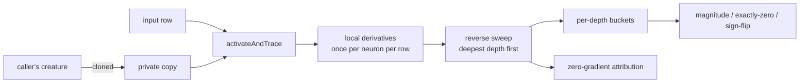

# 📉 Gradient-health probe (per-depth)

> Issue #3972 — how much gradient actually reaches a neuron at depth _d_, and
> which construct killed it when the answer is "none".

## 📌 Why this exists

The second half of the residual-network (ResNet,
[He et al., 2016](https://arxiv.org/abs/1512.03385)) story is the **shattered
gradients** problem ([Balduzzi et al., 2017](https://arxiv.org/abs/1702.08591)):
in a plain feed-forward network, the gradient early layers see degrades toward
noise as depth grows, so the signal that drives learning stops being a guide.
Whether that applies to NEAT-AI is an empirical question about the topologies
evolution actually produces, and it was unmeasured.

The GRQ-lineage creature in `test/data/grq-23-forests-constants.json` is 61 hops
deep, and depths 34–61 hold **exactly one neuron each** — a 28-neuron
single-file tail built from the constructs that return an exactly zero
derivative: `HARD_TANH` outside `(-1, 1)`, the losing branch of a `MINIMUM` /
`MAXIMUM`, the untaken branch of an `IF`. In a run like that there is no second
route, so one zero anywhere along it zeroes every neuron upstream of it for that
sample. The preconditions were all visible; the measurement was not.

Two failure modes look identical from outside — slow, unreliable learning — and
need completely different fixes:

| Measured                                 | Diagnosis             | Fixed by                                                   |
| ---------------------------------------- | --------------------- | ---------------------------------------------------------- |
| Gradient is **exactly zero** at depth    | Topology / activation | Skip connections, depth-aware squash choice (#3973, #3974) |
| Gradient is present but **badly scaled** | No adaptive step size | Adam / momentum (#3916)                                    |

This probe is what separates them.

## 🔬 What it measures

`probeGradientDepth(creature, samples)` in
[`src/propagate/GradientDepthProbe.ts`](../src/propagate/GradientDepthProbe.ts)
returns one bucket per depth, where depth is
[`computeLayerAssignments`](../src/propagate/LayerAssignment.ts)'s longest path
from an input:

| Metric                                                                     | Why                                                                                                                                                                           |
| -------------------------------------------------------------------------- | ----------------------------------------------------------------------------------------------------------------------------------------------------------------------------- |
| `meanAbsGradient`, `medianAbsGradient`, `p95AbsGradient`, `maxAbsGradient` | The vanishing / exploding picture                                                                                                                                             |
| `zeroFraction`                                                             | Exactly-zero measurements — the dominant mechanism here, which a mean magnitude hides completely                                                                              |
| `zeroCauses`                                                               | Attribution **per blocked route**: zero derivative, unselected `MIN`/`MAX` branch, untaken `IF` branch, `IF` condition, zero weight, downstream loss, cancellation, unreached |
| `zeroDerivativeSquashes`                                                   | Which squash returned the zero derivative. `HARD_TANH` outside `(-1, 1)` is saturation; `STEP` and `BIPOLAR` have no slope for any input, a different fault                   |
| `signFlipRate`                                                             | The shattered-gradient signature: a gradient present but reversing every step is noise, not signal                                                                            |
| `serialChainProfile`                                                       | The same measurements pooled across the serial chain, labelled with its depth range; the per-depth rows are in `buckets`                                                      |

The serial chain itself comes from
[`src/propagate/SerialChains.ts`](../src/propagate/SerialChains.ts): a maximal
run of consecutive depth levels holding exactly one neuron each, connected end
to end. Depth 0 is never a member — inputs and constants have nothing upstream
for a lost gradient to matter to.

## ⚙️ How it works



It is a read-only reverse-mode sweep over the forward activations the engine
produced, using the same derivative implementations the engine's backpropagation
uses:

- a scalar squash contributes `squash.derivative(value) * weight`, where
  `value = bias + Σ activation(from) * weight` over **every** inward synapse,
  matching the aggregation `NeuronActivation.makeFunction` compiles. A squash
  that exposes no `derivative()` raises an `ActivationError` rather than being
  recorded as a zero slope;
- `MINIMUM` / `MAXIMUM` route the whole gradient to the winning inward synapse,
  and `RUNNER_UP_LEAK_FRACTION × runnerUpProximity(...)` of it to a loser inside
  the proximity window (Issue #1874) — the constant is exported from
  [`RunnerUpProximity.ts`](../src/methods/activations/aggregate/RunnerUpProximity.ts)
  so the engine and the probe cannot disagree;
- `IF` routes it to the branch the condition sum selected, and nothing to the
  condition synapses, whose threshold has no usable derivative.

## 🔒 Inertness

A diagnostic that changes what it measures is worse than no diagnostic, so the
probe is inert by construction, not by convention:

- the creature is **cloned** before anything runs, so no weight, bias, trace or
  cache belonging to the caller is touched;
- every `createBackPropagationConfig` field that would otherwise draw from the
  global random number generator (RNG) is **pinned**, and `sparseRatio: 1` makes
  neuron selection deterministic — so a probe run cannot shift a later seeded
  training run;
- nothing in the training path calls it, so leaving it off costs nothing.

Both halves are asserted in
[`test/propagate/GradientDepthProbeInert.ts`](../test/propagate/GradientDepthProbeInert.ts):
the profiled creature is byte-identical afterwards, and a seeded training run
produces the same weights with the probe on or off.

## 🤝 Cross-engine agreement

A per-depth profile only means something if the engines agree what depth a
neuron is at. [`test/fixtures/depth/`](../test/fixtures/depth/README.md) is the
language-neutral corpus that freezes NEAT-AI's answer — the per-neuron depths of
six rule cases, and `maxDepth`, the full histogram and the serial chain of the
GRQ creature. NEAT-AI-Backpropagation ports against those bytes; the TypeScript
half runs in the normal `deno test` gate.

## 🏃 Running it

```bash
deno run --allow-read --allow-write --allow-env --allow-ffi \
  scripts/gradientDepthReport.ts \
  --creature test/data/grq-23-forests-constants.json \
  --samples 64 --seed 42 --output docs/evidence/gradient-depth-3972.md
```

`--observations <file>` reads a real corpus — a JSON array of input rows;
`--scale` widens or narrows the synthetic rows for a sensitivity check. Without
a corpus the script synthesises seeded rows and **says so in the report**,
because a profile measured on synthetic observations describes the topology's
response to that distribution and nothing more.

## 📊 What it found

[`docs/evidence/gradient-depth-3972.md`](evidence/gradient-depth-3972.md) has
the full profile. The short version: the shallow control never measured an
exactly-zero gradient and flips sign on 18–28% of consecutive pairs, while the
GRQ creature is exactly zero on 99.8% of measurements at depth 1 and on at least
95% at every depth from 4 to 44. The sign-flip rate is undefined for most of
that range because the gradient is never non-zero twice running — the failure is
**dead, not noisy**. That is the topology mode, not the step-size mode: an
adaptive optimiser multiplying an exactly-zero gradient still gets zero.
