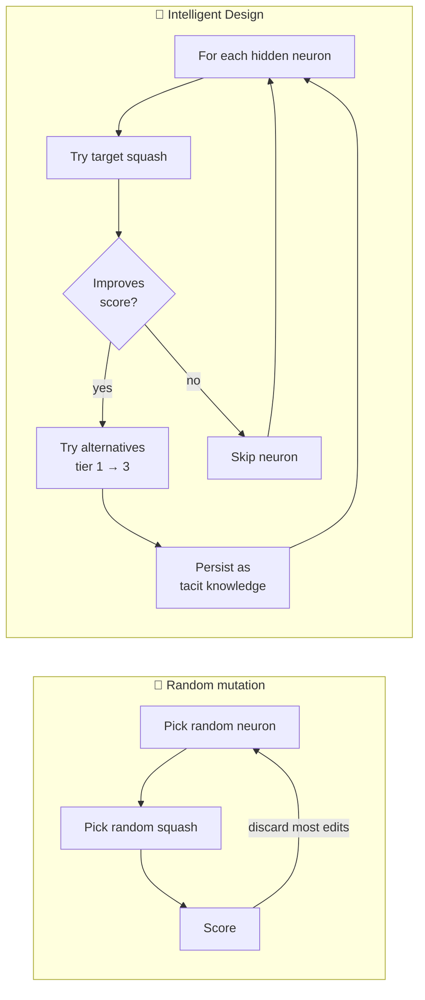
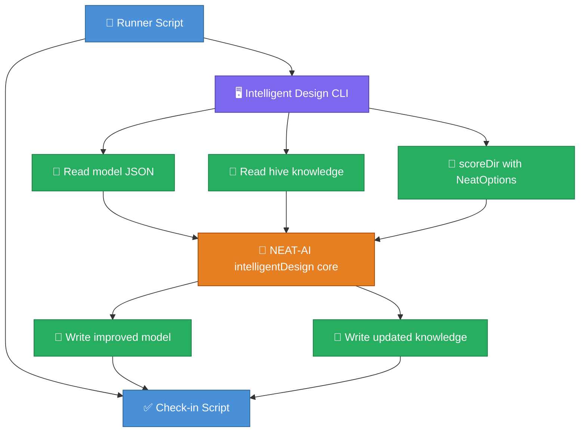

# 🧠 Intelligent Design

> **Intelligent Design** in NEAT-AI is the systematic per-neuron search over
> squash (activation) functions. For each hidden neuron, it tries the candidate
> squash, scores the modified creature, and keeps the substitution if it
> improves fitness. Successful substitutions are persisted as **tacit
> knowledge** so future runs can replay them without re-discovering them. The
> implementation lives in
> [`src/intelligentDesign/`](../src/intelligentDesign/mod.ts); the project-wide
> vocabulary is in [`AGENTS.md`](../AGENTS.md#-terminology) and the doc index is
> [`docs/README.md`](README.md).

<!-- -->

> [!NOTE]
> Intelligent Design is distinct from random mutation — it performs a
> systematic, exhaustive scan of the activation function space and persists its
> discoveries as tacit knowledge for reuse across future runs.

## 🆚 Random search vs Intelligent Design



The random path explores the search space uniformly and rejects most edits.
Intelligent Design walks every hidden neuron once per pass, escalates promising
neurons through the alternative-squash tiers, and writes successful
substitutions to disk so the next run skips re-discovery.

## 📋 Overview

The Intelligent Design workflow consists of two main phases:

1. **Squash Improvement Scan**: For a given target activation function, test
   replacing each hidden neuron's current squash with the target. Record
   improvements and optionally try alternative squashes for neurons that show
   promise.

2. **Tacit Knowledge Application**: Apply previously discovered neuron-to-squash
   mappings ("tacit knowledge") to accelerate future improvement cycles.

## 🔑 Key Concepts

### 💡 Tacit Knowledge

Tacit knowledge is a mapping from neuron UUID to squash function name. When a
squash substitution improves a creature's score, this mapping is stored and can
be reapplied in future runs:

- **Local Knowledge**: Machine-specific knowledge stored locally. Takes
  precedence over hive knowledge.
- **Hive Knowledge**: Shared knowledge across multiple machines, typically
  stored in a version-controlled repository.

> [!TIP]
> Use hive knowledge to share discoveries across a team or a cluster of
> machines. Local knowledge always takes precedence over hive knowledge, so
> per-machine overrides are safe and straightforward.

### 🔀 Alternative Squashes

When a neuron shows improvement with the target squash, Intelligent Design
automatically tries alternative squash functions from a curated list. This
explores the activation function space more thoroughly without requiring
separate scans for each function.

The alternative squashes are organised into tiers:

- **Tier 1 (Core Workhorses)**: GELU, Swish, LeakyReLU, Mish, SELU, ELU, TANH
- **Tier 2 (Complementary)**: LOGISTIC, Softplus, ArcTan, SOFTSIGN, HARD_TANH,
  BENT_IDENTITY
- **Tier 3 (Specialised)**: SINE, Cosine, ABSOLUTE, Cube, ISRU, LogSigmoid,
  GAUSSIAN

### 🛡️ Safe File Writing

To prevent data corruption, all file writes use atomic operations:

1. Write content to a temporary file in the same directory
2. Atomically rename the temporary file to the target path

This ensures that the target file is never in a partial or corrupted state,
which is critical when storing trained models.

## 🚀 Usage

### 🔬 Basic Squash Improvement Scan

```typescript
import {
  combineImprovements,
  safeWriteJson,
  scanForSquashImprovements,
} from "@stsoftware/neat-ai";

const result = await scanForSquashImprovements({
  creature: creatureExport,
  targetSquash: "GELU",
  outputDir: "./creatures",
  dataDir: "./training-data",
  bestScore: currentScore,
  options: {
    customCost: { filePath: "file://./my-cost.ts" },
  },
});

console.log(
  `Found ${result.improved} improvements out of ${result.tested} tested`,
);

if (result.improvements.size > 0) {
  const { creature, message } = combineImprovements(
    creatureExport,
    result.improvements,
    "./training-data",
    currentScore,
  );
  console.log(message);
  await safeWriteJson("./best.json", creature);
}
```

### 📚 Applying Tacit Knowledge

```typescript
import {
  cleanKnowledge,
  combineKnowledge,
  getNeuronsToTest,
  getValidNeuronSquashes,
  makeModifiedCreature,
} from "@stsoftware/neat-ai";

// Load knowledge from files
const localKnowledge = JSON.parse(Deno.readTextFileSync(".cheatSheet.json"));
const hiveKnowledge = JSON.parse(Deno.readTextFileSync("./hive.json"));

// Clean knowledge against current creature
const validNeurons = getValidNeuronSquashes(creatureExport);
const cleaned = cleanKnowledge(validNeurons, localKnowledge, hiveKnowledge);

// Combine with local taking precedence
const combined = combineKnowledge(
  cleaned.localKnowledge,
  cleaned.hiveKnowledge,
);

// Get neurons that could benefit from knowledge application
const neuronsToTest = getNeuronsToTest(creatureExport, combined);
console.log(
  `Found ${neuronsToTest.length} neurons to test from tacit knowledge`,
);
```

### ⚡ Using Workers for Parallel Scoring

```typescript
import { IntelligentDesignWorkerHandler } from "@stsoftware/neat-ai";

const workers = Array.from(
  { length: navigator.hardwareConcurrency || 4 },
  () => new IntelligentDesignWorkerHandler(),
);

// Score in parallel
const promises = neurons.map((neuron, i) => {
  const worker = workers[i % workers.length];
  return worker.score(modifiedCreature, neuron.uuid, dataDir, options);
});

const results = await Promise.all(promises);

// Clean up
workers.forEach((w) => w.terminate());
```

## ⚙️ Configuration Options

### 📊 Squash Improvement Options

| Option            | Type        | Default       | Description                               |
| ----------------- | ----------- | ------------- | ----------------------------------------- |
| `creature`        | Object      | Required      | The creature export to improve            |
| `targetSquash`    | string      | Required      | The squash function to try substituting   |
| `outputDir`       | string      | Required      | Directory to write improved creatures     |
| `dataDir`         | string      | Required      | Directory containing scoring data         |
| `bestScore`       | number      | Required      | Current best score of the creature        |
| `options`         | NeatOptions | `{}`          | NEAT-AI options (can include customCost)  |
| `maxImprovements` | number      | 12            | Stop after finding this many improvements |
| `maxPending`      | number      | Auto          | Maximum pending tasks per worker          |
| `timeoutMs`       | number      | 3600000 (1hr) | Timeout in milliseconds                   |
| `epsilon`         | number      | 1e-8          | Epsilon for score comparison              |
| `onProgress`      | function    | undefined     | Callback for progress updates             |

> [!WARNING]
> The default `timeoutMs` of 3,600,000 ms (1 hour) may not be sufficient for
> large creatures with many hidden neurons. Increase this value when running
> exhaustive scans on complex models to avoid premature termination.

## 🔗 Integration with External Workflows

Intelligent Design is designed to work with external orchestration scripts:

1. **Runner script** prepares training data and invokes the TypeScript CLI
2. **CLI** loads the creature, runs the scan, and writes results
3. **Check-in script** commits improved models to version control

This separation allows the core logic to remain generic while domain-specific
concerns (training data preparation, repository layout) are handled externally.

### 🔄 Data Flow



## ✅ Best Practices

1. **Start with high-tier squashes**: GELU, Swish, and LeakyReLU typically
   produce the best results.

2. **Use hive knowledge for team collaboration**: Store shared knowledge in a
   repository that all machines can access.

3. **Run multiple passes**: Each pass may find improvements that unlock further
   improvements in subsequent passes.

4. **Monitor progress**: Use the `onProgress` callback to track long-running
   scans and detect stalls.

5. **Handle timeouts gracefully**: The scan returns partial results if timed
   out, which can still be valuable.

## 🔗 Related

- [`src/intelligentDesign/`](../src/intelligentDesign/mod.ts) — implementation
  (`ImproveSquash.ts`, `BestNeuronSquash.ts`, `TacitKnowledge.ts`,
  `AlternativeSquashes.ts`, `SafeWrite.ts`, and the worker pool).
- [`docs/ACTIVATION_FUNCTIONS.md`](ACTIVATION_FUNCTIONS.md) — selection guide
  for the 30+ built-in squash functions Intelligent Design searches over.
- [`docs/CRISPR_GUIDE.md`](CRISPR_GUIDE.md) — sibling specialised topic;
  hand-crafted DNA injection that complements the systematic squash search.
- [`README.md`](../README.md) and [`docs/README.md`](README.md) — entry point
  and topic index.
