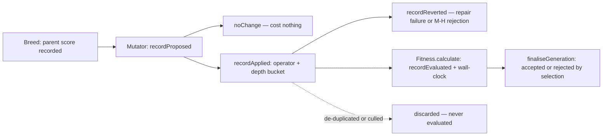

# 📊 Per-operator mutation telemetry (Issue #3971)

`MCMCDiagnostics` — Markov Chain Monte Carlo ([MCMC](GLOSSARY.md#-acronyms))
acceptance diagnostics, Issue #2201 — has always counted mutation acceptance
**in aggregate** — proposed, accepted, rejected, and a rolling rate. That
aggregate cannot answer the question a structural-evolution change has to be
judged against: _is `AddNeuron` rejected more often than `ModWeight`, at what
depth did the rejected change land, and how much evaluation wall-clock went into
offspring that were then thrown away?_

Per-operator mutation telemetry answers exactly those. It is **always on** — it
adds no evaluations, only counters around evaluations already being paid for.

Terms below follow the house vocabulary in the
[canonical glossary](GLOSSARY.md): a **creature** is one candidate neural
network (a genome/phenotype), an **elite** is a top-ranked creature carried into
the next generation unchanged, and **memetic** evolution is the
gradient-refinement pass that runs beside mutation.

## What is recorded, per operator, per generation

| Field                             | Meaning                                                                                                              |
| --------------------------------- | -------------------------------------------------------------------------------------------------------------------- |
| `proposed`                        | Times the operator was invoked.                                                                                      |
| `noChange`                        | Times it reported no change, or produced an identical Universally Unique Identifier ([UUID](GLOSSARY.md#-acronyms)). |
| `applied`                         | Times it actually changed the creature.                                                                              |
| `reverted`                        | Applied changes rolled back before any evaluation (failed repair, or a Metropolis-Hastings rejection).               |
| `mcmcAccepted` / `mcmcRejected`   | M-H decisions covering a batch containing this operator.                                                             |
| `evaluated`                       | Offspring carrying this operator that reached `Fitness.calculate()`.                                                 |
| `accepted` / `rejected`           | Of those, how many survived selection into the next generation.                                                      |
| `evaluationMs`                    | Evaluation wall-clock spent on offspring carrying this operator.                                                     |
| `scoreDelta`                      | `count` / `min` / `median` / `max` of (offspring score − parent score).                                              |
| `deltaUnavailable`                | Evaluated offspring with no usable baseline, so no delta sample.                                                     |
| `depthBuckets`                    | Applied mutations bucketed by the depth of the mutation site.                                                        |
| `soleAttributed` / `coAttributed` | Whether this operator was alone on the offspring, or shared it.                                                      |

The distribution is reported deliberately — **not the mean**. At the 1e-5
margins production runs decide on, a mean over a heavy-tailed delta says
nothing.

## Where it is emitted

Alongside the existing per-generation diagnostics — no new output channel:

- on the `generation_complete` training event as `mutationOperators`;
- on `EvolveResult.mutationOperators`;
- as a `[MutationOps] …` line on the verbose log, beside `[Timing]`,
  `[Utilisation]` and `[Throughput]`.

## Attribution model



Three rules make the numbers honest:

- **Attribution survives breeding, and every operator is credited.** An
  offspring may carry several mutations. Each one is attributed the offspring's
  whole outcome, including its evaluation wall-clock, so the per-operator
  `evaluationMs` can sum past the once-per-offspring `attribution.evaluationMs`.
  The report carries `soleAttributed` / `coAttributed` and a plain-language
  `attribution.note` so a co-attributed operator is never mistaken for one
  credited alone.
- **`noChange` is not `rejected`.** `AddNeuron` logs `"AddNeuron: No change."`
  and returns `false`; that costs nothing. Booking it as a rejection would
  flatter the baseline in the wrong direction.
- **Offspring that never reached evaluation are excluded.** A creature the
  `DeDuplicator` replaced never reaches `Fitness.calculate()`, so it appears in
  neither `evaluated` nor `evaluationMs`; after a generation of slack it is
  reported under `attribution.discardedOffspring`.

## Score-delta baseline

The delta is measured against the **parent** score: `ParallelBreeding` records
the ranked parent's score for each offspring it produces
(`lastParentBaselines`), and the tracker reads it when the mutation lands. A
creature that already carries a score of its own (an elite being re-mutated) is
measured against that instead. The score is captured **at evaluation time**,
because an offspring dropped from the population is disposed — which clears its
score — before the generation ends, and a rejected structural mutation is
precisely the delta worth measuring. When no baseline exists (the seed
population's first mutations, for example) the offspring is counted in
`deltaUnavailable` rather than given a guessed delta.

## Reconciliation with `MCMCDiagnostics`

`report.mcmc` counts M-H **decisions**, not operators, so it reconciles exactly
with `MCMCDiagnostics.getGenerationStats()`:

```typescript
assertEquals(report.mcmc.proposed, aggregate.proposedCount);
assertEquals(report.mcmc.accepted, aggregate.acceptedCount);
assertEquals(report.mcmc.rejected, aggregate.rejectedCount);
```

A discrepancy means attribution is dropping or double-counting decisions. The
per-operator `mcmcAccepted` / `mcmcRejected` credit every operator in the batch,
so they sum to a multiple of the aggregate — never to a smaller number.

## Cost

Every hook is a counter or one map write **per mutation**, never per synapse.
The single non-constant call is the depth bucket, which walks the topology via
`computeLayerBucket` — so it is computed for **structural** mutations only.
Weight and bias mutations, the overwhelming majority, report the `unknown`
bucket and never trigger the walk.

## Related

- [`src/NEAT/MutationOperatorTelemetry.ts`](../src/NEAT/MutationOperatorTelemetry.ts)
  — the tracker.
- [`src/NEAT/MutationOperatorReport.ts`](../src/NEAT/MutationOperatorReport.ts)
  — the report shapes carried on the training event.
- [`src/NEAT/MCMCDiagnostics.ts`](../src/NEAT/MCMCDiagnostics.ts) — the
  aggregate acceptance tracking this extends.
- [`src/NEAT/SquashEffectivenessTracker.ts`](../src/NEAT/SquashEffectivenessTracker.ts)
  — the per-role fitness-delta EMA that shares the same layer bucketing.
