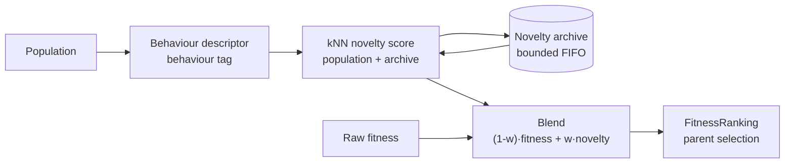

# Novelty (Behavioural-Diversity) Selection

> Issue #2932 — escape deceptive landscapes by rewarding behavioural novelty.

On **deceptive** problems, pure-fitness selection drives the population into a
local optimum where fitness stops improving and the effective pace of evolution
collapses. **Novelty search**
([Lehman & Stanley, 2011](https://doi.org/10.1162/EVCO_a_00025)) rewards
behavioural diversity rather than — or blended with — raw fitness, and is a
well-established accelerant for escaping deception.

NEAT-AI's existing diversity mechanisms (speciation, fitness sharing,
compatibility gating) maintain **structural** diversity only. Novelty selection
adds **behavioural** diversity: it compares what creatures _do_, not how they
are wired.

The mechanism is **OFF by default**. When disabled, ranking and selection are
exactly as before.

## How it works

1. **Behaviour descriptor** — a numeric vector describing a creature's
   behaviour, supplied by the problem's fitness function as a comma-separated
   `behaviour` tag (for example, the creature's output vector on a fixed probe
   set). Creatures without a parseable descriptor contribute no novelty.
2. **Novelty score** — the mean Euclidean distance from a creature's descriptor
   to its `k` nearest neighbours, drawn from both the current population and a
   bounded **archive** of past behaviours. A creature that behaves unlike
   everything seen so far scores high.
3. **Bounded archive** — novel behaviours are retained (first-in, first-out once
   `archiveLimit` is reached) so the population is pushed away from regions
   already explored, not just away from the current generation.
4. **Blend** — ranking uses `score' = (1 - weight)·fitness + weight·novelty`,
   with fitness and novelty min-max normalised first so their scales do not
   dominate each other.



## Configuration

```ts
const neat = new Neat(input, output, fitness, {
  novelty: {
    enabled: true, // OFF by default
    weight: 0.5, // blend weight w in [0,1] (0 = pure fitness)
    neighbours: 15, // k nearest neighbours for the novelty score
    archiveLimit: 500, // maximum behaviours retained in the archive
    addThreshold: 0, // minimum novelty to admit a behaviour to the archive
    behaviourTag: "behaviour", // tag holding the descriptor
  },
});
```

| Option         | Default       | Meaning                                                     |
| -------------- | ------------- | ----------------------------------------------------------- |
| `enabled`      | `false`       | Master switch. OFF leaves ranking unchanged.                |
| `weight`       | `0.5`         | Blend weight `w`; `0` is pure fitness, `1` is pure novelty. |
| `neighbours`   | `15`          | `k` for the k-nearest-neighbour novelty score.              |
| `archiveLimit` | `500`         | Archive cap; oldest behaviours are evicted first.           |
| `addThreshold` | `0`           | Minimum novelty before a behaviour is archived.             |
| `behaviourTag` | `"behaviour"` | Creature tag holding the descriptor.                        |

## Supplying behaviour descriptors

The fitness function tags each creature with its behaviour descriptor — a
comma-separated list of finite numbers:

```ts
import { addTag } from "@stsoftware/tags/mod";

// e.g. the creature's outputs on a fixed probe set
addTag(creature, "behaviour", probeOutputs.join(","));
```

When fewer than two creatures expose a parseable descriptor there is nothing
meaningful to compare, so ranking is left untouched — novelty is safe to enable
even before descriptors are wired up.

## Evidence

A deterministic deceptive-landscape benchmark
([`bench/NoveltyDeceptiveEscape.ts`](../bench/NoveltyDeceptiveEscape.ts)) starts
the population inside a deceptive basin (fitness cap `0.8`) with the global
optimum (`1.0`) on the far side of a fitness valley. Pure-fitness selection is
trapped; novelty selection escapes in a handful of generations:

| seed  | fitness-only         | with novelty    |
| ----- | -------------------- | --------------- |
| 12345 | trapped (best 0.800) | solved @ gen 8  |
| 222   | trapped (best 0.800) | solved @ gen 9  |
| 9001  | trapped (best 0.800) | solved @ gen 8  |
| 4242  | trapped (best 0.800) | solved @ gen 11 |
| 77777 | trapped (best 0.800) | solved @ gen 5  |

The acceptance test
[`test/NEAT/NoveltySearchDeceptive.ts`](../test/NEAT/NoveltySearchDeceptive.ts)
asserts novelty escapes the trap in strictly fewer generations than
fitness-only.
