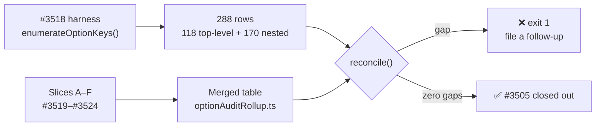

# Option audit — consolidated result (#3505 roll-up)

Final roll-up of the
[#3505](https://github.com/stSoftwareAU/NEAT-AI/issues/3505) option-removal
audit (Issue #3525). It merges the six slice classification tables into one,
reconciles them against the #3518 key inventory, resolves the cross-slice
overlaps, and sequences the removal issues.

Per-key evidence stays in the slice write-ups — this document does not restate
it:

| Slice | Scope                                                                  | Write-up                                             | Issue |
| ----- | ---------------------------------------------------------------------- | ---------------------------------------------------- | ----- |
| A     | Core evolution & training top-level options                            | [`OPTION_AUDIT_SLICE_A.md`](OPTION_AUDIT_SLICE_A.md) | #3519 |
| B     | `discovery*` top-level options                                         | [`OPTION_AUDIT_SLICE_B.md`](OPTION_AUDIT_SLICE_B.md) | #3520 |
| C     | Population & selection nested configs                                  | [`OPTION_AUDIT_SLICE_C.md`](OPTION_AUDIT_SLICE_C.md) | #3521 |
| D     | Training, regularisation & data-shaping nested configs                 | [`OPTION_AUDIT_SLICE_D.md`](OPTION_AUDIT_SLICE_D.md) | #3522 |
| E     | Runtime & infrastructure configs and injection points                  | [`OPTION_AUDIT_SLICE_E.md`](OPTION_AUDIT_SLICE_E.md) | #3523 |
| F     | Experimental configs (MCMC, hyperparameter evolution, OPD, specialist) | [`OPTION_AUDIT_SLICE_F.md`](OPTION_AUDIT_SLICE_F.md) | #3524 |

## Headline

**288 classifications, zero unclassified keys, 15 issues, zero duplicates.** Of
the 288 rows, **68 are `IN USE`**, **121 are `KEEP (load-bearing default)`** and
**99 `QUALIFY`** — but that last number is dominated by the nested fields of
four experimental configs and badly overstates the removable surface.

Counted by _option_ rather than by row, **20 of 120 qualify**, and only 10 of
those are proposed for outright removal:

| Outcome                                  | Options | Issues                                                        |
| ---------------------------------------- | ------: | ------------------------------------------------------------- |
| Removal proposed                         |      10 | #3552, #3553, #3554, #3556, #3558, #3562, #3566, #3568, #3569 |
| **Decision** recommending KEEP           |       7 | #3559, #3560, #3563, #3565, #3570                             |
| Already decided `NOT_PLANNED` by a human |       3 | #1943 (commented, not re-filed)                               |

That is the audit's real result, and it is close to the "few options qualify"
outcome the brief called a legitimate finding. `KEEP` outnumbers `IN USE` almost
two to one: the **defaults**, not the consumers, drive most of NEAT-AI's
behaviour, which is exactly why "no consumer sets it" was never sufficient
grounds for removal.



## Coverage check — mechanical, not by eye

The brief required the coverage check to be a diff against the harness, not a
reading of the six slice comments. It is
[`scripts/option-audit-rollup.ts`](../scripts/option-audit-rollup.ts), backed by
the merged table in
[`scripts/lib/optionAuditRollup.ts`](../scripts/lib/optionAuditRollup.ts) and
run on every CI build by
[`test/scripts/OptionAuditRollup.ts`](../test/scripts/OptionAuditRollup.ts):

```bash
deno run --allow-read scripts/option-audit-rollup.ts
# 🔎 288 enumerated rows (118 top-level, 170 nested) · 288 classified
# ✅ zero coverage gaps — every option key is classified
```

A key the harness enumerates but the table does not classify exits **1** and
names the gap. It cannot be mistaken for a clean audit, and the roll-up may not
close #3505 while one exists.

### The one gap it found: `mutation`

At audit close `NeatArguments` had **119** top-level fields, not the 118 quoted
in #3518 and #3525. The original figure came from a grep that skipped
`readonly mutation: readonly MutationInterface[]`; the parser-backed harness saw
the real 119, and its CI test pins that number. Every slice brief was written
from the 118-key list, so **no slice classified `mutation`**. (The pinned count
is **118** again today — a different 118: #3556 removed
`discoveryReplayDiagnostics`. See [Executed removals](#executed-removals).)

This roll-up classified it with the slice method — `git grep`, exit code
checked, both controls run first (`populationSize` 390 hits, `dnaSharingMode`
0):

**`mutation` is `IN USE`.** GRQ sets it in four `NeatOptions` literals —
`src/exchange/EvolveApp.ts:418`, `src/fx/EvolveApp.ts:365`,
`src/industry/EvolveApp.ts:415` and `src/location/EvolveApp.ts:471` — from its
`--mutation=ALL|FFW` operator flag. No removal issue is needed and no follow-up
is filed, because the gap closed as a live option rather than a missed
candidate.

### Executed removals

A removal issue that lands takes its key out of `NeatArguments`, so the harness
stops enumerating it and its roll-up entry must go with it — a retained entry is
reported as an orphan (`reconcile()` lists keys the source no longer has) and
fails `test/scripts/OptionAuditRollup.ts`. The counts in this document therefore
shrink as the campaign proceeds.

| Issue | Key                          | Slice | Landed                                                     |
| ----- | ---------------------------- | ----- | ---------------------------------------------------------- |
| #3556 | `discoveryReplayDiagnostics` | B     | Timing instrumentation and its `diagnostics` payload gone. |

### `fitnessSampleRate` and `seed`

`fitnessSampleRate` is the audit's one legitimate exclusion — removed by #3502
before the audit began, and absent from the current source, so the harness does
not enumerate it.

`seed` is a second, previously unrecorded exclusion. Slice E flagged it as
missing from slice A's table, but it is **not a `NeatArguments` field at all**:
it is input-only on `NeatOptions`, resolved at `NeatConfig.ts:208-217` into
`rng`, which _is_ enumerated and classified `KEEP`. Slice E verified `seed` as
`KEEP` on its own evidence, so the pair is settled either way.

### Reconciling the counts with the slice comments

The roll-up counts one classification per row the harness enumerates. The slices
counted "parent keys + fields" under slightly different conventions, so the
per-slice totals shift:

| Slice     | Slice comment | Roll-up | Why                                                                                                                                               |
| --------- | ------------: | ------: | ------------------------------------------------------------------------------------------------------------------------------------------------- |
| A         |            46 |      46 | —                                                                                                                                                 |
| B         |            36 |      42 | B classified its 3 nested configs at parent level; the harness enumerates `DiscoveryCacheConfig` (4) + `DiskSpaceConfig` (3) fields individually. |
| C         |            59 |      56 | `adaptiveMutationThresholds` is declared inline in `NeatArguments`, so its 3 fields are not separate nested rows.                                 |
| D         |            69 |      63 | Same for `plateauDetection`'s 6 inline fields.                                                                                                    |
| E         |            33 |      37 | `RustScorerConfig` has no `NeatOptions` key (−1 parent row) but two interfaces, so `RequiredRustScorerConfig`'s 5 fields are enumerated too (+5). |
| F         |            43 |      43 | —                                                                                                                                                 |
| roll-up   |             — |       1 | `mutation`.                                                                                                                                       |
| **Total** |       **286** | **288** |                                                                                                                                                   |

No slice lost a key in the merge; the deltas are all enumeration conventions.

## Merged classification table

One row per option key, plus a row for every nested field whose verdict differs
from its parent's. Nested fields not listed inherit their parent's verdict — a
field can only reach `NeatOptions` through its parent object, so it cannot be
set independently. Generated by
`deno run --allow-read scripts/option-audit-rollup.ts`.

| Verdict     | Classifications |
| ----------- | --------------: |
| `QUALIFIES` |              99 |
| `KEEP`      |             121 |
| `IN USE`    |              68 |
| **Total**   |         **288** |

| Key                                           | Slice   | Verdict     | Issue | Note                                                                                      |
| --------------------------------------------- | ------- | ----------- | ----- | ----------------------------------------------------------------------------------------- |
| `costName`                                    | A       | `IN USE`    | —     |                                                                                           |
| `creativeThinkingConnectionCount`             | A       | `IN USE`    | —     |                                                                                           |
| `creatureStore`                               | E       | `IN USE`    | —     |                                                                                           |
| `dataSetPartitionBreak`                       | A       | `KEEP`      | —     |                                                                                           |
| `debug`                                       | A       | `KEEP`      | —     |                                                                                           |
| `experimentStore`                             | E       | `IN USE`    | —     |                                                                                           |
| `creatures`                                   | A       | `IN USE`    | —     |                                                                                           |
| `CRISPRs`                                     | A       | `IN USE`    | —     |                                                                                           |
| `maxCRISPRsPerGeneration`                     | A       | `KEEP`      | —     |                                                                                           |
| `customCost`                                  | A       | `IN USE`    | —     |                                                                                           |
| `feedbackLoop`                                | A       | `IN USE`    | —     |                                                                                           |
| `focusList`                                   | A       | `IN USE`    | —     |                                                                                           |
| `focusRate`                                   | A       | `IN USE`    | —     |                                                                                           |
| `costOfGrowth`                                | A       | `IN USE`    | —     |                                                                                           |
| `elitism`                                     | A       | `IN USE`    | —     |                                                                                           |
| `maxDedupRetries`                             | A       | `KEEP`      | —     |                                                                                           |
| `timeoutMinutes`                              | A       | `IN USE`    | —     |                                                                                           |
| `trainPerGen`                                 | A       | `IN USE`    | —     |                                                                                           |
| `trainingTaskTimeoutMinutes`                  | A       | `KEEP`      | —     |                                                                                           |
| `maxConns`                                    | A       | `QUALIFIES` | #3552 |                                                                                           |
| `maximumNumberOfNodes`                        | A       | `QUALIFIES` | #3552 |                                                                                           |
| `mutationAmount`                              | A       | `IN USE`    | —     |                                                                                           |
| `mutationRate`                                | A       | `IN USE`    | —     |                                                                                           |
| `populationSize`                              | A       | `IN USE`    | —     |                                                                                           |
| `threads`                                     | A       | `IN USE`    | —     |                                                                                           |
| `heavyTaskWorkerCount`                        | A       | `IN USE`    | —     |                                                                                           |
| `selection`                                   | A       | `IN USE`    | —     |                                                                                           |
| `mutation`                                    | roll-up | `IN USE`    | —     | Gap found by this roll-up. GRQ `src/{exchange,fx,industry,location}/EvolveApp.ts` set it. |
| `iterations`                                  | A       | `IN USE`    | —     |                                                                                           |
| `verbose`                                     | A       | `IN USE`    | —     |                                                                                           |
| `enableRepetitiveTraining`                    | A       | `QUALIFIES` | #3553 |                                                                                           |
| `skipTrainingAfterConsecutiveRegressions`     | A       | `KEEP`      | —     |                                                                                           |
| `subnetworkIndexSize`                         | A       | `KEEP`      | —     |                                                                                           |
| `trainingBatchSize`                           | A       | `KEEP`      | —     |                                                                                           |
| `log`                                         | A       | `IN USE`    | —     |                                                                                           |
| `traceStore`                                  | E       | `IN USE`    | —     |                                                                                           |
| `disableRandomSamples`                        | A       | `KEEP`      | —     |                                                                                           |
| `trainingSampleRate`                          | A       | `IN USE`    | —     |                                                                                           |
| `targetError`                                 | A       | `IN USE`    | —     |                                                                                           |
| `maximumBiasAdjustmentScale`                  | A       | `KEEP`      | —     |                                                                                           |
| `maximumWeightAdjustmentScale`                | A       | `KEEP`      | —     |                                                                                           |
| `sparseRatio`                                 | A       | `IN USE`    | —     |                                                                                           |
| `globalBreedingRate`                          | A       | `KEEP`      | —     |                                                                                           |
| `diversityBreedingRate`                       | A       | `KEEP`      | —     |                                                                                           |
| `geneticCompatibilityThreshold`               | A       | `KEEP`      | —     |                                                                                           |
| `interSpeciesCrossoverThreshold`              | A       | `KEEP`      | —     |                                                                                           |
| `syntheticAlignmentThreshold`                 | A       | `KEEP`      | —     |                                                                                           |
| `discoverySampleRate`                         | B       | `IN USE`    | —     |                                                                                           |
| `discoveryRecordTimeOutMinutes`               | B       | `IN USE`    | —     |                                                                                           |
| `discoveryMinRecordCoverage`                  | B       | `KEEP`      | —     |                                                                                           |
| `discoveryAnalysisTimeoutMinutes`             | B       | `IN USE`    | —     |                                                                                           |
| `discoveryHardDeadlineTS`                     | B       | `KEEP`      | —     |                                                                                           |
| `discoveryBatchSize`                          | B       | `IN USE`    | —     |                                                                                           |
| `discoveryBufferSize`                         | B       | `IN USE`    | —     |                                                                                           |
| `discoveryRustFlushRecords`                   | B       | `IN USE`    | —     |                                                                                           |
| `discoveryRustFlushBytes`                     | B       | `KEEP`      | —     |                                                                                           |
| `discoveryMaxNeurons`                         | B       | `IN USE`    | —     |                                                                                           |
| `discoveryAnalysisChunkSize`                  | B       | `KEEP`      | —     |                                                                                           |
| `discoveryAnalysisPerChunkMaxMs`              | B       | `KEEP`      | —     |                                                                                           |
| `discoveryDrainEveryNBatches`                 | B       | `IN USE`    | —     |                                                                                           |
| `discoveryFocusNeuronUUIDs`                   | B       | `IN USE`    | —     |                                                                                           |
| `discoveryDisableEvaluationSummaryLogging`    | B       | `IN USE`    | —     |                                                                                           |
| `checkpointEveryGeneration`                   | B       | `IN USE`    | —     |                                                                                           |
| `discoveryDisableCleanup`                     | B       | `IN USE`    | —     |                                                                                           |
| `discoveryBaseDirectory`                      | B       | `IN USE`    | —     |                                                                                           |
| `discoverySkipRecordPhase`                    | B       | `IN USE`    | —     |                                                                                           |
| `discoveryCacheDir`                           | B       | `IN USE`    | —     |                                                                                           |
| `discoveryFailureCacheDir`                    | B       | `IN USE`    | —     |                                                                                           |
| `discoverySuccessCacheDir`                    | B       | `IN USE`    | —     |                                                                                           |
| `discoveryFailureCacheBypassOnDrought`        | B       | `KEEP`      | —     |                                                                                           |
| `discoveryReplayMaxSingles`                   | B       | `KEEP`      | —     |                                                                                           |
| `discoveryReplayMaxPairwise`                  | B       | `KEEP`      | —     |                                                                                           |
| `discoveryReplayMaxTriples`                   | B       | `KEEP`      | —     |                                                                                           |
| `discoveryReplayVerifyScores`                 | B       | `IN USE`    | —     |                                                                                           |
| `discoveryReplayConcurrency`                  | B       | `KEEP`      | —     |                                                                                           |
| `discoveryReplayRescoreBaseline`              | B       | `IN USE`    | —     |                                                                                           |
| `discoveryReplayTimeoutMinutes`               | B       | `KEEP`      | —     |                                                                                           |
| `discoveryReplayMinTimeMinutes`               | B       | `KEEP`      | —     |                                                                                           |
| `discoveryMinCandidatesPerCategory`           | B       | `KEEP`      | —     |                                                                                           |
| `adaptiveMutationThresholds`                  | C       | `KEEP`      | —     |                                                                                           |
| `plateauDetection`                            | D       | `KEEP`      | —     | Borderline: flag defaults false, but three exported presets turn it on.                   |
| `stabilityAdaptation`                         | D       | `QUALIFIES` | #3562 | No implementation exists — parsed, never read.                                            |
| `weightRegularisation`                        | D       | `KEEP`      | —     |                                                                                           |
| `biasRegularisation`                          | D       | `KEEP`      | —     |                                                                                           |
| `ensembleDiversity`                           | C       | `QUALIFIES` | #3558 | No implementation exists — parsed, never read.                                            |
| `quantumStep`                                 | D       | `KEEP`      | —     |                                                                                           |
| `fineTunePopulation`                          | C       | `KEEP`      | —     |                                                                                           |
| `predictiveCoding`                            | D       | `IN USE`    | —     | GRQ sets only `.enabled`; the other four defaults then drive inference.                   |
| `wasmCache`                                   | E       | `KEEP`      | —     | GRQ's 50 `wasmCache` hits are its own unrelated cap — a false IN USE.                     |
| `discoveryCache`                              | B       | `KEEP`      | —     |                                                                                           |
| `discoveryDiskSpace`                          | B       | `KEEP`      | —     |                                                                                           |
| `memory`                                      | E       | `IN USE`    | —     | GRQ sets `enabled` + `nativeBudgetBytes`; seven defaults are live.                        |
| `workerThreadCap`                             | E       | `IN USE`    | —     | Env-only (DISCOVERY_*_MB) — zero camelCase hits, still load-bearing.                      |
| `logger`                                      | E       | `KEEP`      | —     | Kept on the resolution path, not the injection.                                           |
| `rng`                                         | E       | `KEEP`      | —     | Checked as a pair with input-only `seed`; both stay.                                      |
| `outputRanges`                                | D       | `IN USE`    | —     |                                                                                           |
| `onTrainingEvent`                             | E       | `IN USE`    | —     |                                                                                           |
| `hyperparameterEvolution`                     | F       | `QUALIFIES` | #3569 |                                                                                           |
| `adaptivePopulation`                          | C       | `KEEP`      | —     | Borderline: flag defaults false, but FAST_CONVERGENCE_PRESET turns it on.                 |
| `crossValidation`                             | D       | `QUALIFIES` | #1943 | Commented on the existing #1943 rather than filing a duplicate.                           |
| `dataFuzzing`                                 | D       | `QUALIFIES` | #1943 | Commented on the existing #1943 rather than filing a duplicate.                           |
| `dataQuantisation`                            | D       | `QUALIFIES` | #1943 | Commented on the existing #1943 rather than filing a duplicate.                           |
| `maxConcurrentDiscoveries`                    | B       | `KEEP`      | —     |                                                                                           |
| `allowPoolBorrowing`                          | A       | `KEEP`      | —     |                                                                                           |
| `mcmc`                                        | F       | `QUALIFIES` | #3570 | Decision — GRQ's evolution-mode sweep declares intent but never wires it.                 |
| `opd`                                         | F       | `QUALIFIES` | #3570 | Decision — filed jointly with `mcmc`.                                                     |
| `specialist`                                  | F       | `QUALIFIES` | #3568 | Option surface is unreadable at any value.                                                |
| `parallelEvaluation`                          | E       | `KEEP`      | —     |                                                                                           |
| `squashEffectiveness`                         | D       | `KEEP`      | —     |                                                                                           |
| `squashBudget`                                | D       | `QUALIFIES` | #3563 | Decision, audit recommends KEEP — live lever, adoption is a GRQ task.                     |
| `fitnessSharing`                              | C       | `KEEP`      | —     |                                                                                           |
| `novelty`                                     | C       | `QUALIFIES` | #3559 | Decision, audit recommends KEEP — implemented and documented.                             |
| `randomImmigrants`                            | C       | `QUALIFIES` | #3560 | Decision, audit recommends KEEP — implemented and documented.                             |
| `speciesStagnation`                           | C       | `KEEP`      | —     |                                                                                           |
| `compatibilityGating`                         | C       | `KEEP`      | —     |                                                                                           |
| `selectionPressure`                           | C       | `KEEP`      | —     |                                                                                           |
| `tolerateCorruptParents`                      | A       | `KEEP`      | —     |                                                                                           |
| `dnaSharingMode`                              | A       | `QUALIFIES` | #3554 | Slice F confirmed `DnaSharingPreset.ts` is covered here and filed nothing.                |
| `memory.enabled`                              | E       | `IN USE`    | —     |                                                                                           |
| `memory.proactiveGc`                          | E       | `QUALIFIES` | #3565 |                                                                                           |
| `memory.nativeBudgetBytes`                    | E       | `IN USE`    | —     |                                                                                           |
| `memory.maxAnalysisMemoryMb`                  | E       | `QUALIFIES` | #3565 |                                                                                           |
| `parallelEvaluation.maxConcurrentEvaluations` | E       | `QUALIFIES` | #3566 |                                                                                           |
| `predictiveCoding.enabled`                    | D       | `IN USE`    | —     |                                                                                           |
| `RustScorerConfig.env`                        | E       | `KEEP`      | —     |                                                                                           |
| `RustScorerConfig`                            | E       | `IN USE`    | —     | No NeatOptions key — resolved from NEAT_AI_RUST_SCORER_* env.                             |

## Deduplication

### Across slices

Three option keys span a slice boundary and could have drawn two removal issues
each. None did — every one resolves to a single issue, verified by
`gh issue list --search "<key> in:title" --state all` per key and by the
`no option key is claimed by two removal issues` test.

| Overlap                                 | Slices | Resolution                                                                                                            |
| --------------------------------------- | ------ | --------------------------------------------------------------------------------------------------------------------- |
| `dnaSharingMode` / `DnaSharingPreset`   | A ↔ F  | Slice A filed **#3554**; slice F recorded the overlap and filed nothing. One issue.                                   |
| `seed` / `rng`                          | A ↔ E  | Neither qualifies, so no issue exists to duplicate. `rng` is `KEEP` (slice E); `seed` is not a `NeatArguments` field. |
| `discoveryCache` / `discoveryDiskSpace` | B ↔ E  | Both are `KEEP` on slice B's evidence; slice E did not reclassify them. No issue exists.                              |

Two further cross-slice mentions were checked and are not duplicates:
`stabilityAdaptation` and `squashBudget` appear in slice E's and F's prose only
as "unrelated slice-D findings", and `ensembleDiversity` appears in slice D's
prose only as the precedent for #3562.

### Against the adjacent campaigns

Both campaigns were re-checked at roll-up time, after the slices ran:

- **#3446–#3449 (deprecated-api)** — all four still **open**, and all four
  concern `HYPOT` / `HYPOTv2` / `MEAN` activations and `focusNeuronErrorShares`.
  None of those is an option key in the harness inventory, so no overlap exists.
- **#3509–#3512 (dead-code sweep)** — all four now **closed**. Orphan barrels,
  superseded modules, redundant exports and two unused WASM constants; no option
  key among them. #3511's redundant-export list names `ImmigrantInjectionResult`
  but deliberately excludes it, and that is the `export` keyword rather than the
  `randomImmigrants` option — recorded on #3560, not treated as absorbing.
- **#1942 / #1943** — both closed `NOT_PLANNED`. #1943's premise is unchanged,
  so slice D **commented there** instead of filing a duplicate. #1942's premise
  has gone stale (its `adaptivePopulation` claim is false today), so #3558 and
  #3562 supersede its still-valid thirds and cross-reference it.

All 14 new issues are open and unique: no option key maps to two of them.

## Removal ordering

Every removal deletes from `src/config/NeatConfig.ts`, `NeatArguments.ts` and
`NeatOptions.ts`, so **all 14 conflict there by construction**. That is a
trivial rebase. The orderings below are the ones where two PRs would edit the
same non-config code or the same documentation block, and those should be
sequenced rather than merged in parallel.

```mermaid
flowchart TD
    subgraph P["src/presets/Presets.ts + docs/troubleshooting/TRAINING.md"]
        direction LR
        I3558["#3558 ensembleDiversity"] --> I3562["#3562 stabilityAdaptation"]
    end
    subgraph M["src/NEAT/Mutator.ts + src/breed/Breed.ts + ParallelBreeding.ts"]
        direction LR
        I3552["#3552 maxConns"] --> I3559["#3559 novelty"] --> I3569["#3569 hyperparamEvolution"] --> I3570["#3570 mcmc + opd"]
    end
    subgraph N["src/NEAT/Neat.ts + NeatEvolution.ts + NeatConfigValidation.ts"]
        direction LR
        I3559b["#3559 novelty"] --> I3560["#3560 randomImmigrants"] --> I3570b["#3570 mcmc + opd"]
    end
    subgraph R["src/config/parsers/RuntimeParsers.ts"]
        direction LR
        I3565["#3565 memory brakes"] --> I3566["#3566 maxConcurrentEvaluations"]
    end
```



| Order | Chain                             | Shared path                                                                                                         | Why                                                                                                                                                                                                |
| ----- | --------------------------------- | ------------------------------------------------------------------------------------------------------------------- | -------------------------------------------------------------------------------------------------------------------------------------------------------------------------------------------------- |
| 1     | #3558 → #3562                     | `src/presets/Presets.ts`, `docs/troubleshooting/TRAINING.md`, `docs/config/RECIPES.md`, `docs/api/CONFIGURATION.md` | Both delete a `LARGE_NETWORK_PRESET` entry and adjacent rows in the same three docs. Land #3558 first — it is the unambiguous one.                                                                 |
| 2     | #3552 → #3559 → #3569 → #3570     | `src/NEAT/Mutator.ts`, `src/breed/Breed.ts`, `src/breed/ParallelBreeding.ts`                                        | #3552 edits `Mutator.ts` growth caps; #3569 and #3570 delete gated blocks from the same files; #3559 touches `Breed.ts`.                                                                           |
| 3     | #3559 → #3560 → #3570             | `src/NEAT/Neat.ts`, `src/NEAT/NeatEvolution.ts`, `src/config/NeatConfigValidation.ts`                               | Three per-generation hook removals in the same functions.                                                                                                                                          |
| 4     | #3565 → #3566                     | `src/config/parsers/RuntimeParsers.ts`                                                                              | Both delete parser entries from the same runtime-parser block.                                                                                                                                     |
| —     | #3553, #3554, #3556, #3563, #3568 | own module only                                                                                                     | Independent — `NeatScheduling.ts`, `transfer/KnobTuningStrategy.ts`, `discovery/DiscoveryReplayRunner.ts`, config-only, and `NEAT/Specialist*`/`Genus`/`Species` respectively. Merge in any order. |

Chains 2 and 3 share #3559 and #3570, so in practice they collapse into one
sequence: **#3552 → #3559 → #3560 → #3569 → #3570**.

**Decisions gate their own removals.** #3559, #3560, #3563, #3565 and #3570 ask
for a keep-or-remove call before any code is deleted. If a decision lands as
KEEP, its position in the chain simply drops out.

## Definition of done

- [x] Single consolidated table covering every option key — 288 rows above.
- [x] Zero unclassified keys — one gap found (`mutation`), classified `IN USE`
      in this roll-up rather than left to disappear. No follow-up needed.
- [x] Cross-slice and cross-campaign duplicates closed — none existed; one issue
      per key, verified mechanically.
- [x] Removal issues sequenced.

## If a removal PR breaks a consumer

This document stays the audit trail after #3505 closes. A consolidation error
that mislabelled a load-bearing option as `QUALIFIES` surfaces when the removal
PR lands and GRQ or NEAT-AI-Examples fails its own `deno check` / test workflow.
Report any such breakage on #3505, note it here, and reclassify the key in
`scripts/lib/optionAuditRollup.ts` so the record matches reality.

The two verdicts most exposed to that risk are the ones the slices called
borderline: `adaptivePopulation` (slice C) and `plateauDetection` (slice D) are
`KEEP` with flags that default `false`, kept because exported presets turn them
on. Both were called conservatively — a false `KEEP` costs only under-delivery,
whereas a false `QUALIFIES` proposes deleting live code.
