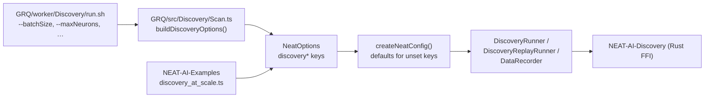

# Option audit — slice B: `discovery*` top-level options

Slice B of the [#3505](https://github.com/stSoftwareAU/NEAT-AI/issues/3505)
option-removal audit (Issue #3520). It classifies the **33 `discovery*` /
discovery-adjacent top-level options** declared in
[`src/config/NeatArguments.ts`](../src/config/NeatArguments.ts) plus the **3
discovery-scoped nested configs**, against real consumer usage.

Out of scope here: the non-`discovery*` top-level options (slice A, #3519 —
[`OPTION_AUDIT_SLICE_A.md`](OPTION_AUDIT_SLICE_A.md)) and the remaining nested
config objects (slices C–F).

The companion doc [`OPTION_USAGE_AUDIT.md`](OPTION_USAGE_AUDIT.md) describes the
scan harness and the search traps this audit has to work around.

## Result

| Verdict                       | Count |
| ----------------------------- | ----: |
| `IN USE`                      |    19 |
| `KEEP (load-bearing default)` |    16 |
| `QUALIFIES`                   |     1 |
| **Total**                     |    36 |

Slice B is **near-clean**: one option qualifies for removal,
`discoveryReplayDiagnostics`, filed as #3556. Every other key is either set by a
consumer or has a default that drives live behaviour.

That is the expected shape for this slice. GRQ drives discovery through a
dedicated CLI (`GRQ/src/Discovery/Scan.ts` + `GRQ/worker/Discovery/run.sh`) that
exposes almost the entire `discovery*` surface as operator flags, so most of
these keys are set on every discovery run.



## Method

Consumers were confirmed from `deno.json` via the org backstop
(`gh search code "stsoftware/neat-ai" --owner stSoftwareAU --filename deno.json`,
the one org-wide query that is safe because it is `--filename`-scoped):
`stSoftwareAU/GRQ` pins `jsr:@stsoftware/neat-ai@6.0.0` and
`stSoftwareAU/NEAT-AI-Examples` pins `@5.9.43`. No third TypeScript consumer
exists. `stSoftwareAU/NEAT-AI-Discovery` was searched as the extra Rust-side
consumer this slice is required to cover.

Each key was resolved against fresh clones of all three repos and against the
code-search index:

```bash
# Local pass — primary evidence, complete and unmetered. Searched against
# origin/Develop, not the checked-out branch, and over every file type.
git -C GRQ                grep -n -F "<key>" origin/Develop
git -C NEAT-AI-Examples   grep -n -F "<key>" origin/Develop
git -C NEAT-AI-Discovery  grep -n -F "<key>" origin/Develop

# Cross-check — per-repo only, never a bare --owner.
gh search code "<key>" --repo stSoftwareAU/GRQ --limit 20
gh search code "<key>" --repo stSoftwareAU/NEAT-AI-Examples --limit 20
gh search code "<key>" --repo stSoftwareAU/NEAT-AI-Discovery --limit 20
```

### Env-var and CLI-alias forms

A `*.ts`-only camelCase grep is not sufficient for this slice: GRQ drives
discovery from `.sh` wrappers, and `worker/Discovery/run.sh` accepts a **short
alias** for most keys (`--batchSize=*|--discoveryBatchSize=*`). Every key that
came back with no camelCase hit was therefore re-searched in five further forms:

| Form               | Example for `discoveryReplayMaxSingles` |
| ------------------ | --------------------------------------- |
| short CLI alias    | `replayMaxSingles`                      |
| `snake_case`       | `discovery_replay_max_singles`          |
| alias `snake_case` | `replay_max_singles`                    |
| `SCREAMING_SNAKE`  | `DISCOVERY_REPLAY_MAX_SINGLES`          |
| alias env form     | `REPLAY_MAX_SINGLES`                    |

All five forms came back empty for all 17 not-set keys. The single apparent hit
(`disk_space` in GRQ) is `GRQ/worker/deno/lib/disk_space.ts` — GRQ's own
host-level disk monitor, unrelated to NEAT-AI's `discoveryDiskSpace` option.

### Nested configs are resolved by field name, not object name

`discoveryCache` and `discoveryDiskSpace` cannot be resolved by the object key
alone. `git grep -F discoveryCache` matches `discoveryCacheDir`, which **is**
set by GRQ — a substring false positive that would wrongly mark the nested cache
config `IN USE`. Each nested config was therefore also resolved by its own field
names, all of which came back empty in all three consumers:

| Nested config                       | Fields searched                                             |
| ----------------------------------- | ----------------------------------------------------------- |
| `discoveryCache`                    | `successMaxEntries`, `failureMaxEntries`, `obsoleteTTLDays` |
| `discoveryDiskSpace`                | `minFreeDiskMB`, `criticalFreeDiskMB`                       |
| `discoveryMinCandidatesPerCategory` | `addSynapses`, `removeLowImpact`, `changeSquash`            |

`changeSquash` does hit in NEAT-AI-Discovery (198 times), but every hit is the
Rust **mutation-category name** in the FFI candidate vocabulary, not the
`discoveryMinCandidatesPerCategory.changeSquash` config field. The Rust crate
does not read this config.

### Rust-side envelope check

The slice was required to treat any NEAT-AI-Discovery reference as `IN USE`.
Four keys are referenced there — `discoverySampleRate`,
`discoveryRecordTimeOutMinutes`, `discoveryAnalysisTimeoutMinutes` and
`discoveryMaxNeurons` — all inside operator-facing guidance
(`src/analysis/utils/memory.rs`, `src/analysis/orchestration.rs`,
`src/analysis/utils/deadline.rs`, `src/ffi_types/requests.rs`). All four are
also set by a TypeScript consumer, so no verdict turns on the Rust hit alone.

No slice-B key crosses the worker envelope.
[`src/config/DiscoveryWorkerEnvelope.ts`](../src/config/DiscoveryWorkerEnvelope.ts)
carries only worker thread-cap and heap fields (`maxMemoryMB`,
`estimatedMemoryPerWorkerMB`), so the "Rust deserialization test fails on a
missing envelope field" detection path named in the issue does not apply to any
key in this slice.

The two FFI-forwarded values that _are_ derived from slice-B options —
`analysisChunkSize` and `perChunkMaxMs`, passed to Rust from
`DataRecorder.ts:408` / `:435` — have no reference on the Rust side under either
camelCase or `snake_case`. They are `KEEP` on their defaults, so nothing turns
on this either.

### Controls

The `populationSize` positive control was run through the same `git grep` path
before any verdict was recorded: hits in both TypeScript consumers
(`GRQ/src/Learn.ts:436`,
`NEAT-AI-Examples/adaptive_mutation/adaptive_mutation.ts:409`). Following slice
A's `rg` fault, every search in this slice uses `git grep` with **stderr not
suppressed** and an explicit exit-code check — `rc > 1` is reported as
`SEARCH FAILED`, never folded into "no hits".

The 17 not-set verdicts were independently corroborated by the #3518 baseline
probe cache (`docs/audit/option-usage/.probe-cache.json`), which reached the
same miss result for all 17 from a separate run.

## `QUALIFIES` — 1 key

| Key                          | Default | Issue | Why the default is inert                                                                                                             |
| ---------------------------- | ------- | ----- | ------------------------------------------------------------------------------------------------------------------------------------ |
| `discoveryReplayDiagnostics` | `false` | #3556 | Pure timing instrumentation. With the flag off, every `performance.now()` site short-circuits and `result.diagnostics` is never set. |

`discoveryReplayDiagnostics` gates ~15 `performance.now()` call sites in
`src/discovery/DiscoveryReplayRunner.ts` and the `result.diagnostics` payload
they fill. Nothing in `src/` ever reads that payload — the only references to
`DiscoveryReplayDiagnostics` are its own declaration, its own field, and the
runner that writes it.

**Reviewer caveat.** This is not a pure dead-knob deletion. The payload is
reachable from public API: `Creature.discoveryReplayDir()` returns
`DiscoveryReplayDirResult`, which carries the optional `diagnostics` field. An
embedder could set the flag and read the timings today, even though neither GRQ
nor NEAT-AI-Examples does. Removing it therefore withdraws an opt-in
observability surface, so the removal issue has to take the
`DiscoveryReplayDiagnostics` type and the `diagnostics` field with it. If the
instrumentation is being kept for a future replay-performance investigation,
close #3556 as `KEEP` and say so on #3505.

## `KEEP (load-bearing default)` — 16 keys

Nobody sets these, but the default drives live behaviour, so the knob stays.

| Key                                    | Default                    | What the default drives                                                                                               |
| -------------------------------------- | -------------------------- | --------------------------------------------------------------------------------------------------------------------- |
| `discoveryMinRecordCoverage`           | `0.5`                      | Real coverage guard in `DataRecorder.ts:364`; `0` would disable it.                                                   |
| `discoveryHardDeadlineTS`              | `undefined`                | **Internal caller**: set by `NeatScheduling.ts:167` from `neat.hardDeadlineTS`, then clamps every discovery deadline. |
| `discoveryRustFlushBytes`              | `50 MiB`                   | `rustFlushBytesThreshold` — the real payload-size flush trigger.                                                      |
| `discoveryAnalysisChunkSize`           | `2`                        | Chunk size forwarded to the Rust analysis call; `0` would mean unchunked.                                             |
| `discoveryAnalysisPerChunkMaxMs`       | `120_000`                  | Live per-chunk deadline that stops one slow Rust call eating the whole budget.                                        |
| `discoveryFailureCacheBypassOnDrought` | `true`                     | The #3072 drought bypass is **on** by default.                                                                        |
| `discoveryReplayMaxSingles`            | `max(2 × threads, 10)`     | Real cap on single-candidate replays.                                                                                 |
| `discoveryReplayMaxPairwise`           | `10`                       | Real cap on pairwise combos.                                                                                          |
| `discoveryReplayMaxTriples`            | `8`                        | Real cap on triple combos.                                                                                            |
| `discoveryReplayConcurrency`           | `threads` (`8+` on verify) | Sizes the replay worker pool.                                                                                         |
| `discoveryReplayTimeoutMinutes`        | `5`                        | Replay wall-clock cap; `0` would disable it.                                                                          |
| `discoveryReplayMinTimeMinutes`        | `1`                        | Minimum remaining time before replay is started at all.                                                               |
| `maxConcurrentDiscoveries`             | `1`                        | Gates scheduling in `NeatScheduling.ts:87` — at `1` it _is_ the pre-#2238 binary guard, and it fires.                 |
| `discoveryMinCandidatesPerCategory`    | `1/1/1/3`                  | Per-category evaluation floors in `CandidateFiltering.ts:231`.                                                        |
| `discoveryCache`                       | `10k/50k/30d/7d`           | Live cache eviction limits and TTLs in `DiscoveryRunnerEvaluation.ts:181`.                                            |
| `discoveryDiskSpace`                   | `enabled`, `500`/`100` MB  | Disk monitoring is **on** by default and aborts discovery below the critical threshold.                               |

## `IN USE` — 19 keys

| Key                                        | Evidence                                                                                                                                                                            |
| ------------------------------------------ | ----------------------------------------------------------------------------------------------------------------------------------------------------------------------------------- |
| `discoverySampleRate`                      | `GRQ/src/Discovery/Scan.ts:640`, `GRQ/src/Learn.ts:446`; `NEAT-AI-Examples/discovery_at_scale/discovery_at_scale.ts:941`; also `NEAT-AI-Discovery/src/analysis/utils/memory.rs:365` |
| `discoveryRecordTimeOutMinutes`            | `GRQ/src/Discovery/Scan.ts:638`, `GRQ/src/interruptTimeouts.ts:47`; `NEAT-AI-Examples/discovery_at_scale/discovery_at_scale.ts:943`                                                 |
| `discoveryAnalysisTimeoutMinutes`          | `GRQ/src/Discovery/Scan.ts:639`, `GRQ/src/interruptTimeouts.ts:40`; `NEAT-AI-Examples/discovery_at_scale/discovery_at_scale.ts:944`                                                 |
| `discoveryBatchSize`                       | `GRQ/src/Learn.ts:447`, `GRQ/src/Discovery/Scan.ts:647`, `GRQ/worker/Discovery/run.sh`; `NEAT-AI-Examples/discovery_at_scale/discovery_at_scale.ts:942`                             |
| `discoveryBufferSize`                      | `GRQ/src/Discovery/Scan.ts:658`, `GRQ/worker/Discovery/run.sh:291`                                                                                                                  |
| `discoveryRustFlushRecords`                | `GRQ/src/Discovery/Scan.ts:661`, `GRQ/worker/Discovery/run.sh:294`                                                                                                                  |
| `discoveryMaxNeurons`                      | `GRQ/src/Discovery/Scan.ts:664`; `NEAT-AI-Examples/discovery_at_scale/discovery_at_scale.ts:945`; also `NEAT-AI-Discovery/src/ffi_types/requests.rs:404`                            |
| `discoveryDrainEveryNBatches`              | `GRQ/src/Discovery/Scan.ts:667`, `GRQ/worker/Discovery/run.sh:300`                                                                                                                  |
| `discoveryFocusNeuronUUIDs`                | `GRQ/src/Discovery/Scan.ts:654` (`[...args.focusNeurons]`, #3510)                                                                                                                   |
| `discoveryDisableEvaluationSummaryLogging` | `GRQ/src/Discovery/Scan.ts:670`, `GRQ/worker/Discovery/run.sh:303`                                                                                                                  |
| `checkpointEveryGeneration`                | `GRQ/src/Learn.ts:448` (`true`); relied on by `GRQ/src/train/LearnCriticalAbort.ts` and `GRQ/worker/learn.sh:477`                                                                   |
| `discoveryDisableCleanup`                  | `GRQ/src/Discovery/Scan.ts:674`, `GRQ/worker/Discovery/run.sh:306`                                                                                                                  |
| `discoveryBaseDirectory`                   | `GRQ/src/Discovery/Scan.ts:677`, `GRQ/worker/Discovery/run.sh:309`                                                                                                                  |
| `discoverySkipRecordPhase`                 | `GRQ/src/Discovery/Scan.ts:680`, `GRQ/worker/Discovery/run.sh:312`                                                                                                                  |
| `discoveryCacheDir`                        | `GRQ/src/Learn.ts:431`, `GRQ/src/exchange/EvolveApp.ts:254`, `GRQ/src/fx/EvolveApp.ts:204`, `GRQ/src/industry/EvolveApp.ts:258`                                                     |
| `discoveryFailureCacheDir`                 | `GRQ/src/Discovery/Scan.ts:641` (and the #2766 drought bypass repoint)                                                                                                              |
| `discoverySuccessCacheDir`                 | `GRQ/src/Discovery/Scan.ts:642`, `GRQ/src/Discovery/Replay.ts:81`                                                                                                                   |
| `discoveryReplayVerifyScores`              | `GRQ/src/Discovery/Replay.ts:86`                                                                                                                                                    |
| `discoveryReplayRescoreBaseline`           | `GRQ/src/Discovery/Replay.ts:88`                                                                                                                                                    |

`discoveryFocusNeuronUUIDs` was flagged in the issue as expected internal-only —
it is **not**. GRQ sets it directly from the `--focusNeurons` operator flag, so
it is `IN USE` on consumer evidence, not `KEEP` on an internal caller.
`discoveryHardDeadlineTS` is the only key in the slice that really is
internal-only, and it is `KEEP` with the caller recorded.

## Dedup

Checked #3446–#3449 (deprecated-api) and #3509–#3512 (dead-code sweep): none
mentions a slice-B option key, so no existing issue absorbs this finding. An
all-state issue search for `discoveryReplayDiagnostics` returned only this audit
issue (#3520), so #3556 is not a duplicate.
