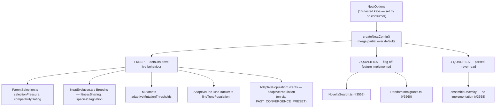

# Option audit — slice C: population & selection nested configs

Slice C of the [#3505](https://github.com/stSoftwareAU/NEAT-AI/issues/3505)
option-removal audit (Issue #3521). It classifies the **10 nested config objects
governing population and selection dynamics** — both the top-level `NeatOptions`
key and every field inside each interface, **59 classifications** in total.

Out of scope here: the non-`discovery*` top-level options (slice A, #3519 —
[`OPTION_AUDIT_SLICE_A.md`](OPTION_AUDIT_SLICE_A.md)), the `discovery*` options
and discovery-scoped nested configs (slice B, #3520 —
[`OPTION_AUDIT_SLICE_B.md`](OPTION_AUDIT_SLICE_B.md)), and the remaining nested
configs (slices D–F).

The companion doc [`OPTION_USAGE_AUDIT.md`](OPTION_USAGE_AUDIT.md) describes the
scan harness and the search traps this audit has to work around.

## Result

| Verdict                       | Parent keys | Fields | Total |
| ----------------------------- | ----------: | -----: | ----: |
| `IN USE`                      |           0 |      0 |     0 |
| `KEEP (load-bearing default)` |           7 |     29 |    36 |
| `QUALIFIES`                   |           3 |     20 |    23 |
| **Total**                     |      **10** | **49** |    59 |

**No consumer sets any of these ten keys.** That is the headline, and it is a
genuine structural result rather than a search fault — the positive control
passes in the same run, and slices A and B found plenty of `IN USE` keys using
this exact method.

The reason is that slice C is the first slice made entirely of **internal
evolution-dynamics knobs**. Slice B was near-clean in the opposite direction (19
of 36 `IN USE`) because GRQ exposes the `discovery*` surface as operator flags
through `Scan.ts` and `run.sh`. Nothing equivalent exists for selection pressure
or speciation: GRQ sets `populationSize`, `elitism` and the discovery knobs,
then lets NEAT-AI's defaults drive breeding. So "nobody sets it" is the expected
shape here, and the real work of this slice was the second question — **is the
default inert, or is it quietly running the show?** For 7 of 10 configs, it is
running the show.



## Method

The two confirmed consumers are unchanged from slice B: `stSoftwareAU/GRQ` and
`stSoftwareAU/NEAT-AI-Examples`, both declaring `@stsoftware/neat` in
`deno.json`. Each key was resolved against fresh clones (fetched 30 Jul 2026)
and cross-checked against the code-search index:

```bash
# Local pass — primary evidence, complete and unmetered. Searched against
# origin/Develop, not the checked-out branch, and over every file type.
git -C GRQ              grep -n -F "<key>" origin/Develop
git -C NEAT-AI-Examples grep -n -F "<key>" origin/Develop

# Cross-check — per-repo only, never a bare --owner.
gh search code "<key>" --repo stSoftwareAU/GRQ --limit 20
gh search code "<key>" --repo stSoftwareAU/NEAT-AI-Examples --limit 20
```

All 20 code-search queries returned zero results except the two false-positive
sets dissected below. The `--owner` saturation trap documented in
[`OPTION_USAGE_AUDIT.md`](OPTION_USAGE_AUDIT.md) was avoided throughout.

### A word-splitting fault, caught by the control

The first sweep of this slice reported _all ten keys unused in one line of
output_ — the ten-key list had failed to word-split, so a single `git grep` for
the concatenated string ran once and missed. The per-key verdict would have been
right by accident, which is exactly what makes this class of fault dangerous: a
broken loop and a clean slice produce the same table.

It was caught because the run prints the positive control and a per-key header,
so the collapsed output was visible. Following slice A's `rg` fault and slice
B's discipline, every search here uses `git grep` with **stderr not suppressed**
and an explicit exit-code check: `rc == 0` hit, `rc == 1` miss, `rc > 1`
reported as `SEARCH FAILED` and never folded into "no hits".

### Controls

`populationSize` (positive) returned 509 hits in GRQ and 231 in NEAT-AI-Examples
in the same run that returned zero for all ten slice-C keys. The ten zero
results are therefore a property of the keys, not of the search.

The #3518 baseline probe cache (`docs/audit/option-usage/.probe-cache.json`)
reached the same not-set result for all ten keys from a separate run, including
the identical two `novelty` doc paths.

### Fields are resolved through the parent, not by name

A nested field can only reach `NeatOptions` through its parent object: there is
no way to set `injectionFraction` without writing `randomImmigrants: { ... }`.
Since all ten parent keys are unset in both consumers, **no field of any of them
is consumer-set**, and each field's verdict turns solely on whether its default
drives live behaviour.

This ordering matters, because grepping slice-C field names directly is
worthless. The fields collide with common identifiers across the whole codebase
— a raw `git grep` over `src/` returns 1580 hits for `weight`, 200 for `large`
and 29 for `power`, essentially none of which are the config field. Every field
verdict below was therefore established by reading the **specific implementation
file** that destructures the resolved config, not by counting name matches.

### Substring false positives

Three apparent hits were run down and all three are unrelated:

| Apparent hit                                 | Reality                                                                                                                                                                                                                               |
| -------------------------------------------- | ------------------------------------------------------------------------------------------------------------------------------------------------------------------------------------------------------------------------------------- |
| `novelty` — 4 in GRQ                         | `noveltyEscalationActive` (the #3072 Discovery drought signal) in `docs/OPERATIONS.md` + a pr-summary; the phrase "Novelty Search" in GRQ's `worker/teams/README.md` roadmap; the English word in `pr-summary-2890.md`. No call site. |
| `ADAPTIVE_MUTATION` — 13 in NEAT-AI-Examples | The Examples repo's **own** `AdaptiveMutationConfig` (`timeoutMinutes`, `targetError`, `maxIterations`) — unrelated to NEAT-AI's `adaptiveMutationThresholds` (`medium` / `large` / `largeTopologyWeight`).                           |
| `fineTunePopulation` — 1 in NEAT-AI-Examples | `docs/archive/pr-summaries/pr-summary-695.md` naming the internal class `FineTunePopulation.make`, not the option.                                                                                                                    |

### Presets are an internal setter, and one of them lies

`src/presets/Presets.ts` is a shipped, exported part of the public API and it
sets two slice-C keys. Neither consumer imports the presets
(`git grep -F LARGE_NETWORK_PRESET` / `FAST_CONVERGENCE_PRESET` → no hits in
both; GRQ's `MACHINE_PRESETS` is its own unrelated construct), but an in-repo
setter still has to be recorded — this is the same situation slice B handled for
`discoveryHardDeadlineTS`.

- `FAST_CONVERGENCE_PRESET` sets `adaptivePopulation: { enabled: true }` and
  `speciesStagnation: { haltWindow: 12, extinctionWindow: 20 }`. Both drive real
  code, so both are `KEEP`.
- `LARGE_NETWORK_PRESET` sets `ensembleDiversity: { enabled: true }` and its doc
  comment claims it will _"Encourage species diversity"_. **It does nothing** —
  see below. The preset entry is itself a defect and #3558 removes it.

## `QUALIFIES` — 3 parent keys, 20 fields

| Key                 | Fields | Default          | Issue | Why it qualifies                                           |
| ------------------- | -----: | ---------------- | ----- | ---------------------------------------------------------- |
| `ensembleDiversity` |     10 | `enabled: false` | #3558 | **No implementation exists.** Parsed, then never read.     |
| `novelty`           |      6 | `enabled: false` | #3559 | Flag off, no adopter. Feature is real — decision required. |
| `randomImmigrants`  |      4 | `enabled: false` | #3560 | Flag off, no adopter. Feature is real — decision required. |

These are **not** three of a kind, and the table above flattens a distinction
the reviewer needs.

### `ensembleDiversity` — genuinely dead (#3558)

The only reference to the parsed object anywhere in `src/` is the parse call
itself, `src/config/NeatConfig.ts:700`. All ten fields — `diversityWeight`,
`weightVarianceWeight`, `squashEntropyWeight`, `topologyDiversityWeight`,
`protectDiverseLowPerformers`, `diversityProtectionThreshold`,
`crossSpeciesBreedingThreshold`, `lowDiversityThreshold`,
`diverseParentPreferenceWeight` and `enabled` — have **zero** read sites outside
the config declaration and the preset doc comment. Setting `enabled: true`
changes nothing.

Unlike its siblings, it has no implementation module at all:
`AdaptivePopulationSizer.ts`, `NoveltySearch.ts` and `RandomImmigrants.ts` all
exist and are wired in; there is no `EnsembleDiversity*` counterpart. Five docs
(`docs/api/CONFIGURATION.md:178`, `docs/config/RECIPES.md:48`,
`docs/troubleshooting/TRAINING.md:100`, `docs/PERFORMANCE_TUNING.md`,
`docs/config/REGULARISATION.md`) describe it as a working feature, so a user
following the troubleshooting guide to fix a diversity problem gets a silent
no-op. This one is unambiguous.

### `novelty` and `randomImmigrants` — working features with no adopters (#3559, #3560)

Both meet the audit's mechanical `QUALIFIES` test (flag off, nobody sets it) and
the slice brief requires a removal issue for each. Both are nonetheless
**complete, tested, benchmarked and documented** features shipped only 7 weeks
ago by #2932 and #2933 in the _Improve evolution_ milestone (#2942). `novelty`
has a dedicated guide (`docs/NOVELTY_SEARCH.md`) and a benchmark
(`bench/NoveltyDeceptiveEscape.ts`); `randomImmigrants` is documented in
`README.md`.

Removing them withdraws real opt-in capability rather than deleting dead weight,
so **both issues are filed as explicit decisions with an audit recommendation to
lean KEEP**, following the reviewer-caveat precedent slice B set with #3556.
Adoption for `novelty` is additionally blocked on the consumer side — it needs a
problem-supplied behaviour descriptor that GRQ has not defined — which is a
reason adoption has not begun, not evidence the lever is useless.

## `KEEP (load-bearing default)` — 7 parent keys, 29 fields

Nobody sets these, but the default drives live behaviour, so the knob stays.
Each row records the implementation file that reads the resolved config.

| Key                          | Fields | Default state             | What the default drives                                                                             |
| ---------------------------- | -----: | ------------------------- | --------------------------------------------------------------------------------------------------- |
| `selectionPressure`          |      7 | no flag; all fields live  | `ParentSelection.ts:320-341` — POWER exponent and the whole tournament path. **All 7 fields read.** |
| `fitnessSharing`             |      2 | `enabled: true`           | `NeatEvolution.ts:637`, `Breed.ts:145`, `ParallelBreeding.ts:153` — species breeding quotas.        |
| `speciesStagnation`          |      3 | `enabled: true`           | `NeatEvolution.ts:650` → `SpeciesPlateauDetector.ts:107-108` — halt/extinction windows.             |
| `compatibilityGating`        |      3 | `enabled: true`           | `ParentSelection.ts:538` — `gate.enabled && gate.power > 0` soft gate, else legacy pick.            |
| `adaptiveMutationThresholds` |      3 | no flag; all fields live  | `Mutator.ts:766-786` — destructures all 3 to scale topology mutation by creature size.              |
| `fineTunePopulation`         |      4 | no flag; all fields live  | `AdaptiveFineTuneTracker.ts:28-80`, live via `NeatEvolution.ts:356/525` — all 4 fields read.        |
| `adaptivePopulation`         |      7 | `enabled: false`, **but** | `AdaptivePopulationSizer.ts:32-62` — all 7 fields read; **turned on by `FAST_CONVERGENCE_PRESET`**. |

### `adaptivePopulation` is the borderline call

It is the one `KEEP` in this slice a reviewer might reasonably reclassify. Its
flag defaults `false`, which is the mechanical `QUALIFIES` signature, and no
consumer sets it. It is classified `KEEP` on three pieces of evidence:

1. `FAST_CONVERGENCE_PRESET` (`src/presets/Presets.ts:247`) sets `enabled: true`
   — an in-repo setter on an exported public API surface.
2. The implementation is live and reached: `NeatEvolution.ts:534` calls
   `computeAdaptivePopulationSize`, and the result feeds
   `effectivePopulationSize`.
3. `bench/EvolutionPaceLeverComparison.ts` carries it as a measured lever.

This is deliberately the conservative call: a false `KEEP` costs only
under-delivery, whereas a false `QUALIFIES` proposes deleting live code.

**Note for the #3505 roll-up:**
[#1942](https://github.com/stSoftwareAU/NEAT-AI/issues/1942) ("Remove unused
config-only modules: AdaptivePopulation, EnsembleDiversity,
StabilityAdaptation", closed `NOT_PLANNED`, March 2026) asserted that
`computeAdaptivePopulationSize()` "is defined but never called anywhere". That
was either wrong then or has gone stale since — it **is** called today. Bundling
a live config with a dead one is the most likely reason #1942 stalled without
comment, and #3558 deliberately unbundles the `ensembleDiversity` third, whose
premise was re-verified and still holds exactly.

## Dedup

Checked the ranges the brief names, plus an all-state issue search per
candidate:

- **#3446–#3449** (deprecated-api) — all concern `HYPOT` / `MEAN` activations
  and `focusNeuronErrorShares`. No slice-C symbol.
- **#3509–#3512** (dead-code sweep) — #3511 lists
  `src/NEAT/RandomImmigrants.ts:31 ImmigrantInjectionResult` among redundant
  exports but **deliberately excludes** it as a possibly-documented public type.
  Different concern (the `export` keyword, not the option), and closed. Recorded
  on #3560 rather than treated as an absorbing duplicate.
- **#1942** — closed `NOT_PLANNED`, covers `EnsembleDiversity`. Closed and never
  actioned, so it does not absorb the finding under the one-follow-up rule;
  #3558 supersedes its `ensembleDiversity` third and cross-references it.
- No **open** issue exists for `ensembleDiversity`, `novelty` or
  `randomImmigrants` removal, so #3558–#3560 are not duplicates.
