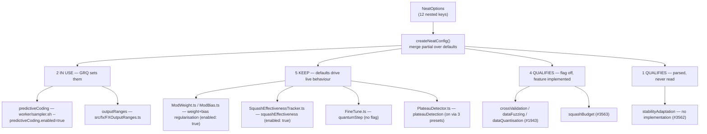

# Option audit — slice D: training, regularisation & data-shaping nested configs

Slice D of the [#3505](https://github.com/stSoftwareAU/NEAT-AI/issues/3505)
option-removal audit (Issue #3522). It classifies the **12 nested config objects
governing training, regularisation and data shaping** — both the top-level
`NeatOptions` key and every field inside each interface, **69 classifications**
in total.

Out of scope here: the non-`discovery*` top-level options (slice A, #3519 —
[`OPTION_AUDIT_SLICE_A.md`](OPTION_AUDIT_SLICE_A.md)), the `discovery*` options
and discovery-scoped nested configs (slice B, #3520 —
[`OPTION_AUDIT_SLICE_B.md`](OPTION_AUDIT_SLICE_B.md)), the population and
selection nested configs (slice C, #3521 —
[`OPTION_AUDIT_SLICE_C.md`](OPTION_AUDIT_SLICE_C.md)), and the remaining nested
configs (slices E–F).

The companion doc [`OPTION_USAGE_AUDIT.md`](OPTION_USAGE_AUDIT.md) describes the
scan harness and the search traps this audit has to work around.

## Result

| Verdict                       | Parent keys | Fields |  Total |
| ----------------------------- | ----------: | -----: | -----: |
| `IN USE`                      |           2 |      4 |      6 |
| `KEEP (load-bearing default)` |           5 |     32 |     37 |
| `QUALIFIES`                   |           5 |     21 |     26 |
| **Total**                     |      **12** | **57** | **69** |

Slice D breaks slice C's zero-`IN USE` pattern: GRQ genuinely drives two of
these keys from production. It is otherwise the mirror of slice C — the same
"nobody sets it, so is the default inert or running the show?" question, and the
same answer for the majority of keys.



## Method

The two confirmed consumers are unchanged from slices B and C:
`stSoftwareAU/GRQ` and `stSoftwareAU/NEAT-AI-Examples`. Both were rediscovered
independently in this run by the #3518 harness's org backstop
(`--filename deno.json`), which reported exactly those two repositories as
declaring `@stsoftware/neat-ai`.

Each key was resolved against fresh clones (fetched 30 Jul 2026, GRQ
`origin/Develop` at `bc622f5`) and cross-checked against the code-search index:

```bash
# Local pass — primary evidence, complete and unmetered. Searched against
# origin/Develop, not the checked-out branch, and over every file type.
git -C GRQ              grep -n -F "<key>" origin/Develop
git -C NEAT-AI-Examples grep -n -F "<key>" origin/Develop

# Cross-check — per-repo only, never a bare --owner.
gh search code "<key>" --repo stSoftwareAU/GRQ --limit 20
gh search code "<key>" --repo stSoftwareAU/NEAT-AI-Examples --limit 20
```

Following slice C, every local search checks the exit code explicitly — `rc 0`
hit, `rc 1` miss, `rc > 1` reported as `SEARCH FAILED` and never folded into "no
hits". The `--owner` saturation trap documented in
[`OPTION_USAGE_AUDIT.md`](OPTION_USAGE_AUDIT.md) was avoided throughout.

### Controls

`populationSize` (positive) returned **388** hits in GRQ and **231** in
NEAT-AI-Examples in the same run that returned zero for the ten unset slice-D
keys. `dnaSharingMode` (negative) returned zero in both. The #3518 harness ran
its own copy of both controls in this session and passed before it was stopped.
The zero results below are therefore a property of the keys, not of the search.

### The index can produce a false _used_, not just a false _unused_

`OPTION_USAGE_AUDIT.md` warns that a bare `--owner` search saturates and reports
a set key as unused. Slice D hit the opposite failure on the same tool:

`gh search code squashBudget --repo stSoftwareAU/GRQ` returns **2 hits** where
`git grep -F squashBudget origin/Develop` returns none. Both are GRQ's own
**ImproveSquash** pass and its wall-clock **budget** —
`worker/IntelligentDesign/run.sh` (`--budgetSeconds`, `ID_STEP_BUDGET_SECONDS`)
and `docs/archive/pr-summaries/pr-summary-3744.md`, which also names
`test/worker/ImproveSquashBudgetWiring.ts`. GitHub code search splits camelCase
and matches across the split, so `squashBudget` matches any document containing
"…Squash… budget…".

Had the verdict rested on the index alone, `squashBudget` would have been
recorded `IN USE` and the audit would have under-reported. Local `git grep -F`
is the primary evidence in both directions; the index is only ever a
cross-check.

The same effect explains `predictiveCoding` returning 5 index hits against 18
local hits — the index is partial as well as fuzzy. It agreed on the _verdict_
for all 24 key×repo probes; it disagreed on the evidence for two of them.

### Fields are resolved through the parent, not by name

As in slice C, a nested field can only reach `NeatOptions` through its parent
object — there is no way to set `l2Strength` without writing
`weightRegularisation: { … }`. So each field's verdict follows its parent's
consumer result, and the real work is reading the **specific implementation file
that destructures the resolved config**. Grepping field names directly is
worthless here: `enabled`, `learningRate`, `folds` and `minSamples` collide with
hundreds of unrelated identifiers.

### Bench and test hits are recorded, not counted as usage

Per the slice brief, in-repo bench/test usage is not consumer usage — it is part
of what a removal deletes. One slice-D key has a bench:
`bench/SquashBudgetSelection.ts` (#3263), with no `deno.json` task entry to
unregister. No other slice-D key is referenced from `bench/`.

## `IN USE` — 2 parent keys, 4 fields

| Key                | Fields | Consumer evidence                                                                                                                                                        |
| ------------------ | -----: | ------------------------------------------------------------------------------------------------------------------------------------------------------------------------ |
| `predictiveCoding` |      5 | **GRQ** `src/Learn.ts:526-533` sets `options.predictiveCoding.enabled` from the `--predictiveCoding.enabled=true` flag emitted by `worker/sampler.sh:67`. 18 local hits. |
| `outputRanges`     |      3 | **GRQ** `src/fx/EvolveApp.ts:377` and `src/fx/IntelligentDesignFX.ts:144` pass `buildFXOutputRanges()` (`src/fx/FXOutputRanges.ts`). 17 local hits.                      |

`predictiveCoding` is a **sampler variant**: `worker/sampler.sh` picks one of
`predictiveCoding` / `syntheticSynapses` / `default` per run, so the key is set
on a fraction of GRQ's fleet runs rather than on every one. That is still
consumer usage — the option is load-bearing for that variant.

Only `predictiveCoding.enabled` is consumer-set; the other four fields
(`inferenceSteps`, `inferenceRate`, `learningRate`, `energyThreshold`) are left
at their defaults **and those defaults then drive live inference**, so they are
counted as `KEEP (load-bearing default)` in the table below, not as `IN USE`.
All four are read: `src/predictiveCoding/AdaptiveScaling.ts:73-84`,
`src/predictiveCoding/PredictiveCodingInference.ts:142/146/240`,
`src/predictiveCoding/PredictiveCodingTrainer.ts:109`.

`outputRanges` is the opposite: GRQ's `buildFXOutputRanges()` sets **all three**
fields (`min`, `max`, `penaltyWeight`) on every element, so all three are
`IN USE`. `penaltyWeight: 10` is deliberately far from the library default of
`1.0` — see `docs/archive/pr-summaries/pr-summary-2156.md` in GRQ, which relies
on the high penalty as the FX scorer's output-safety mechanism.

## `QUALIFIES` — 5 parent keys, 21 fields

| Key                   | Fields | Default               | Issue                | Why it qualifies                                  |
| --------------------- | -----: | --------------------- | -------------------- | ------------------------------------------------- |
| `stabilityAdaptation` |     10 | `enabled: false`      | **#3562** (new)      | **No implementation exists.** Parsed, never read. |
| `crossValidation`     |      3 | `enabled: false`      | #1943 (commented on) | Flag off, no adopter. Feature is real.            |
| `dataFuzzing`         |      4 | `enabled: false`      | #1943 (commented on) | Flag off, no adopter. Feature is real.            |
| `dataQuantisation`    |      3 | `enabled: false`      | #1943 (commented on) | Flag off, no adopter. Feature is real.            |
| `squashBudget`        |      1 | `allowedSquashes: []` | **#3563** (new)      | Empty allow-list = free mix. Lever is real.       |

These are three different situations, and the table flattens a distinction the
reviewer needs.

### `stabilityAdaptation` — genuinely dead (#3562)

The only reference to the parsed object anywhere in `src/` is the parse call
itself, `src/config/NeatConfig.ts:690`. All ten fields — `enabled`,
`stabilityWindowSize`, `brittlenessThreshold`, `brittleReductionFactor`,
`stableBoostFactor`, `stableBoostThreshold`, `selectionStabilityWeight`,
`adaptiveSelectionWeight`, `topologyMutationReductionForBrittle` and
`trackPerMutationType` — have **zero** read sites. Setting `enabled: true`
changes nothing.

`find src -iname "*stability*"` returns only the config file. Every other
slice-D config has a reader: `weightRegularisation` → `src/mutate/ModWeight.ts`,
`biasRegularisation` → `src/mutate/ModBias.ts`, `squashEffectiveness` →
`src/NEAT/SquashEffectivenessTracker.ts`, `plateauDetection` →
`src/NEAT/PlateauDetector.ts`.

Three shipped surfaces promise behaviour that never happens:
`LARGE_NETWORK_PRESET` (`src/presets/Presets.ts:93`, rationale line `:75`
advertising _"Adapt mutation to stability"_),
`docs/config/MUTATION_ADAPTATION.md` (`:19`, `:73`), and
`docs/troubleshooting/TRAINING.md` (`:80`, `:233`), which tells a user with a
brittleness problem to enable it. That is the same defect #3558 found in the
same preset for `ensembleDiversity`. This one is unambiguous.

### `crossValidation`, `dataFuzzing`, `dataQuantisation` — a human already decided (#1943)

[#1943](https://github.com/stSoftwareAU/NEAT-AI/issues/1943) ("Remove unused
DataFuzzing, DataQuantisation, and CrossValidation configs") covers exactly
these three symbols and was closed **`NOT_PLANNED`** in March 2026. The audit
re-verified the premise — still unset, still `enabled: false`, still gated at
`src/architecture/Training.ts:65` and
`src/architecture/training/TrainingSamples.ts:77/:84` — and **commented on
#1943** rather than filing a duplicate, per the audit's one-follow-up-per-root-
cause rule.

Reopening is not recommended. All three are complete, tested and documented
regularisation features, and `DataFuzzingConfig` / `RequiredDataFuzzingConfig` /
`DEFAULT_DATA_FUZZING_CONFIG` are exported from `mod.ts:255-258`, so removing
that one is a breaking change to the published API rather than a tidy-up. The
comment records two scope corrections for whoever picks it up: the call sites
listed on #1943 have since moved out of `Training.ts` into
`src/architecture/training/`, and all three are also threaded through
`src/NEAT/NeatScheduling.ts`.

This is the deliberate difference from slice C's handling of #1942: that issue's
premise had gone **stale** (its `adaptivePopulation` claim is false today), so
#3558 superseded it. #1943's premise is **still exactly correct**, so
re-litigating it would be churn.

### `squashBudget` — a three-week-old lever with no adopter yet (#3563)

Default `allowedSquashes: []` → `Activations.setAllowedSquashes([])`
(`src/config/NeatConfig.ts:225`) → `allowedSquashes = null`, so
`pickRandomSquash` draws from the full `WEIGHTED_POOL`. Byte-identical to
pre-#3263 behaviour.

Filed as a **decision recommending KEEP**, following the slice-C precedent of
#3559/#3560. It shipped three weeks ago (#3263, closed 9 Jul 2026) with a bench
and a `docs/PERFORMANCE_RESEARCH.md` entry recording that the production A/B
needs the production creature seed and the ≈21 GiB corpus — neither
distributable to CI. Removing the lever discards the only means of running that
experiment on the fleet, and its carrying cost is one field and one setter call.
GRQ consumes neither the input side (`allowedSquashes`) nor the diagnostic side
(`squashHistogram`), so adoption is a GRQ-side task that has not started — a
reason to chase adoption, not to delete the option.

#### The `CoerceNumeric` asymmetry is intentional, not a bug

The slice brief flagged that `squashBudget` appears untransformed in
`NeatOptionsInput` (`src/config/NeatOptions.ts:376`) while every sibling nested
config is wrapped in `CoerceNumeric<…>`. **The asymmetry is deliberate and
inert.**

`CoerceNumeric<T>` (`src/config/NeatOptions.ts:40-43`) passes arrays straight
through — `T extends readonly (infer _U)[] ? T` — and `SquashBudgetConfig`'s
only field is `allowedSquashes?: string[]`. So
`CoerceNumeric<SquashBudgetConfig>` would be a strict no-op, which is exactly
what the in-code comment at `:375` says: _"No numeric fields to coerce."_

Blast radius: **smaller** than a sibling's by one line, and no CLI-coercion
behaviour changes on removal either way. There is nothing here to fix and
nothing here that blocks a removal.

## `KEEP (load-bearing default)` — 5 parent keys, 32 fields

Nobody sets these, but the default drives live behaviour, so the knob stays.
Each row records the implementation file that reads the resolved config. The 4
non-`enabled` `predictiveCoding` fields are included in the field count because
GRQ enables the parent and then relies on their defaults.

| Key                    | Fields | Default state             | What the default drives                                                                                                    |
| ---------------------- | -----: | ------------------------- | -------------------------------------------------------------------------------------------------------------------------- |
| `weightRegularisation` |      6 | `enabled: true`           | `src/mutate/ModWeight.ts:147-219`, wired at `Mutator.ts:266`. Clamps every weight mutation. **All 6 fields read.**         |
| `biasRegularisation`   |      6 | `enabled: true`           | `src/mutate/ModBias.ts:89-161`, wired at `Mutator.ts:271`. Clamps every bias mutation. **All 6 fields read.**              |
| `squashEffectiveness`  |      7 | `enabled: true`           | `src/NEAT/SquashEffectivenessTracker.ts:83-279`, live via `Neat.ts:362` and `NeatEvolution.ts:203`. **All 7 fields read.** |
| `quantumStep`          |      3 | no flag; all fields live  | `src/blackbox/FineTune.ts:73-75`, reached from `FineTunePopulation.ts` and `NeatScheduling.ts:421`. **All 3 fields read.** |
| `plateauDetection`     |      6 | `enabled: false`, **but** | `src/NEAT/PlateauDetector.ts`, live via `Neat.ts:342` / `NeatEvolution.ts:349,540,679`. **Turned on by 3 presets.**        |
| `predictiveCoding` (4) |      4 | parent enabled by GRQ     | `AdaptiveScaling.ts:73-84`, `PredictiveCodingInference.ts:142/146/240`, `PredictiveCodingTrainer.ts:109`.                  |

### `plateauDetection` is the borderline call

It is the one `KEEP` in this slice a reviewer might reasonably reclassify — the
same shape as `adaptivePopulation` in slice C. Its flag defaults `false`, which
is the mechanical `QUALIFIES` signature, and no consumer sets it. It is `KEEP`
on three pieces of evidence:

1. **Three exported presets enable it**, not one: `LARGE_NETWORK_PRESET`
   (`windowSize: 15`, `responseMutationMultiplier: 2.5`),
   `DISCOVERY_FOCUSED_PRESET`, and `FAST_CONVERGENCE_PRESET` (`windowSize: 10`,
   `responseMutationMultiplier: 2.0`). `src/presets/Presets.ts` is a shipped
   part of the public API.
2. **The implementation is live and reached**: `NeatEvolution.ts:540` feeds
   `isOnPlateau()` into adaptive population sizing, and `:679` uses
   `getMutationMultiplier()` to raise the mutation rate on a stall.
3. **`bench/EvolutionPaceLeverComparison.ts` carries it as a measured lever**,
   and `FAST_CONVERGENCE_PRESET`'s documentation names its 2× mutation boost as
   the headline reason the preset converges faster.

Unlike `stabilityAdaptation`, whose preset entry is a lie, this preset entry is
backed by code. As in slice C, the conservative call is deliberate: a false
`KEEP` costs only under-delivery, whereas a false `QUALIFIES` proposes deleting
live code.

### `squashEffectiveness` reaches production through an on-by-default flag

Worth calling out because it is the only slice-D config that is both unset by
consumers and `enabled: true`: `Neat.ts:362` constructs the tracker from the
resolved config for **every** run, and `NeatEvolution.ts:203` commits a fitness
sample per creature per generation. Every GRQ run has biased squash mutation
today. Its seven fields are the tuning surface of live behaviour.

## Dedup

Checked the ranges the brief names, plus an all-state issue search per
candidate:

- **#3446–#3449** (deprecated-api) — all concern `HYPOT` / `MEAN` activations
  and `focusNeuronErrorShares`. No slice-D symbol.
- **#3509–#3512** (dead-code sweep) — orphan barrels, superseded modules,
  redundant exports and two unused WASM constants. No slice-D symbol; all
  closed.
- **#1942** — closed `NOT_PLANNED`, bundled `StabilityAdaptation` with
  `AdaptivePopulation` and `EnsembleDiversity`. Closed and never actioned, and
  its `adaptivePopulation` premise is now false, so it does not absorb the
  finding; #3558 superseded its `ensembleDiversity` third and **#3562**
  supersedes its `StabilityAdaptation` third.
- **#1943** — closed `NOT_PLANNED`, covers `crossValidation`, `dataFuzzing` and
  `dataQuantisation` exactly. Its premise is unchanged, so the audit **commented
  there** instead of filing a duplicate.
- **#3263** — closed; the experiment that shipped `squashBudget`. Not a removal
  issue, so #3563 is not a duplicate of it.
- No **open** issue exists for `stabilityAdaptation` or `squashBudget` removal.
