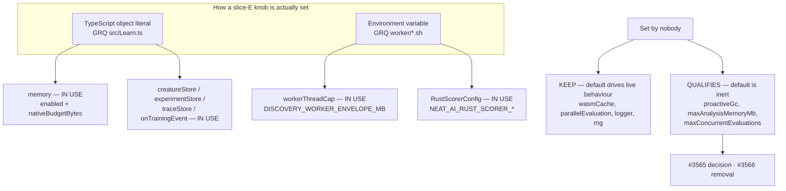

# Option audit — slice E: runtime & infrastructure configs and injection points

Slice E of the [#3505](https://github.com/stSoftwareAU/NEAT-AI/issues/3505)
option-removal audit (Issue #3523). It classifies the **four runtime/
infrastructure nested configs**, the **internal `RustScorerConfig`**, and the
**six injection-point options** — both the top-level `NeatOptions` key and every
field inside each interface, **33 classifications** in total.

Out of scope here: the non-`discovery*` top-level options (slice A, #3519 —
[`OPTION_AUDIT_SLICE_A.md`](OPTION_AUDIT_SLICE_A.md)), the `discovery*` options
(slice B, #3520 — [`OPTION_AUDIT_SLICE_B.md`](OPTION_AUDIT_SLICE_B.md)), the
population and selection configs (slice C, #3521 —
[`OPTION_AUDIT_SLICE_C.md`](OPTION_AUDIT_SLICE_C.md)), the training,
regularisation and data-shaping configs (slice D, #3522 —
[`OPTION_AUDIT_SLICE_D.md`](OPTION_AUDIT_SLICE_D.md)), and the experimental
configs (slice F, #3524).

The companion doc [`OPTION_USAGE_AUDIT.md`](OPTION_USAGE_AUDIT.md) describes the
scan harness and the search traps this audit has to work around.

## Result

| Verdict                       | Parent keys | Fields |  Total |
| ----------------------------- | ----------: | -----: | -----: |
| `IN USE`                      |           7 |      8 |     15 |
| `KEEP (load-bearing default)` |           4 |     11 |     15 |
| `QUALIFIES`                   |           0 |      3 |      3 |
| **Total**                     |      **11** | **22** | **33** |

Slice E is the **only slice so far where the deciding evidence is not
TypeScript**. Two of its four nested configs are set from production without a
single camelCase occurrence in either consumer repo:

- `workerThreadCap` is populated **entirely from environment variables**
  exported by GRQ's `worker/Discovery/run.sh`;
- `RustScorerConfig` has no `NeatOptions` key at all and is resolved from
  `NEAT_AI_RUST_SCORER_*` env, which GRQ sets in 121 places.

A camelCase-only sweep reports both as unused. The slice brief predicted exactly
this failure mode, and it is the reason no `QUALIFIES` verdict below rests on a
TypeScript grep alone.



## Method

The two confirmed consumers are unchanged from slices B–D: `stSoftwareAU/GRQ`
and `stSoftwareAU/NEAT-AI-Examples`. Each key was resolved against fresh clones
(fetched 30 Jul 2026; GRQ `origin/Develop` at `5199cb241`, NEAT-AI-Examples at
`2405d1b`).

```bash
# Local pass — primary evidence, complete and unmetered. git grep searches
# every tracked file type, so .sh / .yml / Dockerfile / .json are all covered.
git -C GRQ              grep -n -F "<key>" origin/Develop
git -C NEAT-AI-Examples grep -n -F "<key>" HEAD

# Env-form pass — required for this slice (see below).
git -C GRQ grep -n -I -F "<SCREAMING_SNAKE>" origin/Develop \
  -- '*.sh' '*.yml' '*.yaml' '*.json' '*.jsonc' 'Dockerfile*' '*.env'

# Cross-check — per-repo only, never a bare --owner.
gh search code "<key>" --repo stSoftwareAU/GRQ --limit 20
```

Every local search checks the exit code explicitly — `rc 0` hit, `rc 1` miss,
`rc > 1` reported as `SEARCH FAILED` and never folded into "no hits". The
`--owner` saturation trap documented in
[`OPTION_USAGE_AUDIT.md`](OPTION_USAGE_AUDIT.md) was avoided throughout.

### The env sweep is not optional here, and it changed two verdicts

The slice brief flagged this slice as the highest false-positive risk in the
audit. It was right, and the positive control it named worked:
`NEAT_AI_WASM_CACHE_DIR` returned **29 hits in GRQ** (`worker/Discovery/run.sh`,
`worker/DiscoveryReplay/run.sh`, `worker/learn.sh`,
`worker/shared/neat_ai_wasm_cache.sh`), so the method demonstrably surfaces
env-driven consumers.

Rather than guess at env spellings, the sweep was made exhaustive from the
**library** side: every environment variable NEAT-AI reads was enumerated from
`src/`, then each was searched in both consumers.

| NEAT-AI env var                    | Feeds                                        | GRQ | Examples |
| ---------------------------------- | -------------------------------------------- | --: | -------: |
| `DISCOVERY_WORKER_ENVELOPE_MB`     | `workerThreadCap.maxMemoryMB`                |  15 |        0 |
| `DISCOVERY_HEAP_SIZE_MB`           | `workerThreadCap.estimatedMemoryPerWorkerMB` |  38 |        0 |
| `DISCOVERY_PER_WORKER_HEAP_CAP_MB` | same, fallback                               |  10 |        0 |
| `NEAT_AI_RUST_SCORER_BINARY_PATH`  | `RustScorerConfig.binaryPath`                | 121 |       18 |
| `NEAT_AI_RUST_SCORER_ENABLED`      | `RustScorerConfig.enabled`                   |  68 |       11 |
| `NEAT_AI_RUST_SCORER_TIMEOUT_MS`   | `RustScorerConfig.timeoutMs`                 |   4 |        0 |
| `NEAT_AI_RUST_SCORER_BATCH`        | `RustScorerConfig.batch`                     |   0 |        1 |
| `NEAT_AI_RUST_SCORER_ENV`          | `RustScorerConfig.env`                       |   0 |        0 |
| `NEAT_AI_WASM_CACHE_DIR`           | `WasmBundleCache` (**not** `wasmCache`)      |  29 |        0 |

The SCREAMING_SNAKE forms of every remaining slice-E key were then swept over
`*.sh`, `*.yml`, `*.yaml`, `*.json`, `*.jsonc`, `Dockerfile*` and `*.env` in
both repos: `PROACTIVE_GC`, `MAX_ANALYSIS_MEMORY`, `MAX_CONCURRENT_EVALUATIONS`,
`TOPOLOGY_GROUPING`, `WORKER_THREAD_CAP`, `PARALLEL_EVALUATION`,
`MAX_CACHED_ACTIVATIONS`, `COMPILATION_CACHE_SIZE`,
`ESTIMATED_MEMORY_PER_WORKER`, `NATIVE_BUDGET_BYTES` — all `rc 1`, zero hits.
`WASM_CACHE` (27) and `MEMORY_MB` (34) do hit, and both were read: they are
`NEAT_AI_WASM_CACHE_DIR`, GRQ's own `WASM_CACHE_CAP`, and the `DISCOVERY_*_MB`
family already accounted for above.

### Two name collisions that would have produced wrong verdicts

**`wasmCache` — a false `IN USE`.**
`gh search code wasmCache --repo
stSoftwareAU/GRQ` returns the full window of
**20 hits**, and `git grep` returns 50. Not one of them is NEAT-AI's `wasmCache`
option: every hit is GRQ's own `src/train/wasmCacheCap.ts`, an unrelated
per-host LRU cap with its own `WASM_CACHE_CAP` env var. This is the same failure
mode slice D found on `squashBudget`, and it is why `wasmCache` is classified
below on its **defaults**, not on GRQ's hit count.

**`warningThreshold` / `criticalThreshold` — 47 and 48 GRQ hits, all false.**
Both are fields of GRQ's own `src/train/SystemMemoryMonitor.ts`. GRQ sets
neither on NEAT-AI's `memory` config.

`NEAT_AI_WASM_CACHE_DIR` is a third instance of the same trap in the opposite
direction: it is live, load-bearing, and named after `wasmCache`, but it drives
`src/wasm/WasmBundleCache.ts` (where the compiled WASM bundle is cached on disk)
and has nothing to do with `WasmCacheConfig` (how many activations the in-memory
LRU holds). Treating it as evidence for `wasmCache` would be as wrong as
ignoring it.

### Fields are resolved through the parent, not by name

As in slices C and D, a nested field can only reach `NeatOptions` through its
parent object, so each field's verdict follows its parent's consumer result and
the real work is reading the implementation file that destructures the resolved
config. The exception in this slice is `RustScorerConfig`, whose fields each
have their **own** env var and so are classified individually.

### Bench and test hits are recorded, not counted as usage

`bench/ParallelEvaluation.ts` sets `maxConcurrentEvaluations: 0` and
`topologyGrouping` (both values) in four scenarios; it has no `deno.json` task
entry to unregister. `bench/ScorerBatchThroughput.ts` exercises the Rust scorer
path. No other slice-E key is referenced from `bench/`.

## `IN USE` — 7 keys, 8 fields

| Key                | Fields | Consumer evidence                                                                                                                                          |
| ------------------ | -----: | ---------------------------------------------------------------------------------------------------------------------------------------------------------- |
| `memory`           |      2 | **GRQ** `src/Learn.ts:461-467` assigns `options.memory` from `resolveInlineDiscoveryMemoryConfig()` (`src/train/inlineDiscoveryMemory.ts`). 58 local hits. |
| `workerThreadCap`  |      2 | **GRQ** `worker/Discovery/run.sh:212-229` exports `DISCOVERY_WORKER_ENVELOPE_MB` + `DISCOVERY_PER_WORKER_HEAP_CAP_MB`; env-only, zero camelCase hits.      |
| `RustScorerConfig` |      4 | **GRQ** `worker/IntelligentDesign/run.sh:551-662`, **Examples** `.github/workflows/quality.yml:190`; env-only, no `NeatOptions` key exists.                |
| `creatureStore`    |      — | **GRQ** `src/Learn.ts:427`; also drives `worker/teams/run.sh:582-1419` OOM salvage and `worker/shared/statistics_snapshot.sh:68`.                          |
| `experimentStore`  |      — | **GRQ** `src/Learn.ts:420-435`; **Examples** `maze_navigation/maze_navigation.ts:436`.                                                                     |
| `traceStore`       |      — | **GRQ** `src/Learn.ts:443`, fed by `worker/sampler.sh:896` (`--traceStore=.trace`).                                                                        |
| `onTrainingEvent`  |      — | **GRQ** `src/Learn.ts:513` — routes `memory_pressure` and `generation_complete` into three subsystems (#2219, #2345, #2346).                               |

### `memory` — the parent is set, most of the fields are not

`buildInlineDiscoveryMemoryConfig()` returns exactly
`{ enabled: true, nativeBudgetBytes }` (#3025/#3712), so only those two of the
eleven fields are `IN USE`. The other nine are left at their defaults and are
classified on those defaults below — seven `KEEP`, two `QUALIFIES`.

`nativeBudgetBytes` is read at
`ErrorGuidedStructuralEvolution/AnalysisHeapGuard.ts:136` and
`DiscoveryAnalysisMemory.ts:89-90`: a worker-V8-only CRITICAL sample no longer
aborts analysis while RSS stays inside the budget. GRQ derives the budget from
total host RAM specifically so the effective population no longer swings with
ambient load. Removing it would reinstate the GRQ-16 false-positive aborts.

### `workerThreadCap` — the slice's headline false negative

Zero camelCase hits in either consumer. `gh search code workerThreadCap` returns
`0` for both repos. On TypeScript evidence alone this is a textbook `QUALIFIES`:
`maxMemoryMB` defaults to `0`, which disables the cap.

It is in fact load-bearing on every GRQ Discovery run.
`src/config/DiscoveryWorkerEnvelope.ts` reads `DISCOVERY_WORKER_ENVELOPE_MB`,
`DISCOVERY_HEAP_SIZE_MB` and `DISCOVERY_PER_WORKER_HEAP_CAP_MB` and merges them
into `workerThreadCap` **automatically, with no per-caller opt-in**
(`NeatConfig.ts:245-275`), which then caps `config.threads` to
`floor(envelope / per_worker)`. GRQ exports all three from
`worker/Discovery/run.sh:212-229` and `worker/shared/island_discovery_plan.sh`.
Both fields are therefore `IN USE`: the envelope sets `maxMemoryMB`, the heap
size sets `estimatedMemoryPerWorkerMB` (4096 on GRQ-22, not the static 2048
guess). Removing either brings back the GRQ-22 worker-OOM class this wiring
exists to prevent, and NEAT-AI's own CI would not catch it.

### `RustScorerConfig` — internal, env-resolved, four of five fields live

There is no `rustScorer` key in `NeatOptions`; the config is built lazily in
`src/score/RustScorerBridge.ts:85-120` from `NEAT_AI_RUST_SCORER_*` and consumed
by `architecture/Fitness.ts:236-269`, `Creature.ts:1107`, and
`creature/CreatureActivation.ts:416`. `enabled`, `binaryPath`, `timeoutMs` and
`batch` are all set by at least one consumer.

`env` (from `NEAT_AI_RUST_SCORER_ENV`, a JSON blob) is set by neither, and its
default `{}` is inert. It is still classified `KEEP` below rather than
`QUALIFIES`, on the slice brief's own rule: it is a **pure deploy-time env
knob** with no source footprint required, so absence from two clones is not
evidence of absence on the fleet. That rule is exactly what protects
`workerThreadCap`, and it has to be applied consistently.

### The injection points are all consumer-wired

The slice brief's instruction to default injection points to `KEEP` turned out
not to be needed for four of the six — GRQ wires them explicitly. `traceStore`
even has a shell surface (`worker/sampler.sh:896`). `creatureStore` is the most
deeply entangled: three GRQ shell scripts and five GRQ tests depend on the
numbered population files NEAT-AI writes under it (#1740/#1743/#3471), so its
blast radius is much wider than the option itself.

## `KEEP (load-bearing default)` — 4 keys, 11 fields

Nobody sets these, but the default drives live behaviour, so the knob stays.

| Key                    | Fields | Default state                | What the default drives                                                                                                                  |
| ---------------------- | -----: | ---------------------------- | ---------------------------------------------------------------------------------------------------------------------------------------- |
| `wasmCache`            |      2 | `512` (or `pop × 2`) / `100` | `creature/CreatureTraining.ts:439-440` sizes both LRUs on **every** run; propagated to every worker isolate via `WorkerHandler.ts:419`.  |
| `parallelEvaluation`   |      1 | `topologyGrouping: true`     | `architecture/Fitness.ts:374` → `multithreading/EvaluationScheduling.ts:77` reorders the evaluation queue on every generation.           |
| `memory` (7 fields)    |      7 | monitor `enabled`            | `NEAT/MemoryMonitor.ts:171-172, 586-638`, called twice per generation from `NEAT/NeatEvolution.ts:144, 946`.                             |
| `logger`               |      — | console logger               | `config/NeatConfig.ts:831-840` — always resolves to a `Logger` and calls the global `setLogger()`. Never absent at runtime.              |
| `rng`                  |      — | unseeded xoshiro256**        | `config/NeatConfig.ts:208-217` — always resolves and calls `setRandomNumberGenerator()`; used at `:231, :469, :477` during config build. |
| `RustScorerConfig.env` |      1 | `{}`                         | Deploy-time-only env knob (`NEAT_AI_RUST_SCORER_ENV`); see above.                                                                        |

The seven `memory` fields kept here are `warningThreshold` (`0.70`),
`criticalThreshold` (`0.85`), `snapshotThreshold` (`0.90`), `snapshotIntervalMs`
(`10_000`), `criticalBackoffBurst` (`5`), `criticalBackoffWindowMs` (`10_000`)
and `criticalBackoffCooldownMs` (`60_000`). GRQ sets `memory.enabled: true`, so
the monitor runs and **all seven defaults are live on every GRQ generation**:
the first two classify pressure, the next two gate the #2381 retainer snapshot,
and the last three drive the adaptive backoff that stops the monitor thrashing
the caches.

### `logger` and `rng` — kept on the code path, not on the injection

Neither consumer injects either one: `setLogger` returns zero hits in both
repos, and `\brng\b` returns zero. That is not the same as the option being
dead. `createNeatConfig()` **always** produces both — a console logger at the
requested `logLevel`, and either the `seed`-derived deterministic RNG or an
unseeded one — and publishes both globally. The field cannot be deleted from
`NeatConfig` without deleting the resolution logic that every other module reads
through `getLogger()` / `getRandomNumberGenerator()`. Only the _injection_ is
unused, and per the brief that is precisely what must not be removed on
consumer-absence evidence: an embedder that instruments NEAT-AI through them
breaks at typecheck on the next bump.

### `rng` and `seed` were checked as a pair

Neither is removable, so the pair question does not arise. `seed` has no
production consumer either — GRQ's only `--seed=42` occurrences are
passthrough-argument fixtures in `test/worker/LearnPopulationSize.ts:238` and
`test/worker/LearnEvolutionMode.ts:199`, and NEAT-AI-Examples' 305 `seed:` hits
are its own example-local seeds, not the option. But `seed` selects
`createSeededRng` vs `createUnseededRng` at `NeatConfig.ts:208-217`, so removing
it would delete NEAT-AI's entire determinism story while leaving the
`RandomNumberGenerator` module's seeded half unreachable. Both stay.

> **Coverage note for #3505:** `seed` does not appear in the slice-A
> classification table, and slice A is where it belongs. Slice E has verified it
> as `KEEP` for the pair check; it is **not** counted in slice E's 33 totals to
> avoid double-counting if slice A is amended.

## `QUALIFIES` — 0 parent keys, 3 fields

| Field                                         | Default | Issue                | Why it qualifies                                                         |
| --------------------------------------------- | ------- | -------------------- | ------------------------------------------------------------------------ |
| `memory.proactiveGc`                          | `false` | **#3565** (decision) | Flag off ⇒ two `attemptProactiveGc()` gates never fire.                  |
| `memory.maxAnalysisMemoryMb`                  | `0`     | **#3565** (decision) | `0` ⇒ the budget field is omitted from the FFI call entirely.            |
| `parallelEvaluation.maxConcurrentEvaluations` | `0`     | **#3566** (removal)  | `0` ⇒ `allWorkers` is used unsliced; the branch is a no-op in every run. |

All three are reachable **only** from a TypeScript object literal — no env var,
no CLI flag, no shell wrapper. That distinction is what makes a `QUALIFIES`
verdict safe here and unsafe for `workerThreadCap`: a knob with an env path can
be set invisibly at deploy time, and one without cannot.

### `memory.proactiveGc` and `memory.maxAnalysisMemoryMb` — dormant OOM brakes (#3565)

Filed as a **decision**, following the slice-C/D precedent of #3559/#3560/#3563,
because the mechanical verdict and the engineering judgement point opposite
ways.

Mechanically both are inert. `proactiveGc: false` means `MemoryMonitor.ts:624`'s
`if (config.proactiveGc) attemptProactiveGc()` and `DataRecorder.ts:388`'s
`attemptGc: this.config.memory.proactiveGc` never fire — and
`attemptProactiveGc()` is a documented no-op anyway unless the runtime was
started with `--v8-flags=--expose-gc`, which no GRQ launcher passes.
`maxAnalysisMemoryMb: 0` makes `resolveAnalysisMemoryBudgetMb()` return
`undefined`, so `RustAnalysisCache.ts:190` omits the field and Discovery runs
with **no Rust-side allocator budget at all**.

The judgement is that both are brakes built for the exact failure GRQ still
fights. #3432 shipped `maxAnalysisMemoryMb` to stop `analyze_parallel` growing
RSS until the host OOMs, and stated the host cannot police it from TypeScript
because the FFI call is blocking. Deleting it removes the only in-flight brake
on that path. The recommendation on #3565 is therefore **wire up, do not
remove**: GRQ already computes a Rust budget (`RUST_MEMORY_BUDGET_MB` in
`worker/Discovery/run.sh:215`) and simply never passes it to NEAT-AI.

### `parallelEvaluation.maxConcurrentEvaluations` — a plain inert knob (#3566)

`Fitness.ts:392-395`:

```ts
const maxConcurrent = this.evalConfig.maxConcurrentEvaluations;
const activeWorkers = maxConcurrent > 0
  ? allWorkers.slice(0, maxConcurrent)
  : allWorkers;
```

With the default `0` the ternary always takes the `allWorkers` branch, so
removing the field and the branch is byte-for-byte behaviour-preserving. Its
stated purpose — reserving workers for training and discovery — was superseded
by #2245's fast/heavy worker-pool split, which already dedicates pools by task
type, and by `heavyTaskWorkerCount`, which GRQ **does** set
(`GRQ/src/Learn.ts:110`). This is a straightforward #3502-pattern removal:
option surface, the `Fitness.ts` branch, four `bench/ParallelEvaluation.ts`
scenario lines, `test/config/ParallelEvaluationConfig.ts`,
`test/config/parsers/RuntimeParsers.ts`, and three `docs/config/WORKERS.md`
rows. `topologyGrouping` stays — it is the half of the config that does work.

## Dedup

Checked the ranges the brief names, plus an all-state issue search per
candidate:

- **#3446–#3449** (deprecated-api) — `HYPOT` / `HYPOTv2` / `MEAN` activations
  and `focusNeuronErrorShares`. No slice-E symbol.
- **#3509–#3512** (dead-code sweep) — orphan barrels, superseded modules,
  redundant exports, two unused WASM constants. No slice-E symbol; all closed.
- `gh issue list --search "proactiveGc OR maxAnalysisMemoryMb OR
  maxConcurrentEvaluations in:title,body" --state open`
  returns **nothing**, so #3565 and #3566 are not duplicates.
- **#3562** (`stabilityAdaptation` removal) and **#3563** (`squashBudget`
  decision) are slice-D findings on unrelated symbols.

## Reproducing this audit

```bash
# Controls first — a sweep whose controls fail cannot be trusted.
git -C GRQ grep -c -F populationSize origin/Develop   # 388, expect hits
git -C GRQ grep -c -F dnaSharingMode origin/Develop   # rc 1, expect none
git -C GRQ grep -c -F NEAT_AI_WASM_CACHE_DIR origin/Develop  # 29, env control

# Then per key, both forms.
git -C GRQ grep -n -F "<camelCaseKey>" origin/Develop
git -C GRQ grep -n -I -F "<SCREAMING_SNAKE>" origin/Develop -- '*.sh' '*.yml' '*.json' 'Dockerfile*'
```

The `gh search code` cross-check ran per repo for nine keys and hit an
`HTTP 403: API rate limit exceeded` after ten queries. The affected probes were
**re-run after the window reset**, not folded into "no hits": `proactiveGc` 0/0,
`maxAnalysisMemoryMb` 0/0, `nativeBudgetBytes` 19/0. The index agreed with the
local verdict on every key except `wasmCache`, where it produced the false
`IN USE` documented above.
