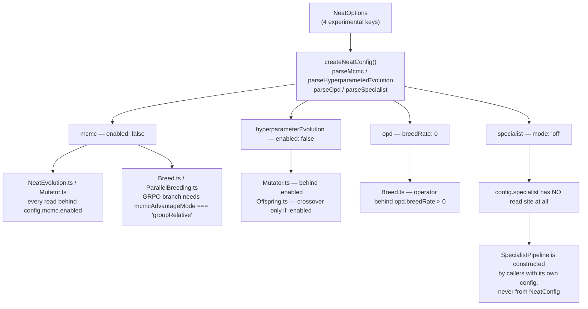

# Option audit — slice F: experimental / research configs

Slice F of the [#3505](https://github.com/stSoftwareAU/NEAT-AI/issues/3505)
option-removal audit (Issue #3524). It classifies the **four experimental
research configs** — `mcmc`, `hyperparameterEvolution`, `opd` and `specialist` —
covering both the top-level `NeatOptions` key and every field inside each
interface, **43 classifications** in total.

Out of scope here: the non-`discovery*` top-level options (slice A, #3519 —
[`OPTION_AUDIT_SLICE_A.md`](OPTION_AUDIT_SLICE_A.md)), the `discovery*` options
(slice B, #3520 — [`OPTION_AUDIT_SLICE_B.md`](OPTION_AUDIT_SLICE_B.md)), the
population and selection nested configs (slice C, #3521 —
[`OPTION_AUDIT_SLICE_C.md`](OPTION_AUDIT_SLICE_C.md)), the training /
regularisation / data-shaping nested configs (slice D, #3522 —
[`OPTION_AUDIT_SLICE_D.md`](OPTION_AUDIT_SLICE_D.md)), and the runtime /
infrastructure configs (slice E, #3523).

`src/config/DnaSharingPreset.ts` is listed in the slice-F brief only as the
backing type for `dnaSharingMode`, which slice A already classified and filed as
**#3554**. This slice files nothing for it — see
[Overlap with slice A](#overlap-with-slice-a) below.

The companion doc [`OPTION_USAGE_AUDIT.md`](OPTION_USAGE_AUDIT.md) describes the
scan harness and the search traps this audit has to work around.

## Result

| Verdict                       | Parent keys | Fields |  Total |
| ----------------------------- | ----------: | -----: | -----: |
| `IN USE`                      |           0 |      0 |      0 |
| `KEEP (load-bearing default)` |           0 |      0 |      0 |
| `QUALIFIES`                   |           4 |     39 |     43 |
| **Total**                     |       **4** | **39** | **43** |

Slice F is the clean sweep the brief predicted: **every key qualifies**. All
four features are gated behind an off-by-default flag (`mcmc.enabled: false`,
`hyperparameterEvolution.enabled: false`, `opd.breedRate: 0`,
`specialist.mode: "off"`), no consumer sets any of them, and none of the
defaults reaches live behaviour. It is the only slice so far with zero
`KEEP (load-bearing default)` rows — research machinery, by construction, does
not run unless you switch it on.



## Method

The two confirmed consumers are unchanged from slices B–D: `stSoftwareAU/GRQ`
and `stSoftwareAU/NEAT-AI-Examples`. Both were resolved against fresh clones
fetched 30 Jul 2026 — GRQ `origin/Develop` at `312370d`, NEAT-AI-Examples
`origin/Develop` at `2405d1b`. `Develop` is the default branch of both
repositories, so the local pass and the code-search index look at the same tree.

```bash
# Local pass — primary evidence, complete and unmetered.
git -C GRQ              grep -n -F -I "<key>" origin/Develop
git -C NEAT-AI-Examples grep -n -F -I "<key>" origin/Develop

# Cross-check — per-repo only, never a bare --owner.
gh search code "<key>" --repo stSoftwareAU/GRQ --limit 20
gh search code "<key>" --repo stSoftwareAU/NEAT-AI-Examples --limit 20
```

Following slices C and D, every local search checks the exit code explicitly —
`rc 0` hit, `rc 1` miss, `rc > 1` reported as `SEARCH FAILED` and never folded
into "no hits".

### Controls

| Control                     | GRQ                         | NEAT-AI-Examples            | Verdict |
| --------------------------- | --------------------------- | --------------------------- | ------- |
| `populationSize` (positive) | 389 local hits, 20/20 index | 231 local hits, 20/20 index | ✅ pass |
| `dnaSharingMode` (negative) | 0                           | 0                           | ✅ pass |

Both controls ran in the same session as the sweep, so every "not set" verdict
below is backed by a search harness that provably finds a key the consumers do
set.

### Method fault caught by the positive control

The first sweep of this slice reported **zero hits for every key including
`populationSize`** — the exact failure mode #3524's brief tells you to watch
for. Cause: the worker's non-interactive shell is **zsh**, which does not
word-split an unquoted `$KEYS` variable, so the `for k in $KEYS` loop ran once
with the entire key list as a single search term. Every key "missed" because no
file contains the concatenation of all 38 keys.

Nothing crashed and no stderr appeared — the run looked like a clean slice with
43 free removals. Fixed by running the sweep under `bash -c`, and re-verified by
the control returning 389/231 hits. This is the third distinct search fault the
audit has recorded (slice A: `rg` missing from `PATH`; slice D: camelCase-split
index false positive), and the second one that the positive control was the only
thing standing between and a corrupt result.

## `mcmc` — 17 classifications, all `QUALIFIES`

**Interface:** `src/config/MCMCConfig.ts`. **Parser:** `parseMcmc` in
`src/config/parsers/MutationParsers.ts:180`, wired at
`src/config/NeatConfig.ts:735`.

Neither consumer sets `mcmc`. GRQ has no case-insensitive `mcmc` match anywhere
under `src/`, `worker/` or `deno.json`. NEAT-AI-Examples has 82 matches, all in
its own `mcmc_acceptance/` demo, which builds a **self-contained analytical
Metropolis-Hastings sampler** with its own `MCMCOptions` interface
(`mcmc_acceptance/mcmc_acceptance.ts:71`) and never passes an `mcmc` block to
`NeatOptions` — a `git grep -E "mcmc\s*:"` over that repo returns nothing. The
same applies to the `initialTemperature` hit in that file: it is a field of the
demo's local `MCMCOptions`, not of NEAT-AI's `MCMCConfig`.

`enabled` defaults to `false`, and every read site in `src/` is behind it:
`NeatEvolution.ts:703`, `:706`, `:725` and `:780`, and `Mutator.ts:311`. The one
group of reads **outside** the `enabled` guard is the GRPO advantage branch at
`Breed.ts:139` and `ParallelBreeding.ts:147`, which tests
`mcmcAdvantageMode === "groupRelative"` — inert at the default `"absolute"`, so
`minCohortSize`, `advantageEps` and `advantageClip` are never read either.
`NeatConfigValidation.ts:123` reads `minTemperature` / `initialTemperature`, but
only to reject an inconsistent pair; it changes no behaviour.

| Key                                         | Default      | Verdict     | Why inert                                                                     |
| ------------------------------------------- | ------------ | ----------- | ----------------------------------------------------------------------------- |
| `mcmc`                                      | see below    | `QUALIFIES` | Nobody sets it; the whole block is behind `enabled: false`.                   |
| `mcmc.enabled`                              | `false`      | `QUALIFIES` | The gate itself.                                                              |
| `mcmc.initialTemperature`                   | `1.0`        | `QUALIFIES` | Read only by `mcmcState` when enabled, plus a validation bound.               |
| `mcmc.minTemperature`                       | `0.01`       | `QUALIFIES` | As above.                                                                     |
| `mcmc.coolingRate`                          | `0.995`      | `QUALIFIES` | `cool()` runs only when enabled (`NeatEvolution.ts:780`).                     |
| `mcmc.targetAcceptanceRate`                 | `0.234`      | `QUALIFIES` | Adaptive tuning runs inside `cool()`.                                         |
| `mcmc.adjustmentRate`                       | `0.02`       | `QUALIFIES` | As above.                                                                     |
| `mcmc.toleranceRate`                        | `0.05`       | `QUALIFIES` | As above.                                                                     |
| `mcmc.diversityAwareMCMC`                   | see below    | `QUALIFIES` | Reheat is evaluated inside `cool()`.                                          |
| `mcmc.diversityAwareMCMC.enabled`           | `true`       | `QUALIFIES` | Default-on **inside** a default-off feature — unreachable.                    |
| `mcmc.diversityAwareMCMC.minSpecies`        | `4`          | `QUALIFIES` | Unreachable with `mcmc.enabled: false`.                                       |
| `mcmc.diversityAwareMCMC.crowdingThreshold` | `0.85`       | `QUALIFIES` | Unreachable.                                                                  |
| `mcmc.diversityAwareMCMC.reheatFactor`      | `1.5`        | `QUALIFIES` | Unreachable.                                                                  |
| `mcmc.mcmcAdvantageMode`                    | `"absolute"` | `QUALIFIES` | Read outside the `enabled` gate, but the GRPO branch needs `"groupRelative"`. |
| `mcmc.minCohortSize`                        | `4`          | `QUALIFIES` | Only read on the `"groupRelative"` branch.                                    |
| `mcmc.advantageEps`                         | `1e-8`       | `QUALIFIES` | As above.                                                                     |
| `mcmc.advantageClip`                        | `10`         | `QUALIFIES` | As above.                                                                     |

Filed as **#3570** (decision issue — see
[The GRQ evolution-mode finding](#the-grq-evolution-mode-finding)).

## `hyperparameterEvolution` — 14 classifications, all `QUALIFIES`

**Interface:** `src/config/HyperparameterConfig.ts` (Issue #1863). **Parser:**
`parseHyperparameterEvolution` in `src/config/parsers/TrainingParsers.ts:29`,
wired at `src/config/NeatConfig.ts:747`.

Zero hits in either consumer, in both the local pass and the index — the only
slice-F key that is clean on every probe. The `addNeuronRate` hit in
NEAT-AI-Examples `cart_pole/cart_pole.ts:150` is a field of that example's own
local options interface, not of `EvolvableHyperparameters`; no other
`EvolvableHyperparameters` field appears in either repository.

`enabled` defaults to `false`. `Mutator.ts:497` is the only site that ever
_creates_ per-creature hyperparameters, and it is behind the flag.
`Offspring.ts:239` / `:643` cross over `mum.hyperparameters` and
`dad.hyperparameters` when enabled, and otherwise **carry an existing block
through unchanged** — deliberate preservation so a creature evolved with the
feature on does not lose its genes when it is bred by a run with the feature
off. With the flag never turned on, no creature ever acquires a
`hyperparameters` block, so the preservation branch is unreachable too.

| Key                                                 | Default   | Verdict     |
| --------------------------------------------------- | --------- | ----------- |
| `hyperparameterEvolution`                           | see below | `QUALIFIES` |
| `hyperparameterEvolution.enabled`                   | `false`   | `QUALIFIES` |
| `hyperparameterEvolution.minLearningRate`           | `0.0001`  | `QUALIFIES` |
| `hyperparameterEvolution.maxLearningRate`           | `0.1`     | `QUALIFIES` |
| `hyperparameterEvolution.minWeightPerturbation`     | `0.1`     | `QUALIFIES` |
| `hyperparameterEvolution.maxWeightPerturbation`     | `2.0`     | `QUALIFIES` |
| `hyperparameterEvolution.maxRegularisationStrength` | `0.1`     | `QUALIFIES` |
| `hyperparameterEvolution.mutationStdDev`            | `0.1`     | `QUALIFIES` |

The six `EvolvableHyperparameters` fields live on the **creature genome**
(`Creature.hyperparameters`), not on `NeatOptions`, but they are part of the
same interface file and the brief counts them, so they are classified here. Each
is only ever written by `mutateHyperparameters` / `crossoverHyperparameters`,
both reachable only through the flag above.

| Genome field                                        | Default | Verdict     |
| --------------------------------------------------- | ------- | ----------- |
| `EvolvableHyperparameters.learningRate`             | `0.01`  | `QUALIFIES` |
| `EvolvableHyperparameters.addNeuronRate`            | `0.1`   | `QUALIFIES` |
| `EvolvableHyperparameters.addConnectionRate`        | `0.2`   | `QUALIFIES` |
| `EvolvableHyperparameters.weightPerturbationScale`  | `1.0`   | `QUALIFIES` |
| `EvolvableHyperparameters.l1RegularisationStrength` | `0`     | `QUALIFIES` |
| `EvolvableHyperparameters.l2RegularisationStrength` | `0`     | `QUALIFIES` |

Filed as **#3569**.

## `opd` — 7 classifications, all `QUALIFIES`

**Interface:** `src/config/OpdConfig.ts` (Issue #2528). **Parser:** `parseOpd`
in `src/config/parsers/MutationParsers.ts:308`, wired at
`src/config/NeatConfig.ts:739`.

Zero local hits in either consumer. The index reports 2 GRQ hits for `opd`;
those are the code-search tokeniser matching case-insensitively against GRQ's
prose mentions of "OPD", and a case-insensitive local grep over GRQ `src/`,
`worker/` and `deno.json` returns nothing. GRQ _does_ emit an
`--onPolicyDistillation=<bool>` flag — see below — but nothing reads it.

`breedRate` defaults to `0`, and `Breed.ts:180` guards the entire operator with
`config.opd.breedRate > 0`, so `teacherCount` (`Breed.ts:247`) and the four
distillation parameters are never read. `onPolicyDistillationBreed` itself has a
second caller — `SpecialistPipeline.ts:252` — which passes its **own** config
object, so the module survives removal of the `NeatOptions` key.

| Key                        | Default | Verdict     | Why inert                                              |
| -------------------------- | ------: | ----------- | ------------------------------------------------------ |
| `opd`                      |       — | `QUALIFIES` | Nobody sets it; operator behind `breedRate > 0`.       |
| `opd.breedRate`            |     `0` | `QUALIFIES` | The gate itself — 0 means "never select the operator". |
| `opd.teacherCount`         |     `3` | `QUALIFIES` | Read only inside the gated branch.                     |
| `opd.distillationSteps`    |    `50` | `QUALIFIES` | Read only by `onPolicyDistillationBreed`.              |
| `opd.calibrationBatchSize` |    `16` | `QUALIFIES` | As above.                                              |
| `opd.temperature`          |   `1.0` | `QUALIFIES` | As above; `1.0` is also the identity softening.        |
| `opd.learningRate`         |  `0.01` | `QUALIFIES` | As above.                                              |

Filed as **#3570** (decision issue, jointly with `mcmc`).

## `specialist` — 5 classifications, all `QUALIFIES`

**Interface:** `src/config/SpecialistConfig.ts` (Issue #2530). **Parser:**
`parseSpecialist` in `src/config/parsers/MutationParsers.ts:359`, wired at
`src/config/NeatConfig.ts:743`.

This is the strongest removal in the slice, and it is stronger than "unused":
**`config.specialist` has no read site anywhere in `src/`.** The key is declared
on `NeatOptions`, parsed into
`NeatArguments.specialist:
RequiredSpecialistConfig`, and then never consulted.
`SpecialistPipeline` — the feature's implementation — takes its own
`Partial<RequiredSpecialistConfig>` constructor argument, and the only things
that construct it are `mod.ts` consumers, `bench/SpecialistVsMixed.ts` and
`test/NEAT/SpecialistPipeline.ts`. Neither `Neat` nor `NeatEvolution` ever
instantiates it.

So setting `specialist: { mode: "auto", subTaskIds: [...] }` on `NeatOptions`
today silently does nothing. That makes the option not merely inert at its
default but **inert at every value** — the same shape as slice D's
`stabilityAdaptation` (#3562).

The `Genus.addCreatureToSpecies(specialistTaskId)` and
`Species.specialistTaskId` plumbing is real and works, but it is driven by
`SpecialistPipeline`, not by the config key, so it is untouched by the removal.

| Key                                | Default | Verdict     | Why inert                                                   |
| ---------------------------------- | ------- | ----------- | ----------------------------------------------------------- |
| `specialist`                       | —       | `QUALIFIES` | Parsed into `NeatConfig`, never read.                       |
| `specialist.mode`                  | `"off"` | `QUALIFIES` | No read site; even `"auto"` would do nothing.               |
| `specialist.distillEveryN`         | `25`    | `QUALIFIES` | No read site.                                               |
| `specialist.subTaskIds`            | `[]`    | `QUALIFIES` | No read site; empty list is also the documented off switch. |
| `specialist.minSpecialistsPerTask` | `2`     | `QUALIFIES` | No read site.                                               |

Filed as **#3568**.

## The GRQ evolution-mode finding

The one thing in this slice that is not a plain "nobody set it": GRQ's
`worker/shared/evolution_mode.sh` picks a random 6-bit evolution mode and, for
the `learn` driver, emits

```text
--grpoAdvantage=<bool> --onPolicyDistillation=<bool> --specialistSubpopulations=<bool> ...
```

into the `src/Learn.ts` argv (`worker/learn.sh:468`), exports
`EVOLUTION_MODE=<label>` so `record_performance.sh` files the run under that
label, and prints the enabled features to the console. The first three bits name
exactly three slice-F features: `--grpoAdvantage` is #2527
(`mcmc.mcmcAdvantageMode`), `--onPolicyDistillation` is #2528 (`opd`),
`--specialistSubpopulations` is #2530 (`specialist`).

**`Learn.ts` never reads any of them.** `parseArgs` accepts them into `args`,
but the `NeatOptions` literal it builds (`src/Learn.ts:426`) contains no `mcmc`,
`opd` or `specialist` block, and a case-insensitive grep for all three flag
names across GRQ `src/` finds only comments. Bits G, O and S of the factorial
sweep therefore toggle nothing, while the leaderboard records them as though
they did.

Two consequences for this audit:

1. The three keys stay `QUALIFIES` — a flag that is parsed and dropped is not a
   consumer setting the option.
2. There is a **declared intent to adopt** these features, so the removal issues
   for `mcmc` and `opd` are framed as decisions (keep-and-wire vs remove), the
   #3563 pattern, rather than as unconditional deletions. `specialist` is filed
   as a straight removal of the option surface because its config key is
   unreadable at any value; whether the _feature_ is later wired up through
   `SpecialistPipeline` is independent of that.

The GRQ-side half-wiring is a separate root cause in a separate repository and
is filed there as **stSoftwareAU/GRQ#3793**.

## Overlap with slice A

`src/config/DnaSharingPreset.ts` appears in the slice-F brief because it backs
`dnaSharingMode`, which belongs to slice A. Slice A classified `dnaSharingMode`
as `QUALIFIES` and filed **#3554** ("retire the dnaSharingMode knob preset and
KnobTuningStrategy"). Per the brief's dedup rule, slice F files nothing for it
and no slice-F removal issue touches `DnaSharingPreset.ts`. An open-issue search
for `DnaSharingPreset` returns only #3554.

## Dedup

Checked before filing, per the brief:

- **#3446–#3449** (deprecated-api findings) — `HYPOT`, `HYPOTv2`, `MEAN`,
  `focusNeuronErrorShares`. None touches a slice-F key.
- **#3509–#3512** (dead-code sweep, all closed) — orphan barrels, superseded
  modules, redundant exports, unused WASM buffers. None touches a slice-F key;
  in particular #3511's redundant-export list does not include any `MCMCConfig`
  / `OpdConfig` / `SpecialistConfig` / `HyperparameterConfig` symbol, all of
  which are re-exported from `mod.ts`.
- Open-issue search for `mcmc`, `opd`, `specialist` and
  `hyperparameterEvolution` in title — only #3524 itself.

## Issues filed

| Feature                                  | Issue           | Shape                                                   |
| ---------------------------------------- | --------------- | ------------------------------------------------------- |
| `specialist`                             | #3568           | Removal — option surface is unreadable at any value     |
| `hyperparameterEvolution`                | #3569           | Removal — feature complete, flag never turned on        |
| `mcmc` + `opd`                           | #3570           | Decision — inert today, but GRQ's sweep declares intent |
| `dnaSharingMode` / `DnaSharingPreset.ts` | #3554 (slice A) | Not re-filed                                            |
