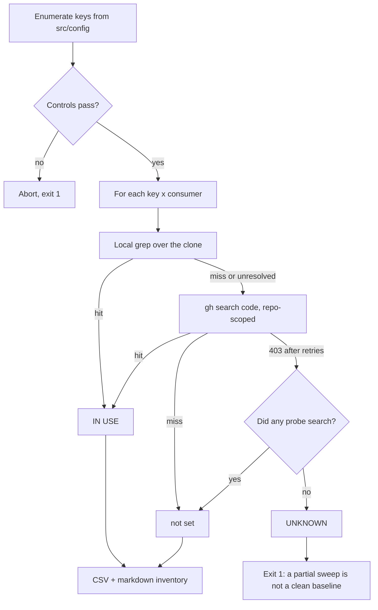

# Option-usage audit harness

`scripts/audit-option-usage.ts` is the enabling slice of the #3505
option-removal audit (Issue #3518). It enumerates every NEAT-AI option key from
`src/config/`, checks each one against the consumer repositories, and publishes
a baseline inventory the sibling removal slices work from.

The harness answers **`IN USE` vs `not set`** only. The `QUALIFIES` vs
`KEEP (load-bearing default)` call needs a human reading the default's code path
— that remains the sibling slices' job.

## Running it

```bash
deno run --allow-read --allow-write --allow-run --allow-env \
  scripts/audit-option-usage.ts --clone-root "$HOME/auto-issue-work"
```

Useful flags (`--help` lists them all):

| Flag               | Effect                                                          |
| ------------------ | --------------------------------------------------------------- |
| `--out-dir DIR`    | Where the CSV/markdown land (default `docs/audit/option-usage`) |
| `--clone-root DIR` | Directory holding the sibling consumer clones (default `..`)    |
| `--cache FILE`     | Probe cache; a re-run costs no search quota                     |
| `--no-code-search` | Local grep only — fast, but skips the code-search cross-check   |
| `--controls-only`  | Run the two controls and stop                                   |

Exit codes: `0` clean, `1` a control failed or a key stayed `UNKNOWN`, `2` bad
usage.

## How a key is resolved



## The methodology traps it guards against

**Never search with a bare `--owner`.** `populationSize` is set by both GRQ and
NEAT-AI-Examples, but NEAT-AI's own hits fill the entire org-wide result window,
so `gh search code populationSize --owner stSoftwareAU` reports it as unused. An
audit built on `--owner` searches produces false `QUALIFIES` verdicts and
proposes removing load-bearing options. Every code-search query the harness
issues is `--repo`-scoped, and a unit test asserts `--owner` never appears in
the argument list.

Excluding NEAT-AI with a `-repo:` qualifier does **not** fix this — the
qualifier is ignored in that position and the window saturates anyway. The org
backstop is therefore a single `--filename deno.json` search that _discovers_
the consumer set (currently GRQ and NEAT-AI-Examples), after which every key is
checked per repo.

**Never fold "could not search" into "not set".** Each probe reports `hit`,
`miss` or `unresolved`. A consumer is only `not set` when at least one probe
genuinely searched; if none did, the key is `UNKNOWN` and the run exits
non-zero. Unresolved probe results are never cached, so a rate-limited key is
retried on the next run instead of being frozen as a miss.

**Enumerate from source, not from a list.** Keys come from parsing
`NeatArguments` and each `src/config/*Config.ts` interface. A pinned count in
`test/scripts/AuditOptionUsage.ts` fails in CI if a config refactor changes the
surface without the harness picking it up.

## Built-in controls

Both run before the sweep and abort it on failure, because a corrupt inventory
is worse than no inventory:

- **Positive** — `populationSize` must be `IN USE` in both `stSoftwareAU/GRQ`
  and `stSoftwareAU/NEAT-AI-Examples`. This flips if the `--owner` saturation
  trap reappears, if the cache goes stale, or if the code-search index skips a
  consumer.
- **Negative** — `dnaSharingMode` must be reported as not set in both. This
  flips if a probe starts matching everything.

## Rate limiting

The GitHub code-search endpoint allows **10 requests/minute** for an
authenticated user (`gh api rate_limit --jq .resources.code_search`), not the 30
of the general search endpoint. Queries are therefore spaced ~6.5s apart, retry
403/429 responses with exponential back-off, and are cached to disk so a re-run
spends no quota.

The local grep is the primary evidence: it is complete, has no rate limit, and
covers paths the code-search index lags on. Code search is spent only where the
local pass found nothing — the one direction in which a wrong answer produces a
false `QUALIFIES` verdict.

## Reading the output

`docs/audit/option-usage/option-usage.csv` and `option-usage.md` carry one row
per declaration site:

| Column                           | Meaning                                                              |
| -------------------------------- | -------------------------------------------------------------------- |
| `slice`                          | `top-level` (`NeatArguments`) or `nested` (a `*Config.ts` interface) |
| `owner_file` / `owner_interface` | Where the key is declared                                            |
| `key`                            | The option key                                                       |
| `status`                         | `IN USE`, `not set`, or `UNKNOWN`                                    |
| `set_by`                         | Consumers that mention the key                                       |
| `verdict_candidate`              | What a sibling slice should do next                                  |
| `detail`                         | Evidence paths, or why the key is unresolved                         |

The harness matches the key as a plain string, so a nested key with a generic
name (`enabled`, `weight`) and a key mentioned only in a consumer's
documentation both come out as `IN USE`. That bias is deliberate: an over-broad
match can only ever prevent a removal, never cause a wrong one. Check the
`detail` column before treating an `IN USE` verdict as a live call site — a row
whose only evidence is `docs/…` is a documentation mention, not a consumer
setting the option.
