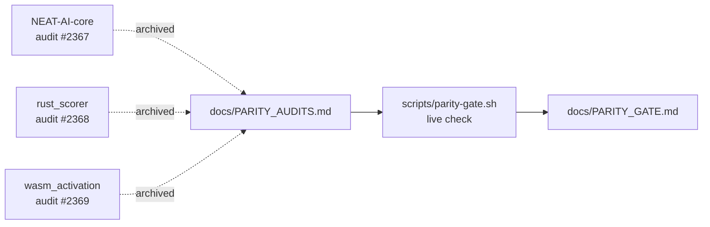

# Parity Audits — Archived

This document consolidates the three historical parity audits originally filed
as separate stubs. They are retained for context — current verification flows
through the live parity gate, not these audits.

> **Looking for the live check?** Run
> [`./scripts/parity-gate.sh`](../scripts/parity-gate.sh) — see
> [docs/PARITY_GATE.md](PARITY_GATE.md) for the full release checklist.

## Why these were archived

All three audits were one-shot snapshots of in-tree native code that has since
been removed:

- The in-repo Rust sources under `neat-core/`, `rust_scorer/`, and
  `wasm_activation/src/` were retired once
  [NEAT-AI-core](https://github.com/stSoftwareAU/NEAT-AI-core) became the single
  home for native logic (Issue #2341).
- This repository now consumes `wasm_activation/pkg/**` as a vendored artefact
  synced from a pinned `neatCore.rev` in `deno.json` (see
  [docs/CORE_DEPENDENCY_POLICY.md](CORE_DEPENDENCY_POLICY.md)).
- Drift is caught by the live parity gate
  ([`scripts/parity-gate.sh`](../scripts/parity-gate.sh)) running the
  TypeScript-side parity tests
  [`test/score/WasmJsScoreParity.ts`](../test/score/WasmJsScoreParity.ts) and
  [`test/costs/MSE.ts`](../test/costs/MSE.ts).

## NEAT-AI-core parity audit (Issue #2367)

The `neat-core/` audit compared every public item and test in the in-repo crate
with its NEAT-AI-core equivalent at the pinned `rev`. The in-repo crate has
since been removed; only the pinned external dependency remains.

Current alignment is enforced by:

- [`deno.json`](../deno.json) — `neatCore.repo` plus a 40-character
  `neatCore.rev` SHA.
- [`./build.sh`](../build.sh) — fetches `wasm_activation/pkg/**` from the pinned
  NEAT-AI-core release.
- [`./scripts/parity-gate.sh`](../scripts/parity-gate.sh) — invokes
  [`test/scripts/CoreDependencyPolicy.ts`](../test/scripts/CoreDependencyPolicy.ts)
  and the cross-boundary parity tests.

The original audit narrative lives in the merged PR for Issue #2367 (browse via
`git log` or GitHub's PR history); the per-PR summary file was pruned in Issue
#2958.

## rust_scorer parity audit (Issue #2368)

The `rust_scorer/` experiment lived in this repository while we prototyped
Rust-side scoring. It is no longer present — all native scoring code has moved
into NEAT-AI-core, consumed via `wasm_activation/pkg/**`.

Current scoring parity is verified by
[`test/score/WasmJsScoreParity.ts`](../test/score/WasmJsScoreParity.ts): the
test scores a deterministic synthetic creature end-to-end through the WASM
activation module and asserts the score is finite, non-negative and bounded
by 1.

The original audit narrative lives in the merged PR for Issue #2368 (browse via
`git log` or GitHub's PR history); the per-PR summary file was pruned in Issue
#2958.

## wasm_activation parity audit (Issue #2369)

`wasm_activation/src/` Rust sources have been removed. The runtime contract for
callers is unchanged: `wasm_activation/pkg/**` is still shipped and loaded by
TypeScript, and `deno.json` `neatCore.rev` remains the single source of truth
for the bundled revision.

Current activation parity is verified by the same WASM/JS score parity test plus
[`test/costs/MSE.ts`](../test/costs/MSE.ts), which exercises the Mean Squared
Error cost surface that crosses the WASM boundary.

The original audit narrative lives in the merged PR for Issue #2369 (browse via
`git log` or GitHub's PR history); the per-PR summary file was pruned in Issue
#2958.

## See also

- [docs/EXTERNAL_NEAT_AI_CORE.md](EXTERNAL_NEAT_AI_CORE.md) — cluster overview
  for the NEAT-AI-core dependency.
- [docs/CORE_DEPENDENCY_POLICY.md](CORE_DEPENDENCY_POLICY.md) — pinning, semver,
  and approval policy.
- [docs/PARITY_GATE.md](PARITY_GATE.md) — live parity gate runbook used today
  instead of these snapshots.
- [docs/CI_EXTERNAL_NEAT_AI_CORE.md](CI_EXTERNAL_NEAT_AI_CORE.md) — CI plumbing
  that enforces the policy on every PR.

---

**Up to:** [`README.md`](../README.md) (entry point) ·
[`docs/README.md`](README.md) (topic index).
