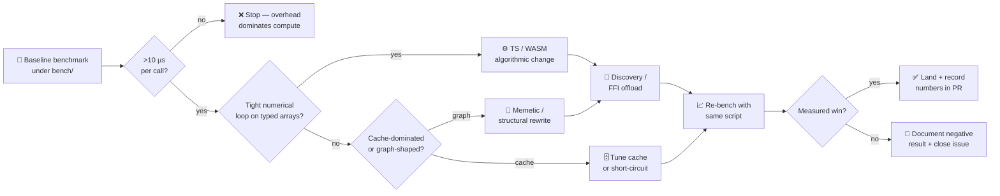

# 🔬 Performance Optimisation Guide

> **Brief**: A research log of every measured attempt to make NEAT-AI faster —
> what worked, what didn't, and the underlying reasons. Use this guide to decide
> whether a proposed optimisation (WASM migration, SIMD expansion, algorithmic
> change) is worth pursuing **before** writing code. For day-to-day operational
> tuning, see [PERFORMANCE_TUNING.md](./PERFORMANCE_TUNING.md).

## 📑 In this cluster

The performance documentation cluster is split across three companion docs. Pick
whichever matches your task:

- **PERFORMANCE_RESEARCH.md** (this file) — investigation log: which
  optimisations worked, which did not, and why.
- **[PERFORMANCE_TUNING.md](./PERFORMANCE_TUNING.md)** — operational knobs for a
  running training pipeline (caches, thread pools, memory).
- **[PREDICTIVE_CODING_BENCHMARKS.md](./PREDICTIVE_CODING_BENCHMARKS.md)** —
  benchmark companion to the [Predictive Coding](./PREDICTIVE_CODING.md) deep
  dive.

See also the [docs index](./README.md) for the full topic map.

## 🧪 Acronyms used in this guide

- **CPU** — Central Processing Unit
- **GPU** — Graphics Processing Unit
- **WASM** — WebAssembly
- **FFI** — Foreign Function Interface (the JavaScript ↔ Rust boundary)
- **SIMD** — Single Instruction, Multiple Data (vector arithmetic)
- **MCMC** — Markov Chain Monte Carlo (used for mutation acceptance)
- **LRU** — Least Recently Used (cache eviction policy)
- **JIT** — Just-In-Time (compilation, as in V8)
- **MSE / MAE / MAPE / RMSE** — Mean Squared Error / Mean Absolute Error / Mean
  Absolute Percentage Error / Root Mean Squared Error
- **UUID** — Universally Unique IDentifier

## 🛣️ Optimisation pipeline overview

The flowchart below shows the staged path NEAT-AI applies to every potential
hotspot. The same pipeline is the lens through which every claim in the rest of
this guide is evaluated.



The **baseline → algorithmic change → measured outcome** loop is the only path
that has produced repeatable wins. Skipping the baseline step or assuming that
"WASM is faster" without measurement has consistently produced negative results
(see issues
[#1630](https://github.com/stSoftwareAU/NEAT-AI/issues/1630)–[#1633](https://github.com/stSoftwareAU/NEAT-AI/issues/1633)
and the WASM-resident assessment further down).

This guide captures learnings from systematic performance investigations in
NEAT-AI, including several WASM migration experiments and TypeScript-level
optimisations. The goal is to help contributors identify which optimisation
strategies are likely to succeed and which are not worth pursuing.

All benchmarks were run on Apple M4 Pro (CPU) and M2 Ultra (CPU), Deno 2.7.x
(aarch64-apple-darwin), unless otherwise stated.

> [!NOTE]
> Absolute timings will differ on other hardware, but the relative ratios
> between approaches (e.g., serialisation overhead vs computation time) are
> consistent across platforms. Where a number was captured, the source benchmark
> script is named in the surrounding text or referenced in the linked issue.

## ✅ When WASM Migration Works

WASM migration is effective for **tight numerical loops** with high arithmetic
intensity relative to data marshalling cost. The existing WASM coverage in
NEAT-AI is well-targeted:

- **Activation functions** — pure numerical transforms applied per-neuron
- **Forward pass** — batched matrix-style computation
- **Error distribution** — fused gradient arithmetic
  ([#1377](https://github.com/stSoftwareAU/NEAT-AI/issues/1377))
- **Batch accumulation** — weight/bias gradient sums
- **SIMD operations** — leveraging hardware vector instructions in Rust

These operations share a common pattern: the data is already in a compact
numerical format (typed arrays), the computation is CPU-intensive, and the
result is a similarly compact numerical output. The JS↔WASM boundary crossing
cost (~100–500 ns) is negligible relative to the computation time.

## ❌ When WASM Migration Does NOT Work

Four systematic investigations
([#1630](https://github.com/stSoftwareAU/NEAT-AI/issues/1630),
[#1631](https://github.com/stSoftwareAU/NEAT-AI/issues/1631),
[#1632](https://github.com/stSoftwareAU/NEAT-AI/issues/1632),
[#1633](https://github.com/stSoftwareAU/NEAT-AI/issues/1633)) explored migrating
remaining TypeScript hotspots to Rust/WASM. All four yielded negative results,
producing valuable learnings.

### 🕸️ Graph-Structure Manipulation (Breeding/Crossover)

**Investigation:** [#1632](https://github.com/stSoftwareAU/NEAT-AI/issues/1632)

The WASM topology computation itself was 300–1,600x faster than TypeScript in
isolation, but serialisation overhead dominated the end-to-end time:

| Size   | WASM Call Only | Serialise + WASM | TS Breed |
| ------ | -------------- | ---------------- | -------- |
| Small  | 1.5 µs         | 264 µs           | 468 µs   |
| Medium | 48 µs          | 23 ms            | 47 ms    |
| Large  | 1.1 ms         | 751 ms           | 1.7 s    |

Converting UUID-keyed `Map<string, Neuron>` objects to flat `Uint32Array` for
WASM consumed 99%+ of end-to-end time. V8's hash tables are already highly
optimised for this workload.

A follow-up investigation
([#1644](https://github.com/stSoftwareAU/NEAT-AI/issues/1644)) confirmed that
even pure TypeScript allocation optimisations (eliminating thousands of
intermediate objects) yielded only ~1–2% improvement, because V8's generational
garbage collector handles short-lived objects efficiently.

### ⚡ Trivially Fast Operations (Rejection Sampling, Compatibility Scoring)

**Investigations:**
[#1631](https://github.com/stSoftwareAU/NEAT-AI/issues/1631),
[#1633](https://github.com/stSoftwareAU/NEAT-AI/issues/1633)

When the JS computation itself takes only 1–2 µs, the WASM boundary crossing
overhead alone (100–500 ns for argument marshalling) represents a significant
fraction of the total time. Serialising the topology for WASM took ~70 µs — 50x
more than the computation being migrated.

| Metric                     | Time    | Notes                        |
| -------------------------- | ------- | ---------------------------- |
| JS rejection sampling      | 1.4 µs  | The actual computation       |
| WASM call (pre-serialised) | 48 µs   | Just the WASM function       |
| Serialisation overhead     | 70.5 µs | Extracting topology for WASM |

> [!WARNING]
> Do not assume WASM is faster simply because it runs closer to the metal. For
> operations that complete in under 2 µs in TypeScript, the serialisation
> overhead alone is 35–50x higher than the original computation. Always
> benchmark end-to-end (including serialisation), not just the isolated WASM
> function call.

### 🗄️ Cache-Dominated Paths

**Investigation:** [#1633](https://github.com/stSoftwareAU/NEAT-AI/issues/1633)

The LRU distance cache
([#1293](https://github.com/stSoftwareAU/NEAT-AI/issues/1293)) already
eliminates most redundant compatibility scoring work:

| Metric             | Time/iter | Notes                        |
| ------------------ | --------- | ---------------------------- |
| Cache hit          | 66.3 ns   | Already below WASM overhead  |
| Cache miss         | 521.2 ns  | 7.86x slower than hit        |
| Full pairwise warm | 118.9 µs  | ~97 ns/pair for 50 creatures |

Cache hit rates are high: 100% for stable populations, ~64% with 20% population
turnover. At 66 ns per cache hit, migrating to WASM would actually be slower
than the cached TypeScript path.

### 🔗 Sequential Graph Traversal (Backpropagation Orchestration)

**Investigation:** [#1630](https://github.com/stSoftwareAU/NEAT-AI/issues/1630)

Backpropagation is inherently sequential — each neuron's gradient depends on
downstream neurons. Profiling a medium network (117 neurons, 910 synapses)
showed:

| Component                 | Time   | % of Total |
| ------------------------- | ------ | ---------- |
| Recursive error traversal | 4.3 ms | ~91%       |
| Weight/bias accumulation  | 0.4 ms | ~9%        |
| WASM boundary crossings   | 15 µs  | **~0.3%**  |

The fused error distribution
([#1377](https://github.com/stSoftwareAU/NEAT-AI/issues/1377)) had already
eliminated the largest per-neuron boundary crossing overhead. The remaining 91%
of time is in recursive TypeScript graph traversal that cannot be parallelised
or offloaded without moving the entire creature state into WASM.

## 📈 What DOES Work for Optimisation

The most effective optimisations in NEAT-AI have been TypeScript-level
algorithmic improvements.

### 🗂️ Batching Expensive Operations

**PR:** [#1590](https://github.com/stSoftwareAU/NEAT-AI/pull/1590) (from
[#1583](https://github.com/stSoftwareAU/NEAT-AI/issues/1583))

Deferring `fix()` and `validate()` calls until after the full mutation loop
(instead of calling them after every atomic mutation) yielded 33–51%
improvement:

| Benchmark                             | Before   | After   | Speedup |
| ------------------------------------- | -------- | ------- | ------- |
| 50 creatures, mutationAmount=3        | 24.5 ms  | 16.5 ms | **33%** |
| 50 creatures, mutationAmount=5        | 33.9 ms  | 20.6 ms | **39%** |
| 50 creatures, mutationAmount=10       | 61.6 ms  | 31.7 ms | **49%** |
| 20 large creatures, mutationAmount=5  | 91.2 ms  | 52.3 ms | **43%** |
| 20 large creatures, mutationAmount=10 | 162.9 ms | 80.3 ms | **51%** |

**Lesson:** Look for operations that are repeated unnecessarily in loops.
Topology cache rebuilds and graph traversal are expensive; doing them once
instead of N times gives linear speedup.

### 🧹 Removing Redundant Work

**PR:** [#1591](https://github.com/stSoftwareAU/NEAT-AI/pull/1591) (from
[#1584](https://github.com/stSoftwareAU/NEAT-AI/issues/1584))

Eliminating duplicate `validate()` calls in `AddConnection.mutate()` yielded
8–11% improvement:

| Creature Size | Before   | After    | Improvement |
| ------------- | -------- | -------- | ----------- |
| Sparse        | 128.9 µs | 114.5 µs | **11.2%**   |
| Medium        | 617.0 µs | 555.9 µs | **9.9%**    |
| Large         | 2.4 ms   | 2.2 ms   | **8.3%**    |

**Lesson:** Audit call chains for repeated validation, caching, or
initialisation that could be eliminated.

### 🐑 Better Cloning Strategies

**PR:** [#1593](https://github.com/stSoftwareAU/NEAT-AI/pull/1593) (from
[#1586](https://github.com/stSoftwareAU/NEAT-AI/issues/1586))

Replacing `Creature.fromJSON(creature.exportJSON())` with `shallowClone()` for
in-process mutation backup yielded 2.4–3.5x improvement:

| Creature Size | JSON Clone | shallowClone | Speedup   |
| ------------- | ---------- | ------------ | --------- |
| Small         | 21.8 µs    | 9.2 µs       | **2.37x** |
| Medium        | 1.0 ms     | 283.6 µs     | **3.54x** |
| Large         | 5.0 ms     | 1.6 ms       | **3.13x** |

**Lesson:** JSON round-tripping is expensive. When data stays in-process,
structured cloning or shallow copies avoid serialisation overhead entirely.

> [!TIP]
> JSON round-tripping (`exportJSON` → `fromJSON`) should only be used when
> persisting creatures to disk or sending them across a worker boundary. For all
> in-process operations (mutation backups, speciation copies), prefer
> `shallowClone()` — it is 2.4–3.5x faster and avoids the full
> serialisation/deserialisation cycle.

### 🎲 Better Algorithms

**PR:** [#1594](https://github.com/stSoftwareAU/NEAT-AI/pull/1594) (from
[#1587](https://github.com/stSoftwareAU/NEAT-AI/issues/1587))

Replacing O(N²) enumeration of available connections with rejection sampling
yielded 9–12% improvement:

| Creature Size | Before   | After    | Improvement |
| ------------- | -------- | -------- | ----------- |
| Sparse        | 125.9 µs | 110.4 µs | **12%**     |
| Medium        | 589.8 µs | 537.6 µs | **9%**      |
| Large         | 2.3 ms   | 2.1 ms   | **9%**      |
| Very Large    | 14.6 ms  | 13.2 ms  | **10%**     |

**Lesson:** For sparse networks (the typical NEAT scenario), probabilistic
algorithms that exploit sparsity outperform exhaustive enumeration. The
rejection sampling approach finds valid connections in 1–2 attempts, eliminating
full list construction.

## 🧱 The Serialisation Wall

The JS↔WASM boundary crossing cost is the primary barrier for migrating
remaining operations. The pattern is consistent across all negative-result
investigations:

1. **Data lives in JS objects** — `Map<string, Neuron>`, UUID-keyed lookups,
   polymorphic objects
2. **Serialisation to WASM** — converting to flat typed arrays takes 50–1,000x
   longer than the computation itself
3. **WASM computation** — typically 300–1,600x faster than JS in isolation
4. **Serialisation back** — reconstructing JS objects from WASM output

The net result is that serialisation overhead cancels out WASM compute gains for
all remaining non-numerical operations.

### 🔭 Future Directions

Future performance gains from WASM require **architectural changes** rather than
piecemeal migration:

- **WASM-resident creature state** — keeping the neural network topology in WASM
  memory permanently, eliminating per-operation serialisation
- **Batch API design** — grouping multiple operations into single WASM calls to
  amortise boundary crossing cost (implemented in #1960:
  `calculateWeightBatch4Way`, `calculateBiasBatch4Way`, `validateTopologyBatch`)
- **Typed array topology** — replacing `Map<string, Neuron>` with indexed arrays
  that can be shared directly with WASM via `SharedArrayBuffer` (implemented in
  #1957: `TypedTopology`)

The batch API (#1960) and typed array topology (#1957) are now implemented.
WASM-resident creature state remains as a potential future optimisation.

## 🧭 Decision Framework

When considering a performance optimisation, use this checklist:

### Try WASM migration when:

- [ ] The operation involves tight numerical loops (activation, gradient, loss)
- [ ] Input/output data is already in typed arrays or can be cheaply converted
- [ ] The computation takes >10 µs per call (to justify boundary crossing)
- [ ] There is no caching layer that already short-circuits the computation

### Try TypeScript-level optimisation when:

- [ ] The operation involves graph structures, Maps, or string-keyed objects
- [ ] There are repeated/redundant calls that could be batched or eliminated
- [ ] Serialisation (JSON, structured clone) could be replaced with lighter
      alternatives
- [ ] An algorithmic improvement (better data structure, probabilistic method)
      could reduce complexity class

### 🧪 Measure before committing:

- [ ] Create a benchmark that isolates the operation being optimised
- [ ] Measure both the computation and any serialisation/boundary overhead
- [ ] A negative result is a valuable result — document it and move on

> [!NOTE]
> Negative benchmark results are first-class contributions. When a WASM
> migration attempt yields no improvement, documenting the serialisation
> overhead and the measured timings saves future contributors from repeating the
> same investigation. See the four linked issues above as examples of
> well-documented negative results.

## 🔄 evolveDir Hotspot WASM Migration Evaluation (Issue #2278)

A systematic evaluation of every remaining evolveDir hotspot against the WASM
migration decision framework, conducted after TypedTopology (#1957), Batch API
(#1960), and worker pool separation (#2243) were implemented.

### Profiling Baseline (from Issue #2274)

Per-generation phase breakdown on Apple M2 Ultra, Deno 2.7.12:

| Phase          | % of Generation Time | Character                |
| -------------- | -------------------- | ------------------------ |
| Breeding       | 50–60%               | Graph manipulation       |
| Fitness        | 13–19%               | Already WASM-accelerated |
| Mutation       | 4–10%                | Trivially fast per-op    |
| De-duplication | 6–9%                 | Bloom filter + Set ops   |
| Speciation     | <1%                  | Architecture bucketing   |

### Operation 1: Breeding / Crossover (50–60%)

| Criterion             | Result                                                                                     |
| --------------------- | ------------------------------------------------------------------------------------------ |
| Tight numerical loop? | ✗ NO — graph manipulation with Map lookups, Set intersections, connectivity fingerprinting |
| Typed array data?     | ✗ NO — `Map<number, Neuron>`, `ConnectionRef`, `Set<number>`, UUID strings                 |
| >10 µs per call?      | ✓ YES — ~382 µs (small, 20 neurons), ~6.0 ms (medium, 80 neurons)                          |
| Caching layer?        | ✗ NO (deferred ConnectionRef avoids allocation but not computation)                        |

**Verdict: NOT a WASM candidate.** The serialisation wall applies directly.
Investigation #1632 confirmed that converting `Map<string, Neuron>` objects to
flat `Uint32Array` consumed 99%+ of end-to-end time. Breeding involves:

- Building `Map<number, Neuron>` lookups for both parents
- Set-based connection deduplication (`Set<number>`)
- Dependency resolution loops with Map.get() on each neuron
- UUID-based neuron matching across parents
- Neuron sorting by dependency index

None of these are numerical loops. The data lives in polymorphic JS objects that
require expensive serialisation for WASM transfer.

### Operation 2: Fitness Evaluation — Cost Functions (13–19%)

| Criterion             | Result                                             |
| --------------------- | -------------------------------------------------- |
| Tight numerical loop? | ✓ YES — per-element arithmetic over output arrays  |
| Typed array data?     | ✓ YES — `Float32Array` inputs and outputs          |
| >10 µs per call?      | ✗ NO — ~419 ns (10 outputs), ~609 ns (100 outputs) |
| Caching layer?        | ✗ NO                                               |

**Verdict: ALREADY IN WASM.** The fused batch loss functions
(`mseSumBatchPacked`, `maeSumBatchPacked`, `crossEntropySumBatchPacked`,
`mapeSumBatchPacked`, `msleSumBatchPacked`, `hingeSumBatchPacked`) in
`wasm_activation/src/loss.rs` are used for all forward-only creatures via
`evaluateDir()`. The JS cost functions in `src/costs/` serve only as fallback
for unsupported cost types or non-forward-only topologies.

Benchmark confirms JS cost functions are trivially fast (<1 µs even for 100
outputs), well below the WASM boundary crossing threshold. The WASM batch loss
functions amortise boundary crossing across multiple records, making them
efficient for the real hot path.

### Operation 3: Genetic Compatibility (used across breeding & speciation)

| Criterion             | Result                                                                           |
| --------------------- | -------------------------------------------------------------------------------- |
| Tight numerical loop? | ✗ NO — `Set<string>` intersection on neuron wire keys                            |
| Typed array data?     | ✗ NO — `Set<string>` of UUID wire keys                                           |
| >10 µs per call?      | ✗ NO — cache hits at ~70 ns, misses at ~277 µs (creature construction dominated) |
| Caching layer?        | ✓ YES — LRU distance cache (10K entries, Issue #1293)                            |

**Verdict: NOT a WASM candidate.** Cache-dominated path. At ~70 ns per cache
hit, this is already 1.4–7x faster than WASM boundary crossing overhead
(~100–500 ns). The cache miss path is dominated by creature construction and
`getHiddenNeuronWireKeys()`, not by numerical computation.

### Operation 4: Mutation — ModWeight / ModBias (4–10%)

| Criterion             | Result                                                                                                                |
| --------------------- | --------------------------------------------------------------------------------------------------------------------- |
| Tight numerical loop? | ✗ NO — O(1) scalar arithmetic per mutation                                                                            |
| Typed array data?     | ✗ NO — individual `Neuron` and `Synapse` objects                                                                      |
| >10 µs per call?      | ✓ YES — ~21 µs (but dominated by `Creature.fromJSON` clone overhead in benchmarks; real in-place mutation is ~1–2 µs) |
| Caching layer?        | ✗ NO                                                                                                                  |

**Verdict: NOT a WASM candidate.** Individual mutation operations (ModWeight,
ModBias, ModSquash) perform O(1) scalar arithmetic — adding a delta to a single
weight or bias value. The actual computation is trivially fast (~1–2 µs). The
measured ~21 µs includes creature cloning overhead from `Creature.fromJSON()`,
which is itself a serialisation operation unrelated to the mutation computation.

Structural mutations (AddConnection, AddNeuron, SubNeuron) involve graph
topology changes with Map lookups and array splicing — the serialisation wall
applies to these just as it does to breeding.

### Operation 5: De-duplication — Bloom Filter + Set (6–9%)

| Criterion             | Result                                                     |
| --------------------- | ---------------------------------------------------------- |
| Tight numerical loop? | ✗ NO — Bloom filter hash checks + `Set<string>` membership |
| Typed array data?     | ✗ NO — UUID strings                                        |
| >10 µs per call?      | ✓ YES — ~21 µs for UUID computation per creature           |
| Caching layer?        | ✓ Bloom filter IS the fast rejection path                  |

**Verdict: NOT a WASM candidate.** De-duplication involves:

1. Computing a deterministic UUID from creature structure (~21 µs per creature)
2. Bloom filter pre-check (`mayContain()`) for fast rejection
3. Exact `Set.has()` confirmation on Bloom filter positives
4. Replacement breeding for confirmed duplicates

The Bloom filter already provides fast O(1) rejection for the common case
(unique creatures). The UUID computation is a hash over the creature's topology
— a string-based operation, not a numerical loop.

### Operation 6: Speciation — Genus Assignment (<1%)

| Criterion             | Result                                                                   |
| --------------------- | ------------------------------------------------------------------------ |
| Tight numerical loop? | ✗ NO — architecture bucketing with string concatenation                  |
| Typed array data?     | ✗ NO — neuron objects, string keys                                       |
| >10 µs per call?      | ✓ YES — ~50 µs for architecture key computation (includes topology hash) |
| Caching layer?        | ✓ YES — topology hash is cached on creature                              |

**Verdict: NOT a WASM candidate.** Speciation consumes <1% of generation time.
Even if WASM could accelerate it, the potential savings are negligible in
absolute terms (<0.6 ms per generation at the largest measured configuration).

### Operation 7: WASM Activation (baseline comparison)

For reference, WASM-accelerated forward pass timings:

| Creature Size | Time per Activation |
| ------------- | ------------------- |
| Small (20n)   | ~724 ns             |
| Medium (80n)  | ~3.6 µs             |

These demonstrate the kind of operation that benefits from WASM: tight numerical
loops over typed arrays where computation dominates boundary crossing cost.

### Summary: No New WASM Migration Opportunities

All seven evaluated operations fall into one of three categories:

1. **Already in WASM** (Operation 2 — fitness/loss functions): No action needed.
2. **Blocked by the serialisation wall** (Operations 1, 4, 5, 6):
   Graph-structure manipulation with `Map`/`Set`/UUID data that requires
   expensive marshalling.
3. **Cache-dominated** (Operation 3): LRU cache hits at 70 ns, already below
   WASM boundary crossing cost.

The remaining hotspot (breeding at 50–60%) is fundamentally constrained by the
same serialisation wall documented in investigations #1630–#1633. The
implementation of TypedTopology (#1957) and Batch API (#1960) did not change
this conclusion — breeding still operates on `Map<number, Neuron>` and
`Set<number>` data structures that live in JavaScript heap space.

## 🏠 WASM-Resident Creature State Feasibility Assessment

### What is WASM-Resident Creature State?

Rather than serialising creature data to WASM for each operation (the current
approach), WASM-resident state would keep the neural network topology
**permanently** in WASM linear memory. Operations would manipulate the WASM-side
data directly, eliminating per-operation serialisation overhead entirely.

### Estimated Benefit

Based on the profiling data:

- **Breeding (50–60%):** If creature state lived in WASM, parent topology data
  would already be in WASM-accessible format. However, breeding operations
  (crossover, dependency resolution, neuron matching) require complex graph
  traversal that is not easily expressed in Rust without reimplementing the
  entire breeding algorithm. Estimated benefit: **20–40% reduction** in breeding
  time (eliminating Map construction overhead), but only if the full breeding
  algorithm is also ported to Rust.

- **Fitness (13–19%):** Already WASM-accelerated via compiled networks. WASM-
  resident state could eliminate the `compileCreatureToWasm()` step (~5–20 µs
  per creature), saving **<1%** of total generation time.

- **Mutation (4–10%):** Individual mutations would operate directly on WASM
  memory instead of JS objects. Estimated benefit: **negligible** — mutations
  are already O(1) scalar operations.

- **Total estimated benefit:** 10–25% generation time reduction, but only if
  breeding is fully reimplemented in Rust/WASM.

### Architectural Changes Required

1. **Dual-format topology representation:**
   - WASM-side: indexed arrays (`Uint32Array` for connectivity, `Float64Array`
     for weights/biases) in WASM linear memory
   - JS-side: thin proxy objects that read/write WASM memory directly
   - Synchronisation protocol for mutations that change topology structure

2. **Breeding algorithm in Rust:**
   - Port `Offspring.breed()` including neuron matching, dependency resolution,
     and connection deduplication
   - Handle UUID-based neuron identity matching across parents
   - Support both standard crossover and inter-species breeding paths

3. **Mutation operators in Rust:**
   - Port all 12 mutation operators to operate on WASM-resident data
   - Maintain the same MCMC acceptance/rejection semantics
   - Preserve focus-list and prediction-error-guided mutation support

4. **Memory management:**
   - WASM linear memory allocation/deallocation for creature lifecycle
   - Handle population-scale memory (150+ creatures × variable topology)
   - Coordinate with V8 garbage collection for proxy objects

### Estimated Effort

- **Phase 1** (WASM-resident topology): 4–6 weeks
  - Implement indexed array representation in WASM linear memory
  - Create JS proxy layer for read/write access
  - Port `compileCreatureToWasm()` to work with resident state

- **Phase 2** (Breeding in Rust): 6–10 weeks
  - Port standard crossover with UUID matching
  - Port inter-species breeding (InputWeightCrossover, SubgraphTransplant)
  - Port father compatibility adjustment (createCompatibleFather)
  - Handle all edge cases (forward-only constraints, IF neurons, etc.)

- **Phase 3** (Mutation in Rust): 3–4 weeks
  - Port 12 mutation operators
  - Maintain MCMC semantics and focus-list support

**Total: ~13–20 weeks of focused development.**

### Recommendation

**Not recommended at this time.** The effort-to-benefit ratio is unfavourable:

1. **The benefit is uncertain.** The 20–40% breeding speedup estimate assumes
   that Rust graph traversal would be significantly faster than V8's optimised
   hash tables — this is not guaranteed given V8's highly optimised Map
   implementation.

2. **The risk is high.** Reimplementing the entire breeding/mutation pipeline in
   Rust introduces a large surface area for correctness bugs, especially around
   UUID identity preservation and forward-only topology constraints.

3. **Better alternatives exist.** TypeScript-level algorithmic improvements
   (batching, redundant work elimination, better cloning) have consistently
   delivered 10–50% gains with 1–2 week implementation effort.

4. **Prerequisites are incomplete.** Full TypedTopology coverage (#1957) is
   needed before WASM-resident state is practical. Many code paths still use
   `Map<string, Neuron>` rather than indexed arrays.

**Future trigger conditions:**

- If TypedTopology coverage reaches >90% of breeding/mutation paths
- If a production workload demonstrates that breeding time is the critical
  bottleneck limiting evolution quality (not just wall-clock time)
- If SharedArrayBuffer support improves to allow zero-copy sharing between JS
  and WASM for topology data

## 🔬 SIMD Expansion Viability Investigation (Issue #2277)

A systematic profiling of 5 candidate numerical operations against the WASM/SIMD
decision framework to determine whether additional SIMD optimisations can
increase throughput in the evolution pipeline.

### Existing SIMD Coverage

The current SIMD usage (`weighted_sum_simd()` in `wasm_activation/src/simd.rs`)
targets the activation forward pass — dual-accumulator `f32x4` with relaxed
fused multiply-add. This is the only operation in the codebase where:

- The loop count is large enough (8+ synapses per neuron × many neurons)
- The data is already in typed arrays (compiled network format)
- The per-call time exceeds 10 µs (medium networks: ~3.2 µs per activation)
- No caching layer short-circuits the computation

### Profiling Results

All benchmarks on Apple M2 Ultra, Deno 2.7.12 (aarch64-apple-darwin).

#### Candidate 1: Loss/Cost Error Reduction

Per-element error loops (MSE, MAE, CrossEntropy) over output neurons.

| Operation    | Output Size | Time/iter |
| ------------ | ----------- | --------- |
| MSE          | 3 (typical) | 6.1 ns    |
| MSE          | 10          | 9.8 ns    |
| MSE          | 100         | 77.1 ns   |
| MAE          | 100         | 75.5 ns   |
| CrossEntropy | 100         | 1.4 µs    |

| Criterion             | Result                                               |
| --------------------- | ---------------------------------------------------- |
| Tight numerical loop? | ✓ YES — per-element arithmetic over Float32Array     |
| Typed array data?     | ✓ YES — Float32Array inputs and outputs              |
| >10 µs per call?      | ✗ NO — 6 ns (3 outputs) to 1.4 µs (100 CrossEntropy) |
| Caching layer?        | ✗ NO                                                 |

**Verdict: NOT SIMD-viable.** Typical NEAT creatures have 1–10 outputs, giving
loop counts of 1–10 elements — far too small for SIMD to amortise setup cost.
Even the worst case (100-output CrossEntropy at 1.4 µs) is well below the 10 µs
threshold. Additionally, the batch loss functions in `loss.rs` already use SIMD
for the activation step — the per-output error reduction is a tiny fraction of
the total batch scoring time.

#### Candidate 2: Gradient Accumulation Arithmetic

Weight/bias gradient sums during backpropagation.

| Operation                 | Time/iter |
| ------------------------- | --------- |
| accumulateWeight (single) | 6.4 ns    |
| accumulateWeightBatch4Way | 22.6 ns   |
| accumulateWeightBatch8Way | 40.6 ns   |
| accumulateBiasBatch4Way   | 45.7 ns   |
| accumulateBiasBatch8Way   | 1.9 µs    |

| Criterion             | Result                                                      |
| --------------------- | ----------------------------------------------------------- |
| Tight numerical loop? | ✗ PARTIAL — branchy per-item logic (is_finite, sign, plank) |
| Typed array data?     | ✓ YES — f64 arrays passed to WASM                           |
| >10 µs per call?      | ✗ NO — 6.4 ns (single) to 1.9 µs (8-way bias)               |
| Caching layer?        | ✗ NO                                                        |

**Verdict: NOT SIMD-viable.** Three factors disqualify SIMD:

1. **Branchy logic**: Each item involves 6+ conditional paths (is_finite checks,
   sign tests, plank_constant comparisons, positive/negative activation
   tracking). SIMD requires uniform control flow across lanes.
2. **f64 data type**: WASM SIMD provides `f64x2` (only 2-wide parallelism)
   compared to `f32x4` (4-wide). The existing 4-way and 8-way batching already
   achieves better parallelism through loop unrolling than `f64x2` could
   provide.
3. **Below threshold**: Even the largest batch (8-way bias at 1.9 µs) is well
   below 10 µs.

#### Candidate 3: Score Statistics Extraction

Weight/bias magnitude scanning for penalty calculation in `Score.ts`.

| Operation                     | Time/iter |
| ----------------------------- | --------- |
| WASM activation (20 hidden)   | 935.7 ns  |
| WASM activation (80 hidden)   | 3.2 µs    |
| Score calculate (cached path) | 106.0 ns  |

| Criterion             | Result                                                  |
| --------------------- | ------------------------------------------------------- |
| Tight numerical loop? | ✓ YES — iterate synapses, compute abs, track max/sum    |
| Typed array data?     | ✓ YES — compiled network data in WASM                   |
| >10 µs per call?      | ✗ NO — 106 ns (cached) to 3.2 µs (medium activation)    |
| Caching layer?        | ✓ YES — `CachedScoreComponents` prevents repeated scans |

**Verdict: ALREADY IN WASM and cached.** The scan functions
(`wasmScanMaxWeight`, `wasmScanMaxBias`, `wasmComputeScoreComponents`) are
already implemented in Rust (`score_scan.rs`). Results are cached per creature
via `CachedScoreComponents`. The cached path completes in 106 ns — adding SIMD
to the Rust scan loops would save at most a few hundred nanoseconds on the
uncached path, which fires once per creature per score recalculation.

#### Candidate 4: Population Score Aggregation

Average score and sorting of creature score arrays.

| Operation                               | Time/iter |
| --------------------------------------- | --------- |
| Avg score — 50 creatures (typed array)  | 31.2 ns   |
| Avg score — 150 creatures (typed array) | 111.0 ns  |
| Avg score — 500 creatures (typed array) | 468.1 ns  |
| Avg score — 50 creatures (JS objects)   | 36.2 ns   |
| Avg score — 500 creatures (JS objects)  | 455.1 ns  |
| Sort scores — 150 creatures             | 11.8 µs   |
| Sort scores — 500 creatures             | 65.3 µs   |

| Criterion             | Result                                                 |
| --------------------- | ------------------------------------------------------ |
| Tight numerical loop? | ✓ YES (sum) / ✗ NO (sort is comparison-based)          |
| Typed array data?     | ✗ NO — scores live on JS Creature objects              |
| >10 µs per call?      | ✗ NO (sum) / BORDERLINE (sort at 500 creatures: 65 µs) |
| Caching layer?        | ✗ NO                                                   |

**Verdict: NOT SIMD-viable.** The sum operation (31–468 ns) is trivially fast
and well below threshold. Sorting (the only operation exceeding 10 µs at large
population sizes) is comparison-based — not a SIMD-friendly pattern. More
importantly, scores live on heterogeneous JS `Creature` objects, not typed
arrays. Extracting them to a typed array would add allocation overhead that
likely exceeds the SIMD benefit. V8's optimised `Array.sort()` already uses
Timsort with JIT-compiled comparators.

#### Candidate 5: Pairwise Genetic Distance

Set<string> intersection on hidden neuron wire keys.

| Operation                     | Time/iter |
| ----------------------------- | --------- |
| Set intersection — 20 neurons | 111.9 ns  |
| Set intersection — 80 neurons | 401.0 ns  |

| Criterion             | Result                                                     |
| --------------------- | ---------------------------------------------------------- |
| Tight numerical loop? | ✗ NO — `Set<string>.has()` is hash-based string comparison |
| Typed array data?     | ✗ NO — `Set<string>` of UUID wire keys                     |
| >10 µs per call?      | ✗ NO — 112–401 ns for the intersection itself              |
| Caching layer?        | ✓ YES — LRU distance cache (10K entries, Issue #1293)      |

**Verdict: NOT SIMD-viable.** This is a string-based Set intersection, not a
numerical loop. Even the uncached intersection (401 ns for 80 neurons) is well
below threshold. The LRU cache further reduces the effective cost with ~64% hit
rate at typical population turnover.

### Summary: No New SIMD Expansion Opportunities

| Candidate                | Tight Loop | Typed Array | >10 µs | No Cache | SIMD Viable  |
| ------------------------ | ---------- | ----------- | ------ | -------- | ------------ |
| 1. Loss error reduction  | YES        | YES         | NO     | —        | ✗            |
| 2. Gradient accumulation | PARTIAL    | YES         | NO     | —        | ✗            |
| 3. Score statistics      | YES        | YES         | NO     | CACHED   | Already WASM |
| 4. Population stats      | YES/NO     | NO          | NO     | —        | ✗            |
| 5. Genetic distance      | NO         | NO          | NO     | CACHED   | ✗            |

None of the 5 candidates qualify for SIMD expansion. The existing SIMD coverage
(dual-accumulator weighted sum in the activation forward pass) remains the only
operation where SIMD provides meaningful benefit. It is the only tight numerical
loop over typed arrays that processes enough data per call for SIMD to amortise
setup overhead.

**Key insight:** The SIMD viability threshold (>10 µs per call) is the binding
constraint. All candidate operations complete in nanoseconds to low
microseconds. The operations that do exceed 10 µs in the evolution pipeline
(breeding, sorting) are graph-structured or comparison-based — fundamentally
incompatible with SIMD's data-parallel execution model.

This is a negative result. It confirms that the current SIMD coverage is
well-targeted and there are no additional SIMD expansion opportunities in the
evolution pipeline at this time.

## 🧾 Reproducing the numbers in this guide

Every benchmark cited above is backed by a script under [`bench/`](../bench/).
The most relevant scripts are:

| Topic                                | Bench script(s)                                                          |
| ------------------------------------ | ------------------------------------------------------------------------ |
| Breeding / crossover                 | `bench/BreedPerformance.ts`, `bench/ParallelBreeding.ts`                 |
| Breeding sub-phase profile           | `bench/BreedingSubPhaseProfile.ts`                                       |
| Backprop allocation / WASM overhead  | `bench/BackpropAllocation.ts`, `bench/BackpropWasmOverhead.ts`           |
| Topological backprop profile         | `bench/TopologicalBackpropProfile.ts`                                    |
| Discovery batch validation / timeout | `bench/BatchDiscoveryValidation.ts`, `bench/AdaptiveDiscoveryTimeout.ts` |
| `evolveDir` per-phase profile        | `bench/EvolveDirPhaseProfile.ts`, `bench/ProfileEvolveDirPhases.ts`      |
| `evolveDir` WASM migration analysis  | `bench/EvolveDirWasmMigrationAnalysis.ts`                                |
| Production-scale evolveDir profile   | `bench/ProductionScaleEvolveDirProfile.ts`                               |
| WASM activation                      | `bench/ActivateWasm.ts`, `bench/Activate.ts`                             |
| Distance / compatibility cache       | `bench/DistanceCacheHitRate.ts`                                          |

Run any benchmark with:

```bash
deno bench --allow-read --allow-env --allow-ffi bench/<Script>.ts
```

If a number in this guide no longer matches a fresh local run, **update the
table and add a follow-up note** rather than deleting the prior figure — history
matters for negative-result investigations.

## 📚 See Also

- [PERFORMANCE_TUNING.md](./PERFORMANCE_TUNING.md) — Operational tuning guide
  for WASM caches, thread pools, memory management, and scaling.
- [PREDICTIVE_CODING.md](./PREDICTIVE_CODING.md) — Deep dive on the predictive
  coding training mode (theory and architecture).
- [PREDICTIVE_CODING_BENCHMARKS.md](./PREDICTIVE_CODING_BENCHMARKS.md) —
  Benchmark companion to the predictive coding deep dive.
- [CONFIGURATION_GUIDE.md](./CONFIGURATION_GUIDE.md) — Complete reference of
  every `NeatOptions` / `NeatConfig` field.
- [GPU_ACCELERATION.md](./GPU_ACCELERATION.md) — GPU compute layer details
  (Metal / Vulkan / DX12 via `wgpu`) referenced from the discovery pipeline.
- [docs/README.md](./README.md) — Topic index for the full documentation set.

---

**Up to:** [`README.md`](../README.md) (entry point) ·
[`docs/README.md`](README.md) (topic index).
