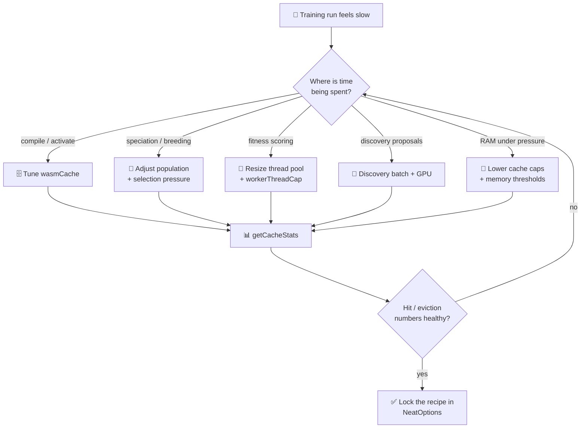
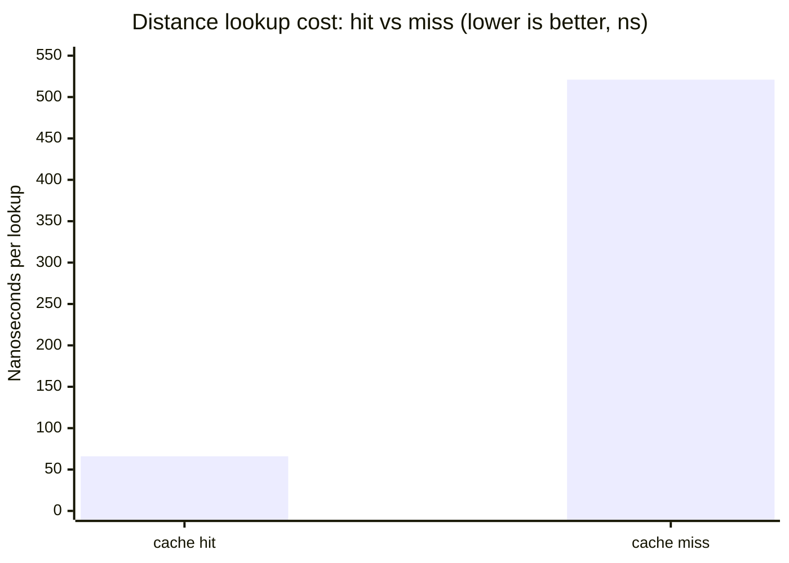
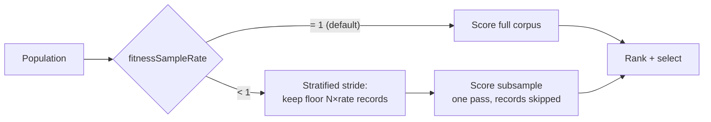

# ⚡ Performance Tuning Guide for Large-Scale Training

> **Brief**: A practical, knob-by-knob tuning guide for production training
> runs. Each section maps a `NeatOptions` setting to the symptom it addresses
> and to the underlying research. For background on **why** the knobs are shaped
> the way they are, read [PERFORMANCE_RESEARCH.md](./PERFORMANCE_RESEARCH.md).

## 📑 In this cluster

- **[PERFORMANCE_RESEARCH.md](./PERFORMANCE_RESEARCH.md)** — investigation log
  behind every "what worked" and "what did not" claim referenced here.
- **PERFORMANCE_TUNING.md** (this file) — operational tuning of caches, thread
  pools, memory, and scaling.
- **[PREDICTIVE_CODING.md](./PREDICTIVE_CODING.md)** and
  **[PREDICTIVE_CODING_BENCHMARKS.md](./PREDICTIVE_CODING_BENCHMARKS.md)** —
  background and benchmark numbers for the optional Predictive Coding (PC)
  training mode. Tuning recipes for PC live in this file under
  [Memetic Evolution](#-memetic-evolution-backpropagation--evolution).

See the [docs index](./README.md) for the full topic map.

This guide explains how to tune [NEAT-AI](../AGENTS.md#-terminology) for
large-scale training runs. It covers every configurable performance parameter,
explains when to enable or disable features, and provides practical
recommendations for different scenarios.

All configuration is passed via `NeatOptionsInput` to `createNeatConfig()`. See
the [Configuration Guide](./CONFIGURATION_GUIDE.md) for the full reference of
every option. Acronyms used throughout: **CPU** (Central Processing Unit),
**GPU** (Graphics Processing Unit), **WASM** (WebAssembly), **LRU** (Least
Recently Used), **FFI** (Foreign Function Interface), **PC** (Predictive
Coding).

## 🛣️ Tuning decision flow



Use `getCacheStats()` after every tuning change — the cross-reference numbers in
this guide assume you can observe the same metrics live.

## Table of Contents

- [Key Concepts](#key-concepts)
- [WASM Cache Tuning](#wasm-cache-tuning)
- [Distance Cache Tuning](#distance-cache-tuning)
- [Thread Pool Configuration](#thread-pool-configuration)
- [Memory Management](#memory-management)
- [Population Size and Selection Pressure](#population-size-and-selection-pressure)
- [Fitness Corpus Subsampling](#fitness-corpus-subsampling)
- [When to Enable WASM Activation](#when-to-enable-wasm-activation)
- [Discovery and GPU Acceleration](#discovery-and-gpu-acceleration)
- [Memetic Evolution (Backpropagation + Evolution)](#memetic-evolution-backpropagation--evolution)
- [Synthetic Synapse Training](#synthetic-synapse-training)
- [Scaling Patterns](#scaling-patterns)
- [Tuning Recipes](#tuning-recipes)
- [Diagnostics and Monitoring](#diagnostics-and-monitoring)
- [Further Reading](#further-reading)

---

## 🧠 Key Concepts

Before diving into configuration, here are the core concepts referenced
throughout this guide.

> [!NOTE]
> **General practice vs NEAT-AI-specific.** LRU caching, work-stealing thread
> pools and the island model are **general** techniques borrowed from mainstream
> systems and evolutionary-computing literature — the definitions below are
> deliberately generic. The _knobs_ in the rest of this guide (`wasmCache`,
> `distanceCache`, `selectionPressure`, `discoverySampleRate`, the
> serialisation-wall trade-offs) are **NEAT-AI-specific**: they exist because of
> NEAT-AI's UUID-keyed graph topologies and TypeScript↔WASM boundary, and their
> default values are tuned for this library, not for systems in general.

**LRU cache** — A "Least Recently Used" cache is a fixed-size store that
automatically evicts the oldest unused entry when it runs out of room. NEAT-AI
uses LRU caches for compiled WASM modules and genetic distance scores so that
frequently accessed items stay fast while memory stays bounded.

**Work-stealing thread pool** — A pool of worker threads where idle workers
"steal" tasks from busy workers' queues. This keeps all CPU cores occupied even
when tasks have different durations, avoiding the bottleneck of a single shared
queue.

**Island model** — A distributed evolution strategy where separate populations
("islands") evolve independently, then periodically exchange their best
individuals. This maintains genetic diversity and allows training across
multiple machines.

**Memetic evolution** — Combining evolutionary search (mutation and crossover)
with local gradient descent (backpropagation). Evolution explores the broad
solution space while backpropagation fine-tunes promising candidates.

**Serialisation wall** — The cost of converting JavaScript objects to flat
arrays for WASM processing. For graph-structured data like neural network
topologies, this conversion can take longer than the computation itself.

---

## 🗄️ WASM Cache Tuning

NEAT-AI compiles neural network topologies into WASM modules for fast
activation. Two caches prevent repeated compilation.

### WASM Activation LRU (`wasmCache.maxCachedActivations`)

This cache holds compiled WASM creature activations (the ready-to-run modules).

| Parameter              | Default              | Description                                  |
| ---------------------- | -------------------- | -------------------------------------------- |
| `maxCachedActivations` | `populationSize * 2` | Maximum compiled activations kept in the LRU |

**How it works**: Each unique network topology is compiled to WASM once, then
cached. On cache hit, activation runs immediately without recompilation. On
eviction, the module must be recompiled next time it is needed.

**Recommendations**:

- **Start with the default** (`populationSize * 2`). This accommodates the
  current generation plus parent creatures carried forward.
- **Increase to `populationSize * 3`** if you use memetic evolution heavily,
  since backpropagation creates modified copies that may differ from the
  original topology.
- **Decrease** if you are memory-constrained. Each cached activation holds a
  compiled WASM module in memory. On machines with limited RAM, a smaller cache
  trades recompilation time for lower memory usage.
- **Monitor evictions** via `getCacheStats()` (see
  [Diagnostics](#diagnostics-and-monitoring)). A high eviction rate means the
  cache is too small for your workload.

> [!TIP]
> When using memetic evolution, set `maxCachedActivations` to
> `populationSize * 3` rather than the default `populationSize * 2`.
> Backpropagation generates modified weight copies that differ structurally from
> their parent topology, increasing the effective working set of cached modules.

### WASM Compilation Cache (`wasmCache.compilationCacheSize`)

This cache holds compiled topology templates — the intermediate step before a
full activation module is created.

| Parameter              | Default | Description                       |
| ---------------------- | ------- | --------------------------------- |
| `compilationCacheSize` | `100`   | Maximum topology templates cached |

**Recommendations**:

- The default of 100 works well for most workloads.
- Increase if your population has many distinct topologies (high structural
  diversity). This is common when using aggressive topology mutations or
  cross-species breeding.
- A value lower than 50 is rarely useful.

### ⚙️ Configuration Example

```typescript
const config = createNeatConfig({
  populationSize: 200,
  wasmCache: {
    maxCachedActivations: 600, // 3x population for memetic workloads
    compilationCacheSize: 150, // more topology variety expected
  },
});
```

---

## 📏 Distance Cache Tuning

The distance cache stores genetic compatibility scores between pairs of
creatures. These scores determine which creatures belong to the same species.

> [!IMPORTANT]
> The distance-cache size is **not** a `NeatOptions` / `NeatConfig` field —
> there is no `distanceCache.maxSize` config key. It is a process-wide LRU that
> defaults to **10,000** entries and is tuned imperatively at runtime via
> `setDistanceCacheMaxSize()` (the distance-cache counterpart to
> `setMaxCachedWasmCreatureActivations()`):
>
> ```typescript
> import { setDistanceCacheMaxSize } from "@stsoftware/neat-ai";
>
> // Size the cache to cover a population of N creatures without eviction.
> setDistanceCacheMaxSize(50_000); // Default: 10_000
> ```

**How it works**: Computing the genetic distance between two creatures requires
comparing their full genome structure. The LRU cache stores results keyed by
creature UUID pairs so that repeated comparisons (which happen every generation
during speciation) are nearly free.

**Performance characteristics** (measured on Apple M4 Pro):

| Operation                    | Time    | Notes                             |
| ---------------------------- | ------- | --------------------------------- |
| Cache hit                    | ~66 ns  | Below WASM boundary crossing cost |
| Cache miss                   | ~521 ns | Full genome comparison            |
| Warm pairwise (50 creatures) | ~119 µs | ~97 ns per pair                   |



A cache hit is ~7.9× cheaper than a full genome comparison, which is why sizing
the distance cache (via `setDistanceCacheMaxSize()`) to cover your population
matters at scale.

**Recommendations**:

- For a population of size `N`, each generation computes up to `N*(N-1)/2`
  pairwise distances. The default of 10,000 covers populations up to ~140
  creatures without eviction.
- **For large populations** (500+), call `setDistanceCacheMaxSize(N * N / 2)` or
  higher. Cache hits at 66 ns are dramatically faster than recomputation at 521
  ns.
- **With high population turnover** (many new creatures each generation), the
  cache hit rate drops. Expect ~64% hit rate with 20% turnover versus ~100% for
  stable populations.

> [!NOTE]
> The distance cache uses UUID pairs as keys. Creatures that are eliminated and
> replaced each generation will never yield a cache hit for their pairings,
> which is why high turnover reduces hit rates significantly. If your problem
> involves aggressive culling, consider raising the distance-cache size with
> `setDistanceCacheMaxSize()` beyond the default.

---

## 🧵 Thread Pool Configuration

NEAT-AI uses a work-stealing thread pool to parallelise evaluation, breeding,
and mutation across CPU cores.

### Thread Count (`threads`)

| Parameter | Default                             | Description              |
| --------- | ----------------------------------- | ------------------------ |
| `threads` | `navigator.hardwareConcurrency + 2` | Number of worker threads |

The default adds two heavy-task workers on top of the core count
(`hardwareConcurrency + 2`) so the pool keeps making progress while some workers
are busy on longer breeding/discovery tasks.

**Recommendations**:

- **Use the default** (all cores plus two) for dedicated training machines.
- **Reserve 1–2 cores** (`cores - 2`) on shared machines or when running
  alongside other processes.
- **More threads are not always better**: each worker consumes memory for its
  WASM environment, creature copies, and training data. On memory-constrained
  systems, fewer threads with adequate memory per worker outperform many
  memory-starved threads.

### Memory-Based Thread Capping (`workerThreadCap`)

The worker thread cap automatically limits the number of threads based on
available memory, preventing out-of-memory crashes during large-scale training.

| Parameter                                    | Default        | Description                              |
| -------------------------------------------- | -------------- | ---------------------------------------- |
| `workerThreadCap.maxMemoryMB`                | `0` (disabled) | Total memory budget in megabytes         |
| `workerThreadCap.estimatedMemoryPerWorkerMB` | `2048`         | Estimated memory per worker in megabytes |

**How it works**: When enabled, the effective thread count is capped to
`floor(maxMemoryMB / estimatedMemoryPerWorkerMB)`. This prevents launching more
workers than your system can sustain.

**Recommendations**:

- **Enable this for production training** on machines with known memory limits.
- The default estimate of 2 GB per worker is calibrated for GRQ-scale training
  (large networks, large data sets). For smaller workloads, 512 MB–1 GB per
  worker may be sufficient.
- **Example**: On a 64 GB machine, `maxMemoryMB: 56000` with
  `estimatedMemoryPerWorkerMB: 2048` caps threads at 27, leaving headroom for
  the main process and OS.

> [!WARNING]
> Do not omit `workerThreadCap` on production machines with large populations.
> Without a memory budget, NEAT-AI will attempt to launch one thread per logical
> core. On a 32-core machine with a population of 500, this can exceed available
> RAM and result in an out-of-memory crash mid-training run.

```typescript
const config = createNeatConfig({
  threads: 32,
  workerThreadCap: {
    maxMemoryMB: 56000,
    estimatedMemoryPerWorkerMB: 2048,
  },
});
```

### Heavy Task Worker Count (`heavyTaskWorkerCount`)

| Parameter              | Default | Description                                 |
| ---------------------- | ------- | ------------------------------------------- |
| `heavyTaskWorkerCount` | `2`     | Workers reserved for discovery and training |

The remaining workers (`threads - heavyTaskWorkerCount`) form the **fast pool**
used for fitness evaluation and breeding. The heavy pool runs long-running
discovery and memetic training tasks.

**Recommendations**:

- **Default of 2 is good for most workloads**. Increasing this helps when
  `trainPerGen` is high or multiple concurrent discoveries are configured.
- On machines with many cores (24+), consider `3–4` heavy workers if discovery
  or training queues frequently stall.

### Cross-Pool Borrowing (`allowPoolBorrowing`)

| Parameter            | Default | Description                                              |
| -------------------- | ------- | -------------------------------------------------------- |
| `allowPoolBorrowing` | `true`  | Allow idle workers to be borrowed across pool boundaries |

When enabled, idle fast workers can temporarily run heavy tasks (discovery,
training) when the heavy pool is saturated, and vice versa (idle heavy workers
already assist with fitness and breeding). This maximises CPU utilisation on
high-core machines where one pool finishes before the other.

**Recommendations**:

- **Leave enabled** (the default) for maximum throughput.
- Set to `false` to restore strict pool separation if you observe contention
  between fast and heavy tasks.

```typescript
const config = createNeatConfig({
  threads: 26,
  heavyTaskWorkerCount: 2,
  allowPoolBorrowing: true, // default — idle fast workers help heavy tasks
});
```

---

## 🧩 Memory Management

### Heap Memory Monitoring (`memory`)

NEAT-AI proactively monitors heap usage and evicts caches before the system runs
out of memory.

| Parameter                  | Default | Description                                           |
| -------------------------- | ------- | ----------------------------------------------------- |
| `memory.enabled`           | `true`  | Enable heap monitoring via `Deno.memoryUsage()`       |
| `memory.warningThreshold`  | `0.70`  | Heap fraction that triggers LRU reduction             |
| `memory.criticalThreshold` | `0.85`  | Heap fraction that triggers aggressive cache clearing |

**How it works**:

1. **Normal** (heap < 70%): Caches operate at full capacity.
2. **Warning** (heap 70–85%): LRU cache caps are reduced and oldest entries are
   evicted. Training continues normally.
3. **Critical** (heap > 85%): All non-essential caches are aggressively cleared.
   This is a last resort to avoid a crash.

**Recommendations**:

- **Leave defaults for most workloads**. The 70/85% thresholds are tuned for
  production GRQ training where repeated memory pressure was observed at ~75% of
  heap.
- **Lower the warning threshold to 0.60** on systems with limited RAM or when
  running multiple processes.
- **Raise the critical threshold to 0.90** only if you are confident that no
  other process will compete for memory.
- If you see frequent warning-level evictions, the root cause is usually a cache
  that is too large (reduce `maxCachedActivations`) or too many worker threads
  (enable `workerThreadCap`).

> [!WARNING]
> Raising `memory.criticalThreshold` above 0.90 is dangerous on systems that run
> other processes. The critical threshold is a last-ditch defence; if the heap
> breaches it and there is nothing left to evict, the process will crash. Always
> leave at least 10–15% headroom below your system's physical memory limit.

### Checkpoint Write Memory (`creatureStore`)

Per-generation checkpoints (`creatureStore` plus `checkpointEveryGeneration`)
land on an already-hot generation, so the checkpoint itself must not become the
peak. Creatures are exported, serialised, and written in **bounded batches** of
8 (Issue #3436), so the transient checkpoint footprint is capped by the batch
size rather than by the population size.


Each batch's serialised genomes and in-flight write buffers are released before
the next batch allocates its own, so peak checkpoint memory no longer scales
with `populationSize × genome JSON`. File contents and numbering (`1.json`,
`2.json`, …) are unchanged. No configuration is required — this is the default
and only behaviour.

### Understanding Cache Diagnostics

Use `getCacheStats()` to inspect cache health at any point during training:

```typescript
import { getCacheStats } from "@stsoftware/neat-ai";

const stats = getCacheStats();
for (const cache of stats) {
  console.log(`${cache.name}:`);
  console.log(`  Size: ${cache.currentSize} / ${cache.maxSize}`);
  console.log(`  Hits: ${cache.hits}, Misses: ${cache.misses}`);
  console.log(`  Evictions: ${cache.evictions}`);
  const hitRate = cache.hits / (cache.hits + cache.misses) || 0;
  console.log(`  Hit rate: ${(hitRate * 100).toFixed(1)}%`);
}
```

**What to look for**:

| Symptom                           | Likely cause            | Action                                            |
| --------------------------------- | ----------------------- | ------------------------------------------------- |
| Hit rate below 50%                | Cache too small         | Increase `maxSize`                                |
| High eviction count               | Cache thrashing         | Increase `maxSize` or reduce population diversity |
| `currentSize` always at `maxSize` | Cache is full           | Consider increasing capacity                      |
| Zero hits                         | Cache is not being used | Check that the feature is enabled                 |

---

## 👥 Population Size and Selection Pressure

Population size is the single most impactful parameter for training performance.
Larger populations explore more of the solution space but cost proportionally
more compute per generation.

| Parameter        | Default | Description                        |
| ---------------- | ------- | ---------------------------------- |
| `populationSize` | `50`    | Number of creatures per generation |

### ⚖️ Trade-offs

| Population size | Exploration | Compute cost          | Memory    | Best for                              |
| --------------- | ----------- | --------------------- | --------- | ------------------------------------- |
| 10–25           | Low         | Very fast generations | Minimal   | Prototyping, quick experiments        |
| 50–100          | Moderate    | Balanced              | Moderate  | Most training tasks                   |
| 200–500         | High        | Slow generations      | High      | Complex problems, production training |
| 500+            | Very high   | Very slow             | Very high | Research, multi-machine setups        |

**Recommendations**:

- **Start small** (50–100) and increase only if the population converges too
  quickly (premature convergence) or the problem requires significant structural
  innovation.
- **Watch diversity metrics**: If all creatures in the population look similar
  after a few generations, the population is too small for the problem.
- **Scale threads with population**: A population of 500 benefits from 16+
  threads. A population of 20 may see diminishing returns beyond 4 threads
  because the overhead of work distribution exceeds the parallelism gains.

### Selection Pressure

Selection pressure controls how aggressively the algorithm favours top
performers. Higher pressure means faster convergence but risks losing diversity.

| Parameter        | Default | Description                                       |
| ---------------- | ------- | ------------------------------------------------- |
| `elitism`        | `1`     | Number of top creatures carried forward unchanged |
| `mutationRate`   | `0.3`   | Base probability of mutation per creature         |
| `mutationAmount` | `1`     | Number of mutations applied per mutated creature  |

**Recommendations**:

- **For exploration**: Lower `elitism` (1–2), higher `mutationRate` (0.4–0.6),
  higher `mutationAmount` (2–5). This creates more variation each generation.
- **For exploitation**: Higher `elitism` (3–5), lower `mutationRate` (0.1–0.2),
  lower `mutationAmount` (1). This preserves proven solutions.
- **Adaptive mutation** adjusts these automatically based on creature size — see
  [Adaptive Mutation Thresholds](#adaptive-mutation-thresholds) below.

#### Tunable selection-pressure knobs (`selectionPressure`)

Issue #2929 exposes the previously hardcoded selection-pressure parameters
through `selectionPressure`. Every default reproduces the prior behaviour, so
existing runs are unchanged unless a knob is overridden. These knobs apply to
the active `selection` strategy (`POWER` or `TOURNAMENT`).

| Parameter                                          | Default | Description                                                                        |
| -------------------------------------------------- | ------- | ---------------------------------------------------------------------------------- |
| `selectionPressure.power`                          | `4`     | POWER selection exponent. Higher → stronger bias towards the top-ranked creatures. |
| `selectionPressure.tournamentSize`                 | `5`     | Fixed tournament size used when `adaptiveTournament` is `false`.                   |
| `selectionPressure.tournamentProbability`          | `0.5`   | Probability of picking the best tournament participant. Higher → more pressure.    |
| `selectionPressure.adaptiveTournament`             | `true`  | Scale tournament size with population size instead of using `tournamentSize`.      |
| `selectionPressure.adaptiveTournamentMinSize`      | `3`     | Floor for the adaptive tournament size.                                            |
| `selectionPressure.adaptiveTournamentSqrtExponent` | `0.5`   | Population scaling exponent: `floor(pop ^ exponent)`. `0.5` = square-root scaling. |
| `selectionPressure.adaptiveTournamentCapFraction`  | `0.1`   | Cap as a fraction of population: `floor(pop * fraction)`.                          |

**Recommendations**:

- **For faster convergence (more exploitation)**: raise `power` (e.g. 6–12),
  raise `tournamentProbability` towards `1.0`, or raise
  `adaptiveTournamentSqrtExponent`/`adaptiveTournamentCapFraction` so larger
  tournaments form. This selects the best creatures more often.
- **For longer exploration**: lower `power` (e.g. 1–3), lower
  `tournamentProbability`, or shrink the adaptive bounds. This keeps weaker
  creatures in the breeding pool for longer.
- All values are validated at config time; out-of-range input (e.g.
  `power <= 0`, `tournamentProbability > 1`) is rejected with a clear error.

```ts
const neat = new Neat(input, output, fitness, {
  selection: Selection.POWER,
  selectionPressure: { power: 8 }, // stronger exploitation
});
```

### 🔄 Adaptive Mutation Thresholds

Large creatures (many neurons) are more fragile — random topology changes are
more likely to be destructive. NEAT-AI automatically reduces topology mutation
rates for large creatures.

| Parameter                                        | Default | Description                                        |
| ------------------------------------------------ | ------- | -------------------------------------------------- |
| `adaptiveMutationThresholds.medium`              | `100`   | Neuron count threshold for "medium" creatures      |
| `adaptiveMutationThresholds.large`               | `300`   | Neuron count threshold for "large" creatures       |
| `adaptiveMutationThresholds.largeTopologyWeight` | `0.1`   | Topology mutation weight for large creatures (0–1) |

**Recommendations**:

- The default of 0.1 means large creatures have only a 10% chance of topology
  mutations (add neuron, add connection). The remaining mutations focus on
  weight and bias adjustments.
- **Set to 0** to completely disable topology expansion for large creatures.
- **Raise towards 1.0** only if your problem genuinely requires very large,
  structurally diverse networks.

---

## 🎯 Fitness Corpus Subsampling

`fitnessSampleRate` (Issue #3257) trades a small amount of ranking precision for
a large cut in per-generation scoring work. In production evolution ≈95 % of
`evolveDir` wall-clock is fitness evaluation against a multi-GiB binary corpus,
so scoring each creature on a **deterministic, stratified subsample** of records
is the single largest algorithmic lever available.

- **Range:** `0.0001 … 1`. **Default `1`** (score the full corpus — today's
  behaviour, unchanged unless you opt in).
- **What it does:** on the streaming `evaluateDir` reader, a record at global
  index `i` is kept iff `floor((i + 1) × rate) > floor(i × rate)`. This keeps
  exactly `floor(N × rate)` records, spread evenly (a stride), in a single pass
  — **no second corpus is written to disk**. The selection is RNG-free, so the
  same creature on the same corpus always sees the same records and rank
  comparisons stay honest.
- **Why it wins:** halving the scored records roughly halves the 95 % phase —
  far larger than another few-percent kernel tweak — **provided** rank order on
  the subsample tracks the full-corpus rank for your workload.

```typescript
// Score each creature on a deterministic 25 % of the corpus per generation.
await creature.evolveDir(".training", {
  fitnessSampleRate: 0.25,
});
```

### Before you enable a sub-1 rate

Run `bench/FitnessSampleRate.ts` against a representative corpus and confirm the
**Spearman (rank) correlation** of subsample vs full scores stays high (≥ 0.95
is a sensible bar) across a frozen population. On a uniform synthetic 27 MiB
corpus the reference run shows wall-clock falling ~proportionally to the rate
with Spearman ≥ 0.999:

| rate | wall-clock | speedup | Spearman vs full |
| ---: | ---------: | ------: | ---------------: |
| 1.00 |     3738ms |   1.02× |           1.0000 |
| 0.50 |     2104ms |   1.80× |           1.0000 |
| 0.25 |     1067ms |   3.56× |           0.9991 |
| 0.10 |      468ms |   8.11× |           1.0000 |

Real production corpora may correlate less than a uniform synthetic one, so keep
the default at `1.0` until the correlation is confirmed on your data. When the
external `rust_scorer` batch path is enabled, a sub-1 rate currently stays on
the TS/WASM path (the native binary cannot yet skip records) — record-level
subsampling inside the streaming reader is tracked as a scorer follow-up.



---

## 🚀 When to Enable WASM Activation

WASM activation is always enabled in NEAT-AI — it is required for all forward
passes. However, understanding when WASM provides the greatest benefit helps
when tuning cache sizes.

### Where WASM Excels

WASM is effective for tight numerical loops with high arithmetic intensity:

- **Activation functions**: Pure numerical transforms applied per-neuron
- **Forward pass**: Batched matrix-style computation
- **Error distribution**: Fused gradient arithmetic
- **Batch accumulation**: Weight/bias gradient sums

### Where WASM Does Not Help

The serialisation wall means that graph-structure manipulation (breeding,
crossover) and trivially fast operations (rejection sampling) do not benefit
from WASM migration. See [Performance Research](./PERFORMANCE_RESEARCH.md) for
detailed benchmark results.

**Practical impact**: You do not need to configure WASM for these operations —
they remain in TypeScript automatically. The key tuning parameter is the WASM
cache size (see [WASM Cache Tuning](#wasm-cache-tuning)).

---

## 🔍 Discovery and GPU Acceleration

Discovery is NEAT-AI's error-guided structural evolution, powered by the
[NEAT-AI-Discovery](https://github.com/stSoftwareAU/NEAT-AI-Discovery) Rust
extension with optional GPU acceleration via Metal (macOS).

### When Discovery Helps

- **Stuck populations**: When evolution alone plateaus, discovery can propose
  structural changes that escape local optima.
- **Complex problems**: Problems requiring specific internal representations
  benefit from targeted synapse/neuron additions.
- **Typical improvements**: 0.5–3% per discovery run, accumulating over many
  iterations.

### When Discovery Overhead Dominates

- **Small networks** (fewer than 20 neurons): The overhead of recording
  activations, serialising data to Rust, and analysing results exceeds the
  benefit. Evolution alone usually finds good solutions quickly.
- **Fast-changing problems**: If the fitness landscape shifts significantly
  between generations, discovered structures may be obsolete by the time they
  are applied.
- **Disable discovery** by setting `discoverySampleRate: -1`.

> [!TIP]
> For data sets exceeding 100,000 records, set `discoverySampleRate` to
> 0.05–0.10. Sampling 5–10% is typically sufficient for structural analysis and
> avoids the significant memory overhead of recording full-dataset activations
> before each Rust analysis phase.

### ⚙️ Discovery Configuration

| Parameter                         | Default | Description                                               |
| --------------------------------- | ------- | --------------------------------------------------------- |
| `discoverySampleRate`             | `0.2`   | Fraction of training data sampled (0–1, or -1 to disable) |
| `discoveryRecordTimeOutMinutes`   | `5`     | Maximum recording phase duration                          |
| `discoveryAnalysisTimeoutMinutes` | `10`    | Maximum analysis phase duration                           |
| `discoveryBatchSize`              | `128`   | Records per batch sent to Rust                            |
| `discoveryMaxNeurons`             | `6`     | Maximum neurons analysed per iteration                    |

**Recommendations**:

- **For large data sets**, reduce `discoverySampleRate` to 0.1 or lower.
  Sampling 10% of a million-record data set is usually sufficient for structural
  analysis.
- **For large networks**, increase `discoveryAnalysisTimeoutMinutes` to 15–30.
  Analysis time grows with network complexity.
- **For memory-constrained systems**, reduce `discoveryBatchSize` to 64 and
  lower `discoveryRustFlushRecords` to flush data to Rust more frequently.

### 🖥️ GPU Acceleration

GPU acceleration (Metal on macOS) speeds up the discovery analysis phase. See
[GPU Acceleration Guide](./GPU_ACCELERATION.md) for setup details.

**When it helps**: Networks with 50+ neurons and large data sets where the
analysis phase takes minutes rather than seconds.

**When overhead dominates**: Small networks where analysis completes in under a
second — the GPU kernel launch overhead exceeds the computation time.

---

## 🧬 Memetic Evolution (Backpropagation + Evolution)

Memetic evolution combines evolutionary search with gradient-based
backpropagation to fine-tune weights and biases within evolved network
structures.

### When to Use Memetic Evolution

- **Always beneficial** for most practical training tasks. Evolution finds good
  structures; backpropagation optimises the weights within those structures.
- **Most impactful** for networks with 20+ neurons where the weight space is too
  large for evolution alone to search efficiently.

### When to Rely on Evolution Alone

- **Very small networks** (fewer than 10 neurons): The weight space is small
  enough that evolutionary search covers it adequately.
- **Highly deceptive fitness landscapes**: Gradient descent can get trapped in
  local minima. If backpropagation consistently makes creatures worse, consider
  reducing or disabling it.

### 🔧 Key Backpropagation Parameters

| Parameter                              | Default         | Description                                          |
| -------------------------------------- | --------------- | ---------------------------------------------------- |
| `backpropagation.learningRate`         | `0.01`          | Step size for weight updates                         |
| `backpropagation.batchSize`            | `64`            | Training samples per batch                           |
| `backpropagation.generations`          | `1–10` (random) | Backprop iterations per evolutionary generation      |
| `backpropagation.learningRateStrategy` | Random          | One of: `fixed`, `decay`, `adaptive`, `warm_restart` |

**Recommendations**:

- **Start with defaults**. The randomised strategy selection provides built-in
  exploration of hyperparameter space.
- **For faster convergence**: Fix the strategy to `adaptive` with a learning
  rate of 0.01–0.05.
- **For stability**: Use `decay` with `learningRateDecay: 0.95` to gradually
  reduce the step size.
- **Batch size**: Larger batches (128–256) give smoother gradients but cost more
  memory. Smaller batches (16–32) add noise that can help escape local minima.

### Fine-Tune Population Sizing

NEAT-AI adaptively sizes the population dedicated to memetic fine-tuning.

| Parameter                                   | Default | Description                               |
| ------------------------------------------- | ------- | ----------------------------------------- |
| `fineTunePopulation.minPopulationFraction`  | `0.1`   | Minimum fraction dedicated to fine-tuning |
| `fineTunePopulation.maxPopulationFraction`  | `0.4`   | Maximum fraction dedicated to fine-tuning |
| `fineTunePopulation.basePopulationFraction` | `0.2`   | Starting fraction before adaptation       |

**How it works**: The fine-tuning fraction automatically increases when
backpropagation succeeds (improves creature fitness) and decreases when it
fails. This is tracked over a rolling window of recent generations.

**Recommendations**:

- The defaults work well for most scenarios.
- **Increase `maxPopulationFraction` to 0.6** for problems where backpropagation
  is highly effective (smooth fitness landscapes, continuous outputs).
- **Decrease `maxPopulationFraction` to 0.2** for problems where evolution is
  the primary driver (discrete outputs, deceptive landscapes).

---

## 🧪 Synthetic Synapse Training

Synthetic synapses temporarily densify the network during backpropagation by
adding zero-weight connections between adjacent topological layers. After
training, near-zero connections are pruned and only useful ones are retained.

### When to Enable Synthetic Synapses

- **Sparse early-evolution networks**: When NEAT-AI has not yet evolved dense
  inter-layer connectivity, synthetic synapses give backpropagation more
  connections to optimise, often finding useful pathways that mutation alone
  would take many generations to discover.
- **Problems requiring dense connectivity**: Tasks where the solution benefits
  from many inter-layer connections (similar to conventional dense neural
  networks).

### When to Disable Synthetic Synapses

- **Already-dense networks**: If evolution has already built dense connectivity,
  the overhead of adding and pruning synthetic synapses may outweigh the
  benefit.
- **Very small networks**: Networks with fewer than 10 neurons have limited
  layer structure; synthetic synapses add little value.
- **Memory-constrained environments**: Synthetic synapses temporarily increase
  the network size. At production scale (~1,700 neurons), expect a ~3.3x
  expansion in synapse count during training.

### Performance Implications

Synthetic synapse generation and pruning add overhead to each training session:

| Phase      | Typical Cost (production scale) | Description                                         |
| ---------- | ------------------------------- | --------------------------------------------------- |
| Generation | ~90 ms                          | Computing layers and adding zero-weight synapses    |
| Pruning    | ~380 ms                         | Removing near-zero synapses and cleaning up orphans |
| Overall    | ~4.6x baseline                  | Full training lifecycle overhead                    |

The overhead is a fixed cost per training session, not per iteration. For
training runs with many backpropagation iterations, the per-iteration overhead
is negligible.

### Tuning the Per-Target Cap

The `maxPerTarget` parameter (default: 50) limits how many synthetic connections
each target neuron receives from a single source layer. This prevents
combinatorial explosion on wide networks.

- **Lower values** (e.g., 20–30): Reduce memory usage and generation time at the
  cost of sparser coverage.
- **Higher values** (e.g., 80–100): Provide denser coverage but increase memory
  and training time.
- **Default (50)**: A good balance for production-sized creatures (~1,000
  neurons).

> [!TIP]
> The `maxPerTarget` cap uses evenly-spaced sampling across the source layer,
> ensuring good coverage even when the cap is well below the source layer size.
> In most cases, the default of 50 is sufficient.

---

## 📐 Scaling Patterns

### 🖥️ Single Machine: Thread Pool Sizing

For a single machine, the primary scaling lever is the thread pool size combined
with memory management.

**Step-by-step approach**:

1. **Start with the default**: leave `threads` unset to get
   `navigator.hardwareConcurrency + 2` (all cores plus two heavy-task workers).
2. **Enable memory capping**: Set `workerThreadCap.maxMemoryMB` to 80% of
   available RAM.
3. **Monitor memory**: Use `getCacheStats()` and system memory tools to check
   for pressure.
4. **Reduce threads if needed**: If memory pressure events are frequent, reduce
   threads or lower `estimatedMemoryPerWorkerMB`.

**Example for a 32-core, 128 GB machine**:

```typescript
const config = createNeatConfig({
  populationSize: 300,
  threads: 30, // Reserve 2 cores for OS and monitoring
  workerThreadCap: {
    maxMemoryMB: 102400, // 100 GB budget
    estimatedMemoryPerWorkerMB: 3072, // 3 GB per worker for large networks
  },
  wasmCache: {
    maxCachedActivations: 900, // 3x population
  },
  memory: {
    warningThreshold: 0.65, // Conservative thresholds for production
    criticalThreshold: 0.80,
  },
});
```

### 🌐 Multi-Machine: Island Model Configuration

For training across multiple machines, NEAT-AI supports the island model pattern
where independent populations evolve separately and periodically exchange their
best creatures.

**How it works**:

1. Each machine runs an independent NEAT-AI population (an "island").
2. Periodically, the best creatures from each island are exported and shared.
3. Imported creatures are grafted into the receiving population, adding genetic
   diversity.

**Configuration per island**:

- Use the same `NeatOptions` on each machine for consistency.
- Set population size per island to `totalDesiredPopulation / numIslands`.
- Each island should have its own discovery cache directory
  (`discoveryCacheDir`) to avoid conflicts.
- Use the grafting mechanism for inter-island migration — it handles
  incompatible topologies automatically.

**Recommendations**:

- **2–4 islands** is a good starting point. More islands increase diversity but
  reduce per-island population size.
- **Migration frequency**: Exchange top 5–10% of creatures every 10–20
  generations. Too frequent migration homogenises the populations; too
  infrequent loses the diversity benefit.
- **Heterogeneous configurations**: Consider running islands with different
  mutation rates or different discovery settings to explore the solution space
  more broadly.

### 📦 Data Set Sizing and Batch Strategies

Large data sets affect both training time and memory consumption.

**Recommendations**:

- **Use `discoverySampleRate`** to control how much data is sent to the
  discovery phase. For data sets over 100,000 records, sampling 5–10% is usually
  sufficient.
- **Backpropagation batch size** (`backpropagation.batchSize`): Larger batches
  use more memory but provide more stable gradients. Start with 64 and increase
  to 128–256 for large data sets.
- **Sparse training** (`backpropagation.sparseRatio`): Set below 1.0 to use only
  a fraction of training data per backpropagation pass. Values of 0.5–0.8 can
  halve training time with minimal quality loss.
- **Discovery flush thresholds**: For very large data sets, lower
  `discoveryRustFlushRecords` and `discoveryRustFlushBytes` to flush data more
  frequently, preventing memory spikes.

---

## 🍳 Tuning Recipes

### Recipe: Prototyping (Fast Iteration)

For quick experiments to test whether a problem is solvable:

```typescript
const config = createNeatConfig({
  populationSize: 25,
  threads: 4,
  discoverySampleRate: -1, // Disable discovery for speed
  mutationRate: 0.5,
  mutationAmount: 3,
});
```

### Recipe: Production Training (Balanced)

For serious training runs with good defaults:

```typescript
const config = createNeatConfig({
  populationSize: 200,
  workerThreadCap: {
    maxMemoryMB: 56000,
    estimatedMemoryPerWorkerMB: 2048,
  },
  wasmCache: {
    maxCachedActivations: 600,
  },
  memory: {
    warningThreshold: 0.65,
    criticalThreshold: 0.80,
  },
});
```

### Recipe: Maximum Exploration (Large-Scale Research)

For pushing the boundaries on difficult problems:

```typescript
const config = createNeatConfig({
  populationSize: 500,
  threads: 28,
  workerThreadCap: {
    maxMemoryMB: 112000,
    estimatedMemoryPerWorkerMB: 4096,
  },
  wasmCache: {
    maxCachedActivations: 1500,
    compilationCacheSize: 300,
  },
  memory: {
    warningThreshold: 0.60,
    criticalThreshold: 0.75,
  },
  mutationRate: 0.5,
  mutationAmount: 3,
  ensembleDiversity: {
    enabled: true,
    diversityWeight: 0.2,
  },
  fineTunePopulation: {
    maxPopulationFraction: 0.5,
  },
});
```

---

## 📊 Diagnostics and Monitoring

### Cache Statistics

Call `getCacheStats()` at any point during training to get a snapshot of all
cache health metrics:

```typescript
import { getCacheStats } from "@stsoftware/neat-ai";

const stats = getCacheStats();
```

Each entry in the returned array contains:

| Field         | Description                                         |
| ------------- | --------------------------------------------------- |
| `name`        | Human-readable cache name                           |
| `hits`        | Number of successful lookups                        |
| `misses`      | Number of failed lookups (triggering recomputation) |
| `evictions`   | Number of entries removed to make room              |
| `currentSize` | Current number of entries in the cache              |
| `maxSize`     | Maximum capacity of the cache                       |

### Worker Pool Statistics

The work-stealing thread pool tracks its own performance:

| Metric             | Description                                     |
| ------------------ | ----------------------------------------------- |
| `totalWorkers`     | Number of worker threads                        |
| `busyWorkers`      | Workers currently processing tasks              |
| `idleWorkers`      | Workers waiting for tasks                       |
| `totalQueuedTasks` | Tasks waiting to be processed                   |
| `stealAttempts`    | Number of work-stealing attempts                |
| `successfulSteals` | Number of successful steals                     |
| `stealSuccessRate` | Fraction of steal attempts that succeeded (0–1) |

**What to look for**:

- **Low steal success rate** (below 0.1): Work is well-balanced across workers.
  This is normal and healthy.
- **High steal success rate** (above 0.5): Tasks have uneven durations. Consider
  whether your evaluation function has variable cost and whether breaking it
  into smaller units would help.
- **High `totalQueuedTasks`**: Workers cannot keep up. Either add more threads
  or simplify the evaluation function.
- **Many idle workers**: The population is too small to saturate the thread
  pool. Either reduce threads or increase population size.

### 🚨 Memory Pressure Events

When heap usage crosses the warning or critical threshold, NEAT-AI automatically
evicts cache entries. You can detect this by monitoring cache statistics over
time — a sudden drop in `currentSize` across multiple caches indicates a memory
pressure event.

**If memory pressure is frequent**:

1. Reduce `wasmCache.maxCachedActivations`.
2. Enable `workerThreadCap` to limit worker memory.
3. Lower `memory.warningThreshold` to trigger eviction earlier and more gently.
4. Reduce `discoveryBatchSize` to lower peak memory during discovery.

> [!NOTE]
> A sudden drop in `currentSize` across multiple caches at the same time is a
> reliable indicator of a memory pressure event. If you observe this pattern
> regularly, consider it a signal to revisit your thread count and cache sizing
> rather than simply raising the thresholds.

---

## 📚 Further Reading

- [PERFORMANCE_RESEARCH.md](./PERFORMANCE_RESEARCH.md) — Investigation log for
  every tuning trade-off; cited inline above as "the research".
- [PREDICTIVE_CODING.md](./PREDICTIVE_CODING.md) — Architectural background for
  the optional Predictive Coding training mode.
- [PREDICTIVE_CODING_BENCHMARKS.md](./PREDICTIVE_CODING_BENCHMARKS.md) — PC
  benchmark numbers, with the same `bench/predictiveCoding/` scripts cited.
- [CONFIGURATION_GUIDE.md](./CONFIGURATION_GUIDE.md) — Complete reference for
  every `NeatOptions` field touched here.
- [DISCOVERY_GUIDE.md](./DISCOVERY_GUIDE.md) — Distributed discovery workflows
  (the FFI-backed structural search referenced above).
- [GPU_ACCELERATION.md](./GPU_ACCELERATION.md) — GPU compute layer for the
  discovery pipeline (Metal / Vulkan / DX12 via `wgpu`).
- [BACKPROP_ELASTICITY.md](./BACKPROP_ELASTICITY.md) — Elastic backpropagation
  details referenced from the memetic evolution section.
- [TROUBLESHOOTING.md](./TROUBLESHOOTING.md) — Common issues and solutions.
- [docs/README.md](./README.md) — Topic index for the full documentation set.

---

**Up to:** [`README.md`](../README.md) (entry point) ·
[`docs/README.md`](README.md) (topic index).
