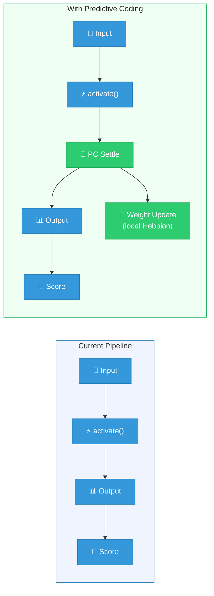
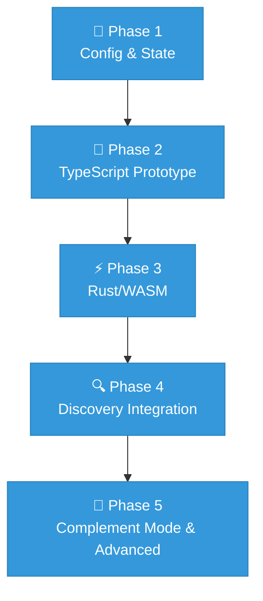

# Predictive Coding Architecture Design

This document describes the architecture for integrating **Predictive Coding**
(PC) as an optional training mode in NEAT-AI. It serves as the blueprint for all
subsequent implementation work.

Part of [#1549](https://github.com/stSoftwareAU/NEAT-AI/issues/1549).

---

## 1. Background & Theory

### What is Predictive Coding?

Predictive coding is a neuroscience-inspired learning framework in which every
layer of a hierarchical network maintains a **generative model** of the layer
below it. Each layer predicts the activity of the layer beneath, and only
**prediction errors** (the mismatch between prediction and actual activity)
propagate upward (Rao & Ballard, 1999).

In a standard feedforward network, information flows bottom-up. Predictive
coding adds a complementary **top-down prediction stream**: higher layers send
predictions downward, and lower layers send prediction errors upward. Learning
consists of adjusting weights to minimise these prediction errors across the
entire hierarchy.

### Core Energy Function

The objective that a PC network minimises is the **total prediction error
energy**:

\[ \mathcal{L} = \frac{1}{2} \sum_{l} \| \varepsilon^{(l)} \|^2 \]

where the prediction error at layer \(l\) is:

\[ \varepsilon^{(l)} = x^{(l)} - f\bigl(W^{(l)} \cdot x^{(l+1)}\bigr) \]

Here \(x^{(l)}\) is the activity at layer \(l\), \(W^{(l)}\) are the top-down
prediction weights, and \(f\) is a nonlinear activation function (squash in
NEAT-AI terminology).

### Two-Timescale Dynamics

PC operates on two distinct timescales (Bogacz, 2017):

1. **Fast inference (settling)** — Given fixed weights, neuron activities
   \(x^{(l)}\) are iteratively updated to minimise the energy \(\mathcal{L}\).
   This is an inner loop of gradient descent on the activities:

   \[ \Delta x^{(l)} = -\eta_x \frac{\partial \mathcal{L}}{\partial x^{(l)}} =
   -\eta_x \bigl( \varepsilon^{(l)} - (W^{(l-1)})^\top f'(\cdot) \cdot
   \varepsilon^{(l-1)} \bigr) \]

   The network "settles" into an equilibrium state where prediction errors are
   minimised. This typically takes 10–50 iterations for small networks
   (Salvatori et al., 2024).

2. **Slow learning (weight updates)** — Once the network has settled, weights
   are updated using the now-equilibrium prediction errors. The update rule is
   **local and Hebbian-like**:

   \[ \Delta W^{(l)} = \eta_W \cdot \varepsilon^{(l)} \cdot
   f\bigl(x^{(l+1)}\bigr)^\top \]

   Each synapse only needs information available at its pre- and post-synaptic
   neurons — no global error signal or weight transport is required (Whittington
   & Bogacz, 2017).

### Local Learning vs Global Backpropagation

A key attraction of PC for NEAT-AI is that weight updates are **purely local**.
Each synapse update depends only on:

- The prediction error at its target neuron (\(\varepsilon^{(l)}\))
- The activity of its source neuron (\(f(x^{(l+1)})\))

This contrasts with standard backpropagation, which requires propagating
gradients through the entire network via the chain rule. Millidge, Tschantz &
Buckley (2022c) proved that PC converges to the same gradients as
backpropagation at equilibrium, making it a **biologically plausible
approximation** of backprop. Rosenbaum (2022) provides a complementary analysis
of the conditions under which PC and backprop produce equivalent updates.

This locality property maps naturally onto NEAT-AI's architecture, where each
`Neuron` already manages its own state and each `Synapse` connects exactly two
neurons.

### Relationship to the Free Energy Principle

PC can be understood as a special case of the **free energy principle**
(Friston, 2018): the network minimises variational free energy, which
upper-bounds surprise (negative log-likelihood of observations). Under Gaussian
assumptions with fixed variance, free energy reduces to the sum-of-squared
prediction errors above (Bogacz, 2017). This connects NEAT-AI's PC extension to
a broader theoretical framework encompassing active inference and Bayesian brain
theories.

### Relationship to Elastic Backpropagation

NEAT-AI's existing elastic backpropagation (see `docs/BACKPROP_ELASTICITY.md`)
already shares structural similarities with PC:

- Both compute a **target value** for each neuron and distribute error upstream.
- Both use **local information** (inbound synapse activations) to determine how
  error is allocated.
- Elastic backprop's safe-zone awareness parallels PC's natural handling of
  saturated neurons — prediction errors through saturated pathways are
  inherently small.

The key difference is that elastic backprop performs a **single pass** through
the network, while PC performs **iterative settling** before weight updates.
PC's iterative inference can potentially find better target activations for
hidden neurons, particularly in deep or recurrent topologies.

---

## 2. Architecture Design

### 2.1 Mapping PC onto NEAT-AI's Existing Architecture

NEAT-AI's core architecture consists of:

| Component       | File                                | Role in PC                                                     |
| --------------- | ----------------------------------- | -------------------------------------------------------------- |
| `Creature`      | `src/Creature.ts`                   | The network as a whole; orchestrates PC inference and learning |
| `Neuron`        | `src/architecture/Neuron.ts`        | Holds prediction and error state per node                      |
| `Synapse`       | `src/architecture/Synapse.ts`       | Carries both feedforward activation and top-down predictions   |
| `CreatureState` | `src/architecture/CreatureState.ts` | Extended with PC-specific per-neuron buffers                   |
| `NeuronState`   | `src/architecture/CreatureState.ts` | Extended with prediction error and target fields               |

#### How Layers Map

NEAT networks are not strictly layered — they are arbitrary directed graphs
(with optional recurrent connections). For PC, we define a neuron's **depth** as
its topological distance from the input layer:

- **Input neurons** (depth 0): Clamped to observed data. Their prediction error
  is the difference between the observation and the top-down prediction from
  depth-1 neurons.
- **Hidden neurons** (depth 1..N): Both predict the layer below and receive
  predictions from the layer above. They maintain both a **value node** (current
  activity) and an associated **error node** (prediction error).
- **Output neurons** (maximum depth): Clamped to target values during supervised
  training. Their prediction error drives the top of the hierarchy.

In NEAT-AI's variable-topology networks, depth is computed during
`Creature.prepare()` using topological sorting (already performed for
feedforward activation ordering).

### 2.2 Prediction Nodes vs Error Nodes

**Decision: Extend existing neurons with additional state rather than creating
new node types.**

Rationale:

1. NEAT-AI's mutation operators (`AddNeuron`, `SubNeuron`, `AddConnection`,
   etc.) operate on the existing `Neuron` and `Synapse` types. Introducing new
   node types would require modifying every mutation operator, the breeding
   system, serialisation, and WASM compilation — a massive and error-prone
   change.

2. The literature supports this approach: Millidge et al. (2022a) show that PC
   can be implemented with a single set of neurons where each neuron maintains
   both its current activity and its prediction error as separate state
   variables.

3. `NeuronState` in `src/architecture/CreatureState.ts` already carries
   per-neuron training metadata (`hintValue`, `totalErrorAbsolute`, etc.).
   Adding PC fields here is natural and non-breaking.

**New fields on `NeuronState`** (when PC is enabled):

```typescript
// In CreatureState.ts — NeuronState extension
pcPrediction?: number;       // Top-down prediction for this neuron
pcError?: number;            // Prediction error: activation - prediction
pcTargetActivity?: number;   // Settled activity after inference
```

**New fields on `SynapseState`** (when PC is enabled):

```typescript
// In CreatureState.ts — SynapseState extension
pcPredictionWeight?: number; // Top-down prediction weight (may differ from
                             // feedforward weight, or may be shared)
```

### 2.3 Weight Symmetry Decision

**Decision: Use shared (symmetric) weights for the initial implementation.**

In classical PC, feedforward weights \(W_{ff}\) and feedback prediction weights
\(W_{fb}\) are separate. However:

- Millidge et al. (2020) showed that **relaxing weight symmetry constraints**
  still yields effective learning.
- Whittington & Bogacz (2017) demonstrated that with tied weights (\(W_{fb} =
  W_{ff}^\top\)), PC approximates backpropagation.
- Using shared weights halves memory requirements and avoids the need to
  evolve/train a separate set of prediction weights.

For the initial implementation, the top-down prediction from neuron \(j\) to
neuron \(i\) uses the **transpose** of the existing feedforward synapse weight.
A future phase may introduce separate prediction weights if experiments show
benefit.

### 2.4 PC Inference (Iterative Settling)

The inference loop runs **before** weight updates, for each training sample:

```
Algorithm: PC Inference (Settling)
─────────────────────────────────────────────────
Input: creature, inputData, targetData (if supervised)
Config: maxIterations, convergenceThreshold

1. Clamp input neurons to inputData
2. Run one feedforward pass to initialise hidden/output activations
3. If supervised: clamp output neurons to targetData

4. For iteration = 1 to maxIterations:
   a. For each hidden neuron (in reverse depth order):
      - Compute top-down prediction:
        pred_i = f(Σ_j w_ji · x_j)  where j are downstream neurons
      - Compute prediction error:
        ε_i = x_i - pred_i
      - Update activity:
        x_i ← x_i - η_x · (ε_i - Σ_k w_ik · f'(·) · ε_k)
        where k are upstream neurons receiving predictions from i

   b. Compute total energy: E = ½ Σ ||ε_i||²

   c. If |E_prev - E| < convergenceThreshold: break

5. Store settled activities and prediction errors in NeuronState
─────────────────────────────────────────────────
```

This integrates with the existing forward activation path:

- Step 2 reuses `Creature.activate()` (or WASM `CompiledNetwork.activate()`) for
  the initial forward pass.
- Steps 4a–4c are new PC-specific computation — the hot inner loop targeted for
  WASM/Rust implementation.
- Step 5 stores results in the existing `CreatureState` structure.

### 2.5 PC Learning (Weight Updates)

After inference has settled, weights are updated using the local Hebbian rule:

```
Algorithm: PC Weight Update
─────────────────────────────────────────────────
For each synapse (i → j):
  Δw_ij = η_W · ε_j · f(x_i)

For each neuron j:
  Δb_j = η_W · ε_j
─────────────────────────────────────────────────
```

This replaces or complements the elastic backpropagation step
(`Neuron.propagate()`) when PC mode is active. The existing
`Neuron.propagateUpdate()` mechanism for applying accumulated weight/bias
changes can be reused — the only difference is **how** the deltas are computed.

### 2.6 Integration with Existing Forward Activation

The activation pipeline remains unchanged when PC is disabled:



PC settling occurs **between** the initial activation and scoring. The settled
activations become the "true" activations used for fitness evaluation.

### 2.7 TypeScript vs Rust/WASM Decision

| Component                          | Language                 | Rationale                                                                           |
| ---------------------------------- | ------------------------ | ----------------------------------------------------------------------------------- |
| PC configuration and orchestration | TypeScript               | Follows existing config patterns; called once per training step                     |
| PC inference inner loop (settling) | Rust/WASM                | Hot loop (10–50 iterations per sample); benefits from SIMD and compiled performance |
| PC weight update computation       | Rust/WASM                | Runs per-synapse per-sample; benefits from batch processing                         |
| PC-enhanced structural discovery   | Rust (NEAT-AI-Discovery) | Prediction errors provide richer signals for the existing GPU-accelerated analysis  |
| Integration tests and validation   | TypeScript (Deno)        | Follows existing test patterns                                                      |

The Rust/WASM components extend the existing `wasm_activation` crate
(`wasm_activation/src/`). New Rust modules:

- `wasm_activation/src/pc_inference.rs` — Settling loop with convergence
  detection
- `wasm_activation/src/pc_learning.rs` — Batch Hebbian weight updates

The TypeScript side calls these through the existing WASM bridge pattern
(`src/wasm/`), adding new wrapper functions in a `PredictiveCodingWasm.ts`
module.

---

## 3. Integration Strategy

### 3.1 PC as an Optional Training Mode

**Principle: PC is strictly opt-in. When disabled (the default), all existing
behaviour is unchanged.**

The existing training pipeline:

```
evolveDir() → NEAT.evolve() → per generation:
  1. Fitness evaluation (WASM activation)
  2. Backprop training (propagate → propagateUpdate)
  3. Memetic fine-tuning (FineTune.ts)
  4. Breeding (crossover + mutation)
  5. Discovery (Error-Guided Structural Evolution)
  6. Species management
```

With PC enabled, step 2 is augmented:

```
2. Training:
   a. PC inference settling (new — iterative inner loop)
   b. PC weight update (replaces elastic backprop OR runs alongside it)
   c. Existing propagateUpdate() applies accumulated changes
```

Steps 1, 3, 4, 5, and 6 remain entirely unchanged. The creature's fitness is
still evaluated using standard WASM activation — PC only affects how weight
updates are computed during training.

### 3.2 Configuration Design

Following the established config pattern (see `src/config/` for examples like
`BiasRegularisationConfig.ts`):

**File: `src/config/PredictiveCodingConfig.ts`**

```typescript
/**
 * Configuration for Predictive Coding training mode.
 *
 * When enabled, training uses iterative inference (settling) followed by
 * local Hebbian weight updates instead of (or alongside) elastic
 * backpropagation.
 */
export interface PredictiveCodingConfig {
  /** Whether PC training is enabled. Default: false */
  enabled?: boolean;

  /** Maximum iterations for inference settling. Default: 20 */
  maxInferenceIterations?: number;

  /** Convergence threshold for early stopping during settling.
   *  Settling stops when |E_prev - E_current| < threshold. Default: 1e-4 */
  convergenceThreshold?: number;

  /** Learning rate for activity updates during inference. Default: 0.1 */
  inferenceRate?: number;

  /** Learning rate for weight updates after settling. Default: 0.01 */
  learningRate?: number;

  /** Strategy for combining PC with existing backprop.
   *  - "replace": PC replaces elastic backprop entirely
   *  - "complement": PC runs first, then elastic backprop refines
   *  Default: "replace" */
  integrationMode?: "replace" | "complement";
}

export type RequiredPredictiveCodingConfig = Required<PredictiveCodingConfig>;

export const DEFAULT_PREDICTIVE_CODING_CONFIG: RequiredPredictiveCodingConfig =
  {
    enabled: false,
    maxInferenceIterations: 20,
    convergenceThreshold: 1e-4,
    inferenceRate: 0.1,
    learningRate: 0.01,
    integrationMode: "replace",
  };
```

**Integration points** (following the config pattern from `MEMORY.md`):

1. Add `predictiveCoding: RequiredPredictiveCodingConfig` to
   `src/config/NeatArguments.ts`
2. Add partial override to `src/config/NeatOptions.ts` (both `NeatOptions` and
   `NeatOptionsInput` types, with `CoerceNumeric<>` for CLI numeric fields)
3. Add to both `Omit` lists in `NeatOptions.ts`
4. Parse in `src/config/NeatConfig.ts` using `parseNumber()` with IIFE pattern
5. Cross-field validation (e.g., `inferenceRate` must be positive) goes after
   config object creation, before `validate()`

### 3.3 Backward Compatibility Guarantees

- **Default off**: `DEFAULT_PREDICTIVE_CODING_CONFIG.enabled = false` ensures no
  existing behaviour changes unless explicitly opted in.
- **Serialisation**: PC state fields on `NeuronState` and `SynapseState` are
  optional (`?` typed). Creatures serialised without PC can be loaded and
  trained with PC, and vice versa.
- **WASM**: New Rust modules are additive — the existing `CompiledNetwork`
  interface is unchanged. PC functionality is exposed through new WASM
  functions.
- **All existing tests must pass**: Every PR in the implementation roadmap must
  pass the full test suite (2000+ tests) without modification to existing tests.

### 3.4 How PC Prediction Errors Enhance Structural Evolution

NEAT-AI's Discovery system (`src/architecture/ErrorGuidedStructuralEvolution/`)
uses per-neuron error signals to propose structural mutations. PC provides
**richer error information** than standard backprop:

1. **Per-neuron prediction errors** reveal which neurons are poorly predicted by
   their parents — candidates for `AddConnection` mutations to provide
   additional predictive input.

2. **Settling dynamics** reveal which neurons take longest to converge —
   candidates for `AddNeuron` mutations to provide intermediate representations.

3. **Residual prediction errors** after settling indicate fundamental model
   limitations — candidates for architectural changes (new squash functions via
   `ModSquash`, or topology changes).

These signals feed into the existing `RustDiscovery.ts` interface. The Rust
discovery library (`NEAT-AI-Discovery`) receives the enriched error data through
its existing JSON-based `record_discovery()` FFI call, extended with PC-specific
fields.

---

## 4. Implementation Roadmap

### Phase 1: Configuration and State Infrastructure

**Goal**: Add PC configuration and extend creature state without changing any
runtime behaviour.

- Create `PredictiveCodingConfig.ts` following the config pattern
- Wire into `NeatArguments.ts`, `NeatOptions.ts`, `NeatConfig.ts`
- Add optional PC fields to `NeuronState` and `SynapseState` in
  `CreatureState.ts`
- Add depth computation utility (topological distance from inputs)
- Write comprehensive unit tests for config parsing and validation
- **Result**: All existing tests pass; PC config is parseable but has no effect

**Key files**:

- `src/config/PredictiveCodingConfig.ts` (new)
- `src/config/NeatArguments.ts` (modified)
- `src/config/NeatOptions.ts` (modified)
- `src/config/NeatConfig.ts` (modified)
- `src/architecture/CreatureState.ts` (modified)

### Phase 2: TypeScript PC Inference Prototype

**Goal**: Implement PC inference (settling) in TypeScript as a working
prototype.

- Implement the settling algorithm in a new `src/propagate/PredictiveCoding.ts`
  module
- Integrate with `CreatureTraining.ts` — call settling before weight updates
  when `pc.enabled === true`
- Implement Hebbian weight update rule
- Write tests verifying convergence on simple networks (XOR, AND, OR)
- Benchmark inference loop to establish baseline for WASM optimisation
- **Depends on**: Phase 1
- **Result**: PC training works end-to-end in TypeScript; performance baseline
  established

**Key files**:

- `src/propagate/PredictiveCoding.ts` (new)
- `src/creature/CreatureTraining.ts` (modified)

### Phase 3: Rust/WASM PC Inference

**Goal**: Port the PC inference hot loop to Rust/WASM for production
performance.

- Add `pc_inference.rs` and `pc_learning.rs` to `wasm_activation/src/`
- Expose WASM functions: `pc_settle()`, `pc_weight_update()`
- Add TypeScript WASM wrapper `src/wasm/PredictiveCodingWasm.ts`
- Benchmark against TypeScript prototype — target 5–10x speedup
- Replace TypeScript inference with WASM calls (keep TypeScript as fallback)
- **Depends on**: Phase 2
- **Result**: PC training at production speed via WASM

**Key files**:

- `wasm_activation/src/pc_inference.rs` (new)
- `wasm_activation/src/pc_learning.rs` (new)
- `wasm_activation/src/lib.rs` (modified — re-export new modules)
- `src/wasm/PredictiveCodingWasm.ts` (new)

### Phase 4: Discovery Integration

**Goal**: Feed PC prediction errors into the structural evolution pipeline.

- Extend `Creature.record()` to capture PC prediction errors when available
- Extend the discovery JSON format to include PC-specific error signals
- Update `NEAT-AI-Discovery` (separate repo) to consume PC error fields
- Add PC-informed structural candidate scoring
- **Depends on**: Phase 3
- **Result**: PC errors guide structural evolution for better topology discovery

**Key files**:

- `src/architecture/ErrorGuidedStructuralEvolution/DiscoverStructure.ts`
  (modified)
- `src/architecture/ErrorGuidedStructuralEvolution/RustDiscovery.ts` (modified)
- NEAT-AI-Discovery repo (separate PRs)

### Phase 5: Complement Mode and Advanced Features

**Goal**: Enable PC and elastic backprop to work together, and add adaptive
settling.

- Implement `integrationMode: "complement"` — PC settling followed by elastic
  backprop refinement
- Adaptive inference iterations (fewer iterations when prediction errors are
  already small)
- PC-aware memetic evolution (use PC prediction errors to guide fine-tuning in
  `FineTune.ts`)
- Performance tuning and documentation
- **Depends on**: Phase 4
- **Result**: Full PC integration with all NEAT-AI training modes

### Dependency Graph



Each phase produces a working, tested PR. Phases are strictly sequential — each
depends on the previous one being merged and passing all tests.

### Performance Considerations

The PC inference loop is the critical performance bottleneck:

- **Per-sample cost**: For a network with \(N\) neurons, each settling iteration
  is \(O(N + S)\) where \(S\) is the number of synapses. With 20 iterations,
  this is 20x the cost of a single forward pass.
- **Why WASM**: The settling loop involves tight numerical computation
  (multiply-accumulate, activation function evaluation) that benefits enormously
  from compiled Rust + SIMD. The existing WASM activation already demonstrates
  10–50x speedup over TypeScript for similar operations.
- **Batch processing**: Multiple training samples can share the same compiled
  network structure, amortising WASM compilation overhead via the existing
  `WasmCompilationCache` (`src/wasm/WasmCompilationCache.ts`).
- **Early convergence**: The convergence threshold allows settling to stop early
  when prediction errors are already small, avoiding unnecessary iterations.

---

## 5. References

- Bogacz, R. (2017). A tutorial on the free-energy framework for modelling
  perception and learning. _Journal of Mathematical Psychology_, 76, 198–211.
  [doi:10.1016/j.jmp.2015.11.003](https://doi.org/10.1016/j.jmp.2015.11.003)

- Friston, K. (2018). Does predictive coding have a future? _Nature
  Neuroscience_, 21, 1019–1021.
  [doi:10.1038/s41593-018-0200-7](https://doi.org/10.1038/s41593-018-0200-7)

- Huang, Y. & Rao, R.P.N. (2011). Predictive coding. _WIREs Cognitive Science_,
  2, 580–593. [doi:10.1002/wcs.142](https://doi.org/10.1002/wcs.142)

- Keller, G.B. & Mrsic-Flogel, T.D. (2018). Predictive Processing: A Canonical
  Cortical Computation. _Neuron_, 100, 424–435.
  [doi:10.1016/j.neuron.2018.10.003](https://doi.org/10.1016/j.neuron.2018.10.003)

- Lillicrap, T.P., Santoro, A., Marris, L., Akerman, C.J. & Hinton, G. (2020).
  Backpropagation and the brain. _Nature Reviews Neuroscience_, 21, 335–346.
  [doi:10.1038/s41583-020-0277-3](https://doi.org/10.1038/s41583-020-0277-3)

- Marino, J. (2021). Predictive Coding, Variational Autoencoders, and Biological
  Connections.
  [doi:10.48550/arXiv.2011.07464](https://doi.org/10.48550/arXiv.2011.07464)

- Millidge, B., Salvatori, T., Song, Y., Bogacz, R. & Lukasiewicz, T. (2022a).
  Predictive Coding: Towards a Future of Deep Learning beyond Backpropagation?

- Millidge, B., Seth, A. & Buckley, C.L. (2022b). Predictive Coding: a
  Theoretical and Experimental Review.
  [doi:10.48550/arXiv.2107.12979](https://doi.org/10.48550/arXiv.2107.12979)

- Millidge, B., Song, Y., Salvatori, T., Lukasiewicz, T. & Bogacz, R. (2023). A
  Theoretical Framework for Inference and Learning in Predictive Coding
  Networks.

- Millidge, B., Tschantz, A. & Buckley, C.L. (2022c). Predictive Coding
  Approximates Backprop Along Arbitrary Computation Graphs. _Neural
  Computation_, 34, 1329–1368.
  [doi:10.1162/neco_a_01497](https://doi.org/10.1162/neco_a_01497)

- Millidge, B., Tschantz, A., Seth, A. & Buckley, C.L. (2020). Relaxing the
  Constraints on Predictive Coding Models.
  [doi:10.48550/arXiv.2010.01047](https://doi.org/10.48550/arXiv.2010.01047)

- Rao, R.P.N. & Ballard, D.H. (1999). Predictive coding in the visual cortex: a
  functional interpretation of some extra-classical receptive-field effects.
  _Nature Neuroscience_, 2, 79–87.
  [doi:10.1038/4580](https://doi.org/10.1038/4580)

- Rosenbaum, R. (2022). On the relationship between predictive coding and
  backpropagation. _PLoS ONE_, 17, e0266102.
  [doi:10.1371/journal.pone.0266102](https://doi.org/10.1371/journal.pone.0266102)

- Salvatori, T., Mali, A., Buckley, C.L., Lukasiewicz, T., Rao, R.P.N., Friston,
  K. & Ororbia, A. (2025). A Survey on Brain-Inspired Deep Learning via
  Predictive Coding.
  [doi:10.48550/arXiv.2308.07870](https://doi.org/10.48550/arXiv.2308.07870)

- Salvatori, T., Song, Y., Lukasiewicz, T., Bogacz, R. & Xu, Z. (2023). Reverse
  Differentiation via Predictive Coding.
  [doi:10.48550/arXiv.2103.04689](https://doi.org/10.48550/arXiv.2103.04689)

- Salvatori, T., Song, Y., Yordanov, Y., Millidge, B., Xu, Z., Sha, L., Emde,
  C., Bogacz, R. & Lukasiewicz, T. (2024). A Stable, Fast, and Fully Automatic
  Learning Algorithm for Predictive Coding Networks.
  [doi:10.48550/arXiv.2212.00720](https://doi.org/10.48550/arXiv.2212.00720)

- Song, Y., Lukasiewicz, T., Xu, Z. & Bogacz, R. (n.d.). Can the Brain Do
  Backpropagation? — Exact Implementation of Backpropagation in Predictive
  Coding Networks.

- Song, Y., Millidge, B., Salvatori, T., Lukasiewicz, T., Xu, Z. & Bogacz, R.
  (2024). Inferring neural activity before plasticity as a foundation for
  learning beyond backpropagation. _Nature Neuroscience_, 27, 348–358.
  [doi:10.1038/s41593-023-01514-1](https://doi.org/10.1038/s41593-023-01514-1)

- Whittington, J.C.R. & Bogacz, R. (2019). Theories of Error Back-Propagation in
  the Brain. _Trends in Cognitive Sciences_, 23, 235–250.
  [doi:10.1016/j.tics.2018.12.005](https://doi.org/10.1016/j.tics.2018.12.005)

- Whittington, J.C.R. & Bogacz, R. (2017). An Approximation of the Error
  Backpropagation Algorithm in a Predictive Coding Network with Local Hebbian
  Synaptic Plasticity. _Neural Computation_, 29, 1229–1262.
  [doi:10.1162/NECO_a_00949](https://doi.org/10.1162/NECO_a_00949)

---

## Further Reading

- Wikipedia:
  [Predictive coding](https://en.wikipedia.org/wiki/Predictive_coding)
- NEAT-AI elastic backpropagation: `docs/BACKPROP_ELASTICITY.md`
- NEAT-AI configuration guide: `docs/CONFIGURATION_GUIDE.md`
- NEAT-AI Discovery guide: `docs/DISCOVERY_GUIDE.md`
- NEAT-AI-Discovery repository:
  [stSoftwareAU/NEAT-AI-Discovery](https://github.com/stSoftwareAU/NEAT-AI-Discovery)
