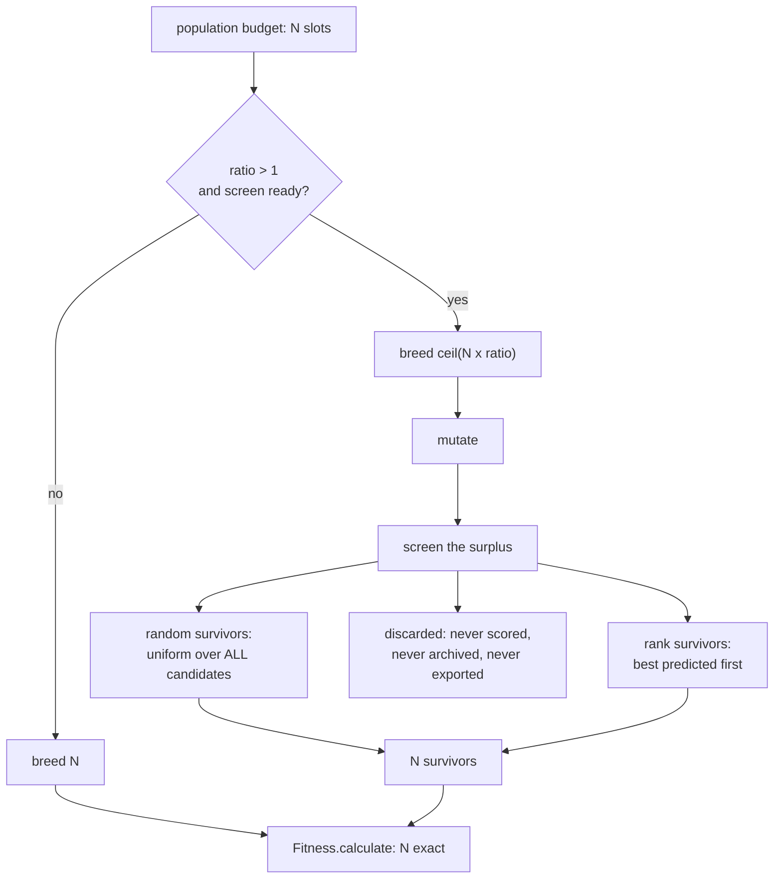

# Offspring pre-selection — surplus and screen (Issue #3932)

[Jin (2011)](comparison/REFERENCES.md) §4 treats **pre-selection** as a lever
distinct from evolution control. Evolution control decides how to spend the
budget on the individuals you already have
([Issue #3931](EVOLUTION_CONTROL.md)); pre-selection changes how many
individuals you make: breed a **surplus**, screen it cheaply, and spend the true
evaluation only on the survivors. The population size does not move — the number
of candidates considered per generation does.

Before this issue NEAT-AI bred exactly the offspring the population budget
called for and every one of them went straight into
[`Fitness.calculate()`](../src/architecture/Fitness.ts) at full corpus cost. The
only pre-fitness filter was
[`DeDuplicator`](../src/architecture/DeDuplicator.ts), and that is a correctness
filter, not a quality one: it declines to score the same creature twice and is
perfectly happy to spend a full evaluation on twenty distinct bad ones.

> [!IMPORTANT]
> **Off by default (`ratio: 1`, `screen: "none"`).** The breeder is asked for
> exactly what the budget calls for, nothing is screened and nothing is
> discarded — the behaviour of every build before this one.
>
> **`screen: "sampled"` cannot run inside the evolution loop.** Issue #3926 put
> the cheap fidelity in the **data pipeline** (a run is pointed at a sampled
> corpus), so the loop has no second, cheaper evaluator to call. Constructing a
> `Neat` with that screen throws `PreSelectionError` `NO_SCREEN_EVALUATOR`
> rather than discarding offspring on a fabricated number; the class itself
> takes a caller-supplied evaluator and is used by the A/B harness below.
>
> **The `"surrogate"` screen's predictive value is unproven.** Issue #3930's
> feasibility gate on 5,300-neuron GRQ creatures was undecidable. What makes it
> usable anyway is the consumer: a screen only orders candidates, it never
> assigns a fitness, and the stage reports the screen rank of every creature
> that becomes an elite so an anti-correlated screen shows up in the trace.
>
> **The `"surrogate"` screen must not run in production without the uncertainty
> guard of Issue #3933** — see
> [`SURROGATE_UNCERTAINTY.md`](SURROGATE_UNCERTAINTY.md). It is on by default
> (`preSelection.uncertainty.enabled: true`): predictions carry a mandatory
> uncertainty, out-of-distribution candidates are refused a prediction and
> routed to an exact evaluation, a stated minimum fraction of the exact
> evaluations goes to the least-certain candidates, and a one-directional signed
> bias disables the surrogate path for the rest of the run.

## The stage



Screening runs **after** mutation, so the screen judges the creature fitness
will actually be asked to evaluate rather than the pre-mutation offspring.

## Options

| Option                                | Default  | Meaning                                                                                         |
| ------------------------------------- | -------- | ----------------------------------------------------------------------------------------------- |
| `preSelection.ratio`                  | `1`      | Offspring bred per population slot; `1` disables the stage.                                     |
| `preSelection.screen`                 | `"none"` | `"sampled"` (a low-rate cheap evaluation) or `"surrogate"` (a fitted predictor).                |
| `preSelection.randomSurvivorFraction` | `0.25`   | Fraction of survivors drawn uniformly rather than by rank.                                      |
| `preSelection.surrogateWindow`        | `256`    | `(descriptor, exact score)` pairs the surrogate is fitted to.                                   |
| `preSelection.surrogateNeighbours`    | `5`      | Neighbours a surrogate prediction averages.                                                     |
| `preSelection.uncertainty`            | guard on | The Issue #3933 uncertainty guard — see [`SURROGATE_UNCERTAINTY.md`](SURROGATE_UNCERTAINTY.md). |

The issue spells the first two `preSelectionRatio` and `preSelectionScreen`;
they are nested under one `preSelection` key so the surface matches the
`evolutionControl` policy they compose with.

**The ratio and the screen only mean anything together.** `ratio > 1` with
`screen: "none"` is refused — discarding an unscreened surplus is a random cull,
not pre-selection — and so is a screen at `ratio: 1`, which has no surplus to
reject. Every other invalid value is **rejected, never clamped**: a silently
corrected ratio changes how many creatures a generation throws away without
saying so.

```ts
const result = await creature.evolveDataSet(data, {
  populationSize: 20,
  preSelection: {
    ratio: 3, // breed three offspring per population slot
    screen: "surrogate", // "none" | "sampled" | "surrogate"
    randomSurvivorFraction: 0.25, // survivors drawn uniformly, not by rank
    surrogateWindow: 256, // training points the model is fitted to
    surrogateNeighbours: 5, // neighbours a prediction averages
    uncertainty: { acquisition: "ei" }, // Issue #3933 guard; on by default
  },
});
```

## The invariants, none of which are optional

- **A screened-out creature is discarded, never recorded.** Its screen value is
  not a fitness: it never reaches `Creature.score`, the evaluation archive
  (Issue #3929), species statistics or an export. `PreSelection.select` verifies
  that the screen did not write a score and throws `SCREEN_WROTE_SCORE` if it
  did.
- **A fixed fraction of survivors is drawn uniformly, not by rank.** Screening
  exclusively on predicted quality is a diversity sink: it systematically
  discards the structurally unusual candidates the screen is least able to
  judge, which are exactly the ones NEAT depends on for novel topology. The draw
  runs over **every** candidate, before any rank-based fill, so it is genuinely
  independent of the ordering.
- **Elites are never screened.** They are not offspring. The stage only ever
  sees the bred slice; the elite band and the creative-thinking clone sit ahead
  of it in the assembled population.
- **An unready screen breeds no surplus.** A surrogate that has not yet seen a
  generation's exact scores says so through `ready()`, and the breeder is asked
  for exactly the budget — so nothing is ever discarded on a number the screen
  could not produce.
- **Every generation logs what it generated, kept and discarded**, and the
  screen rank of every creature that became an elite.
- **A screen rank belongs to the creature, not to its UUID** (Issue #4008). A
  bred offspring reaches the screen with no UUID — mutation invalidates it and
  the evolution loop only recomputes it during fitness, which runs after
  screening — so the rank, and the once-per-creature elite dedup behind it, are
  held in a `WeakMap`/`WeakSet` keyed on the creature itself, exactly as the
  Issue #3933 prediction map is. Keyed on the UUID the rank map stayed empty for
  the whole run and the elite screen rank line was never logged, silently.

## Failure detection

The primary risk is a **diversity regression**, and it does not show in the
fitness trace. Track species count
([`SpeciesDiversity`](../src/NEAT/SpeciesDiversity.ts)) and mean genetic
distance ([`GeneticCompatibility`](../src/breed/GeneticCompatibility.ts))
against an unscreened run, which is what the A/B harness does:

```bash
deno task pre-selection-ab --generations=30 --replicates=10 \
  --json=docs/evidence/pre-selection-3932.json
```

It runs four arms — control, `"sampled"`, `"surrogate"`, and a `random-only`
control that keeps the same surplus entirely at random — and reports the
endpoint at equal generations **and** at equal record budget, the diversity of
each arm, and the screen percentile of every creature that became an elite. The
measured result, including what it does not say, is in
[`docs/evidence/pre-selection-3932.md`](evidence/pre-selection-3932.md). In
short: at equal record budget **no arm improved**, and both screens cut mean
genetic distance while a keep-at-random control raised it. That is why the stage
ships off.

Read it this way:

- **An elite percentile near 1** means the screen is anti-correlated with what
  matters. Report that rather than retuning until the number improves.
- **A screen wall-clock that is a meaningful fraction of a generation** means
  the screen costs more than it saves.
- **Mean genetic distance falling while mean fitness rises** is the failure this
  section exists to catch, not a success.
- **A `"surrogate"` run whose uncertainty-allocation fraction has drifted to
  zero** has degenerated to an argmax — the acquisition rule of Issue #3933 is
  no longer spending anything where the model is unsure, so the model has
  stopped being corrected where it is wrong.

---

**Up to:** [`README.md`](../README.md) (entry point) ·
[`docs/README.md`](README.md) (topic index).
