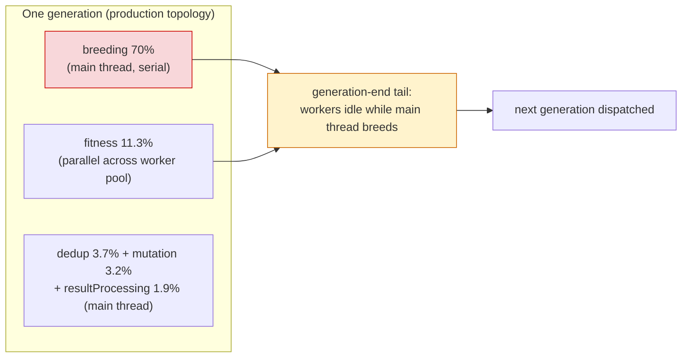

# Production learn/sampler profiling report (Issue #3397)

Sub-issue of #3396 — the foundational profiling deliverable that the other #3396
sub-issues derive their priorities from (same pattern as #3082 → milestone).

This report profiles exactly what the two production scripts drive, on the
GRQ-cluster production topology, and ranks the hotspots by their owning repo and
the follow-up sub-issue that addresses each one. Every finding is framed against
**score improvement per wall-clock hour** inside the fixed learn/sampler
time-boxes — not raw throughput.

## What was profiled

| Production script   | Drives                 | Config                                                                                                                    |
| ------------------- | ---------------------- | ------------------------------------------------------------------------------------------------------------------------- |
| `worker/learn.sh`   | one `src/Learn.ts` run | populationSize=20, trainingSampleRate=0.1, sparseRatio=0.05, random 6-bit evolution-mode flags, soft `--timeout ≈ 45 min` |
| `worker/sampler.sh` | 5 `src/Learn.ts` loops | populations 20→50, rates 0.01→1.0, ~1 h target (only the final 100 % loop is checked in)                                  |

**Production model** = GRQ-cluster `network.json`: **1,666 neurons, ~21,513
synapses, 2,461 inputs (~3 MB)**.

The synthetic `grq-3397` scale preset in
`test/propagate/large/ProductionScaleCreature.ts` reproduces those exact
dimensions deterministically (seed 3396 → **1,666 neurons, 21,560 synapses,
2,461 inputs**). It is dimension-locked by
`test/bench/ProductionScaleEvolveDirProfile.ts` so the preset cannot drift
without failing CI.

## Reproducible profiling command

```bash
export NO_COLOR=true
deno bench --allow-read --allow-write --allow-env --allow-ffi \
  bench/ProductionLearnSamplerProfile.ts
```

This is a `bench/` Deno.bench suite, so it is type-checked by the **Benchmark
smoke** job (`.github/workflows/bench.yaml`) on every PR touching `bench/**` or
`deno.json` — the command in this report cannot silently rot (see Failure
Detection in the issue). Re-running it against the `grq-3397` generator must
reproduce the topology line and the same top-hotspot ordering below; a
materially different ranking means this report is stale and #3397 should be
reopened before acting on any downstream sub-issue.

Measurements below were captured on an Apple M4 Pro, Deno 2.9.3, single worker
thread (`threads: 1`) so the phase attribution is clean. Absolute numbers scale
with hardware and worker count; the **ordering and percentages** are the durable
finding.

## 1. Wall-clock breakdown (where a production run spends time)

Full `evolveDataSet` on the production topology, pop 20, averaged per generation
(7 generations captured, `Total (avg) = 15,919.7 ms/gen`):

| Rank | Phase                                            | Mean (ms/gen) | % of generation | Owning repo                  |
| ---: | ------------------------------------------------ | ------------: | --------------: | ---------------------------- |
|    1 | **breeding** (crossover / alignment / offspring) |      11,144.9 |      **70.0 %** | NEAT-AI (main thread)        |
|    2 | **fitness** (activation + error)                 |       1,800.0 |          11.3 % | native scorer lane / NEAT-AI |
|    3 | deduplication                                    |         586.4 |           3.7 % | NEAT-AI (main thread)        |
|    4 | mutation                                         |         504.0 |           3.2 % | NEAT-AI (main thread)        |
|    5 | resultProcessing                                 |         301.7 |           1.9 % | NEAT-AI (main thread)        |
|    6 | preWarm                                          |         208.3 |           1.3 % | NEAT-AI                      |

Supporting micro-benchmarks on the same creature:

| Micro-benchmark                            | time/iter (avg) | Notes                                                                                 |
| ------------------------------------------ | --------------: | ------------------------------------------------------------------------------------- |
| single activation (fitness lane, 1 sample) |         40.7 ms | WASM lane; this is the per-score cost that the worker pool parallelises in production |
| `exportJSON` round-trip (checkpoint I/O)   |         58.0 ms | per-creature serialise + re-parse; the per-generation checkpoint/write cost           |
| per-generation de-duplication              |      561–691 ms | Bloom-filter + Set dedup at production topology                                       |

### Reading these numbers against score-per-hour

Scoring (fitness) is already parallel across creatures via the web-worker pool
(`src/multithreading/WorkerPool.ts`, ≈ `hardwareConcurrency` workers — NEAT-AI
#2244), so in production its **wall-clock** share shrinks below the 11.3 %
single-thread figure. **Breeding, mutation, dedup, resultProcessing and preWarm
run serially on the main thread**, so parallelising scoring makes the
main-thread band the binding constraint on _generations completed per hour_ —
and therefore on score-per-hour. Breeding at **70 %** is the single largest
lever: within a fixed 45-min box, halving main-thread breeding time roughly
doubles the number of generations evolved, independent of the scoring lane.



## 2. Production scoring lane — native vs WASM (confirmed with evidence)

**The lane is env-gated and defaults to JS/WASM.** The authoritative selection
lives in this repo: `getEnvRustScorerConfig()` in
`src/score/RustScorerBridge.ts` sets `enabled` from
`NEAT_AI_RUST_SCORER_ENABLED` and **defaults it to `false`**. The native
`rust_scorer` is used only when that variable is exported truthy.

- **In this profiling run:** JS/WASM lane. Evidence — `NEAT_AI_RUST_SCORER_*`
  was unset; the run logged 16 `wasmActivation` / `wasmCompilation`
  `MemoryMonitor` markers and **zero** `rust_scorer` markers.
- **In production:** `GRQ/worker/learn.sh` selects the lane via
  `shared/ensure_neat_ai_native_scorer.sh`, which exports
  `NEAT_AI_RUST_SCORER_*` when the native binary is built — so production runs
  the **native lane** when the scorer is present and falls back to JS/WASM
  otherwise. The chosen lane is visible in the run's GRQ-logs output; if a
  production log contradicts the lane assumed here, the native-lane routing
  below must be re-triaged.

**Consequence for routing:** because production scores on the **native lane**,
the fitness hotspot's downstream wins live in the scorer repo, not here — they
are routed to the companion grill **stSoftwareAU/NEAT-AI-core#285** rather than
duplicated in NEAT-AI (one root cause → one issue in the repo where it lives).

## 3. Hotspots ranked, classified, and routed to a follow-up

|  # | Hotspot                                                                                | Evidence                                           | Owning repo                                                                     | Follow-up sub-issue                                                                                                              |
| -: | -------------------------------------------------------------------------------------- | -------------------------------------------------- | ------------------------------------------------------------------------------- | -------------------------------------------------------------------------------------------------------------------------------- |
|  1 | **Main-thread breeding** (70 %) — largest score-per-hour lever                         | 11,144.9 ms/gen                                    | **NEAT-AI**                                                                     | **#3399** — overlap next-gen breeding/mutation prep with in-flight scoring so the main-thread band stops gating generations/hour |
|  2 | **Fitness / scoring lane** (11.3 % single-thread; parallelised in prod)                | 40.7 ms/activation, WASM in bench / native in prod | **NEAT-AI-core / NEAT-AI-scorer** (native lane) + **NEAT-AI** (pool scheduling) | **stSoftwareAU/NEAT-AI-core#285** for native-lane per-score cost; **#3399** for generation-end idle-worker time                  |
|  3 | **De-duplication** (3.7 %, 561–691 ms/gen)                                             | Bloom-filter + Set on 1,666-neuron creatures       | **NEAT-AI** (main thread)                                                       | **#3399** (main-thread band; overlap/scheduling)                                                                                 |
|  4 | **Mutation** (3.2 %)                                                                   | 504.0 ms/gen                                       | **NEAT-AI** (main thread)                                                       | **#3399** (overlap) / **#3400** (mutation rate is a tuned flag)                                                                  |
|  5 | **resultProcessing + preWarm** (3.2 %)                                                 | 301.7 + 208.3 ms/gen                               | **NEAT-AI** (main thread)                                                       | **#3399**                                                                                                                        |
|  6 | **Config lane** — population=20, trainingSampleRate=0.1, sparseRatio=0.05, 6-bit flags | GRQ script parameters + NEAT-AI defaults           | **GRQ** (script params) + **NEAT-AI** (defaults)                                | **#3400** — sweep flags & pop/rate for score-per-hour; raise cross-repo GRQ issue for winning script params                      |
|  7 | **Serialisation / checkpoint I/O** — 58 ms/creature round-trip                         | per-generation write cost                          | **NEAT-AI**                                                                     | tracked as a minor cost; the #3398 harness records it. No dedicated sub-issue — below the breeding/scoring levers                |

The **#3398** score-per-hour harness is the evidence gate every row above
depends on: it is where each follow-up demonstrates its before/after inside a
fixed wall-clock budget.

## 4. Prioritised list (hotspot → follow-up)

Priority order by score-per-hour impact within the fixed time-boxes:

1. **Breeding main-thread cost (70 %) → #3399.** Biggest lever; overlapping it
   with in-flight scoring directly raises generations-per-hour.
2. **Scoring lane (native, in production) → stSoftwareAU/NEAT-AI-core#285** for
   per-score cost, **#3399** for generation-end idle-worker time.
3. **Evolution-mode flags & population/sample-rate → #3400.** Configuration
   levers, cheapest to trial via the #3398 harness; may shift the whole curve
   without touching engine code.
4. **Dedup / mutation / resultProcessing / preWarm (main-thread band) → #3399.**
   Same overlap/scheduling work as breeding.
5. **All evidence gated by the #3398 score-per-hour harness.**

## Acceptance criteria — coverage

- ✅ Report committed with a reproducible profiling command over `bench/`
  production-scale data (`bench/ProductionLearnSamplerProfile.ts`).
- ✅ Production scoring lane confirmed with evidence — env-gated, default WASM;
  native in production via GRQ `ensure_neat_ai_native_scorer.sh`; this run was
  WASM (0 `rust_scorer` markers, 16 WASM markers).
- ✅ Hotspots ranked, each assigned an owning repo + follow-up issue (§3, §4).

## References

- Companion native-lane grill: stSoftwareAU/NEAT-AI-core#285
- Sibling sub-issues: #3398 (harness), #3399 (worker-pool idle), #3400
  (flag/param tuning)
- Prior suggestion rounds: #3082, #2308, #2273
- Negative results — do not re-propose without new evidence: #3258, #2418,
  #2317, #2262, #1655
