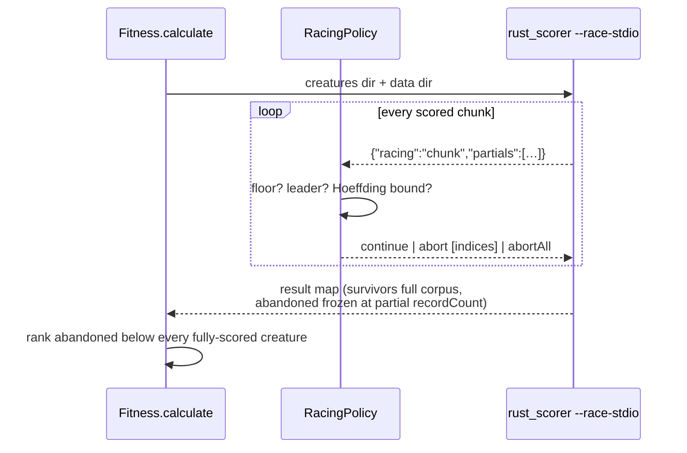

# 🏁 Racing: early-exit fitness scoring (Issue #3928)

Racing is the cheapest member of the surrogate-assisted family
[Jin (2011)](comparison/REFERENCES.md#-surrogate-assisted-search-and-racing)
surveys, and the only one that needs no model at all: score every candidate on a
prefix of the corpus and, as soon as a candidate cannot catch the leader, stop
scoring it. There is no surrogate to train and no approximation error to manage
— **the survivors still receive an exact full-corpus score**. The saving comes
entirely from the losers, which in a NEAT-AI generation are usually most of the
population.

Racing is **off by default**. Turn it on with `NeatOptions.racing`.

```typescript
await creature.evolveDir(dataSetDir, {
  iterations: 100,
  rustScorer: { enabled: true, batch: true },
  racing: { enabled: true }, // conservative defaults; see the knobs below
});
```

## 🧭 How it works

The native scorer sweeps the corpus once and scores every creature in that one
pass. Its early-exit hook (NEAT-AI-scorer#308) publishes a running per-creature
partial score after each chunk and takes a verdict back; the `--race-stdio`
surface exposes that hook to a subprocess caller, which is what NEAT-AI is.



## 📏 The decision rule

A creature `c` is abandoned only when **all** of these hold:

1. **The corpus size is known.** It is learnt from the widest sweep any scorer
   result reported in this run, so the first scored generation is always a full
   sweep. Without it the corpus-fraction floor below cannot be enforced, and the
   policy refuses to abandon anyone rather than guessing.
2. **`c` is past the floor** — it has been scored against at least
   `minCorpusFraction` of the corpus. Records arrive in **corpus order**, which
   is not a random sample, so an early prefix is not evidence about the whole
   corpus however tight the bound looks.
3. **`c` is not the leader**, is not an **exempt** key, and abandoning it would
   still leave at least `minSurvivors` creatures finishing the corpus.
   `minSurvivors` is the run's `elitism` (floor 2), so every elite slot can be
   filled from a creature holding an exact score. Without that cap a generation
   where too few candidates finished would promote an abandoned creature into an
   elite slot — and `Fitness` never re-scores a creature that already has a
   score, so the fabricated rank would follow it for the rest of the run. When
   the cap bites, the worst candidates are abandoned first.
4. **`c` is outside the confidence bound** — its running mean error exceeds the
   leader's by more than the combined
   [Hoeffding](comparison/REFERENCES.md#-surrogate-assisted-search-and-racing)
   radius on both means:

   ```text
   partialError(c) − partialError(leader) > ε(n_c) + ε(n_leader)
   ε(n) = errorRange · sqrt(ln(2/confidence) / (2n))
   ```

A non-finite running error is abandoned once past the floor: it can never
recover into a usable score.

### Knobs

| Option              | Default | Meaning                                                                   |
| ------------------- | ------: | ------------------------------------------------------------------------- |
| `enabled`           | `false` | Master switch.                                                            |
| `minCorpusFraction` |   `0.2` | Fraction of the corpus scored before any abandonment is permitted.        |
| `confidence`        |  `0.01` | `δ` in the bound — each decision holds with probability `1 − δ`.          |
| `errorRange`        |     `1` | Assumed range `R` of the per-record cost. **Wider is more conservative.** |

Out-of-range values are rejected, never clamped: a typo that silently became
"abandon on the first chunk" would look exactly like a working race.

## 🥇 Elites, `previousFittest`, and the breeding sort

- **Elites are never raced.** `Fitness.calculate` only evaluates creatures whose
  `score` is `undefined`, so an elite carried into the next generation never
  reaches the scorer at all; the policy additionally refuses to abandon any
  exempt key. A partial score can never enter an elitism comparison.
- **`previousFittest` is not re-scored.** Within one run of `evolveDir` neither
  the training data nor the champion changes, so its score cannot meaningfully
  change. It is carried forward as a `shallowClone` holding the exact cached
  score, and `NeatEvolution` asserts against that value rather than recomputing
  it.
- **Abandoned creatures rank below every usably-scored creature**, ordered among
  themselves by their partial error at abandonment (best first). A
  partial-corpus error is not comparable with a full-corpus one, so it is not
  allowed into the same sort as a measurement — it is turned into a rank.
  "Usably scored" means a **finite** score: a fully-scored creature whose
  scoring failed carries `-Infinity`, and nothing ranks below that, so the
  abandoned band sits between the finite scores and the failures. If every
  fully-scored creature failed, the band collapses to `-Infinity` as well rather
  than becoming the top of a dead generation.
- The consequence is deliberate: an abandoned creature can never become the
  generation's fittest, be selected as an elite, or be exported — the leader is
  never abandoned, and the survivor cap keeps enough exact scores to fill every
  elite slot.

Racing therefore still changes **breeding probabilities** — an abandoned
creature sits at the bottom of the sort instead of wherever its full score would
have put it — even when the elite line is untouched.

## 🔌 Binary support and failure behaviour

`--race-stdio` is probed from the scorer's `--help` output, exactly as `--cost`
is. A binary without it **cannot** race, so the run logs one warning and scores
every creature over the whole corpus — an operator who asked for racing is told
they did not get it, rather than being handed a full sweep that looks like a
race.

The protocol fails loud on both sides. A closed stdin, an empty line, or an
unparseable or unknown verdict aborts the sweep and exits non-zero; a chunk
event NEAT-AI cannot parse is an error rather than being folded into the result
map.

## 📊 Diagnostics

Each raced generation logs one line and publishes `Fitness.lastRacingSummary`:

```text
[NEAT-AI] Racing: 2/4 creatures abandoned at mean corpus fraction 0.200, saving 40.0% of the generation's record scoring
```

| Field                  | Meaning                                                  |
| ---------------------- | -------------------------------------------------------- |
| `abandoned`            | Creatures abandoned mid-corpus.                          |
| `raced`                | Creatures the generation raced.                          |
| `meanAbandonFraction`  | Mean corpus fraction at abandonment.                     |
| `recordsSavedFraction` | Record-scoring work removed, as a share of a full sweep. |

Abandoned creatures also carry a `racing` tag (`abandoned 200/1000`), so a
downstream consumer reading tags can tell a rank from a measurement.

## 📚 References

- Jin (2011) — surrogate-assisted evolutionary computation; racing as the
  model-free limiting case.
- Maron & Moore (1994), _Hoeffding Races_; Birattari et al. (2002), _F-Race_ —
  see
  [`comparison/REFERENCES.md`](comparison/REFERENCES.md#-surrogate-assisted-search-and-racing).
- NEAT-AI-scorer#308 — the early-exit API this feature consumes.
