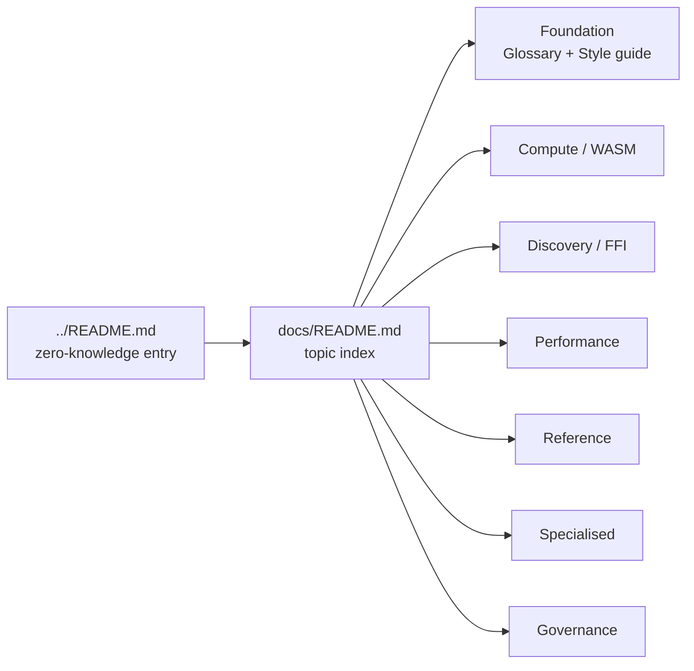

# 📚 NEAT-AI Documentation Index

Welcome to the NEAT-AI documentation. This page is the topic-by-topic table of
contents — every long-form guide in the repository has a home here.

> [!IMPORTANT]
> **NEAT-AI ≠ NEAT.** **NEAT** means the original 2002 algorithm; **NEAT-AI**
> means this project — they are no longer the same thing. See the
> [NEAT vs NEAT-AI rule in AGENTS.md](../AGENTS.md#-neat-vs-neat-ai--which-term-to-use)
> for the one canonical statement of the convention.

If you have not used NEAT-AI before, follow the **Where to start** reading path
below; it walks from a zero-knowledge introduction through to the topic guides
you are most likely to need next.

## 🧭 Where to start

A new reader should follow the docs in this order:

1. **[../README.md](../README.md)** — zero-knowledge entry point. Explains what
   NEAT-AI is, the major features, and gives a working example.
2. **[../AGENTS.md](../AGENTS.md)** — terminology and coding conventions. Read
   this if any of the playful names (Creature, Discovery, CRISPR, Grafting,
   MCMC) are unfamiliar. In particular, see the
   [**NEAT** and **NEAT-AI** terminology entries](../AGENTS.md#-terminology) and
   the [NEAT vs NEAT-AI rule](../AGENTS.md#-neat-vs-neat-ai--which-term-to-use)
   for the convention used throughout this repository.
3. **[../CONTRIBUTING.md](../CONTRIBUTING.md)** — development setup, how to run
   the quality gate, and how to bump the pinned NEAT-AI-core dependency.
4. **This page (`docs/README.md`)** — pick a topic guide below for the feature
   you want to use.
5. **A topic guide** — each guide assumes the basics from steps 1–3 and focuses
   on a single subsystem.

Two **foundation documents** underpin every other doc — keep them open while
reading or writing:

- **[GLOSSARY.md](GLOSSARY.md)** — the canonical glossary. Every acronym
  expanded with a deeper-reading link; every themed term (Creature, Discovery,
  CRISPR, Grafting, Islands …) explained in plain language.
- **[DOC_STYLE.md](DOC_STYLE.md)** — the short documentation style guide: the
  rules (define acronyms, link themed terms, call out NEAT-vs-NEAT-AI
  differences, fact-check, keep docs small, prefer diagrams) every doc follows.

## 🗺️ Reading map

## ⚡ Compute / WebAssembly (WASM)

Activation, gradient flow, and the GPU/WASM compute layer.

- **[ACTIVATION_FUNCTIONS.md](ACTIVATION_FUNCTIONS.md)** — selection guide for
  the 30+ built-in squash functions, with notes on when each is a good fit.
- **[BACKPROP_ELASTICITY.md](BACKPROP_ELASTICITY.md)** — why NEAT-AI prefers
  minimum-change weight updates and how it avoids pushing saturated activations
  further into saturation.
- **[GPU_ACCELERATION.md](GPU_ACCELERATION.md)** — Metal/Vulkan/DX12
  acceleration via `wgpu`, with a CPU fallback.
- **[WASM_RESIDENT_TOPOLOGY.md](WASM_RESIDENT_TOPOLOGY.md)** — feasibility
  analysis for keeping the entire creature topology resident inside the WASM
  module.

## 🧬 Discovery / FFI (Foreign Function Interface)

Error-guided structural evolution backed by the Rust extension.

- **[DISCOVERY_GUIDE.md](DISCOVERY_GUIDE.md)** — end-to-end walkthrough of
  distributed, multi-machine discovery: caches, replay, candidate category
  limits, focus overrides, and the cost-of-growth gate.
- **[DISCOVERY_DIR.md](DISCOVERY_DIR.md)** — technical API reference for
  `Creature.discoveryDir()` and the shape of the data directory it consumes.
- **[DISCOVERY_ARCHITECTURE.md](DISCOVERY_ARCHITECTURE.md)** — internal
  architecture of the discovery pipeline: pulse generation, candidate proposals,
  success/failure caches, and the FFI handshake.

## 🚀 Performance

Tuning guides and benchmark research.

- **[PERFORMANCE_TUNING.md](PERFORMANCE_TUNING.md)** — operational tuning: WASM
  caches, thread pools, memory management, and scaling for large-scale training.
- **[PERFORMANCE_RESEARCH.md](PERFORMANCE_RESEARCH.md)** — research notes and
  migration learnings from the WASM transition.
- **[PREDICTIVE_CODING_BENCHMARKS.md](PREDICTIVE_CODING_BENCHMARKS.md)** —
  benchmark results for the predictive-coding training mode.
- **[SCORE_PER_HOUR_HARNESS.md](SCORE_PER_HOUR_HARNESS.md)** — the
  score-improvement-per-wall-clock-hour benchmark harness: the reproducible
  evidence gate for the #3396 evolution-performance milestone.
- **[EVOLUTION_CONFIG_SWEEP_3400.md](EVOLUTION_CONFIG_SWEEP_3400.md)** — the
  evolution-mode / population / sample-rate configuration sweep over that
  harness, and its findings (Issue #3400).

## 📖 Reference

Drop-in API and configuration material.

- **[API_REFERENCE.md](API_REFERENCE.md)** — public API index. A short surface
  map linking to the per-topic detail docs under [`api/`](api/):
  [Creature](api/CREATURE.md), [Configuration](api/CONFIGURATION.md),
  [Costs & Activations](api/COSTS_AND_ACTIVATIONS.md),
  [Evolution](api/EVOLUTION.md), [Training](api/TRAINING.md),
  [Discovery](api/DISCOVERY.md), [Interop](api/INTEROP.md),
  [Compute / WASM](api/COMPUTE.md), and [Errors](api/ERRORS.md).
- **[CONFIGURATION_GUIDE.md](CONFIGURATION_GUIDE.md)** — topic index for the
  configuration surface. The detail docs under [`config/`](config/) cover
  presets, core evolution, training, discovery, mutation adaptation,
  regularisation, population sizing, workers, logging, and recipes.
- **[OPTION_USAGE_AUDIT.md](OPTION_USAGE_AUDIT.md)** — the option-usage scan
  harness (`scripts/audit-option-usage.ts`): how every option key is enumerated
  from source and checked against consumer repositories, the built-in controls,
  and the search traps that would otherwise corrupt the audit.
- **[OPTION_AUDIT_SLICE_A.md](OPTION_AUDIT_SLICE_A.md)** — slice A of the #3505
  audit: the 46 non-`discovery*` top-level options classified `IN USE` /
  `KEEP (load-bearing default)` / `QUALIFIES`, with the per-key evidence and the
  two search faults that had to be corrected first.
- **[OPTION_AUDIT_SLICE_B.md](OPTION_AUDIT_SLICE_B.md)** — slice B of the #3505
  audit: the 33 `discovery*` top-level options plus the 3 discovery-scoped
  nested configs, with the env-var / CLI-alias forms that a camelCase-only grep
  misses and the substring false positive that hides an unset nested config.
- **[TIMEOUTS.md](TIMEOUTS.md)** — `timeoutMinutes` semantics and the absolute
  **T+15** hard cap: the two deadlines, what each phase does at the cap (abandon
  in-flight work, keep partial results, return the best creature), how the
  deadline propagates from `evolveDir` to the worker clamps, and the unchanged
  external-watchdog backstop.
- **[TROUBLESHOOTING.md](TROUBLESHOOTING.md)** — FAQ-style index of common
  problems. The detail docs under [`troubleshooting/`](troubleshooting/) cover
  WASM, discovery / FFI, memory, performance, training divergence, CI /
  quality.sh, configuration, and ONNX export.

## 🧪 Specialised topics

Subsystems that only some users need.

- **[CRISPR_GUIDE.md](CRISPR_GUIDE.md)** — CRISPR (Clustered Regularly
  Interspaced Short Palindromic Repeats) gene-edit conventions, the
  append+demote pattern, and validation rules.
- **[INTELLIGENT_DESIGN.md](INTELLIGENT_DESIGN.md)** — systematic per-neuron
  squash optimisation.
- **[PREDICTIVE_CODING.md](PREDICTIVE_CODING.md)** — neuroscience-inspired
  predictive-coding training mode.
- **[REINFORCEMENT_LEARNING.md](REINFORCEMENT_LEARNING.md)** — streaming-
  observation / agent-rollout pattern for episode-based tasks (Snake,
  Cart-Pole). Names the use case, documents the `Creature.activate` contract,
  shows a worked `CountingAdapter` + `Creature.evolveRL` example, and links to
  the full episode-rollout example in NEAT-AI-Examples.
- **[event-driven-evolution.md](event-driven-evolution.md)** — RFC for the
  first-class reinforcement-learning evolution API (`Creature.evolveRL`). Names
  the paradigm split between supervised batch (`evolveDir`/`evolveDataSet`) and
  reinforcement-learning evolution, specifies the class-shaped
  `EpisodeAdapter<S, A>` contract (Gym/Gymnasium return shape, default
  termination guards, seed cadence, opt-in geometric statistics), and sets out
  the migration path for the five episodic examples in NEAT-AI-Examples.
- **[dna-sharing-bake-off-results.md](dna-sharing-bake-off-results.md)** —
  bake-off comparison of inter-island DNA-sharing primitives (Issue #2496).
- **[NOVELTY_SEARCH.md](NOVELTY_SEARCH.md)** — optional novelty
  (behavioural-diversity) selection to escape deceptive landscapes: behaviour
  descriptors, the bounded archive, the kNN novelty score, and the
  fitness/novelty blend (Issue #2932).

## 🏛️ Governance and core dependency

Project-level policies, audits, and release plumbing.

- **[../AGENTS.md](../AGENTS.md)** — coding guidelines for human and AI
  contributors (terminology, invariants, testing rules).
- **[../CONTRIBUTING.md](../CONTRIBUTING.md)** — first-time contributor guide.
- **[../SECURITY.md](../SECURITY.md)** — security disclosure policy.
- **[REPO_GOVERNANCE.md](REPO_GOVERNANCE.md)** — CI/CD code ownership
  (`.github/CODEOWNERS`) and required branch-protection settings that guard the
  privileged workflows (Issue #3187).
- **[../CHANGELOG.md](../CHANGELOG.md)** — release notes.
- **[EXTERNAL_NEAT_AI_CORE.md](EXTERNAL_NEAT_AI_CORE.md)** — 🧭 cluster overview
  for the NEAT-AI-core dependency. Day-to-day workflow for bumping the pinned
  revision, plus links to every detail doc below.
- **[CORE_DEPENDENCY_POLICY.md](CORE_DEPENDENCY_POLICY.md)** — how NEAT-AI pins
  and consumes [NEAT-AI-core](https://github.com/stSoftwareAU/NEAT-AI-core) via
  `deno.json` + `build.sh` (rev pinning, semver, approval tiers).
- **[CI_EXTERNAL_NEAT_AI_CORE.md](CI_EXTERNAL_NEAT_AI_CORE.md)** — CI plumbing
  for `build.sh`-driven artefact sync.
- **[PARITY_GATE.md](PARITY_GATE.md)** — release checklist run after every repin
  to verify TypeScript ↔ WASM parity.
- **[PARITY_AUDITS.md](PARITY_AUDITS.md)** — archived parity audits (Issues
  #2367, #2368, #2369) consolidated into a single page. Replaces three former
  stubs.
- **[VERSION_VISIBILITY.md](VERSION_VISIBILITY.md)** — every worker logs the
  running `@stsoftware/neat-ai` version at startup (Issue #2682). Convention,
  rationale, and how to add the line to new entry points.
- **[TS_RUST_MIGRATION.md](TS_RUST_MIGRATION.md)** — TypeScript → Rust migration
  milestone roadmap.

## 🔍 Comparison with other approaches

- **[../COMPARISON.md](../COMPARISON.md)** — the concise comparison **hub**: how
  NEAT-AI compares to standard NEAT, traditional neural networks, CNNs
  (Convolutional Neural Networks), RNNs (Recurrent Neural Networks), and modern
  LLMs (Large Language Models). It carries the at-a-glance capability matrix and
  links out to the focused sub-documents under [`comparison/`](comparison/)
  (Issue #2961):
  - **[comparison/IMPLEMENTED.md](comparison/IMPLEMENTED.md)** — standard NEAT
    machinery vs the NEAT-AI extensions built on top.
  - **[comparison/ARCHITECTURES.md](comparison/ARCHITECTURES.md)** — NEAT-AI's
    evolving topology vs feedforward, CNN, RNN/LSTM, and Transformer networks.
  - **[comparison/TRAINING_PARADIGMS.md](comparison/TRAINING_PARADIGMS.md)** —
    gradient-only training vs NEAT-AI's hybrid evolution + backprop, and RL.
  - **[comparison/UNIQUE_APPROACHES.md](comparison/UNIQUE_APPROACHES.md)** — the
    12 headline NEAT-AI innovations.
  - **[comparison/ECOSYSTEM.md](comparison/ECOSYSTEM.md)** — NEAT-AI vs
    TensorFlow / PyTorch / scikit-learn.
  - **[comparison/PROS_AND_CONS.md](comparison/PROS_AND_CONS.md)** — candid
    trade-offs vs traditional neural networks.
  - **[comparison/FUTURE_WORK.md](comparison/FUTURE_WORK.md)** — gaps versus the
    modern state of the art.
  - **[comparison/REFERENCES.md](comparison/REFERENCES.md)** — consolidated
    supporting literature.

## 🚫 Out of scope for this index

The following artefacts live under `docs/` but intentionally are **not** indexed
above:

- **`pr-summary-*.md`** — per-PR summary files. They are write-once release
  notes for a single change, not topic documentation. Browse them via `git log`
  or the merged PR.
- **`archive/`** — historical material kept for context. Read on demand, not as
  part of the topic flow. Now includes:
  - `archive/pr-summaries/` — archived PR summaries.
  - `archive/research/` — DeepSeek applicability surveys
    ([`deepseek-papers-index.md`](archive/research/deepseek-papers-index.md) is
    the catalogue entry point; sibling applicability notes link from there).
  - `archive/investigations/` — closed per-issue investigation notes (e.g.
    [`issue-2418-training-bin-stream-investigation.md`](archive/investigations/issue-2418-training-bin-stream-investigation.md),
    [`issue-2515-forward-only-apply-audit.md`](archive/investigations/issue-2515-forward-only-apply-audit.md)).
- **`evidence/`** — captured artefacts referenced by individual PR summaries
  (logs, screenshots, repro scripts).
- **`models/`** — sample exported creature JSON used by the visualisation app.
- **`visualize/`, `index.html`, `index.js`, `server.ts`,
  `snapshot-schema.json`** — assets for the GitHub Pages visualisation app, not
  prose documentation.
- **`logo.png`, `cspell.json`** — brand asset and spell-check dictionary.
