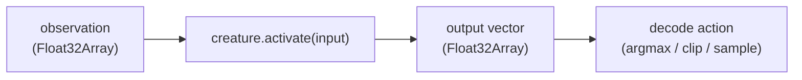
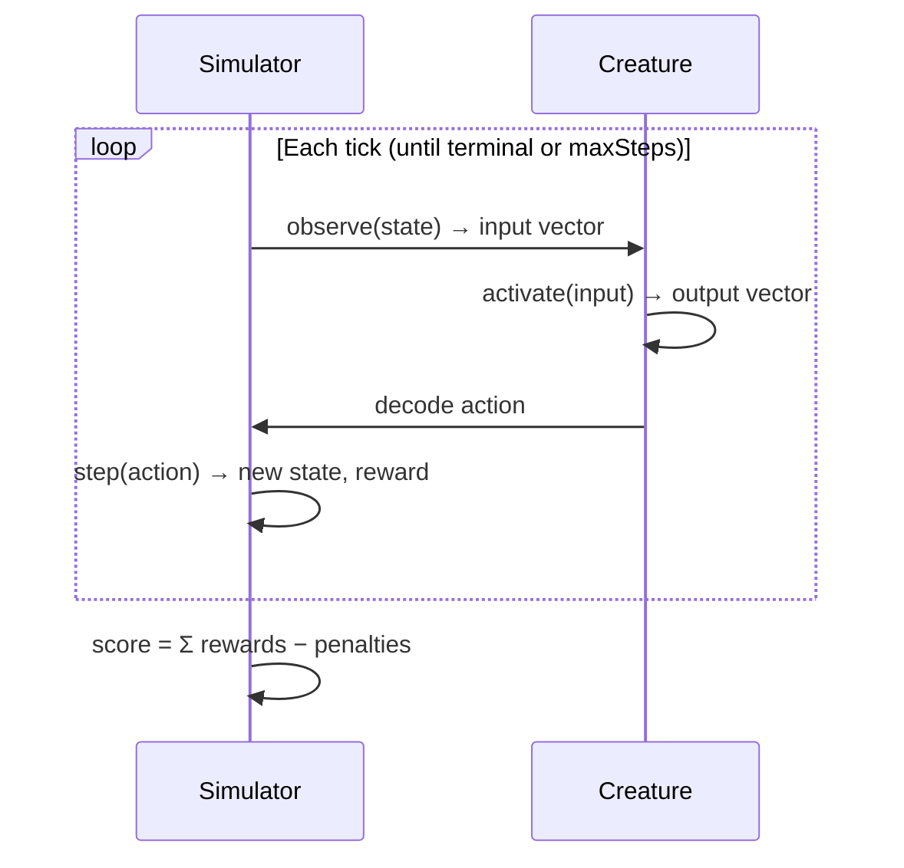
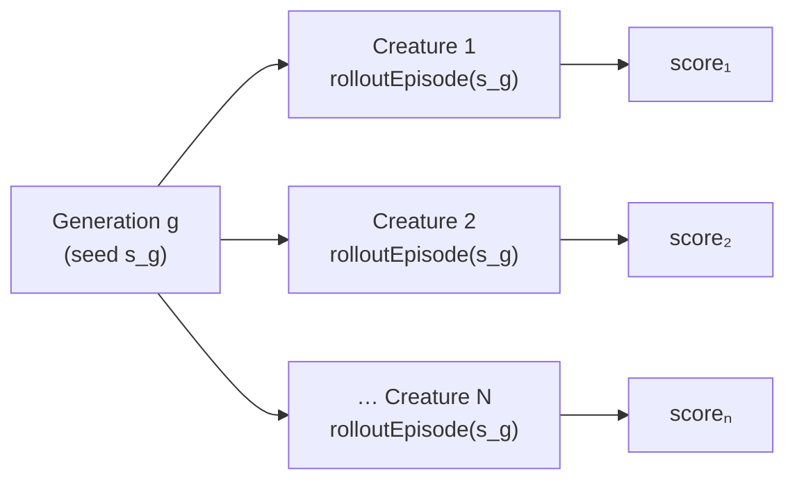
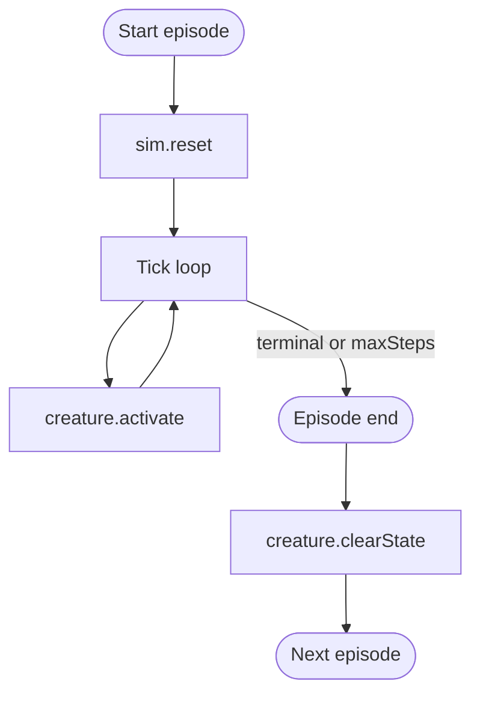

# 🎮 Reinforcement Learning / Agent Rollouts

> **Streaming-observation / agent-rollout** in
> [NEAT-AI](../AGENTS.md#-terminology) is the API pattern for episode-based
> tasks (Snake, Cart-Pole, grid worlds, control tasks) where the next
> observation depends on the creature's previous action.
>
> The library already supports this pattern out of the box — `Creature.activate`
> is the streaming primitive — but until now there was no document on the
> NEAT-AI side that named the use case. This guide names it, describes the API
> contract, and shows the canonical episode-rollout loop.

<!-- -->

> [!NOTE]
> No new code is needed for this pattern. If you can wrap your simulator behind
> a `step(action) → (observation, reward, terminal)` interface, NEAT-AI can
> drive the policy. The companion worked example lives in
> [NEAT-AI-Examples/snake_game](https://github.com/stSoftwareAU/NEAT-AI-Examples).

## 📋 Table of Contents

1. [When to use this pattern](#-when-to-use-this-pattern)
2. [The streaming primitive](#-the-streaming-primitive-creatureactivate)
3. [Episode rollout pattern](#-episode-rollout-pattern)
4. [Per-creature, per-generation independence](#-per-creature-per-generation-independence)
5. [Scoring an episode](#-scoring-an-episode)
6. [`clearState` between ticks vs episodes](#-clearstate-between-ticks-vs-episodes)
7. [Worked example links](#-worked-example-links)
8. [Comparison with value-based and policy-gradient RL](#-comparison-with-value-based-and-policy-gradient-rl)
9. [Glossary](#-glossary)

## 🎯 When to use this pattern

Use the streaming-observation pattern when:

- The task is **episodic** — there is a start state, a sequence of timesteps,
  and a terminal condition (death, goal reached, time-out).
- The observations are **non-i.i.d.** — each observation depends on the agent's
  previous action. This is the defining feature of an
  [agent-environment loop](https://en.wikipedia.org/wiki/Reinforcement_learning).
- You can score a full episode after the fact — typically a sum of rewards, a
  survival proxy, or a shaping signal.
- A differentiable loss is **not** available, or is expensive to construct.
  NEAT-AI optimises the network end-to-end against the episode score, so the
  reward signal does not need to be differentiable.

If your task is fully supervised — every observation comes with a target output
and the data is independent — you do not need this pattern. Use
`creature.train(...)` with batched training data instead.

## 🌊 The streaming primitive: `Creature.activate`

NEAT-AI's streaming primitive is one method on `Creature`:

```typescript
activate(input: Float32Array, feedbackLoop?: boolean): Float32Array;
```

From the caller's point of view this is a **stateless function from observation
to action vector**:

- The simulator owns the world state (position, velocity, board, etc.).
- The creature owns the network weights and topology.
- Each call maps one observation to one output vector. The caller decodes the
  output into an action (e.g. `argmax` for discrete actions, or a clipped scalar
  for continuous control).



> [!IMPORTANT]
> `activate` takes a **`Float32Array`**, not a plain `number[]`. Construct the
> buffer once per episode and overwrite it in place each tick — that way the hot
> loop allocates nothing.

The optional `feedbackLoop` argument enables recurrent self-connections in
networks that have them. For a stateless feed-forward policy leave it at the
default (`false`). If you genuinely want a recurrent policy that carries hidden
state across ticks within an episode, set it to `true` and **do not** call
`clearState()` between ticks of the same episode (see
[`clearState` between ticks vs episodes](#-clearstate-between-ticks-vs-episodes)).

## 🔁 Episode rollout pattern

The canonical rollout loop is:

```typescript
function rolloutEpisode(
  creature: Creature,
  sim: Simulator,
  maxSteps: number,
  seed: number,
): number {
  sim.reset(seed);
  const input = new Float32Array(sim.observationSize);
  let totalReward = 0;

  for (let tick = 0; tick < maxSteps; tick++) {
    sim.observeInto(input); // fill input with current state
    const output = creature.activate(input); // forward pass
    const action = decodeAction(output); // argmax, clip, sample, ...
    const { reward, terminal } = sim.step(action);
    totalReward += reward;
    if (terminal) break;
  }

  return totalReward;
}
```



A few things to notice:

- The loop is **driven by the simulator**, not by NEAT-AI. The library exposes a
  forward pass; the caller runs the loop.
- The terminal check exits early — the rollout stops when the creature "dies" or
  the task ends. `maxSteps` is a safety cap.
- The episode `seed` is passed in. Re-using the same seed across creatures in
  the same generation makes the fitness comparison fair (everyone faces the same
  starting state and the same dynamics).

## 👥 Per-creature, per-generation independence

Each creature's rollout is **independent of every other creature's rollout**.
That gives you trivial parallelism along two axes:



- **Population × generations** parallelises by creature: you can score every
  creature in a generation concurrently. Workers, threads, or remote machines —
  the simulator state lives next to the rollout, never inside the creature.
- **Per-generation seed**: pick **one** seed per generation and reuse it for
  every creature in that generation. Fitness is then a clean comparison ("which
  creature did best on the same level?"). Rotating the seed across generations
  stops the population from over-fitting to a single configuration of the world.
- **Multiple episodes per creature**: if rewards are noisy (stochastic
  environment, random spawn positions), run `K` episodes per creature with `K`
  different seeds and average the scores. This is a variance reduction knob —
  pick `K` to fit your evaluation budget.

> [!TIP]
> Treat the generation-level seed as a hyperparameter. Bigger seeds (or more
> episodes per creature) reduce variance but raise the cost of one generation.
> Snake-style tasks usually do well with `K = 1–4` episodes per creature.

## 📊 Scoring an episode

The fitness score returned to NEAT-AI is **a single scalar per creature, per
generation**. Common choices:

| Score                   | When to use                                                                                    |
| ----------------------- | ---------------------------------------------------------------------------------------------- |
| `Σ rewards`             | Standard cumulative-reward setting — what RL textbooks call the _return_.                      |
| `Σ rewards − penalties` | When you want shaping (e.g. punish jittery actions, oscillation, energy use).                  |
| Survival time           | Pure survival tasks (Cart-Pole). Equivalent to `Σ 1` per non-terminal tick.                    |
| Goal-distance proxy     | Tasks where reward is sparse — mix the sparse signal with a dense shaping term to bootstrap.   |
| Mean over `K` episodes  | Stochastic environments. Average the per-episode score across multiple seeds before reporting. |

Whichever you pick, **return one number** to NEAT-AI's fitness function.
`Creature.score` is treated by the population as "higher is better" — convert
losses to negative scores or similar before returning.

## 🧹 `clearState` between ticks vs episodes

`Creature.clearState()` resets per-creature runtime state (cached activations,
score, WASM compiled network handle). The right place to call it depends on
whether your policy is **stateless** (feed-forward) or **stateful** (recurrent
with `feedbackLoop = true`):



- **Stateless feed-forward policy** (the default): you do **not** need to call
  `clearState()` between ticks — there is no carry-over state to reset. Calling
  it would waste cycles. Existing examples in NEAT-AI-Examples follow this rule:
  they treat the network as a stateless policy and only reset between episodes
  (typically as part of moving on to the next creature).
- **Recurrent policy** (`feedbackLoop = true`): the network's recurrent outputs
  persist across `activate` calls **inside the same episode** — that is the
  point of recurrence. Call `clearState()` **once per episode**, before the
  first tick, so the recurrent state starts clean. Do **not** call it between
  ticks within the same episode.
- **Between creatures** in the same generation: each creature is its own object;
  you do not need to clear a different creature.
- **Memory pressure** (long-running training): if you keep the same creature
  object across many episodes and notice WASM heap growth, calling
  `clearState()` between episodes also disposes the cached WASM CompiledNetwork,
  which is the cheapest reset. See [`activateEphemeral`](API_REFERENCE.md)
  (Issue #1504) if you want the forward pass without ever caching the compiled
  network.

## 🎯 Worked example links

The canonical worked example lives in **NEAT-AI-Examples**:

- **`snake_game`** — full episode-rollout loop with grid observation, discrete
  action decoding, per-generation seed, and cumulative-reward fitness. See
  [stSoftwareAU/NEAT-AI-Examples](https://github.com/stSoftwareAU/NEAT-AI-Examples)
  for the source. Documentation work for the example side is tracked in
  NEAT-AI-Examples#125 and NEAT-AI-Examples#126.

If you build a second example (Cart-Pole, grid world, two-player game),
contribute it to NEAT-AI-Examples and link it from this section so future
readers find both.

## 🔍 Comparison with value-based and policy-gradient RL

NEAT-AI is a **direct policy search** method: it evolves the policy network
itself against the episode score, with no value function and no policy gradient.
This puts it in a different family from the dominant deep-RL methods.

| Family                                                                    | Examples                | What it learns                                                                  | Needs differentiable reward?                                                                | Strengths                                                                                                                                      | Weaknesses                                                                                                                          |
| ------------------------------------------------------------------------- | ----------------------- | ------------------------------------------------------------------------------- | ------------------------------------------------------------------------------------------- | ---------------------------------------------------------------------------------------------------------------------------------------------- | ----------------------------------------------------------------------------------------------------------------------------------- |
| Value-based ([Q-learning](https://en.wikipedia.org/wiki/Q-learning), DQN) | DQN, Rainbow            | A value function `Q(s, a)`; the policy is `argmax_a Q(s, a)`.                   | Reward must be additive; the loss on `Q` is differentiable.                                 | Sample-efficient on tabular and small image tasks. Strong theory.                                                                              | Discrete action spaces only (DQN). Brittle on long-horizon credit assignment. Replay buffer overhead.                               |
| Policy-gradient                                                           | REINFORCE, PPO          | The policy `π(a \| s)` directly, via gradient on a stochastic objective.        | Yes — the policy must be differentiable, and we differentiate through it.                   | Continuous action spaces. Mature ecosystems (RLlib, Stable-Baselines3).                                                                        | Variance is high; needs careful baselines. Hyperparameter-sensitive.                                                                |
| **Neuroevolution (NEAT-AI)**                                              | NEAT, CMA-ES, OpenAI ES | The policy network itself — both topology and weights — by evolutionary search. | **No.** The reward is a scalar produced by the simulator; nothing has to be differentiable. | Works with non-differentiable, sparse, or simulator-only rewards. Embarrassingly parallel across the population. Topology grows automatically. | Less sample-efficient per environment step than DQN/PPO when a good gradient signal exists. Computationally heavier per generation. |

**When NEAT-AI is the right choice for a streaming-observation task:**

- The reward is sparse, non-differentiable, or only available at the end of the
  episode (e.g. "did the agent win?").
- The action space mixes discrete and continuous components, or the action
  decoder is itself non-differentiable.
- You want the architecture to grow with the task — no manual layer sizing.
- You have many CPU cores or distributed nodes — NEAT-AI scales by spreading
  rollouts across them, not by one big GPU.

**When DQN or PPO is the better choice:**

- The environment is cheap to step and you can afford millions of steps.
- The reward is dense and informative on every tick.
- A differentiable policy with a fixed architecture is acceptable.

For a deeper comparison against feedforward, CNN, RNN, and Transformer
architectures, see [`COMPARISON.md`](../COMPARISON.md).

## 📚 Glossary

- **Episode rollout** — one full play-through of the simulator, from `reset` to
  a terminal state (or `maxSteps`). Each tick consists of observe → activate →
  decode → step.
- **Streaming observation** — an observation that depends on the agent's
  previous actions. Each `activate` call maps the current observation to the
  next action; the simulator advances the world state in between.
- **Per-generation seed** — a single random seed reused across every creature in
  a generation, so all creatures face the same world dynamics and the fitness
  comparison is fair.
- **Return** — the standard RL term for the cumulative score of an episode
  (`Σ rewards`), optionally with shaping penalties subtracted.

For the project-wide vocabulary (Creature, Discovery, CRISPR, Grafting, MCMC),
see [`AGENTS.md`](../AGENTS.md#-terminology).
