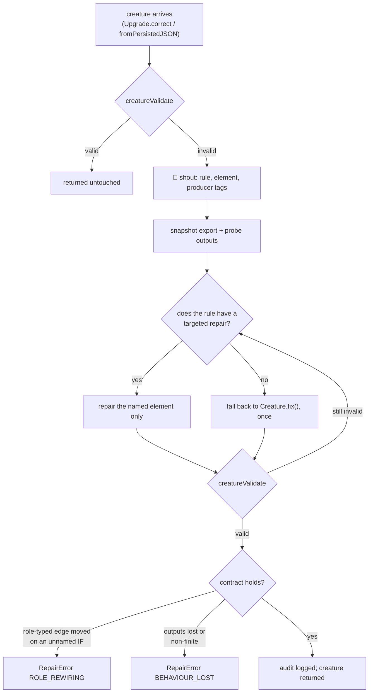

# 🛠️ The repair contract

**A repair pass may never hand back a creature worse than the one it was
given.**

This page is the design record for the load-time repair path — what it may do,
what it must refuse to do, and why. It exists because a repair pass that broke
that rule cost a production champion **90.7 %** of its score (0.36900 → 0.03437)
and went unnoticed for two days (Issues #3845, #3848).

## 📉 What went wrong

`Upgrade.correct()` ran `Creature.fix()` on **every** load, valid or not.
`fix()` was written for v1.x/v2.x genomes — random inbound synapses, orphan
constants, self-connections — years before role-typed synapses and grafted `IF`
forests existed.

On a champion carrying grafted `IF` decision trees it replaced 46 of 26,077
synapses, moving each off the **shared bias-1 constant** feeding an `IF` node's
branch and onto an arbitrary input neuron:

```text
removed:  neuron-132866057  ->  forest-7143fa575f538045-if   role=positive
added:    input-88          ->  forest-fbf1cf006acbc18d-if   role=negative
```

Neuron and synapse **counts were unchanged**, so no size or count check saw
anything. But in a grafted tree the leaf value **is** the weight on that bias-1
constant. Swapping the constant for an input turns a constant leaf into a
function of unrelated data, and the tree stops being a tree.

## 📜 The six principles

1. **Never return something worse than you were given.** Probe behaviour before
   returning; refuse and report failure rather than silently handing back
   damage.
2. **Repair minimally and locally.** Fix the rule that failed, at the element it
   failed on, and change nothing else.
3. **Preserve semantics you do not understand.** An `IF` node's `condition` /
   `positive` / `negative` edges matter by **presence and source**, not
   magnitude. A constant feeding a branch is not a redundant constant — it _is_
   the leaf value.
4. **Substitution is not repair.** Removing an invalid edge, or failing loudly,
   are both honest. Silently re-pointing it at `input-88` fabricates a model.
5. **Be idempotent and auditable.** A second run changes nothing, and every
   change is logged as _rule → element → action_.
6. **Prove it on the shapes you actually receive.** One fixture per structural
   family, and a standing test that each valid one survives untouched.

## 🧩 How the code holds to them

| Principle                         | Where it lives                                                                                                                                                  |
| --------------------------------- | --------------------------------------------------------------------------------------------------------------------------------------------------------------- |
| 1 — never worse                   | `assertBehaviourNotLost` in [`src/repair/VerifiedRepair.ts`](../src/repair/VerifiedRepair.ts), reusing the `BehaviourGuard` probes from Issue #3841             |
| 2 — minimal and local             | `ValidationError.neuronIndex` + `applyTargetedRepair` in [`src/repair/TargetedRepair.ts`](../src/repair/TargetedRepair.ts)                                      |
| 3 — preserve what you cannot read | `findRoleRewiring` in [`src/repair/RepairAudit.ts`](../src/repair/RepairAudit.ts)                                                                               |
| 4 — no substitution               | every targeted repair removes or downgrades; none adds a synapse                                                                                                |
| 5 — idempotent and auditable      | the validity gate makes a second run a no-op; `describeRepairAudit` prints the diff                                                                             |
| 6 — prove it on real shapes       | [`test/fixtures/StructuralFamilies.ts`](../test/fixtures/StructuralFamilies.ts) and [`test/repair/StructuralFamilies.ts`](../test/repair/StructuralFamilies.ts) |

## 🔁 The flow



## 🎯 Rule → repair

`creatureValidate` reports the rule **and** the neuron it failed on;
`ValidationError.neuronIndex` carries that neuron out. Repair dispatches on it:

| Rule                     | Targeted repair                                                                                                                                                                       |
| ------------------------ | ------------------------------------------------------------------------------------------------------------------------------------------------------------------------------------- |
| `NO_OUTWARD_CONNECTIONS` | Remove the hidden/constant neuron nothing reads (cascading to any feeder it strands).                                                                                                 |
| `NO_INWARD_CONNECTIONS`  | Rewrite the inbound-less hidden neuron as the constant it already computes — **same neuron object, same uuid**, every consumer preserved. Remove it when it also has no outward edge. |
| `SELF_CONNECTION`        | Remove the self edge on the named neuron.                                                                                                                                             |
| `RECURSIVE_SYNAPSE`      | Remove the backward edges into the named neuron.                                                                                                                                      |
| `IF_CONDITIONS`          | Downgrade that one `IF` to `IDENTITY` and strip its branch roles.                                                                                                                     |
| `MEMETIC`                | Prune memetic references to elements that no longer exist.                                                                                                                            |
| anything else            | Declined. The legacy `Creature.fix()` runs once, under the same verification, and the failure is recorded in the audit trail.                                                         |

Callers re-validate after every repair: a removal can strand the neurons
downstream of it, and each of those is its own rule failure naming its own
element on the next round.

## 🚫 What the contract refuses

Both refusals raise a [`RepairError`](../src/errors/RepairError.ts):

- **`ROLE_REWIRING`** — a role-typed edge into an `IF` was removed while both
  its endpoints survived, a role-typed edge was invented, or an `IF` was
  downgraded to an ordinary activation — on an `IF` no failing rule named. An
  edge lost along with a source neuron the repair legitimately removed is _not_
  a violation: the edge had to go with it, and the `IF` left short of a role is
  reported by `IF_CONDITIONS` on the next round, which justifies it.
- **`BEHAVIOUR_LOST`** — the creature produced finite outputs on the probe rows
  before the repair and does not after. A creature that could not be activated
  when it arrived carries no contract to break, so the check is skipped rather
  than guessed at.

A creature that still fails validation once every move is spent throws its own
`ValidationError`. **Nothing invalid is ever returned as though it were
repaired.**

## 🚦 Why the #3845 validity gate stays

Issue #3848 asked whether a provably safe repair makes the "only when invalid"
gate redundant. It does not, for two reasons:

1. The repo owner's invariant stands on its own — _"If you're repairing that
   means the creature is invalid in some way. We should not need to repair any
   creature now."_ Running a repair over a healthy creature is work with no
   legitimate outcome, and it must stay loud when it fires.
2. The verification is not free. It costs an export snapshot and 24 forward
   passes per ingest, which is the wrong trade on a path the whole fleet takes
   and no creature needs.

So the gate stays. What changed is that it is now an **optimisation** rather
than the only thing standing between a partly invalid champion and a mangled
one.

## ➕ Adding a structural family

Any new structural family NEAT-AI can emit needs a fixture — that is principle
6, and its absence is why grafted `IF` forests were never tested here.

1. Add a valid fixture to
   [`test/fixtures/StructuralFamilies.ts`](../test/fixtures/StructuralFamilies.ts).
2. List it in `structuralFamilies()`.

The standing tests in
[`test/repair/StructuralFamilies.ts`](../test/repair/StructuralFamilies.ts) then
assert it round-trips both ingest paths structurally identical and behaviourally
exact, including when the input count is widened.
