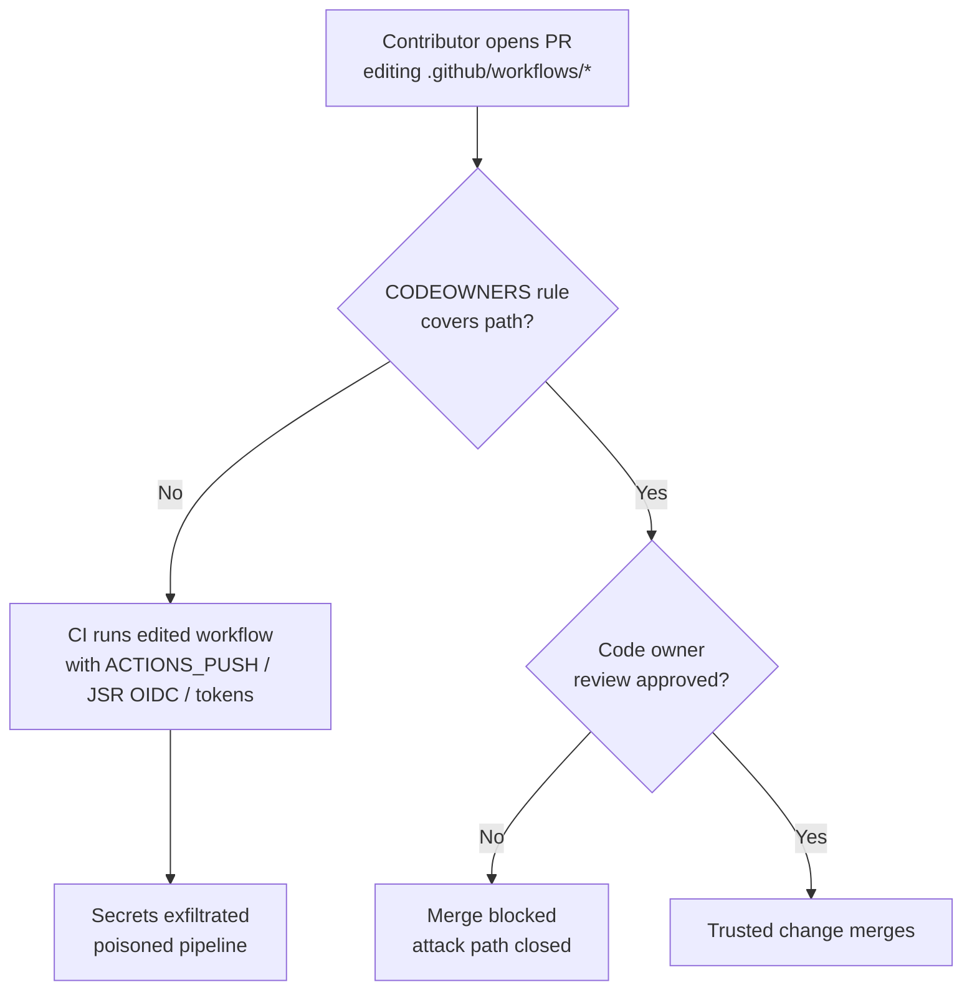

# Repository governance — CI/CD code ownership and branch protection

This page documents the repository-level controls that protect the CI/CD surface
of NEAT-AI. It accompanies the [`.github/CODEOWNERS`](../.github/CODEOWNERS)
file added for Issue #3187.

## Why the CI/CD surface needs code owners

The repository ships several **privileged** GitHub Actions workflows — jobs that
run with secrets beyond the default `GITHUB_TOKEN`:

| Workflow                                       | Privileged capability                                                      |
| ---------------------------------------------- | -------------------------------------------------------------------------- |
| `.github/workflows/publish.yml`                | `id-token: write` — OIDC tokenless publish of `@stsoftware/neat-ai` to JSR |
| `.github/workflows/pages.yml`                  | `id-token: write` + `pages: write` — GitHub Pages deploy                   |
| `.github/workflows/update-package-version.yml` | `secrets.ACTIONS_PUSH` — write-scoped push PAT                             |
| `.github/workflows/quality.yml`                | `secrets.ACTIONS_PUSH` (`push-fixes` job only), `secrets.GITLEAKS_LICENSE` |
| `.github/workflows/semgrep.yml`                | `secrets.SEMGREP_APP_TOKEN`                                                |
| `.github/workflows/coverage.yaml`              | `secrets.CODECOV_TOKEN`                                                    |

`quality.yml` splits its privileged capability out of the job that runs
PR-controlled code (Issue #3607): the `quality` job executes `build.sh` and the
Deno checks with only the read-scoped default `GITHUB_TOKEN` and hands its
fmt/lint fixes on as a patch artefact, while the separate `push-fixes` job
checks out fresh, applies that patch as data, and is the only place
`secrets.ACTIONS_PUSH` is in scope.

Without a code-owner rule covering `.github/workflows/`, a single careless or
compromised account could open a pull request that quietly edits one of these
workflows. The edited workflow then runs with those secrets **the moment CI
fires** — before a human necessarily notices the diff. That is the canonical
poisoned-pipeline / secret-exfiltration path. Requiring a named code owner's
review on every CI/CD change closes it.



## Code owners

[`.github/CODEOWNERS`](../.github/CODEOWNERS) assigns the CI/CD surface to
`@stSoftwareAU/developers`. Code owners **must have write access** to the
repository, otherwise GitHub silently ignores the rule and enforces no review.
The `developers` team holds write (push) access and is the trusted human
reviewer for this repo. (The `vibe-coders` team also has write access but is the
automated worker account, so it is not used as a human code owner.)

> The `maintainers` team that some templates suggest does **not** exist in the
> `stSoftwareAU` org — pointing a rule at a non-existent team leaves it
> unenforced. `test/ci/CodeownersWorkflowsCoverage.ts` guards against that
> regression.

## Required branch-protection settings

CODEOWNERS only _requests_ review; it is enforced **only** once branch
protection requires it. These are repository settings (not files in the tree),
so they must be configured once by a repository administrator on the default
branch (`Develop`):

- **Require a pull request before merging** — block direct pushes to the default
  branch.
- **Require review from Code Owners** — enforce the CODEOWNERS approval before
  merge. This is the setting that makes the rule above effective.
- **Block force-pushes** to the default branch.
- **Require linear history** — recommended if the team uses a rebase/squash
  workflow.
- **Require signed commits** — recommended; recent commits on the default branch
  carry no signature markers.

### Configuring via the GitHub CLI

An administrator can apply the core controls with:

```bash
gh api -X PUT repos/stSoftwareAU/NEAT-AI/branches/Develop/protection \
  --input - <<'JSON'
{
  "required_pull_request_reviews": {
    "require_code_owner_reviews": true,
    "required_approving_review_count": 1
  },
  "required_status_checks": null,
  "enforce_admins": true,
  "restrictions": null,
  "allow_force_pushes": false,
  "required_linear_history": true
}
JSON
```

> Branch protection cannot be asserted by the unit-test suite — it is a
> server-side setting invisible to a static checkout. The tests in
> `test/ci/CodeownersWorkflowsCoverage.ts` verify the part that _is_ visible:
> that a CODEOWNERS file exists and covers the CI/CD surface with a valid, real
> owner.
