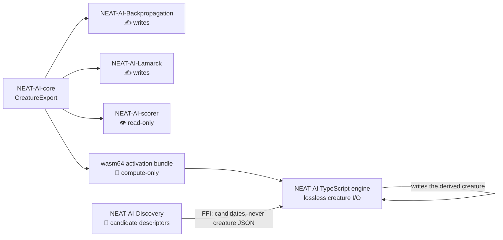

# Rust Extension Creature-JSON Write-Path Audit

Issue #3751 (parent: #3746).

Parent issue #3746 fixed the two Rust extensions known to rewrite creature JSON
(NEAT-AI-Backpropagation and NEAT-AI-Lamarck) and **assumed** the rest of the
family was read-only. This page records the verification of that assumption, so
the fix is known to be complete rather than believed to be.

The failure mode this audit guards against is a false "does not write" verdict —
an extension cleared as read-only that in fact rewrites creature JSON and
silently strips `tags` / `memetic`. Every verdict below therefore cites the
`file:line` it rests on, pinned to a commit SHA a reviewer can re-grep.

## Method

For each repository in the family, at the SHA recorded below:

```bash
grep -rn --include="*.rs" -E \
  "CreatureExport|to_writer|serde_json::to_string|File::create|fs::write" <repo>
```

Hits inside `#[cfg(test)]` modules, `tests/`, `benches/` and bench binaries were
excluded — they create fixtures, they do not rewrite a production creature.
Every remaining hit is accounted for in the verdicts below.

Membership was enumerated rather than assumed: `neat-core` consumers were found
with an org-wide search for `neat-core = { path`, and every `stSoftwareAU/*`
repository carrying Rust was checked, including the private GRQ trainer
repository (the downstream production consumer).

## Audited revisions

| Repository                           | Branch    | Commit SHA                                 |
| ------------------------------------ | --------- | ------------------------------------------ |
| stSoftwareAU/NEAT-AI-Discovery       | `Develop` | `f0250cdc7715d63c2ce052984d0ed696d0e3902c` |
| stSoftwareAU/NEAT-AI-scorer          | `Develop` | `3de9c4ef866083b1e20f4711bb1a83154fe313bd` |
| stSoftwareAU/NEAT-AI-core            | `Develop` | `7c9f3de3bcd7d3df6a878aaf0ebda379fa45a8e3` |
| stSoftwareAU/NEAT-AI-Backpropagation | `Develop` | `505700cee0b0786c73f1f4adae4e1aa5e5baca73` |
| stSoftwareAU/NEAT-AI-Lamarck         | `Develop` | `2673ea6b47ae996af941079e255b25fd96879073` |
| GRQ trainer (private)                | `Develop` | `124703815dab44bbbce1fd90491ca6e3c90698eb` |

`NEAT-AI-core` is the same revision this repository pins in `deno.json`
(`neatCore.rev`) and ships in `wasm_activation/pkg/neat_core_rev.txt`, so the
audited core is the core NEAT-AI actually runs.

## Family map



## Verdicts

### NEAT-AI-Discovery — does **not** write creature JSON

Discovery does not depend on `neat-core` at all: its `Cargo.toml` (SHA above)
lists no `neat-core` entry, and `grep -rn "neat_core\|CreatureExport" src`
returns nothing. It carries its own deliberately-narrow FFI view of a creature,
`CreatureJson` (`src/ffi_types/mod.rs:89`), which models only
`neurons`/`synapses`/`input`/`output`, with `NeuronJson`
(`src/ffi_types/mod.rs:96`) limited to `uuid`/`type`/`squash`/`bias`. That
struct is an **input** type — deserialised from the creature the TypeScript
caller supplies.

The only non-test file write in `src/` that touches a creature at all is the
debug visualisation snapshot: `File::create` at `src/export/snapshot.rs:374`
feeding `serde_json::to_writer` at `src/export/snapshot.rs:394`. That writes a
`VisualisationSnapshot` (`src/export/types.rs`) — a
`{meta, creature, recording,
derived}` envelope for the NEAT-AI-Explore
visualiser, written to a caller-named `out_file`
(`src/ffi_internal/utilities.rs:125`). It is a derived debug artefact that is
never read back as a creature; NEAT-AI does not call it (no occurrence of
`export_visualisation_snapshot` anywhere in `src/` or `test/`).

**Do generated candidates inherit the parent's pedigree?** Yes, and the
inheritance happens in TypeScript, not Rust. Discovery returns candidate
_descriptors_ (`src/ffi_types/candidates.rs`), and the derived creature is built
here by `src/discovery/CandidateCreation.ts` from the parent `Creature`, applied
via `src/discovery/CandidateApplication.ts` — the lossless TypeScript path. This
is asserted, not assumed: `test/discovery/DiscoveryCandidatePedigree.ts` feeds a
parent carrying creature tags, neuron tags, synapse tags and `memetic` through
the add-synapse and change-squash builders and asserts each tag survives on the
candidate.

`memetic` is the one field that legitimately does **not** survive a
topology-changing candidate. `memeticUpdate`
(`src/blackbox/MemeticUpdate.ts:17`) returns `undefined` whenever the child's
structure diverges from the parent's, so the caller resets the fine-tuning
record rather than carrying a stale one. That is a designed reset bound to
topology — not the silent metadata strip #3746 fixes — and the same test pins
the contract so a change of intent stays visible.

### NEAT-AI-scorer — does **not** write creature JSON (confirmed read-only)

The scorer consumes `neat-core` (`rust_scorer/Cargo.toml`) and emits scores. It
never calls `creature_to_json` or `creature_to_json_pretty` —
`grep -rn
"creature_to_json" rust_scorer/` returns nothing across `src/` and
`tests/`.

Every `File::create` / `fs::write` in `rust_scorer/src/` sits inside a
`#[cfg(test)]` module: `cli.rs` (writes from line 768, `cfg(test)` at
`cli.rs:682`), `gpu/mod.rs` (line 652, gate at `gpu/mod.rs:549`),
`stream_score.rs` (line 807, gate at `stream_score.rs:769`) and
`corpus_guard.rs` (line 133, gate at `corpus_guard.rs:121`). The two non-test
serialisations emit score results, not creatures:
`rust_scorer/src/cli.rs:666-668` prints the `RunOutput` result JSON to stdout,
and `rust_scorer/src/host_report.rs:188` serialises a `HostReport`.
`src/bin/gpu_pipeline_alloc_bench.rs:81` writes `creature-N.json` fixtures it
generated itself — a bench binary, not a rewrite path.

### wasm64 activation bundle — compute-only

The shipped bundle's whole API surface is in
`wasm_activation/pkg/wasm_activation.d.ts`: free functions taking and returning
`Float32Array` / `Float64Array` / `Uint8Array` / numbers, plus the
`CompiledNetwork` class. `CompiledNetwork`'s constructor takes a `Uint8Array` (a
compiled binary, not creature JSON) and its members are `activate*`,
`reset_state`, `to_dot`, `to_topology_json` and three readonly counts. Nothing
in the bundle opens a file — WASM has no filesystem here — and nothing emits a
creature.

`to_topology_json` (`NEAT-AI-core/neat-core/src/topology_export.rs:239`) returns
a **string**, and the string is not creature JSON: `TopologyExport` holds
`num_inputs`/`num_outputs`/`num_neurons` plus index-keyed node and synapse
records (`topology_export.rs:200-235`). It carries no `uuid` and no `tags` by
design, is consumed for visualisation via `src/wasm/WasmTopologyExport.ts`, and
is never written over a creature file.

### NEAT-AI-core — library only, no file write path

`creature_to_json` / `creature_to_json_pretty`
(`neat-core/src/creature.rs:297,302`) return `String`; the crate declares no
`[[bin]]` and the sole non-test `File::create` in `neat-core/src/` is
`training_data.rs:503`, inside the `#[cfg(test)]` module opened at
`training_data.rs:496`. Core hands the string to a caller; the caller decides
whether it reaches a file. `wasm-bench` is a single `src/lib.rs` benchmark crate
with no write path.

### GRQ trainer (private) `rust/train-extensions` — does **not** write creature JSON

The only other Rust in the org. Its `Cargo.toml` declares **no dependencies at
all** (deliberately zero-dependency, per its own comments), so it cannot consume
`neat_core::CreatureExport`. It builds trainer input from sentiment data files;
every `fs::write` in `src/v60.rs` is past the `#[cfg(test)]` gate at
`src/v60.rs:735`. `src/lib.rs` and `src/main.rs` contain no write or
serialisation calls at all.

### NEAT-AI-Backpropagation and NEAT-AI-Lamarck — writers (already covered)

Both rewrite creature JSON via `neat_core::creature_to_json` and both are
handled by the parent milestone: #3749 (Backpropagation) and #3750 (Lamarck), on
top of #3748 in `neat-core`.

## `tags.rs` sidecar count: exactly two

The duplication flag in the issue was checked across the family. Exactly two
copy-paste sidecars exist —
`NEAT-AI-Backpropagation/backpropagation/src/tags.rs` and
`NEAT-AI-Lamarck/lamarck/src/tags.rs` — the two already known. No third copy was
found in Discovery, scorer, core or GRQ. The two-copy count does not on its own
justify extracting a shared crate, and both are due to shrink or disappear once
the `neat-core` fix from #3748 is released.

## Outcome

No writer was found beyond Backpropagation and Lamarck, so this audit filed no
follow-up issues. The one candidate-generating extension, Discovery, derives its
creatures through the lossless TypeScript path, and
`test/discovery/DiscoveryCandidatePedigree.ts` is the CI-enforced regression
guard for it.
