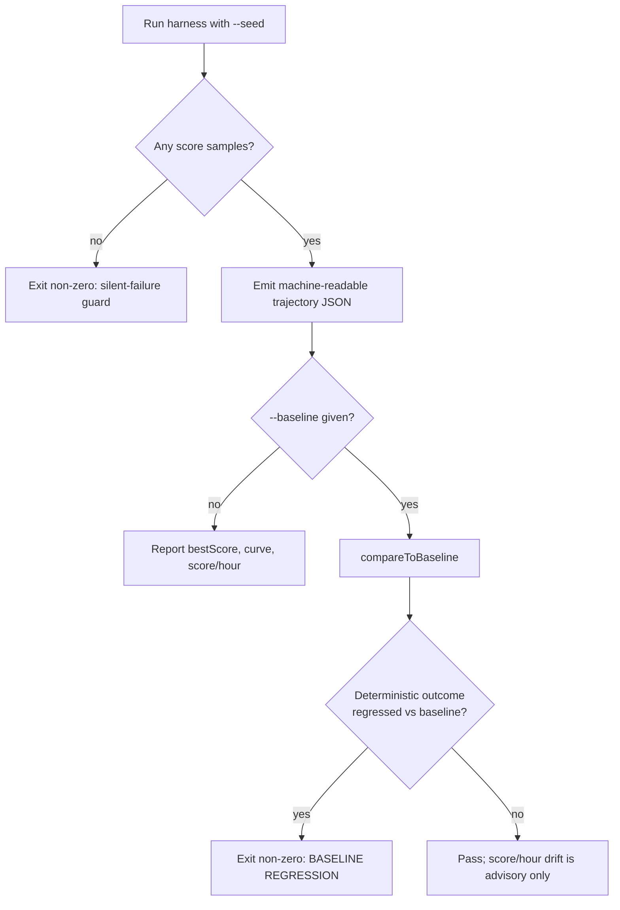

# Score-per-wall-clock-hour benchmark harness

> Issue #3398 — the evidence gate for the #3396 evolution-performance milestone.

The agreed success metric for the #3396 work is **score improvement per
wall-clock hour** inside the production learn/sampler time-boxes — _not_ raw
throughput. This harness measures that metric directly so every #3396
implementation sub-issue can show honest, apples-to-apples before/after evidence
within a fixed time budget.

Source: [`bench/score_per_hour_harness.ts`](../bench/score_per_hour_harness.ts).
Tests:
[`bench/score_per_hour_harness_test.ts`](../bench/score_per_hour_harness_test.ts).

## The one documented command

```bash
deno task bench:score-per-hour \
  --scale=grq-3397 --inputs=2461 --outputs=2 --samples=20 \
  --population=10 --max-generations=10 --time-budget-ms=600000 \
  --seed=3396 --train-per-gen=0 \
  --out=trajectory.json
```

This drives the same production-scale synthetic topology used by
`worker/learn.sh` / `worker/sampler.sh` — the `grq-3397` preset: **1,666 neurons
/ ~21,513 synapses / 2,461 inputs** — from
[`test/propagate/large/ProductionScaleCreature.ts`](../test/propagate/large/ProductionScaleCreature.ts),
and writes a machine-readable JSON trajectory containing:

- `scoreTrajectory` — the **score-vs-time curve**: best/average fitness and
  cumulative wall-clock elapsed at each generation.
- `bestFitness`, `initialBestFitness`, `finalBestFitness` — best score reached.
- `scorePerHour` — **score gained per wall-clock hour**
  (`(finalBestFitness − initialBestFitness) / hours`).

Run with `--baseline=bench/baseline_score_trajectory.json` to additionally gate
the run against the checked-in baseline (exit non-zero on an evolution-outcome
regression).

### Key flags

| Flag                      | Default      | Meaning                                                                    |
| ------------------------- | ------------ | -------------------------------------------------------------------------- |
| `--seed`                  | `3396`       | Seeds the NEAT RNG and synthetic generators — drives reproducibility.      |
| `--scale`                 | `grq-3397`   | Topology preset (`default` \| `grq-cluster` \| `grq-3397`).                |
| `--inputs` / `--outputs`  | `2461` / `2` | Network I/O width.                                                         |
| `--samples`               | `50`         | Number of synthetic training records.                                      |
| `--population`            | `20`         | Population size (`learn.sh` production value).                             |
| `--max-generations`       | `100`        | Hard generation cap.                                                       |
| `--time-budget-ms`        | `2700000`    | Wall-clock budget (learn.sh ≈ 45 min).                                     |
| `--train-per-gen`         | `0`          | Backprop sessions/generation. `0` = byte-reproducible pure neuroevolution. |
| `--discovery-sample-rate` | `-1`         | `-1` disables discovery (deterministic).                                   |
| `--train-data`            | —            | Optional real `.trainData` JSON sample to sanity-check.                    |
| `--out`                   | stdout       | Write the JSON trajectory to a file.                                       |
| `--baseline`              | —            | Compare against a checked-in baseline and gate on regressions.             |

## Reproducibility

With the defaults (`--train-per-gen=0`, `--discovery-sample-rate=-1`) the run is
**pure seeded neuroevolution**: identical seed + config produces a
byte-identical score trajectory. The determinism smoke test
(`identical seeds produce identical score trajectories`) runs in the standard
`deno test` CI suite and asserts byte-identical machine-readable output plus a
schema check on every PR.

Async backprop training (`--train-per-gen >= 1`) improves scores faster but
completes on worker threads whose scheduling is wall-clock-dependent, so those
runs are seeded-but-not-byte-identical. Use them for a production-faithful
measurement, not for the determinism gate.

## Guardrails



Three protections back the metric:

1. **Silent-failure guard (Issue #3234).** The run exits non-zero if it produced
   no score samples (a wedged learn/sampler invocation) rather than emitting an
   empty report.
2. **Evolution-outcome regression gate.** `compareToBaseline` fails when the
   final best score or the per-generation best-fitness trajectory regresses
   below the checked-in baseline
   ([`bench/baseline_score_trajectory.json`](../bench/baseline_score_trajectory.json)).
   This is machine-independent (the seeded trajectory is deterministic), so it
   reliably flags a change that speeds evolution up **but reaches worse scores**
   — pure speed at the cost of worse outcome is unacceptable.
3. **Score/hour drift (advisory).** The score/hour drop vs baseline is reported
   as a warning, not a hard failure, because wall-clock timing is
   machine-load-dependent and would be flaky as a blocking gate.

The scheduled `Score-per-hour regression gate` job in
[`.github/workflows/bench.yaml`](../.github/workflows/bench.yaml) runs the
harness weekly at the baseline config and uploads the trajectory artifact.
