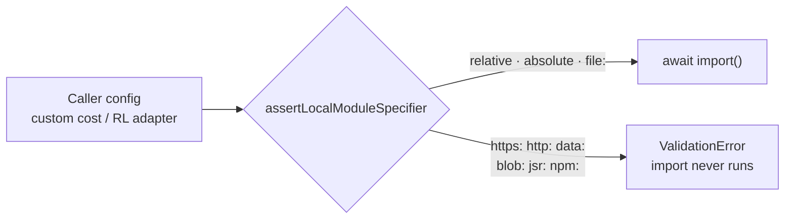

# 🔍 Security sweep coverage

This page records which `src/` directories the periodic **trust-boundary sweep**
has audited, and what each pass concluded. It exists so a later sweep does not
re-audit ground already cleared — a directory listed here as **clean** was read
in full under the lens below and needs re-reading only when it changes
materially.

It is a coverage ledger, not a vulnerability register. Confirmed findings are
filed as individual GitHub issues and linked from the table; the disclosure
process for anything found outside this sweep is in
[`SECURITY.md`](../SECURITY.md).

## 🔬 The lens

Every swept directory is read against the same three questions:

1. **Untrusted input → dangerous sink.** Untrusted input is anything
   deserialised from a model/creature JSON file, a dataset file on disk, or a
   network fetch, plus any caller-supplied string that could originate outside
   the developer's own code. Dangerous sinks are filesystem path construction,
   `Deno.run` / `Deno.Command`, `eval` / `new Function` / dynamic `import()`,
   shell strings, and log injection.
2. **Unbounded allocation or recursion** driven by an externally-supplied value
   — an allocation size, loop bound, or recursion depth taken straight from
   parsed file data with no cap.
3. **Privileged CI context** — anything reading secrets or env, or writing
   somewhere a CI job trusts.

A value that can only come from developer-written code in-process is **not** a
finding, but each pass records what it considered and dismissed so the next
sweep does not relitigate it.

## 📋 Coverage

| Area                                           | Pass                           | Disposition                                                                                                                                                  |
| ---------------------------------------------- | ------------------------------ | ------------------------------------------------------------------------------------------------------------------------------------------------------------ |
| `src/wasm/`, `.github/workflows/`, and friends | #3673 (`vibe-msi7zknu-e4a289`) | Findings filed as #3667–#3672; residue tracked on #3673.                                                                                                     |
| `src/predictiveCoding/`                        | #3685                          | **Clean** — see below.                                                                                                                                       |
| `src/transfer/`                                | #3685                          | **Finding** → #3714 (unbounded allocation at the checkpoint deserialisation boundary).                                                                       |
| `src/intelligentDesign/` (incl. `workers/`)    | #3685                          | **Finding** → #3715 (path traversal from an unvalidated neuron `uuid`).                                                                                      |
| `src/onnx/`                                    | #3685                          | **Clean** — see below. Completes the partial coverage from #3673, which confirmed the absence of an importer but did not read the encoders.                  |
| `src/multithreading/` worker `import()`        | #3685                          | **Resolved in-tree** — scheme allowlist added; see below.                                                                                                    |
| `bench/`, `test/`                              | —                              | Deliberately out of scope. Neither ships to consumers, and neither processes untrusted input in production. Include only if a future finding gives a reason. |

## ✅ Cleared areas

### `src/predictiveCoding/` — clean (#3685)

All six files read in full. The directory contains no `Deno.env`, `Deno.Command`
/ `Deno.run`, `eval`, `new Function`, or dynamic `import()`.

The only dangerous-sink surface is `PredictiveCodingTrainer.ts:139`
(`Deno.openSync`), whose path is a caller-supplied `string[]` parameter never
concatenated from parsed data — there is no traversal primitive because no
segment is joined in from file content.

Allocations were traced to their bounds. `PredictiveCodingTrainer.ts:114-121`
sizes buffers from `creature.input + creature.output`, which _is_ model-derived,
but `Creature.fromJSON` hoists `assertValidCreatureShape` (cap
`MAX_NEURON_COUNT = 1_000_000`, Issue #3672) ahead of any load work, so the
worst case is a bounded buffer. `PredictiveCodingInference.ts:79/115/164`
allocate from the already-materialised neuron array, not a raw JSON scalar.
`config.inferenceSteps` and `options.iterations` are developer-supplied
in-process. There is no recursion in the directory.

Considered and dismissed: `neuron.squash` is a raw string from creature JSON and
reaches `Activations.find()` at `PredictionErrorComputation.ts:59`,
`PredictiveCodingInference.ts:119`, and `PredictiveCodingLearning.ts:112`.
Activation names _do_ eventually reach `new Function()` bodies in the activation
compilers, but `Activations.find`
(`src/methods/activations/Activations.ts:108-113`) resolves against a fixed
registry and throws `ActivationError` on an unknown name, so no
attacker-controlled string reaches a compiler on this path.

### `src/onnx/` — clean (#3685)

All five files read in full, with the encoders (`ProtobufEncoder.ts`,
`OnnxExport.ts`, `OnnxModel.ts`, `ActivationMapping.ts`) as the focus, since
#3673 had confirmed only the absence of an importer.

**No path construction, because there is no I/O.** The export path performs zero
filesystem and zero network operations — `exportToOnnx` returns a `Uint8Array`
and leaves persistence to the caller. There is no write sink to traverse into.

**Creature-supplied names never reach any identifier.** Every ONNX name is
derived from integer array indices, not from neuron names, uuids, or tags:
`OnnxExport.ts:120-123`, `:151`, `:169-170`, `:184`, `:199`, `:211-212`.
Constant names are matched against a fixed allow-list (`OnnxExport.ts:274-289`),
so an unrecognised name is dropped rather than propagated. The only
creature-derived values reaching the encoder are `neuron.bias` and
`synapse.weight`, both written as floats. The single free-form string,
`options.graphName`, lands only in a protobuf string field (`OnnxModel.ts:232`).

**Allocation is bounded.** Every size derives from an array already materialised
in memory, never from a count parsed out of a file: `ProtobufEncoder.ts:118` and
`:136` are driven by accumulated chunk lengths, and the export loops are bounded
by `creature.input`, `creature.neurons.length`, `inwardConnections(i).length`,
and `creature.output`. `writeVarint` (`ProtobufEncoder.ts:29-43`) is the only
value-driven loop; it terminates in at most ten iterations and is only ever fed
enum constants and hard-coded dimensions. There is no recursion — message
nesting depth is fixed by the schema shape in code.

## 🔐 Resolved: worker `import()` scheme (#3685)

#3673 flagged `WorkerProcessor.ts:117` and `EpisodeWorkerProcessor.ts:127` as
taking a caller-supplied module specifier for `await import()` with no scheme
restriction, and deferred the judgement. **Resolved by adding the allowlist**
rather than by writing down a trust argument.

The trust argument was available — both values are developer configuration today
— but it is not durable. Neither the type (`AdapterDescription.url: string`,
`customCost.filePath: string`) nor the call graph prevents a value arriving from
a remote manifest such as a downloaded experiment description or a shared job
spec, and at that point an `https:` or `data:` specifier executes attacker code
inside the worker. Documenting "this can never come from an untrusted source"
would have been a claim the code does not enforce.

`assertLocalModuleSpecifier()` (`src/utils/ModuleSpecifierGuard.ts`) now runs
before either `import()`. Relative paths, absolute filesystem paths (including
Windows drive letters), and `file:` URLs load; every other scheme — `https:`,
`http:`, `data:`, `blob:`, `jsr:`, `npm:` — is rejected with a `ValidationError`
naming the scheme.

The two call sites differ in how the rejection surfaces, deliberately:

- **Custom cost** (`WorkerProcessor.loadCustomCostFromFile`) — the guard sits
  _outside_ the existing try/catch so the typed `ValidationError` reaches the
  caller instead of being flattened into a generic load failure.
- **Episode adapter** (`EpisodeWorkerProcessor.handleInit`) — the guard runs
  first inside `handleInit`, ahead of WASM init, and the rejection travels back
  over the worker protocol as `initialize: { status: "ERROR" }`, which is that
  protocol's fail-loud channel.

Regression cover: `test/utils/ModuleSpecifierGuard.ts` for the predicate, plus
`test/multithreading/WorkerProcessor.ts` and
`test/creature/EpisodeWorkerProcessorSpecifierGuard_test.ts`, which assert each
call site rejects a remote specifier _before_ `import()` is invoked and still
accepts a local one.

## 📝 Observed, not filed

Recorded so a later sweep recognises these as judged rather than missed.

- **`src/transfer/PruningTemplate.ts:123`** — low. Fingerprint allocation is
  `hiddenNeuronCount × probe.length × 4` bytes, and the same product drives the
  scan at `:199-206`. Neither operand is capped and neither individually
  reflects the product, so a large model plus a large probe multiplies out. Both
  operands are already-materialised in-memory structures, making this
  amplification rather than a raw unchecked scalar.
- **Log injection from creature strings** — low. Unvalidated `uuid` / `squash`
  values are interpolated into log lines with no newline escaping
  (`ImproveSquash.ts:205-207`, `:421-424`, `:463-466`, `:523-531`;
  `TacitKnowledge.ts:94-96`, `:159-163`, `:169-172`). A `uuid` containing a
  newline forges log records. Relevant only where logs are machine-parsed; no
  code execution. Captured on #3715 alongside the traversal in the same file.
- **`src/wasm/WasmModuleLoader.ts:507`** — not a finding. This third
  `await import()` takes a specifier built from a fixed literal relative to
  `import.meta.url`, not from caller input, so the #3685 allowlist does not
  apply to it.
- **`src/intelligentDesign/workers/deno/worker.ts:20`** — not a finding. The
  specifier is a hard-coded string literal with no interpolation.

## 🔗 Sibling docs

- **[../SECURITY.md](../SECURITY.md)** — vulnerability disclosure policy and the
  in-repo security automation.
- **[REPO_GOVERNANCE.md](REPO_GOVERNANCE.md)** — CI/CD code ownership and branch
  protection.
- **[../AGENTS.md](../AGENTS.md)** — coding conventions, including the
  secure-coding principles this sweep applies.
