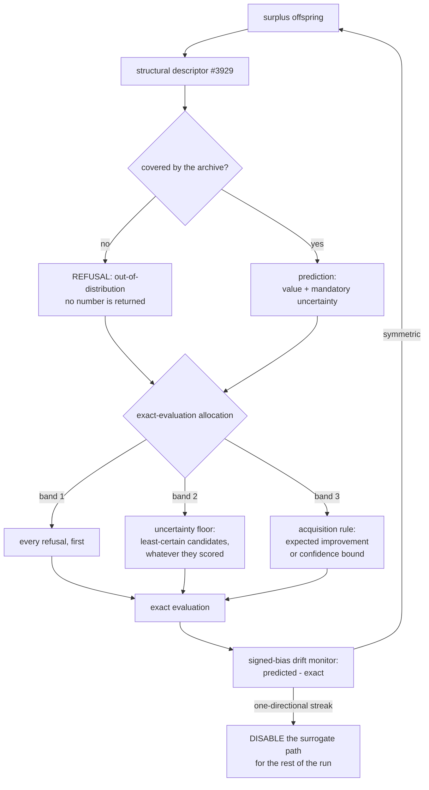

# Surrogate uncertainty and acquisition (Issue #3933)

> [!IMPORTANT]
> **The surrogate path must not run in production without this guard.**
> `preSelection.uncertainty.enabled` defaults to `true` and is meant to stay
> that way. Turning it off reverts to ranking candidates by predicted score,
> which is the one policy that guarantees the model is never corrected where it
> is wrong. `enabled: false` exists for the A/B arm that measures what the guard
> is worth, and for nothing else.

[Jin (2011)](comparison/REFERENCES.md) §4–§5 returns repeatedly to one failure
mode, and it is the paper's most practical contribution: a surrogate does not
merely make mistakes, it makes **consistent** mistakes, and an evolutionary
algorithm finds and exploits them. The search converges on an optimum of the
_model_ that is not an optimum of the _objective_ — a **false optimum** — and
the fitness trace looks excellent throughout, because the fitness trace is drawn
from the model.

The GRQ regime is unusually exposed to this. Accepted improvements on the
forward-only lineage run around `1e-05`. A surrogate does not need to be badly
wrong to wreck that; it needs to be wrong by `1e-04` in a consistent direction,
which is _inside the noise of its own validation_ and therefore invisible to any
aggregate accuracy metric.

This guard is the remedy, in three refusals and a detector.

## The shape of it



### 1. Uncertainty is mandatory on the interface

[`src/surrogate/UncertainSurrogate.ts`](../src/surrogate/UncertainSurrogate.ts)
defines a verdict as either a prediction carrying a **mandatory** uncertainty,
or a **refusal**. There is no third shape, no nullable field and no optional
property: it is impossible to consume a prediction without confronting its
confidence. A model family that cannot produce one either gains it by bootstrap
or ensemble variance, or is not eligible to implement the interface.

The production screen ([`SurrogateScreen`](../src/NEAT/OffspringScreen.ts))
builds its uncertainty from two parts, both in score units:

- **local disagreement** — the distance-weighted standard deviation of the `k`
  neighbour scores; neighbours that disagree about a region are the model saying
  it cannot resolve it;
- **distance from the data** — the window's own score spread, scaled by how far
  the candidate sits from its nearest neighbour as a fraction of the coverage
  radius.

### 2. An acquisition rule, not an argmax

[`src/surrogate/ExactEvaluationAllocator.ts`](../src/surrogate/ExactEvaluationAllocator.ts)
allocates the exact evaluations in three bands, in this order:

1. **every refusal**, because only a true evaluation can say what an unmeasured
   candidate is worth;
2. **the uncertainty floor** — a stated minimum fraction of the slots goes to
   the candidates the model is least sure about, _regardless of predicted
   quality_. This is the band that costs apparent performance in the short run,
   and it is enforced and then asserted: an allocation that falls below it
   throws rather than quietly degenerating into an argmax;
3. **the acquisition rule** fills what is left — expected improvement (Jones,
   Schonlau & Welch 1998) or the confidence bound.

Both rules are named for their minimisation form in the literature; NEAT-AI
scores are higher-is-better, so each is computed on its maximisation mirror.

### 3. Refuse to extrapolate

[`src/surrogate/CoverageRegion.ts`](../src/surrogate/CoverageRegion.ts) draws
the region the model's evidence actually covers and refuses anything outside it.
That evidence is the window of exact `(descriptor, score)` pairs the run has
already paid for — the same records the evaluation archive of Issue #3929
stores, read from the screen's own window rather than from the archive file, so
the refusal holds whether or not archiving is switched on. Two tests, and a
candidate need only fail one:

- **the box** — every descriptor slot must sit inside the range the archive
  spans, widened by `coverageMargin` standard deviations;
- **the radius** — the nearest archived creature must be closer than the
  `coverageQuantile` quantile of the archive's own nearest-neighbour distances,
  times `coverageFactor`.

In a NEAT population an out-of-distribution candidate is not an edge case: novel
topologies are the whole mechanism, and they are by construction the points the
model has no data near. A near-zero out-of-distribution rate is therefore
**suspicious**, not a success.

### The detector: signed-bias drift

[`src/surrogate/DriftMonitor.ts`](../src/surrogate/DriftMonitor.ts) compares
every prediction against the exact score that arrives for it later, and tracks
**signed** bias rather than absolute error:

```text
bias ratio = mean(predicted - exact) / mean(|predicted - exact|)
```

The residuals can only come from candidates that went on to take an exact score,
so the sample is not a uniform one: it is the survivor set. The uniform survivor
draw of Issue #3932 (`randomSurvivorFraction`, `0.25` by default) is what keeps
an unselected slice in that sample — with it at `0`, the monitor sees only what
the acquisition rule chose, which is a narrower view of the model's error than
it looks.

`±1` when every residual points the same way, near `0` for symmetric noise of
any magnitude. The reading is scale-free by construction, which is what lets it
see a `1e-04` bias on a lineage whose improvements are `1e-05`.
`driftGenerations` consecutive generations past `driftBiasRatio` **in the same
direction** disable the surrogate path for the rest of the run, loudly:

```text
[NEAT-AI] Surrogate DISABLED at generation 37: the surrogate over-predicted in
one direction for 5 consecutive generation(s) (bias ratio 0.812, mean signed
bias 1.104e-4). A one-directional bias is the false-optimum signature of Jin
(2011) §5, so the surrogate path is off for the rest of this run and every
candidate is evaluated exactly.
```

Disabled means **not consulted**: the stage stops over-generating entirely and
every creature takes a true evaluation.

## Configuration

Nested under `preSelection.uncertainty`
([`SurrogateUncertaintyConfig`](../src/config/SurrogateUncertaintyConfig.ts)).
Invalid values are rejected, never clamped.

| Option                   | Default | Meaning                                                                                   |
| ------------------------ | ------- | ----------------------------------------------------------------------------------------- |
| `enabled`                | `true`  | The guard runs. Production must leave this on.                                            |
| `acquisition`            | `"ei"`  | `"ei"` (expected improvement) or `"lcb"` (confidence bound).                              |
| `kappa`                  | `1.5`   | Exploration weight of `"lcb"`; `0` reduces it to an argmax.                               |
| `minUncertaintyFraction` | `0.2`   | Floor on the exact evaluations reserved for the least-certain candidates. `1` is refused. |
| `coverageQuantile`       | `0.95`  | Quantile of the archive's nearest-neighbour distances setting the radius.                 |
| `coverageFactor`         | `1.5`   | Multiplier on that radius.                                                                |
| `coverageMargin`         | `0.5`   | Standard deviations beyond the observed range still counted as covered.                   |
| `driftGenerations`       | `5`     | Consecutive one-directional generations that disable the path.                            |
| `driftBiasRatio`         | `0.5`   | How one-directional a generation must be to count.                                        |
| `driftMinSamples`        | `8`     | Residuals a generation needs before its reading counts.                                   |

```ts
const creature = await neat.evolveDataSet(dataSet, {
  preSelection: {
    ratio: 3,
    screen: "surrogate",
    uncertainty: { acquisition: "lcb", kappa: 2, minUncertaintyFraction: 0.25 },
  },
});
```

## Diagnostics

Three numbers per run, and they are the ones that say whether the surrogate is
helping or converging the search onto a false optimum. They are logged per
generation and available from `PreSelection.surrogateGuard?.runDiagnostics`:

- **signed bias** — per generation and per run. A sustained one-directional
  trend disables the path automatically.
- **uncertainty-allocation fraction** — the share of exact evaluations spent on
  refused or least-certain candidates. **If it drifts to zero the acquisition
  rule has degenerated to an argmax**, which is why it is asserted against the
  configured floor rather than merely reported.
- **out-of-distribution rate** — per generation. Near-zero on a NEAT population
  should be investigated, not celebrated.

```text
[NEAT-AI] Surrogate acquisition (ei): 18 exact evaluation(s) over 54 candidate(s)
— 3 out-of-distribution, 2 on the uncertainty floor, 13 by acquisition; OOD rate
5.6%, uncertainty allocation 27.8% (floor 20.0%)
```

## The A/B: guarded against unguarded, on final exact score

[`scripts/surrogate_uncertainty_ab.ts`](../scripts/surrogate_uncertainty_ab.ts)
runs the same seed, the same starting population and the same surrogate screen
with the guard on and off, and judges the pair on **final exact score** over at
least 100 generations — the script refuses a shorter horizon.

```bash
deno task surrogate-uncertainty-ab --generations=120 --replicates=3 \
  --json=docs/evidence/surrogate-uncertainty-3933.json
```

Measured at 120 generations over 3 seeds, population 24
([`docs/evidence/surrogate-uncertainty-3933.md`](evidence/surrogate-uncertainty-3933.md),
machine-readable in
[`surrogate-uncertainty-3933.json`](evidence/surrogate-uncertainty-3933.json)):

| Arm                                 | Mean final exact score | Mean exact evaluations | vs unguarded |
| ----------------------------------- | ---------------------- | ---------------------- | ------------ |
| `unguarded` (predicted-rank argmax) | `-0.012964`            | 1,718                  | —            |
| `guarded`                           | `-0.005990`            | 2,158                  | `+6.974e-3`  |

The guarded arm finished ahead on two seeds of three and behind on the third
(`-0.012019` against `-0.002488`). It spent **25.6 %** of the slots the
acquisition rule allocated on uncertainty — **18.6 %** of every exact evaluation
the stage spent — refused to predict **3.9 %** of candidates, and **the drift
monitor disabled the surrogate path on one of the three runs** (seed 3934,
generation 120) after five consecutive one-directional generations.

**Read that cautiously and in one direction only.** The arms did not spend the
same budget — the guarded one paid for about 26 % more exact evaluations — so
this is not an efficiency result, and three seeds on a synthetic regression is
not evidence that the guard buys score. The guard was never argued for on those
grounds: the failure it prevents is invisible in the fitness trace. What the A/B
does establish is that reserving a quarter of the allocation for exploration did
not collapse the endpoint, and that the detector fires on a real search rather
than only on a fixture. The full reading, including the seed that went the other
way, is in
[`docs/evidence/surrogate-uncertainty-3933.md`](evidence/surrogate-uncertainty-3933.md).

## See also

- [PRE_SELECTION.md](PRE_SELECTION.md) — the stage the guard sits in (Issue
  #3932).
- [EVOLUTION_CONTROL.md](EVOLUTION_CONTROL.md) — the model-management policy it
  composes with (Issue #3931).
- [EVALUATION_ARCHIVE.md](EVALUATION_ARCHIVE.md) — the durable record of the
  same exact `(descriptor, score)` pairs the coverage region is drawn from
  (Issue #3929).
- [comparison/REFERENCES.md](comparison/REFERENCES.md) — Jin (2011); Jones,
  Schonlau & Welch (1998).
